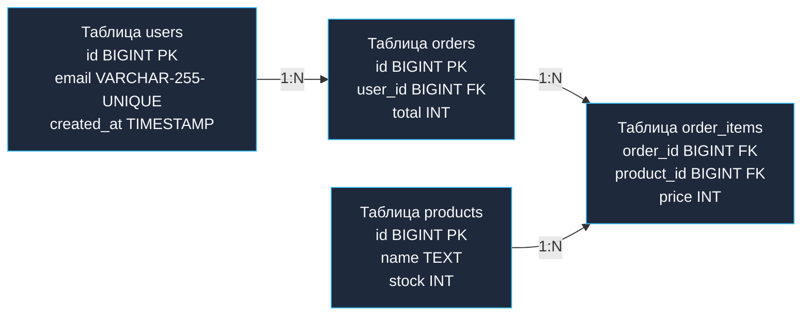

## Карта территории данных

К этому моменту мы прошли внушительный инженерный маршрут: изучили физику страниц и блокировок, научились структурировать данные с помощью алгоритмов нормализации (от базовой [[9. Нормализация. Введение]] до бескомпромиссной [[13. BCNF и более высокие нормальные формы]]) и выяснили, в каких точках эти правила можно осознанно нарушать ради пиковой производительности ([[14. Денормализация и когда она оправдана]]).

Однако в реальном высоконагруженном проекте база данных — это не пара учебных таблиц. Это сложнейший мегаполис из десятков, сотен, а порой и тысяч взаимосвязанных сущностей. Пытаться удержать такую систему в голове или восстанавливать ее топологию по структурам кода на Go — путь к архитектурной катастрофе. Структуры в Go часто отражают агрегированные транспортные контракты (DTO), параметры HTTP-запросов или представления сущностей, маскируя физические реалии дискового хранения.

Единственный надежный способ обуздать сложность, визуализировать топологию связей и согласовать проект с коллегами — это **Моделирование данных** и построение **ER-диаграмм (Entity-Relationship Diagrams)**.

---

## Три уровня моделирования

Проектирование схемы реляционной базы данных никогда не должно начинаться со слепого набора команд `CREATE TABLE` в консоли `psql`. Это дисциплинированный, многоступенчатый процесс трансляции абстрактных бизнес-требований в конкретные байты и блоки на накопителях.

В классической теории системного анализа выделяют три последовательных уровня моделей:

### 1. Концептуальная модель (Conceptual Model)
Взгляд с высоты птичьего полета. На этом этапе инженер общается с бизнесом (Product Owners, системными аналитиками, стейкхолдерами). Здесь полностью отсутствуют типы данных, первичные ключи, внешние индексы и специфика СУБД. Модель фиксирует исключительно ключевые бизнес-сущности реального мира и семантику их взаимосвязей.
* *Прикладной пример:* «Пользователь оформляет Заказ», «Заказ содержит Товары», «Товар принадлежит Категории».

### 2. Логическая модель (Logical Model)
Здесь концептуальные идеи переводятся на язык реляционной алгебры. Каждая сущность наделяется конкретным набором атрибутов (колонок), определяются потенциальные ключи и формализуются отношения. Именно на этом шаге проводится математическая нормализация схемы до уровня [[12. Третья нормальная форма 3NF]]. Мы формализуем то, что связь «Многие-ко-многим» между Заказами и Товарами требует промежуточного связующего отношения.
* *Прикладной пример:* Сущность «Пользователь» получает обязательные атрибуты `email` и `phone`. Проектируется промежуточная сущность `order_items`.

### 3. Физическая модель (Physical Model)
Территория бескомпромиссной аппаратной инженерии. Модель создается под конкретный движок СУБД (например, PostgreSQL 16 или MySQL 8 InnoDB). Здесь определяются физические типы данных СУБД, декларативные ограничения ([[7. Ограничения целостности данных]]), параметры выравнивания памяти и типы индексов.

> [!info] Под капотом: Mechanical Sympathy Физической модели
> Разрыв между Логической и Физической моделью — это граница между математической абстракцией и кремнием.  
> В логической модели проектировщик просто фиксирует атрибут: «Уникальный идентификатор записи».  
> В физической модели инженер обязан сделать жесткий выбор: использовать монотонный `BIGINT` или 16-байтный `UUID`?  
> Этот выбор напрямую определит:
> * Сколько кортежей поместится на 8-килобайтную страницу диска (**Buffer Pool**);
> * Будет ли вставка приводить к постоянному расщеплению узлов (Page Splits) в B-Tree дереве;
> * Сколько байт дискового ввода-вывода (I/O) займет одиночный `INSERT`.  
> Кроме того, именно на физическом уровне вы определяете строгий **порядок столбцов**, исключающий холостой padding (выравнивание памяти процессора), разобранный нами в [[5. Таблицы, строки, столбцы и ключи]].

---

## Анатомия ER-диаграммы

**ER-диаграмма (Модель сущность-связь / Entity-Relationship Diagram)** — универсальный графический язык архитектурного проектирования. Ее графический синтаксис опирается на три базовых конструкта:

1. **Сущность (Entity):** Логический или физический объект данных (в реляционной СУБД реализуется как таблица).
2. **Атрибут (Attribute):** Поименованное свойство сущности (столбец таблицы).
3. **Связь (Relationship):** Логическое взаимодействие между двумя сущностями (в СУБД реализуется через первичные и внешние ключи).

Ключевая характеристика любой связи в ER-модели — это **Кардинальность (Cardinality)**, выражающая количественные пропорции сопоставления экземпляров сущностей.

### Типы кардинальности

1. **Один-к-Одному (1:1):** Например, `Пользователь` и `Паспортные данные`. На уровне DDL дочерняя таблица использует в качестве Primary Key колонку, которая одновременно является Foreign Key на родительскую таблицу.
2. **Один-ко-Многим (1:N):** Доминирующий тип связей в реляционных базах. Один `Пользователь` может иметь множество `Заказов`. Физически поддерживается внешним ключом в дочерней таблице, ссылающимся на первичный ключ родителя (см. [[6. Первичные и внешние ключи]]).
3. **Многие-ко-Многим (M:N):** Классический пример — `Студенты` и `Курсы` (один студент слушает несколько курсов, на каждом курсе учатся сотни студентов).

> [!warning] Ловушка / Gotcha: Физика Много-ко-Многим
> На концептуальной схеме допустимо нарисовать простую линию со стрелками между Студентами и Курсами.  
> Однако на физическом (и логическом) уровне **реляционные базы данных в принципе не поддерживают прямые связи Многие-ко-Многим**.  
> Вы обязаны спроектировать промежуточную таблицу связей (**Junction / Join Table**), расщепив одну связь `M:N` на две независимые связи `1:N`. Непонимание этого фундаментального принципа приводит к разрушению целостности и нарушению [[11. Вторая нормальная форма 2NF]].

### Визуализация физической ER-модели

В промышленной разработке для отображения кардинальности связей стандартом де-факто признана так называемая «Нотация вороньих лапок» (**Crow's Foot notation**).

Ниже представлена физическая ER-модель торгового модуля интернет-магазина, иллюстрирующая связи сущностей:

В этой архитектуре таблица `order_items` физически воплощает связь `M:N` между Заказами и Товарами, попутно предотвращая финансовые аномалии путем материализации цены (`price`) на момент проведения транзакции.

---

## Архитектура: Code-First vs Database-First

В бэкенд-инженерии существует два принципиально разных философских взгляда на жизненный цикл схемы данных. Выбор методологии определяет культуру разработки всей команды.

### 1. Code-First (Мышление объектами)
Разработчик объявляет доменные модели в виде структур языка программирования (например, структуры Go с тегами для ORM вроде GORM), после чего библиотека автоматически генерирует и накатывает на базу операторы `CREATE TABLE` и `ALTER TABLE`. ER-диаграмма в такой парадигме — лишь вторичный артефакт.

* **Риски для высоконагруженных систем:** Разработчик оказывается оторван от физической природы СУБД. ORM-генераторы часто выбирают неоптимальные типы данных (например, раздутый `TEXT` вместо компактного `VARCHAR` или числовые типы без учета Data Alignment), генерируют избыточные индексы или полностью игнорируют параметры заполнения страниц (fillfactor).

### 2. Database-First (Мышление множествами и контрактами)
Это **идиоматичный, канонический путь в экосистеме Go**.  
База данных проектируется как фундаментальная независимая подсистема. Инженеры создают и согласовывают визуальную ER-диаграмму (в специализированных инструментах вроде DataGrip, dbdiagram.io или PlantUML), после чего формулируют строгие DDL-миграции на чистом SQL.

Структуры данных на Go генерируются напрямую из проверенного SQL-кода с помощью строгих статических компиляторов (например, `sqlc`). Это гарантирует стопроцентное соответствие типов Go реальным колонкам СУБД и исключает накладные расходы на рантайм-рефлексию.

> [!tip] Собеседование
> **Вопрос:** Почему в современной микросервисной архитектуре на ER-диаграммах отдельных сервисов часто вообще нет классических внешних ключей (Foreign Keys) для связи с сущностями других доменов?  
> **Ответ:** В архитектуре распределенных систем применяется паттерн Database per Service: база данных строго инкапсулирована внутри своего сервиса. Сервис Заказов и сервис Пользователей физически используют разные базы (или даже разные СУБД).  
> На ER-диаграмме сервиса заказов поле `user_id` — это обычный скалярный атрибут (например, `BIGINT` или `UUID`), а не реляционный Foreign Key. Проверка существования пользователя и обеспечение ссылочной целостности выносятся из ядра СУБД на уровень асинхронных протоколов взаимодействия сервисов Go: распределенных транзакций (паттерн Saga), очередей событий и Transactional Outbox.

## Итог

1.  **Моделирование данных** — это строгая методология преобразования бизнес-логики в структуры хранения через три последовательных уровня: Концептуальный, Логический и Физический.
2.  **ER-диаграмма** служит главным инженерным чертежом системы, документируя сущности (таблицы), атрибуты (колонки) и кардинальность связей.
3.  Реляционные СУБД не поддерживают прямое отношение «Многие-ко-многим»: физически оно всегда декомпозируется на две связи `1:N` через связующую таблицу (Junction Table).
4.  В высоконагруженной Go-разработке стандартом признан подход **Database-First**: схема проектируется в DDL, миграции контролируются версионно, а код генерируется компилятором `sqlc`.

Мы научились проектировать идеальные нормализованные структуры и профессионально фиксировать их на ER-диаграммах. Однако архитектурное мастерство заключается не только в знании лучших практик, но и в умении распознавать скрытые ловушки. Существует целый ряд опасных архитектурных решений, которые с легкостью проходят код-ревью, но гарантированно приводят к краху базы под реальной нагрузкой. В следующей статье мы разберем эти грабли: переходим к [[16. Anti patterns проектирования схем]].