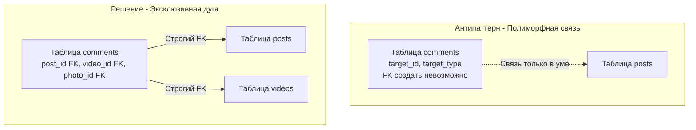

## Темная сторона архитектуры баз данных

Мы завершаем фундаментальный вводный раздел по схемотехнике реляционных баз данных. Вы уже овладели строгой дисциплиной проектирования отношений ([[12. Третья нормальная форма 3NF]]) и осознали, какими законами физики диска руководствуются инженеры при точечной денормализации ([[14. Денормализация и когда она оправдана]]).

Однако на пути бэкенд-разработчика постоянно возникают соблазнительные «гениальные» идеи. Парадоксально, но чаще всего они рождаются не от лени, а из благих побуждений: стремления сделать архитектуру «универсальной», «сверхгибкой» и избавиться от необходимости писать очередные SQL-миграции при появлении новых фич. В 99% случаев подобная абстрактная «гибкость» под реальной нагрузкой превращается в аппаратный кошмар, деградацию задержек и повреждение данных.

В этой главе мы препарируем пять хрестоматийных антипаттернов проектирования реляционных схем, объясним их губительное воздействие на уровне «железа» (Mechanical Sympathy) и закрепим надежные инженерные альтернативы в коде на Go.

---

## 1. Entity-Attribute-Value (EAV): Убийца производительности

Это, пожалуй, самый распространенный архитектурный тупик, который разработчики приносят из мира раннего e-commerce и CMS. Задача типична: в интернет-магазине продаются тысячи разнородных товаров. У ноутбука есть объем оперативной памяти и модель процессора, у футболки — размер и цвет ткани, у моторного масла — вязкость.

**Как выглядит антипаттерн EAV:**  
Вместо того чтобы честно проектировать колонки под сущности, разработчик создает одну «универсальную» таблицу-свалку: `(entity_id, attribute_name, attribute_value)`.

| entity_id (Товар) | attribute_name | attribute_value |
| :--- | :--- | :--- |
| 42 | color | Red |
| 42 | size | XL |
| 42 | cpu_cores | 8 |

### Почему это катастрофа? (Mechanical Sympathy)

1. **Тотальное уничтожение доменной целостности (Domain Integrity):** Колонка `attribute_value` вынуждена иметь строковый тип (`VARCHAR` или `TEXT`). СУБД больше не может гарантировать, что число ядер процессора `cpu_cores` — это валидный `SMALLINT`, а дата гарантии — это `TIMESTAMP`. База данных превращается в текстовый мешок, а вся валидация типов перекладывается на плечи прикладного кода Go.
2. **Адские самосоединения (Self-Joins):** Чтобы извлечь один товар с десятью характеристиками и собрать его в структуру на Go, СУБД вынуждена выполнить десять операций `JOIN` одной и той же гигантской таблицы саму на себя!
3. **Крах кэша (Buffer Pool Thrashing):** В EAV-схеме атрибуты одного товара физически рассеяны по миллионам не связанных страниц данных. Попытка собрать товар порождает лавину случайных чтений с диска (Random I/O). Оптимизатор СУБД сходит с ума, пытаясь построить план выполнения для многократных соединений таблицы объемом в сотни гигабайт.

> [!tip] Собеседование
> **Вопрос:** Если модель EAV настолько разрушительна для реляционной базы, как правильно хранить товары с динамическими характеристиками?  
> **Ответ:** Современный промышленный стандарт де-факто — использование типа `JSONB` (в PostgreSQL). Базовые инварианты сущности (идентификатор `id`, артикул, базовая цена, остаток на складе) выносятся в строго типизированные реляционные колонки. А весь переменный динамический набор атрибутов сохраняется в едином поле `attributes JSONB`.  
> Под капотом PostgreSQL хранит `JSONB` в разобранном бинарном виде и поддерживает специализированные **GIN-индексы**, позволяющие выполнять поиск по вложенным ключам за логарифмическое время без полного сканирования таблицы (Sequential Scan).

---

## 2. Полиморфные связи (Polymorphic Associations)

Представьте систему социальных взаимодействий: пользователи могут оставлять текстовые комментарии к Статьям (`posts`), к Видеороликам (`videos`) и к Фотографиям (`photos`).

**Как выглядит антипаттерн:**  
Создать единую таблицу комментариев `comments` со столбцами `target_id` и текстовым дискриминатором `target_type`:

| id | text | target_type | target_id |
| :--- | :--- | :--- | :--- |
| 1 | Супер! | posts | 42 |
| 2 | Смешно | videos | 10 |

### Почему это катастрофа?

Вы **принципиально не можете создать внешний ключ (Foreign Key)** на колонку, целевая таблица которой определяется строковым содержимым другой колонки!

Нарушается ключевой реляционный закон ([[6. Первичные и внешние ключи]]). СУБД полностью утрачивает контроль над ссылочной целостностью. Если администратор или фоновый воркер удалит статью `posts` с `id = 42`, все связанные комментарии навсегда останутся висеть в базе в виде мертвого мусора (Orphaned Row), так как декларативное каскадное удаление физически невозможно без Foreign Key.

### Решение: Эксклюзивная дуга (Exclusive Arc)

Надежный архитектурный паттерн заключается в создании явных, строго типизированных внешних ключей под каждую потенциальную цель, контролируемых на уровне ядра СУБД через [[7. Ограничения целостности данных]]:



На уровне DDL таблицы `comments` мы объявляем все внешние ключи и накладываем проверочное ограничение `CHECK`, которое математически гарантирует, что для каждой строки заполнен *строго один* внешний ключ, а остальные содержат `NULL`:

```sql
CREATE TABLE comments (
    id BIGINT PRIMARY KEY,
    text TEXT,
    post_id BIGINT REFERENCES posts(id),
    video_id BIGINT REFERENCES videos(id),
    photo_id BIGINT REFERENCES photos(id),
    
    -- Гарантируем, что комментарий привязан ровно к одной сущности
    CONSTRAINT chk_exclusive_arc CHECK (
        (post_id IS NOT NULL)::int + 
        (video_id IS NOT NULL)::int + 
        (photo_id IS NOT NULL)::int = 1
    )
);
```

---

## 3. "The Blob" или Единая таблица справочников (OTLT)

*«Зачем нам создавать десятки мелких таблиц под статусы заказов, типы доставок, категории товаров и роли пользователей? Давайте объединим все справочники в одну супертаблицу `dictionaries (domain, code, value)`!»* — предлагает разработчик в надежде сэкономить время. В литературе этот антипаттерн известен как OTLT (One True Lookup Table).

### Механика катастрофы:

1. **Крах ссылочной целостности:** Вы больше не можете повесить жесткий `FOREIGN KEY (status_id) REFERENCES order_statuses(id)`. Внешний ключ ссылается на общую таблицу `dictionaries`. В результате ничто не помешает приложению из-за бага записать в поле «статус заказа» идентификатор, ссылающийся на категорию продуктов питания!
2. **Острая конкуренция за блокировки (Lock Contention):** Таблица превращается в бутылочное горлышко всей системы. Тысячи конкурентных транзакций непрерывно читают одни и те же страницы памяти. Любая сервисная операция добавления или изменения статуса блокирует доступ несвязанным транзакциям по всему проекту (см. [[1. ACID. Основы]]).

*Идиоматичный подход:* Таблицы в реляционных СУБД стоят буквально копейки. Создавайте под каждый независимый справочник отдельную компактную таблицу. Движок СУБД удержит их в Buffer Pool со стопроцентным Cache Hit, а вы получите несокрушимую гарантию Foreign Keys.

---

## 4. Soft Deletes по умолчанию (is_deleted = true)

Удалять данные физически начинающим разработчикам кажется рискованным. Руководство часто требует: *«Пусть ничего не удаляется насовсем, просто помечайте записи как удаленные»*. Разработчик послушно добавляет колонку `is_deleted BOOLEAN` абсолютно во все таблицы базы данных.

> [!warning] Ловушка / Gotcha: MVCC и индексы
> В современных СУБД (PostgreSQL) обновление строки (`UPDATE is_deleted = true`) физически работает как `DELETE` старой версии кортежа и `INSERT` совершенно новой версии на свободное место страницы. Это фундамент механизма многоверсионности (MVCC).  
> 
> Повсеместное «мягкое удаление» провоцирует серьезные системные деградации:  
> 1. **Крах уникальных ограничений:** Если пользователь удалил аккаунт `bob@go.dev` (`is_deleted=true`), он больше не сможет повторно зарегистрироваться с этим же адресом, так как ограничение `UNIQUE(email)` видит старую строку. Приходится писать костыли вроде частичных индексов:  
> ```sql
> CREATE UNIQUE INDEX ON users (email) WHERE is_deleted = false;
> ```
> 2. **Деградация и раздувание B-Tree:** Со временем таблица на 90% заполняется «мертвыми» записями. Поиск живых пользователей замедляется, так как индекс вынужден прокачивать через память сотни страниц с удаленными строками.

**Решение для Highload:** Если необходимо сохранять историчность, используйте паттерн **Archive Tables (Теневые / архивные таблицы)**.  
Приложение работает с компактной оперативной таблицей `users`. При удалении триггер СУБД или фоновый Go-сервис физически переносит строку в архивную таблицу `users_archive`, удаляя ее из основной. Основная таблица остается компактной, индексы сохраняют идеальную плотность, а аналитики имеют полный доступ к историческому архиву.

---

## 5. Использование рандомных UUIDv4 как Primary Key

Мы уже затрагивали эту проблему, но в контексте антипаттернов ее необходимо зафиксировать с максимальной ясностью.

Выбор полностью случайного `UUID v4` в роли Первичного ключа — это сокрушительный удар по дисковой подсистеме базы данных. B-Tree индексы спроектированы под последовательную вставку в конец дерева (монотонно растущие ключи).

Когда первичный ключ случаен, каждая операция `INSERT` адресует произвольный листовой узел B-Tree дерева. СУБД вынуждена поднимать с диска в память случайные страницы. Переполнение страниц вызывает их непрерывное аварийное разделение пополам (**Page Split**), порождая колоссальную внутреннюю фрагментацию, деградацию кэша и лавинообразный **Write Amplification**.

*Решение:* Если вам необходим UUID на транспортном уровне API (для защиты от перебора ID), применяйте монотонно растущий **UUID v7** (где первые 48 бит содержат временную метку) либо используйте внутренний суррогатный `BIGINT` в качестве Primary Key, а наружу выставляйте публичный идентификатор `public_id UUID`, поддержанный отдельным индексом. Детальную механику работы B-Tree мы изучим в [[2. B Tree индекс под капотом]].

---

## Итог и Чек-лист архитектора

Проектируя схему базы данных для высоконагруженного бэкенда на Go, всегда сверяйтесь со следующим чек-листом:

1. **Нет ли в схеме таблиц-свалок?** (Антипаттерн EAV). Для динамических и слабоструктурированных свойств используйте нативный `JSONB` с GIN-индексами.
2. **Имеют ли все связи явные физические Foreign Keys?** (Антипаттерн Polymorphic Associations). Заменяйте полиморфные связи Эксклюзивными дугами с ограничением `CHECK`.
3. **Не объединены ли разнородные справочники в одну «супертаблицу»?** (Антипаттерн OTLT/The Blob). Создавайте под каждый справочник отдельную компактную таблицу.
4. **Не раздуваются ли «горячие» таблицы мертвыми кортежами?** (Антипаттерн Soft Deletes). Для архивных данных используйте выделенные теневые таблицы (Archive Tables).
5. **Обеспечивает ли первичный ключ монотонный рост для B-Tree?** (Антипаттерн UUIDv4). Используйте автоинкрементный `BIGINT` либо спецификацию `UUID v7`.

Мы завершили фундаментальный цикл знакомства с базами данных: от физики страниц и кэшей памяти до строгой математической нормализации, денормализации и моделирования схем. Теперь у нас есть надежный фундамент. Пришло время научиться виртуозно взаимодействовать с СУБД на ее родном языке: переходим к следующему разделу нашей энциклопедии — [[1. Введение в SQL]].