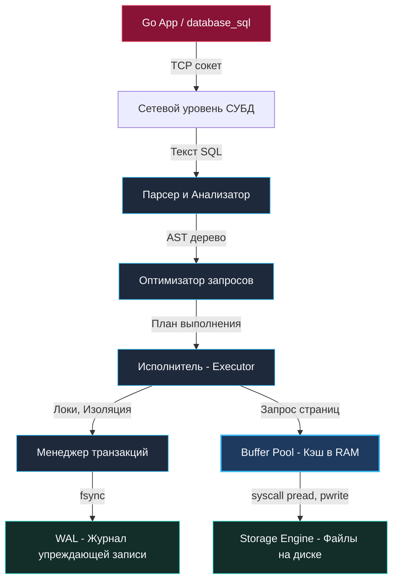

## База данных vs СУБД. Разделяем понятия

В повседневных разговорах бэкенд-разработчиков часто звучат фразы: *«Мы храним профили в базе данных PostgreSQL»* или *«Сервис упал, потому что база не отвечает»*. Для беглого диалога у кулера это привычный сленг, но для инженера, проектирующего отказоустойчивые системы, терминологическая небрежность опасна. Она маскирует границу между пассивными данными и активным вычислительным ядром.

В классической теории вычислительных систем эти понятия строго разделены:
* **База данных (БД, Database)** — это организованная совокупность структурированных данных. На физическом уровне это набор файлов на диске (файловой системе ext4, XFS или ZFS), представляющих собой последовательности байтов, упакованных в блоки определенного формата.
* **СУБД (Система Управления Базами Данных, DBMS — Database Management System)** — это полномасштабный программный комплекс, функционирующий поверх этих файлов. СУБД берет на себя управление сетевыми соединениями, изоляцию конкурентных транзакций, кэширование страниц в ОЗУ, синтаксический анализ запросов и гарантию сохранности информации при аппаратных сбоях.

PostgreSQL, MySQL, Redis, ClickHouse, SQLite — всё это **СУБД**, а не базы данных. Ваша программа на Go устанавливает TCP-сокет или открывает дескриптор именно к процессу СУБД, а СУБД транслирует ваши высокоуровневые декларативные намерения в физические операции чтения и записи страниц данных.

## Почему мы не используем просто файлы?

Каждый разработчик на заре карьеры задает себе соблазнительный вопрос: *«Зачем нам разворачивать тяжелый демон PostgreSQL, настраивать пулы соединений и писать SQL, если можно просто сериализовать структуру в JSON или CSV и дописать в файл?»*

Давайте посмотрим на хрестоматийный пример наивной записи данных на Go:

```go
func saveUser(u User) error {
    // Открываем файл в режиме добавления
    file, err := os.OpenFile("users.csv", os.O_APPEND|os.O_CREATE|os.O_WRONLY, 0644)
    if err != nil {
        return err
    }
    defer file.Close()
    
    line := fmt.Sprintf("%d,%s,%d\n", u.ID, u.Name, u.Age)
    _, err = file.WriteString(line) // syscall write
    return err
}
```

Этот фрагмент безупречно отработает в однопоточном консольном скрипте. Но в боевом бэкенде под реальной нагрузкой он приведет к мгновенной катастрофе. Разберем анатомию проблем по пунктам:

1. **Конкурентность (Concurrency) и гонки данных:**  
   Если 1000 горутин одновременно вызовут `saveUser`, системный вызов `write` без строгой синхронизации перемешает байты строк (interleaved writes). В файле появится мусорная строка вроде `15,Ale42,Bob,28x\n`. Если мы защитим запись с помощью `sync.Mutex`, все горутины выстроятся в единую очередь, заблокировав веб-сервер. А если приложение развернуто в 10 подах Kubernetes? Мьютекс внутри рантайма одного процесса Go бессилен перед параллельным доступом из других контейнеров к общему сетевому диску (NFS/EBS).
2. **Частичная запись и расщепление страниц (Partial / Torn Writes):**  
   Что произойдет, если в момент выполнения `write` аварийно отключится питание сервера или ядро ОС запаникует (Kernel Panic)? На диск успеет записаться половина буфера — например, `15,Ale`. При следующем чтении парсер сломается на невалидной строке, и база будет необратимо повреждена.
3. **Катастрофическая алгоритмическая сложность поиска ($O(N)$):**  
   Чтобы найти пользователя по `email` в CSV-файле объемом 50 ГБ, вы вынуждены последовательно прочитать с накопителя все 50 ГБ данных от первого до последнего байта (Full Scan), раскодировать каждую строчку и сравнить строки в памяти. Дисковый контроллер перегреется, кэш операционной системы вымоется, а пользователь будет ждать ответа десятки секунд вместо миллисекунды.

> [!tip] Собеседование
> **Вопрос:** Зачем нужна СУБД, если современная файловая система ОС (например, ext4 или ZFS) уже умеет быстро читать и писать файлы?  
> **Ответ:** Файловая система решает задачи низкого уровня: она предоставляет абстракцию «файл как неструктурированный поток байтов» (stream of bytes) и распределяет блоки по секторам накопителя. СУБД решает задачи принципиально иного масштаба:  
> 1. Обеспечение свойств [[1. ACID. Основы]] (атомарность операций, согласованность схемы).  
> 2. Изоляция конкурентных транзакций без превращения всей системы в однопоточную очередь.  
> 3. Гарантия живучести данных при аппаратных сбоях с помощью журнала предзаписи [[8. WAL. Write Ahead Log]].  
> 4. Мгновенная выборка данных за $O(\log N)$ или $O(1)$ благодаря индексам (B-Tree, Hash), поддерживаемым в актуальном состоянии прямо во время изменений.

## Архитектура СУБД под капотом

Чтобы гарантировать надежность и скорость в условиях тысяч параллельных соединений, современная реляционная СУБД проектируется как специализированная микро-ОС внутри основной операционной системы.

Когда ваш Go-код выполняет запрос:
```go
db.QueryContext(ctx, "SELECT * FROM users WHERE id = 1")
```
запрос совершает путешествие через строго упорядоченные подсистемы:



1. **Сетевой уровень (Transport):** Принимает входящий TCP-поток, декодирует протокол СУБД (например, PostgreSQL Frontend/Backend Protocol), выполняет аутентификацию и связывает соединение с рабочим процессом или потоком.
2. **Парсер и Анализатор (Parser & Analyzer):** Превращает сырую строку SQL в абстрактное синтаксическое дерево (AST), проверяет соответствие типов данных и наличие колонок в системном каталоге.
3. **Оптимизатор запросов (Query Optimizer / Cost-Based Optimizer):** Главный мозг базы данных. На основе математической статистики распределения данных он перебирает сотни возможных путей выполнения запроса и выбирает план с минимальной ожидаемой стоимостью (CPU + Disk I/O).
4. **Исполнитель (Executor):** Получает готовое дерево физического плана (Scan, Filter, Join, Aggregate) и шаг за шагом запрашивает кортежи данных у нижележащих слоев.
5. **Менеджер транзакций (Transaction Manager):** Управляет блокировками, таблицей активных транзакций и версиями строк (MVCC), обеспечивая требования [[1. ACID. Основы]].
6. **Buffer Pool (Shared Buffers):** Выделенный пул оперативной памяти (в production под него часто отдают от 25% до 75% всей RAM сервера), где кэшируются дисковые страницы. Если нужные данные уже в памяти — диск даже не просыпается.
7. **Журнал упреждающей записи (Write-Ahead Log / WAL):** Прежде чем изменить страницу в памяти, СУБД обязана записать операцию в последовательный лог WAL и зафиксировать его на диске через системный вызов `fsync`.

## Mechanical Sympathy. Страничная организация

На физическом уровне СУБД практически никогда не оперирует отдельными строками (rows/tuples) при взаимодействии с дисковой подсистемой. Чтение отдельной 50-байтовой записи с диска привело бы к колоссальным накладным расходам контроллера.

Вместо этого все файлы таблиц и индексов разбиваются на равные монолитные блоки фиксированного размера — **Страницы (Pages)**. В PostgreSQL размер страницы по умолчанию равен 8 КБ, в InnoDB (MySQL) — 16 КБ.

> [!info] Под капотом
> Когда приложению требуется прочитать одну строчку с `id = 42` размером всего 100 байт:
> 1. СУБД вычисляет, на какой именно странице лежит эта строка.
> 2. Она проверяет хэш-таблицу страниц в **Buffer Pool**.
> 3. Если страницы нет в памяти (Cache Miss), СУБД выполняет системный вызов `pread` (или обращается к сегменту `mmap`) и считывает с накопителя **целиком блок 8 КБ (или 16 КБ)**.
> 4. Страница регистрируется в Buffer Pool, строка извлекается из страничного буфера и упаковывается в сетевой пакет для возврата в Go-приложение.

Это знание фундаментально для понимания производительности:
* **Локальность данных:** Если строки, которые запрашиваются вместе, лежат на одной странице (или на соседних), один системный вызов дискового чтения насыщает десятки запросов.
* **Случайные чтения (Random IO):** Если данные фрагментированы и разбросаны по разным концам терабайтного файла, СУБД будет вынуждена вычитывать по 8 КБ ради каждых 50 байт, создавая лавинообразную нагрузку на шину ввода-вывода.

> [!warning] Ловушка / Gotcha
> Невозможно спасти систему от деградации простым увеличением объема оперативной памяти (RAM), если ваши неоптимальные SQL-запросы выполняют сплошное сканирование гигантских таблиц (Full Table Scan). Запрос, читающий миллионы страниц с диска, мгновенно вытеснит из Buffer Pool «горячие» страницы справочников и пользовательских профилей (эффект Cache Thrashing). В результате все остальные быстрые запросы сервиса резко замедлятся, превратившись в дисковые чтения.

## Итог

1. **БД** — это файлы на диске. **СУБД** — это интеллектуальный программный комплекс, обеспечивающий безопасный, параллельный и высокоэффективный доступ к этим файлам.
2. Файловые системы ОС оперируют сырыми потоками байт. СУБД решает задачи высшего порядка: транзакционность, атомарность при аппаратных авариях и логарифмический поиск по индексам.
3. Фундамент производительности реляционной СУБД опирается на блочную организацию страниц памяти (Buffer Pool) и оптимизацию дискового ввода-вывода (Sequential vs Random IO).

Теперь, когда мы определили, что представляет собой СУБД как программная архитектура и почему она незаменима в бэкенде, перейдем к фундаментальной классификации систем: для каких задач создаются строчные транзакционные хранилища, а для каких — колоночные аналитические движки? Разбираемся в следующей статье: [[3. Типы баз данных. OLTP vs OLAP]].