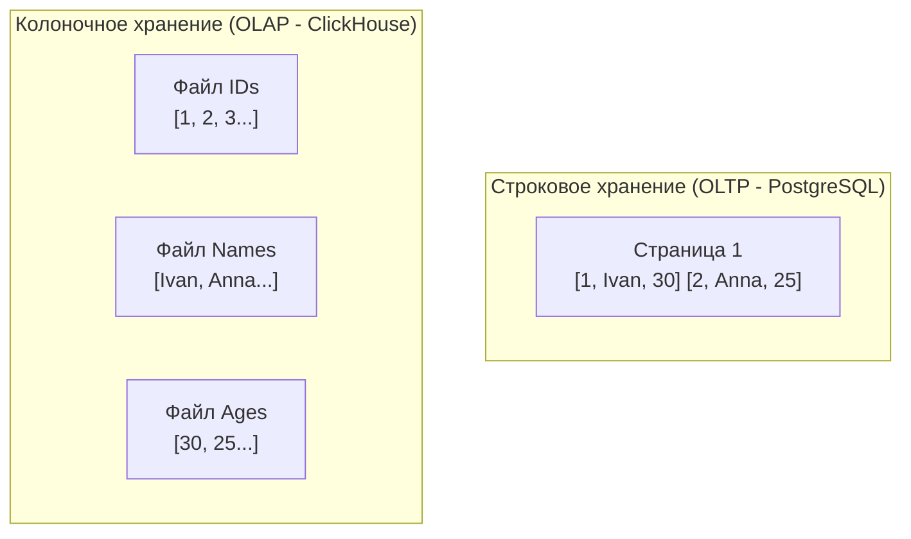

## Великий раскол баз данных

В компьютерных науках существует непреложная истина, сформулированная еще Фредериком Бруксом: *серебряной пули не существует*. В архитектуре подсистем хранения данных это выражается в непреодолимом физическом компромиссе: **невозможно спроектировать структуру данных, которая одинаково молниеносно обслуживала бы точечные транзакции и масштабные аналитические выборки**.

По мере эволюции любого успешного Go-бэкенда наступает день, когда основная транзакционная СУБД (например, PostgreSQL) начинает захлебываться. Вызов аналитического отчета или построение дашборда для руководства парализует обработку клиентских заказов: дисковая очередь взлетает до небес, страницы в оперативной памяти яростно вытесняются, а время ответа API подскакивает с 5 миллисекунд до десятков секунд.

Чтобы предотвратить подобные катастрофы, инженер обязан понимать фундаментальную причину великого архитектурного раскола: разницу между двумя полярными типами нагрузок — **OLTP** (Online Transaction Processing) и **OLAP** (Online Analytical Processing).

---

## OLTP (Online Transaction Processing)

**OLTP** — это оперативная транзакционная обработка. Это классическая кровеносная система большинства веб-сервисов: интернет-магазинов, платежных шлюзов, систем бронирования и мессенджеров. Если ваш микросервис на Go принимает запросы от пользователей и меняет состояние учетных записей, вы в 95% случаев работаете по паттерну OLTP.

**Ключевые характеристики OLTP-нагрузки:**
* **Характер операций:** Короткие, атомарные точечные запросы (CRUD: создание, чтение, обновление, удаление). Запрос затрагивает одну строку или небольшую пачку связанных сущностей по первичному ключу.
* **Степень параллелизма (Concurrency):** Колоссальная. Тысячи и десятки тысяч запросов в секунду (RPS / TPS), поступающих одновременно от независимых клиентов.
* **Требования к надежности:** Бескомпромиссная консистентность. Потеря даже одного финансового перевода недопустима — необходимо строгое следование гарантиям [[1. ACID. Основы]].
* **Объем полезных данных:** Микроскопический (от нескольких сотен байт до десятков килобайт). Запрос `SELECT * FROM users WHERE id = 42` возвращает конкретный профиль конкретного человека.

### Mechanical Sympathy: Строковое хранение (Row-Oriented)

Чтобы СУБД могла атомарно обновить профиль пользователя (например, изменить баланс или адрес доставки), все атрибуты этого пользователя должны располагаться на диске физически рядом. Именно поэтому реляционные OLTP-базы (PostgreSQL, MySQL, Oracle) организуют хранение по принципу **строкового формата (Row-Oriented Storage)**.

Файл таблицы на диске разбивается на страницы по 8 КБ (или 16 КБ), внутри которых кортежи строк записываются последовательно:  
`[ID1, Имя1, Возраст1, Баланс1] [ID2, Имя2, Возраст2, Баланс2]...`

> [!info] Под капотом
> Когда СУБД необходимо обновить `Баланс1`, исполнитель обращается к Buffer Pool. Если страница (8 КБ) находится в ОЗУ, СУБД накладывает кратковременную эксклюзивную блокировку на кортеж (Tuple), перезаписывает байты баланса и маркирует страницу как «грязную» (dirty page). Поскольку все поля пользователя упакованы в одном месте, операция модификации локализована в одном непрерывном участке памяти и генерирует минимальный объем трафика дискового ввода-вывода (I/O).

---

## OLAP (Online Analytical Processing)

**OLAP** — это оперативная аналитическая обработка. Это мир бизнес-аналитики (BI), витрин данных (Data Warehousing) и машинного обучения. В такие системы выгружаются миллиарды исторических записей, чтобы ответить на стратегические вопросы: *«Каков средний чек пользователей за последние три года по регионам?»* или *«Сколько кликов привел конкретный рекламный баннер в Черную Пятницу?»*.

**Ключевые характеристики OLAP-нагрузки:**
* **Характер операций:** Тяжелые агрегационные запросы (`SUM`, `AVG`, `COUNT`, `GROUP BY`, фильтрация по диапазонам дат), охватывающие миллионы и миллиарды строк.
* **Степень параллелизма:** Относительно невысокая. Десятки аналитиков или регулярных фоновых Cron-джобов, но каждый отдельный запрос утилизирует все доступные ядра CPU и максимальную пропускную способность дисковой подсистемы.
* **Требования к транзакциям:** Сложные многошаговые транзакции с блокировками здесь избыточны. Данные поступают в хранилище пакетно (Append-Only) и практически никогда не обновляются точечно.
* **Объем обрабатываемых данных:** Гигантский (сотни гигабайт и десятки терабайт на один аналитический отчет).

### Mechanical Sympathy: Колоночное хранение (Column-Oriented)

Представьте, что мы пытаемся выполнить аналитический запрос к классической строковой OLTP-базе:
```sql
SELECT SUM(balance) FROM users;
```

В таблице 100 миллионов пользователей. В строковой СУБД для расчета суммы процессор вынужден поднять с диска в память **все страницы таблицы целиком** — с именами, хэшами паролей, номерами телефонов и адресами. Чтобы извлечь жалкие 400 МБ полезных чисел баланса, СУБД прочитает с накопителя 50–100 ГБ мусорных для этого запроса данных!

Специализированные аналитические СУБД (ClickHouse, Snowflake, Greenplum, Amazon Redshift) применяют диаметрально противоположный подход — **колоночное хранение (Columnar Storage)**. Данные каждого столбца сохраняются в отдельных физических файлах.



> [!info] Под капотом: Магия кэш-линий и SIMD
> Колоночное хранение творит чудеса на физическом уровне кремния и диска:
> 
> 1. **Безупречная утилизация I/O и сжатие:** Запрос `SUM(balance)` считывает с диска *исключительно* файл колонки балансов. Все остальные столбцы даже не открываются. Кроме того, однородный массив однотипных данных (миллионы `int64`) сжимается алгоритмами LZ4 или ZSTD в 5–10 раз эффективнее гетерогенных строк. Дисковый контроллер считывает компактный поток байт на максимальной линейной скорости накопителя.
> 2. **Кэш процессора и SIMD-векторизация:** Процессор обменивается данными с ОЗУ блоками по 64 байта (**Cache Line**). В строковом хранилище в 64 байта попадает обрывок строки (имя, дата, мусор). В колоночном хранилище в одну кэш-линию ровно ложится массив из 16 значений `int32` (или восьми `int64`) баланса. Процессор может применить векторные инструкции **SIMD** (Single Instruction, Multiple Data: AVX2, AVX-512), складывая или фильтруя по 16 чисел за один-единственный такт CPU! Это называется *векторизованным выполнением (Vectorized Execution)*.

---

## Архитектурные паттерны в Go: Как писать в разные СУБД

Осознание физических различий OLTP и OLAP кардинально меняет то, как мы пишем код на Go для работы с этими системами.

### 1. Работа с OLTP (PostgreSQL / MySQL)
В OLTP мы ориентируемся на атомарность, быстрые одиночные коммиты и аккуратный пул соединений. Работа строится через стандартный пакет `database/sql`:

```go
// OLTP-стиль: атомарная быстрая вставка одной сущности
func CreateOrder(ctx context.Context, db *sql.DB, order Order) error {
    query := `INSERT INTO orders (user_id, total) VALUES ($1, $2) RETURNING id`
    return db.QueryRowContext(ctx, query, order.UserID, order.Total).Scan(&order.ID)
}
```

Каждый вызов изолирован, берет соединение из пула на миллисекунду и возвращает его обратно.

### 2. Работа с OLAP (ClickHouse)
**Никогда не отправляйте точечные INSERT-запросы по одной строке в колоночную базу данных!**

Колоночные СУБД используют под капотом архитектуру LSM-дерева или механизм слияния кусков (MergeTree, подробности в [[12. ClickHouse под капотом]]). Каждая операция `INSERT` создает на диске независимый набор файлов (part) для каждого столбца. Если вы будете слать одиночные вставки в цикле под трафиком 5 000 событий в секунду, база создаст десятки тысяч мелких файлов. Фоновый процесс фонового слияния (Merge) захлебнется, и сервер упадет с фатальной ошибкой `Too many parts in all data in table...`.

> [!warning] Ловушка / Gotcha
> Распространенная ошибка разработчиков: подключить колоночную СУБД через стандартный интерфейс и выполнять привычный `INSERT` на каждый входящий HTTP-запрос или сообщение брокера. Для аналитических хранилищ это смертельно.

Канонический паттерн работы с OLAP на Go — это **Батчинг (Batching)**. События аккумулируются в буфере памяти (или вычитываются пачками из топиков Apache Kafka) и сбрасываются в СУБД укрупненными блоками (от 5 000 до 50 000 строк за один сетевой запрос):

```go
// OLAP-стиль: буферизация и массовая вставка (Batch Insert)
// В реальности лучше использовать драйвер clickhouse-go и его метод PrepareBatch
func FlushAnalyticsToOLAP(ctx context.Context, conn driver.Conn, events []Event) error {
    batch, err := conn.PrepareBatch(ctx, "INSERT INTO user_events")
    if err != nil { return err }

    for _, e := range events {
        // Мы добавляем строки в локальный буфер драйвера, а не шлем по сети
        if err := batch.Append(e.UserID, e.EventType, e.Timestamp); err != nil {
            return err
        }
    }
    // Отправляем 10 000 строк одним TCP-пакетом и одним сжатым блоком на диск
    return batch.Send() 
}
```
Более детально этот паттерн и управление буферизацией мы разберем в статье [[16. Batch запросы]].

---

> [!tip] Собеседование
> **Вопрос:** Что такое HTAP и возможно ли объединить OLTP и OLAP в одной СУБД?  
> **Ответ:** HTAP (Hybrid Transactional/Analytical Processing) — это современное архитектурное направление, нацеленное на устранение задержки ETL между оперативной базой и аналитикой. Примеры систем: TiDB, AlloyDB, Google Spanner.  
> Как правило, это реализуется с помощью гибридного движка хранения: основной мастер-узел обрабатывает пишущие транзакции в строковом формате (для высокой скорости точечных изменений), а специализированные аналитические реплики асинхронно или полусинхронно перепаковывают входящий поток WAL в колоночный формат (например, TiFlash в TiDB). Это позволяет выполнять аналитические запросы над свежайшими данными, не создавая конкуренции за ресурсы с транзакционной нагрузкой.

## Итог

1.  **OLTP (Row-Oriented):** Оптимизировано для быстрых точечных записей и чтения сущностей целиком. Фундамент бизнес-логики и пользовательских сценариев (PostgreSQL, MySQL).
2.  **OLAP (Column-Oriented):** Оптимизировано для агрегации огромных объемов данных по ограниченному набору колонок. Требует обязательного батчинга при записи и векторизованной обработки при чтении (ClickHouse, Greenplum).
3.  **Mechanical Sympathy:** Разница в производительности кроется в физическом размещении байтов на дисковых страницах и кэш-линиях процессора. Выбирайте архитектуру хранения в строгом соответствии с профилем нагрузки вашей системы.

Теперь, когда мы осознали фундаментальное разделение подходов в мире СУБД, самое время сосредоточиться на фундаменте транзакционных систем. В следующей статье мы познакомимся с математической теорией, на которой держится вся индустрия реляционных баз: переходим к [[4. Реляционная модель данных. Основы]].