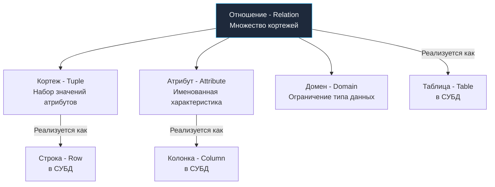

## Математика, изменившая мир бэкенда

До июня 1970 года работа программиста с базой данных напоминала блуждание по темному лабиринту с фонариком. Господствовали так называемые иерархические и сетевые СУБД (например, CODASYL или IBM IMS). Чтобы найти информацию о покупке клиента, разработчик писал низкоуровневый процедурный код: *«встань на корневой узел компании, перейди по физическому указателю к списку отделов, найди третий блок, перейди по связанному списку к первому заказу, проверь указатель на следующий...»*.

Такой подход назывался **навигационным доступом**. Он обладал фатальным изъяном: полным отсутствием независимости данных от физического представления. Стоило системному администратору переупорядочить блоки на магнитной ленте или добавить в структуру один указатель, как сотни тысяч строк прикладного кода превращались в тыкву.

Всё изменилось, когда британский математик и сотрудник IBM Эдгар Франк Кодд (Edgar F. Codd) опубликовал свою эпохальную статью *«A Relational Model of Data for Large Shared Data Banks»*. Кодд предложил радикальную идею: оторвать прикладного программиста от физических дисковых указателей и построить работу с данными на строгом фундаменте теории множеств (Set Theory) и логики предикатов первого порядка.

Главная революция реляционной модели формулируется просто:  
**Разработчик в декларативном стиле описывает, ЧТО именно ему необходимо получить, а СУБД самостоятельно решает, КАК эффективнее всего считать эти байты с накопителя.**

Для инженера на Go, привыкшего мыслить императивными категориями (циклы `for`, аллокации памяти, указатели и каналы), реляционная модель требует осознанного сдвига парадигмы. Мы больше не шагаем по структурам — мы манипулируем *математическими множествами*.

## Анатомия реляционной модели. Терминология

В чистой реляционной теории нет привычных нам терминов «таблица», «строка» или «колонка». Это более поздние физические метафоры. СУБД (например, PostgreSQL) опирается на строгий математический аппарат:

1.  **Отношение (Relation)** — это математическое подмножество декартова произведения доменов. В прикладном понимании — это таблица. Главное свойство отношения: это неупорядоченное множество уникальных элементов.
2.  **Кортеж (Tuple)** — единичный элемент отношения. В терминологии СУБД — это запись или строка (Row). Поскольку математическое множество не имеет порядка, кортежи в таблице не гарантируют никакой физической последовательности, пока вы явно не запросите `ORDER BY`.
3.  **Атрибут (Attribute)** — именованный элемент кортежа. В физической таблице — колонка (Column).
4.  **Домен (Domain)** — допустимое множество значений атрибута. В терминах СУБД — тип данных (например, `INT`, `VARCHAR` или пользовательский перечислимый тип). Домен гарантирует целостность: в домен «возраст» физически невозможно поместить строку «привет».



> [!warning] Ловушка / Gotcha
> Одно из самых живучих заблуждений среди начинающих (и даже опытных) разработчиков: считать, что слово «реляционная» происходит от понятия «связь» (relationship) между таблицами через внешние ключи (Foreign Keys). Это историческая и лингвистическая ошибка! Термин происходит от математического понятия *Relation* (Отношение), то есть обозначает саму таблицу как множество кортежей. База данных остается полностью реляционной, даже если в ней создана всего одна изолированная таблица и нет ни единого внешнего ключа.

## Object-Relational Impedance Mismatch

Один из центральных конфликтов бэкенд-архитектуры — это так называемое «объектно-реляционное несоответствие» (Object-Relational Impedance Mismatch).

Язык Go оперирует графами структур, указателями, вложенными слайсами и ассоциативными массивами (map). Реляционная модель — строго плоская. Классический реляционный кортеж неделим и атомарен: он не может содержать внутри себя произвольный список или вложенный массив других сущностей (это требование детально рассматривается в [[10. Первая нормальная форма 1NF]]).

Посмотрим, как на практике выглядит работа с плоскими реляционными кортежами через стандартный пакет `database/sql` в Go:

```go
package main

import (
	"context"
	"database/sql"
	"log"
)

// User - структура Go, которая должна принять данные из кортежа
type User struct {
	ID        int64
	Name      string
	Age       sql.NullInt16 // Защита от NULL значений домена
	IsActive  bool
}

func fetchActiveUsers(ctx context.Context, db *sql.DB) ([]User, error) {
	// Декларативный запрос: мы описываем ПРЕДИКАТ (is_active = true), 
	// но не пишем цикл по файлу.
	query := `SELECT id, name, age, is_active FROM users WHERE is_active = true`
	
	rows, err := db.QueryContext(ctx, query)
	if err != nil {
		return nil, err
	}
	defer rows.Close() // Критически важно для возврата коннекта в пул

	var users []User
	
	// Императивный Go-код обрабатывает результирующее множество кортежей
	for rows.Next() {
		var u User
		// Scan использует рефлексию (или кодогенерацию в драйверах) для маппинга
		// байт из сетевого буфера напрямую в память структуры Go.
		// Мы обязаны передавать указатели, чтобы Scan мог мутировать память.
		if err := rows.Scan(&u.ID, &u.Name, &u.Age, &u.IsActive); err != nil {
			return nil, err
		}
		users = append(users, u)
	}

	// Обязательно проверяем ошибки, которые могли возникнуть во время итерации
	if err := rows.Err(); err != nil {
		return nil, err
	}

	return users, nil
}
```

Обратите внимание на вызов `rows.Next()`. Это классический курсорный итератор по сетевому потоку кортежей (Tuples Stream), вычитывающий буферы сокета порциями и передающий их низкоуровневой подсистеме сканирования Go.

## Mechanical Sympathy: Кортежи под капотом ОС и памяти

Математика реляционной модели оперирует идеальными абстракциями. Но в реальности СУБД написана на C/C++ и подчиняется физическим законам кремния, выравнивания памяти и дисковых секторов. Как абстрактный математический «кортеж» раскладывается по байтам на диске?

> [!info] Под капотом
> В PostgreSQL кортеж физически размещается внутри 8-килобайтной страницы и состоит из двух ключевых компонентов:
> 1. **Заголовок кортежа (Tuple Header):** Занимает минимум 23 байта (для каждой строки!). В нем сохраняются служебные метаданные рантайма: `t_xmin` и `t_xmax` (номера транзакций создания и удаления для обеспечения многоверсионности MVCC), маска NULL-значений (Bitmap) и системные битовые флаги.
> 2. **Полезная нагрузка (User Data):** Непосредственные значения атрибутов.
> 
> Подобно тому, как рантайм Go выравнивает поля в структурах (`struct alignment`), СУБД выравнивает колонки по границам адресов, кратным их размеру. Если в схеме таблицы колонки объявлены небрежно — например, `(char(1), int8, char(1))` — СУБД будет вынуждена вставлять байты выравнивания (**Padding**) между ними, чтобы 64-битное целое начиналось с адреса, кратного 8. Из-за такого паддинга терабайтная база может раздуться на 20–30% пустого мусора, увеличивая нагрузку на диск и вымывая кэш процессора точно так же, как неоптимальные структуры съедают ОЗУ в Go.

## Сила алгебры: почему не NoSQL?

В эпоху взлета NoSQL-систем (например, MongoDB) многие разработчики искренне полагали, что реляционные базы данных устарели: *«Зачем мучиться с плоскими таблицами и маппингом, если можно сохранить иерархический JSON-документ целиком — ведь он идеально соответствует структуре Go?»*.

Ответ кроется в математической силе **Реляционной алгебры** и механизме **JOIN-ов**.

Реляционная модель опирается на строгий математический аппарат, состоящий из замкнутых операций:
* **Проекция (Projection):** Выборка определенного подмножества атрибутов (в SQL — секция `SELECT col1, col2`).
* **Селекция (Selection):** Фильтрация кортежей по логическому условию (секция `WHERE condition`).
* **Соединение (JOIN) и Декартово произведение (Cartesian Product):** Комбинирование кортежей из разных множеств.

Поскольку результат любой операции над отношениями сам является отношением (свойство замкнутости), оптимизатор СУБД может математически преобразовывать деревья операций, гарантируя идентичность результата.

К примеру, алгебраическое выражение `A JOIN (B JOIN C)` строго эквивалентно выражению `(A JOIN B) JOIN C` (свойство ассоциативности). Опираясь на статистику распределения данных, оптимизатор запросов СУБД может на лету поменять порядок объединения таблиц, применить предикаты до соединения (Predicate Pushdown) и выбрать оптимальный алгоритм (Hash Join, Merge Join или Nested Loop).

В документо-ориентированных базах (NoSQL) выполнение сложных связей перекладывается на плечи бэкенд-разработчика: вам приходится делать несколько сетевых запросов, забирать гигабайты JSON по сети и процедурно «склеивать» их в памяти Go-приложения, расходуя процессорное время, создавая давление на сборщик мусора и теряя консистентность.

> [!tip] Собеседование
> **Вопрос:** В чем фундаментальная разница между навигационным доступом (графовые СУБД, старые иерархические базы, ручные связи в NoSQL) и реляционным доступом?  
> **Ответ:** Реляционный доступ полностью декларативен: разработчик формулирует предикаты отбора в терминах теории множеств, а СУБД берет на себя планирование оптимального физического пути к данным. Навигационный доступ императивен: код жестко привязывается к физическим связям (указателям или ID документов), что делает архитектуру сервиса хрупкой и уязвимой при малейших изменениях схемы данных.

## Итог

1.  Реляционная модель — это строгая математика, подарившая миру независимость данных от физических способов хранения.
2.  Терминологический мост: **Отношение** = Таблица, **Кортеж** = Строка, **Атрибут** = Колонка, **Домен** = Тип данных.
3.  Слово «реляционная» указывает на математическое отношение (*relation*), а не на внешние связи (*foreign keys*).
4.  Математическая замкнутость реляционной алгебры позволяет оптимизатору СУБД перестраивать деревья запросов и находить наиболее дешевый путь исполнения на уровне страниц диска и кэшей памяти.

Разобравшись с математической абстракцией, перейдем к физическому уровню инженерной реализации. В следующей статье мы изучим, как эти концепции воплощаются в конкретных таблицах и как устроены ключи доступа: [[5. Таблицы, строки, столбцы и ключи]].