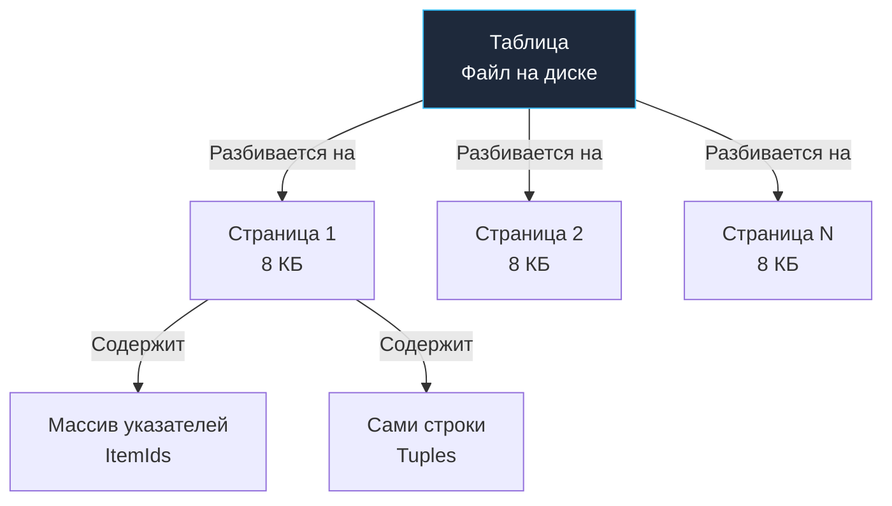

## От математики к железу: физика реляционной БД

В статье [[4. Реляционная модель данных. Основы]] мы рассматривали базу данных как идеальную математическую вселенную, оперирующую абстрактными отношениями, кортежами и предикатами теории множеств. Но промышленная СУБД — это программно-аппаратный механизм, написанный на C/C++ (или Rust), который обязан подчиняться физическим законам кремния, ширины шины данных и механики накопителей (HDD/SSD/NVMe).

В этой главе мы спустимся с математических вершин в машинное отделение. Мы переведем теоретические понятия «отношение», «кортеж» и «атрибут» на инженерный язык физического хранения: **таблицы**, **строки**, **столбцы** и **ключи**, и детально изучим, как они устроены на уровне байтов в страницах памяти.

---

## Таблица (Table) как структура хранения

На уровне SQL таблица предстает перед разработчиком логическим двухмерным контейнером. Однако на дисковом накопителе (на примере PostgreSQL, являющегося стандартом де-факто в современной Go-разработке) таблица организуется в структуру, именуемую **Heap (Куча)**.

> [!NOTE] Терминологический контекст
> Термин «Heap» в СУБД не имеет отношения ни к динамической куче в памяти Go (где аллоцируются переменные после Escape Analysis), ни к алгоритмической структуре данных «Двоичная куча» (Binary Heap).  
> В теории баз данных **Heap File** — это неупорядоченный файл данных. СУБД просто дописывает новые строки туда, где в текущий момент нашлось свободное место на страницах памяти.

В Heap-файле нет и не может быть никакого естественного физического порядка. Если в запросе опущен модификатор `ORDER BY`, СУБД возвратит строки в том порядке, в котором их блоки попадутся на диске. Поиск по Heap-файлу без использования индексов всегда превращается в полное последовательное сканирование (**Seq Scan**), вынуждающее поднять в Buffer Pool весь файл таблицы от начала до конца.



Каждая страница памяти (обычно 8 КБ) организована по схеме **Slotted Page**:
* В начале страницы располагается заголовок (`PageHeaderData`) и массив указателей на строки (`ItemIds`), растущий сверху вниз.
* Сами физические кортежи (`Tuples`) укладываются с самого конца страницы снизу вверх.
* Пространство между ними — это свободная память. Когда указатели и кортежи встречаются — страница считается заполненной.

---

## Строка (Row) под капотом. Анатомия кортежа

В представлении начинающего разработчика строка — это просто полезные данные: `(id=1, name='Bob')`. В реальности же СУБД вынуждена хранить тяжелый массив служебных метаданных для каждой строки, чтобы обеспечить транзакционную изоляцию, видимость версий и блокировки.

В исходном коде PostgreSQL структура заголовка строки называется `HeapTupleHeaderData`. Она отнимает минимум 23 байта (а с учетом обязательного аппаратного выравнивания процессора — ровно **24 байта**) *до того*, как начнутся ваши реальные пользовательские данные.

> [!info] Под капотом
> Что именно упаковано в 24 байтах заголовка строки (`HeapTupleHeader`):
> * `t_xmin` (4 байта): Идентификатор (XID) транзакции, создавшей (INSERT) данную версию строки.
> * `t_xmax` (4 байта): Идентификатор транзакции, удалившей (DELETE) или обновившей (UPDATE) эту строку. Это краеугольный камень механизма многоверсионности, который мы детально разберем в [[7. MVCC. Multi Version Concurrency Control]].
> * `t_cid` / `t_field3` (4 байта): Command Identifier — порядковый номер команды внутри транзакции.
> * `t_ctid` (6 байт): Физический указатель (Tuple ID) на актуальную версию строки (пара: номер страницы + индекс указателя на странице). Если строка обновлена, `t_ctid` указывает на новую страницу.
> * `t_infomask` (2 байта) и `t_infomask2` (2 байта): Системные битовые флаги (зафиксирована ли транзакция, заблокирована ли строка, число атрибутов).
> * `t_hoff` (1 байт): Смещение полезной нагрузки в байтах от начала заголовка.
> * **NULL Bitmap**: Битовая маска наличия NULL-значений. Если в таблице есть колонки, допускающие NULL, СУБД не тратит байты на запись «пустоты» — она выставляет бит `1` в битовой маске заголовка.

### Mechanical Sympathy: Data Alignment (Выравнивание данных)

Здесь мы наблюдаем поразительное архитектурное единство между рантаймом языка Go и физическим движком СУБД. Речь идет о **выравнивании данных в памяти (Memory Alignment и Padding)**.

Архитектура процессора устроена так, что чтение 64-битного целого числа (`int64` / `BIGINT`) по невыровненному адресу (не кратному 8 байтам) требует либо двух циклов шины памяти, либо вызывает аппаратное исключение. Поэтому компилятор Go и подсистема хранения СУБД автоматически вставляют пустые холостые байты — **Padding**.

Взглянем на структуры в Go:

```go
// ПЛОХАЯ СТРУКТУРА: Весит 24 байта из-за padding
type BadUser struct {
	IsActive bool   // 1 байт
	// 7 байт мусора (padding)
	ID       int64  // 8 байт
	RoleID   int8   // 1 байт
	// 7 байт мусора (padding)
}

// ХОРОШАЯ СТРУКТУРА: Весит 16 байт
type GoodUser struct {
	ID       int64  // 8 байт
	IsActive bool   // 1 байт
	RoleID   int8   // 1 байт
	// 6 байт мусора в конце для выравнивания всей структуры
}
```

**В реляционной СУБД разворачивается абсолютно та же драма!**  
Если при проектировании схемы DDL вы объявляете колонки в неоптимальном порядке:
```sql
CREATE TABLE bad_users (
    is_active BOOLEAN,  -- 1 байт + 7 байт padding!
    id        BIGINT,   -- 8 байт
    role_id   SMALLINT  -- 2 байта + 6 байт padding!
);
```
СУБД будет вынуждена вставлять пустые байты между атрибутами каждой отдельной строки!

На объеме в 100 миллионов записей невидимый *padding* раздует размер таблицы на 20–30 гигабайт чистого мусора. Чем больше физический размер Heap-файла — тем больше страниц приходится вычитывать с диска, тем меньше полезных строк помещается в **Buffer Pool (RAM)**, тем выше процент промахов (Cache Miss) и тем медленнее работает весь бэкенд.

> [!tip] Собеседование
> **Вопрос:** Как снизить физический размер таблицы в PostgreSQL без удаления данных и без сжатия?  
> **Ответ:** Переупорядочить столбцы в DDL таблицы по убыванию их размера и требований к выравниванию: сначала 8-байтные типы (`BIGINT`, `TIMESTAMP`, `DOUBLE PRECISION`), затем 4-байтные (`INTEGER`), 2-байтные (`SMALLINT`), 1-байтные (`BOOLEAN`), а все типы переменной длины (`VARCHAR`, `TEXT`, `JSONB`) размещать в самом конце кортежа.

---

## Столбцы (Columns) и техника TOAST

Каждый столбец имеет закрепленный тип данных (домен). Но что происходит, когда в колонку типа `TEXT`, `BYTEA` или `JSONB` сохраняется массивный полезный груз — например, JSON-документ размером 500 КБ?

Мы помним жесткое физическое ограничение: размер страницы в PostgreSQL равен ровно 8 КБ, и кортеж обязан размещаться внутри страницы. Чтобы обойти это препятствие, СУБД использует механизм **TOAST (The Oversized-Attribute Storage Technique)**.

Алгоритм работы TOAST:
1. Если размер строки превышает пороговое значение (в Postgres — около 2 КБ, `TOAST_TUPLE_THRESHOLD`), СУБД пробует прозрачно сжать данные столбца на лету (алгоритмами `pglz` или современным `lz4`).
2. Если после сжатия строка все еще не помещается в допустимый лимит, СУБД физически «вырезает» большой атрибут из кортежа основной таблицы.
3. Данные разрезаются на фрагменты по 2 КБ и сохраняются в отдельную скрытую служебную таблицу (TOAST-таблицу). В исходной строке остается лишь компактный 18-байтный указатель-дескриптор.

> [!warning] Ловушка / Gotcha
> Именно из-за устройства TOAST бездумное использование `SELECT *` в боевом коде — тягчайший архитектурный грех. Если вы выполняете `SELECT * FROM users`, а в таблице есть поле `metadata JSONB`, хранящееся в TOAST, база данных совершит **дополнительные случайные дисковые чтения (Random I/O)** в отдельную TOAST-таблицу, развернет сжатые блоки алгоритмом декомпрессии и передаст сотни килобайт по сети в ваше Go-приложение. И все это ради того, чтобы ваш код отбросил это поле или оставил нетронутым!  
> В промышленном коде запрашивайте только те столбцы, которые вы непосредственно сканируете в структуру: `SELECT id, name, email FROM users`.

---

## Ключи (Keys). Фундамент идентификации

Поскольку физический Heap — это неупорядоченное нагромождение кортежей, СУБД необходим математический гарант однозначной идентификации любой записи. Эту миссию выполняют **Ключи**.

В реляционной теории принята строгая иерархия ключей:
1.  **Суперключ (Superkey):** Любой набор столбцов, который уникально идентифицирует строку. Например, `(ID, Email, Возраст)` (хотя поле «Возраст» здесь явно избыточно, но уникальность гарантирована).
2.  **Потенциальный ключ (Candidate Key):** Минимальный суперключ, из которого нельзя удалить ни одного атрибута без потери свойства уникальности. Например, отдельно `ID` и отдельно `Email`.
3.  **Первичный ключ (Primary Key / PK):** Один из *потенциальных ключей*, выбранный инженером-проектировщиком в качестве канонического идентификатора строки. По стандарту SQL первичный ключ неявно накладывает ограничения `UNIQUE NOT NULL` и автоматически порождает уникальный B-Tree индекс.

### Суррогатные vs Естественные ключи

Классическая дилемма проектирования реляционных схем:

* **Естественный ключ (Natural Key):** Бизнес-атрибут, объективно существующий в реальном мире (номер паспорта, ИНН компании, VIN автомобиля).  
  * *Скрытая угроза:* Бизнес-реальность переменчива. Формат ИНН может измениться при выходе на международный рынок, паспорт может быть утерян и заменен. Изменение естественного ключа требует тяжелых каскадных обновлений во всех дочерних таблицах, что под нагрузкой блокирует систему и приводит к дедлокам.
* **Суррогатный ключ (Surrogate Key):** Искусственный идентификатор, лишенный какого-либо прикладного бизнес-смысла. Обычно это автоинкрементный `BIGINT` (Sequence / Identity) или `UUID`.  
  * *Индустриальный стандарт:* Суррогатный ключ неизменен на протяжении всей жизни записи, что гарантирует абсолютную стабильность связей между таблицами.

> [!tip] Собеседование
> **Вопрос:** Что предпочесть для Primary Key в распределенном бэкенде: автоинкрементный BIGINT (Sequence) или UUID?  
> **Ответ:** Выбор зависит от архитектуры:  
> 1. `BIGINT Sequence`: Компактен (8 байт), монотонно возрастает, идеально ложится в правую ветку B-Tree индекса без фрагментации страниц. Минус: единая точка генерации в базе данных, сложность шардирования.  
> 2. `UUID v4 (полностью случайный)`: 16 байт, генерируется локально в Go без похода в БД. Минус: случайное распределение превращает вставки (INSERT) в сущий кошмар для диска. Случайные значения попадают в случайные страницы B-Tree, вызывая непрерывное расщепление узлов (Page Splits), катастрофическую фрагментацию и разрастание индекса в памяти.  
> 3. **Современный золотой стандарт: UUID v7 (RFC 9562).** Первые 48 бит отводятся под миллисекундный Unix Timestamp, а оставшиеся биты заполняются энтропией. Это дает возможность генерировать ID распределенно в микросервисах на Go и сохранять монотонный рост, устраняя фрагментацию B-Tree страниц в СУБД. Подробнее о механике расщепления страниц мы поговорим в [[2. B Tree индекс под капотом]].

## Итог

1.  **Таблица** — логическая концепция; физически это неупорядоченный Heap-файл, состоящий из страниц по 8 КБ, организованных по принципу Slotted Page.
2.  **Строка** отягощена 24-байтовым служебным заголовком MVCC (`HeapTupleHeaderData`). Расположение колонок в DDL требует учета Data Alignment (выравнивания), иначе до 30% места на диске и в RAM съест невидимый паддинг.
3.  **Столбцы** большого объема выносятся в служебную область TOAST, превращая необдуманный `SELECT *` в источник разрушительного Random I/O.
4.  **Ключи** обеспечивают строгую адресацию строк. В современных распределенных системах оптимальным компромиссом между масштабируемостью и производительностью B-Tree является суррогатный ключ формата `UUID v7` или классический `BIGINT`.

Мы разобрались с внутренней анатомией одной таблицы. Но как связать несколько таблиц в непротиворечивую целостную систему? В следующей статье мы разберем первичные и внешние ключи: переходим к [[6. Первичные и внешние ключи]].