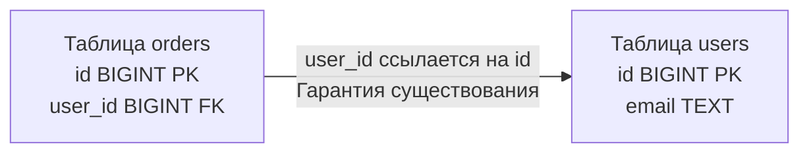

## Связывая изолированные острова данных

В предыдущей статье мы заглянули во внутреннее устройство отдельной таблицы и выяснили, что физически она представляет собой неупорядоченную кучу (Heap) страниц на диске. Однако истинная мощь реляционных баз данных раскрывается не в изолированном хранении разрозненных массивов, а в возможности надежно, консистентно и эффективно объединять эти данные в единую связанную картину предметной области.

Вся эта связность держится на двух архитектурных опорах: **Первичный ключ (Primary Key, PK)** и **Внешний ключ (Foreign Key, FK)**. Для бэкенд-инженера понимание физических механизмов их работы — это водораздел между созданием наивного CRUD-приложения, которое «ложится» при первом всплеске трафика, и проектированием отказоустойчивой распределенной системы, готовой к горизонтальному шардированию.

---

## Первичный ключ (Primary Key): Якорь таблицы

**Первичный ключ** — это столбец (или кортеж столбцов), однозначно идентифицирующий каждую запись в отношении. С математической точки зрения он гарантирует фундаментальный постулат теории множеств: в отношении не может существовать двух неотличимых кортежей-дубликатов.

Но как устроен Primary Key на уровне физического движка СУБД?

> [!info] Под капотом: PK и индексы
> Когда разработчик указывает в DDL ограничение `PRIMARY KEY`, СУБД под капотом выполняет два обязательных действия:
> 1. Навешивает на колонку аппаратные проверки ограничений `NOT NULL` и `UNIQUE`.
> 2. **Автоматически возводит B-Tree индекс** по указанному столбцу.
> 
> Однако реализация этого механизма в разных СУБД кардинально различается:
> * В **PostgreSQL** файл таблицы (Heap) и файл первичного индекса — это две совершенно разные дисковые структуры. Индекс B-Tree содержит отсортированные ключи и физические 6-байтные указатели (`ctid`), ведущие на конкретные страницы и смещения в Heap-файле.
> * В **MySQL (InnoDB)** принята принципиально иная парадигма: **Кластерный индекс (Clustered Index)**. В InnoDB сама таблица физически представляет собой B-Tree дерево, отсортированное по Primary Key. Листовые узлы этого дерева содержат не указатели, а *непосредственные данные всей строки*. Такая структура называется Index-Organized Table (IOT). Мы детально разберем эту механику в статьях [[2. B Tree индекс под капотом]] и [[2. InnoDB storage engine]].

### Mechanical Sympathy: Почему тип PK критически важен?

Поскольку первичный ключ служит основой для построения главного B-Tree индекса, выбор его типа данных предопределяет характер дискового ввода-вывода (I/O) при каждой операции вставки (`INSERT`):

1. **`BIGINT` (Sequence / Identity):** Абсолютный фаворит дисковой подсистемы. Значения возрастают монотонно (1, 2, 3...). Новые записи всегда добавляются в самую правую листовую страницу B-Tree. Страницы заполняются плотно и последовательно, что дает 100% последовательную запись (**Sequential Write**) без дорогостоящих перестроений.
2. **`UUID v4` (Случайный):** Катастрофа для диска при высоких темпах записи. Случайные значения равномерно рассеиваются по всему диапазону ключей. Для каждой вставки СУБД вынуждена находить произвольную страницу B-Tree в оперативной памяти или вычитывать ее с накопителя. Когда страница переполняется, происходит её аварийное расщепление пополам (**Page Split**), порождая колоссальную внутреннюю фрагментацию, деградацию кэша и шквал случайных дисковых операций (**Random I/O**).
3. **`UUID v7` (Time-sorted):** Современный инженерный компромисс (RFC 9562). Первые 48 бит отводятся под миллисекундный Unix Timestamp, благодаря чему ключи монотонно возрастают во времени. Это сохраняет все преимущества `BIGINT` для диска и локальности кэша, одновременно позволяя сервисам на Go генерировать глобально уникальные ID без обращения к единой централизованной базе данных.

---

## Внешний ключ (Foreign Key): Мост и Контролер

**Внешний ключ (Foreign Key)** — это атрибут в дочерней таблице, который строго ссылается на первичный ключ в родительской таблице.

Фундаментальное назначение внешнего ключа — обеспечение **Ссылочной целостности (Referential Integrity)**. База данных на аппаратном уровне ядра гарантирует невозможность появления логических аномалий: вы не сможете создать запись «Заказ» для несуществующего пользователя и не сможете удалить пользователя, если за ним числятся активные транзакции.



> [!warning] Ловушка / Gotcha: Цена ссылочной целостности
> Многие разработчики относятся к Foreign Key как к безобидным декларативным метаданным, полезным лишь для визуализации связей в ER-диаграммах или автогенерации JOIN-ов в ORM. В реальности **Foreign Key — это скрытый и недешевый синхронный триггер**.
> 
> Когда ваш Go-сервис выполняет операцию:
> ```sql
> INSERT INTO orders (user_id) VALUES (42)
> ```
> СУБД *обязана приостановить* вставку, выполнить под капотом скрытую проверку существования родительской записи:
> ```sql
> SELECT id FROM users WHERE id = 42
> ```
> и наложить блокировку на кортеж пользователя, чтобы параллельная транзакция не успела его удалить. Если страница с пользователем 42 сейчас отсутствует в Buffer Pool, этот простой `INSERT` внезапно потребует чтения с диска! На высоконагруженных системах (сотни тысяч RPS) подобные скрытые проверки (и блокировки) становятся бутылочным горлышком.

### Архитектура Highload: Жизнь без Foreign Keys

Если вы заглянете в схемы баз данных высоконагруженных мировых гигантов (Uber, GitHub, Pinterest, Slack или X/Twitter), вы обнаружите поразительный факт: в их продакшен-базах **практически отсутствуют Foreign Keys**.

Почему архитекторы Highload-систем идут на осознанный отказ от встроенной ссылочной целостности?
1. **Горизонтальное шардирование (Sharding):** При росте объемов данных таблица `users` неизбежно переезжает на серверный кластер в один дата-центр, а таблица `orders` шардируется по десяткам других серверов (см. [[4. Sharding]]). Ни одна классическая СУБД не умеет проверять Foreign Key между физически независимыми серверами без использования тяжелых распределенных протоколов двухфазной фиксации (2PC).
2. **Конкуренция и дедлоки (Locks & Deadlocks):** Каждая проверка FK накладывает блокировку на родительскую строку. При массовых параллельных изменениях родительских и дочерних сущностей вероятность взаимоблокировок процессов возрастает экспоненциально.

В подобных архитектурах обеспечение ссылочной целостности переносится на уровень прикладного кода сервисов Go, транзакционных очередей и фоновых воркеров, вычищающих «осиротевшие» записи (Orphaned records).

---

## Работа с ключами в Go: Идиоматика и Обработка ошибок

Взаимодействуя с базой данных из Go через стандартный пакет `database/sql` и драйвер `pgx`, инженер должен соблюдать строгую культуру обработки опциональных связей и ошибок целостности.

### 1. Опциональные связи и NULL
Внешний ключ может содержать значение `NULL`, если бизнес-логика допускает существование сущности без привязки к родителю (например, тикет в службе поддержки, еще не назначенный ни на одного оператора). В Go недопустимо маппить такое поле в примитивный тип `int64`, поскольку дефолтное нулевое значение `0` база данных воспримет как валидный ID пользователя №0.

Идиоматичный подход требует использования специализированных структур-оберток либо указателей:

```go
import (
    "database/sql"
)

type Task struct {
    ID         int64
    Title      string
    // Если assigned_user_id в БД может быть NULL, 
    // обычный int64 использовать нельзя (значение 0 может означать реальный ID).
    // Мы используем sql.NullInt64 или указатель *int64.
    AssigneeID sql.NullInt64 
}
```

### 2. Обработка Foreign Key Violation
Если вы попытаетесь вставить заказ для несуществующего пользователя, база отклонит транзакцию и вернет ошибку. Идиоматичный Go-код никогда не парсит строку ошибки через `strings.Contains()`. Мы используем type assertion для драйверо-специфичных ошибок.

```go
package main

import (
    "context"
    "database/sql"
    "errors"
    "fmt"

    "github.com/jackc/pgx/v5/pgconn"
)

const pgErrForeignKeyViolation = "23503" // Стандартный SQLSTATE код

func createOrder(ctx context.Context, db *sql.DB, userID int64, total int) error {
    query := `INSERT INTO orders (user_id, total) VALUES ($1, $2)`
    _, err := db.ExecContext(ctx, query, userID, total)
    if err != nil {
        // Проверяем, является ли ошибка ошибкой PostgreSQL
        var pgErr *pgconn.PgError
        if errors.As(err, &pgErr) {
            // Сравниваем SQLSTATE код ошибки
            if pgErr.Code == pgErrForeignKeyViolation {
                return fmt.Errorf("пользователь с ID %d не существует: нарушение внешнего ключа", userID)
            }
        }
        return fmt.Errorf("внутренняя ошибка БД: %w", err)
    }
    return nil
}
```

---

## Каскадные операции: Оружие массового поражения

При декларации внешнего ключа стандарт SQL позволяет определить поведение при удалении родительской записи: директива `ON DELETE CASCADE`. Это предписывает СУБД автоматически и рекурсивно удалить все дочерние записи вслед за родителем: удалили пользователя — база сама вычистит его профиль, заказы, корзину, комментарии и логи сессий.

> [!tip] Собеседование
> **Вопрос:** Почему системные архитекторы и ведущие DBA категорически запрещают использование `ON DELETE CASCADE` в высоконагруженных производственных базах данных?  
> **Ответ:** Каскадное удаление — это неконтролируемая скрытая транзакция чудовищной разрушительной силы. Удаление одной ключевой учетной записи (например, корпоративного клиента) может инициировать немедленное удаление десятков миллионов строк в сотнях связанных таблиц:  
> 1. **Глобальный коллапс блокировок:** СУБД накладывает эксклюзивные блокировки на гигантские массивы страниц, парализуя работу сотен параллельных потоков бэкенда и провоцируя лавину дедлоков.  
> 2. **Взрывной рост журнала предзаписи (WAL):** Генерация гигабайтов записей WAL за считанные секунды (подробнее в [[8. WAL. Write Ahead Log]]) приводит к переполнению дисков и критическому отставанию асинхронных реплик (Replication Lag), ставя под угрозу всю инфраструктуру.  
> 
> *Инженерное решение:* Использование мягкого удаления (**Soft Delete** через флаг `is_deleted = true` или временную метку `deleted_at`) либо фоновое асинхронное удаление записей небольшими пакетами (батчами по 1 000–5 000 штук) через управляемые фоновые горутины в Go (Background Workers).

## Итог

1. **Primary Key (PK)** — гарантирует математическую уникальность кортежа и опирается на физический B-Tree индекс (в PostgreSQL) или кластерную организацию всей таблицы (в MySQL InnoDB). Приоритет всегда отдается монотонно растущим суррогатным ключам (`BIGINT` или `UUID v7`).
2. **Foreign Key (FK)** — страж ссылочной целостности, работающий как неявный синхронный триггер с наложением разделяемых блокировок на родительские строки.
3. В распределенных архитектурах и Highload-системах жесткие Foreign Keys часто осознанно устраняются ради шардирования и исключения блокировок, а консистентность гарантируется бизнес-логикой на Go.
4. Каскадные удаления (`ON DELETE CASCADE`) несут риск неконтролируемой перегрузки базы и вытесняются паттернами Soft Delete и пакетной асинхронной очистки.

Первичные и внешние ключи — это фундамент, но далеко не единственный барьер на страже корректности данных. В следующей статье мы подробно изучим полный арсенал ограничений, встроенных в реляционные движки: переходим к [[7. Ограничения целостности данных]].