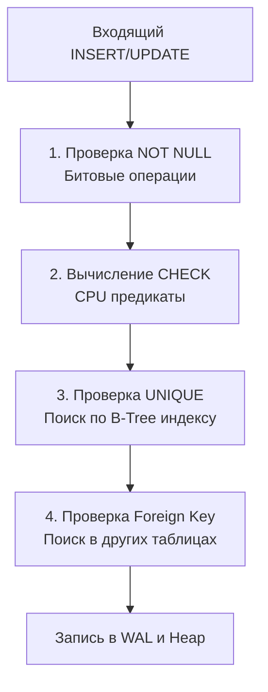

## Последний рубеж обороны данных

Одна из самых распространенных и опасных иллюзий, с которой бэкенд-разработчики сталкиваются при переходе к микросервисной архитектуре — это вера в то, что прикладной код полностью и единолично управляет состоянием системы. Инженер проектирует красивую доменную модель (Domain-Driven Design), пишет аккуратные валидаторы структур на Go, покрывает всё модульными тестами и искренне полагает, что в базу данных физически не могут просочиться некорректные или противоречивые байты.

В реальной жизни высоконагруженного продакшена это опасное заблуждение. В распределенной среде десятки независимых экземпляров сервиса (подов в Kubernetes) параллельно и асинхронно мутируют общее состояние. Никакие проверки в оперативной памяти одного процесса Go не способны предотвратить состояние гонки (Race Condition), когда два запроса одновременно решают, что условие соблюдено. Без бескомпромиссных системных барьеров в самом ядре СУБД повреждение данных (Data Corruption) становится лишь вопросом времени.

**Ограничения целостности (Constraints)** — это непреложные математические инварианты на уровне движка базы данных, гарантирующие корректность данных *до того*, как транзакция запишет измененные страницы в память и журнал на диске. Это финальный, фундаментальный рубеж обороны любой информационной системы.

В предыдущей главе мы подробно разобрали первичные и внешние ключи ([[6. Первичные и внешние ключи]]). В этой статье мы сосредоточимся на трех остальных столпах декларативной защиты: **NOT NULL**, **UNIQUE** и **CHECK**, заглянем в их физическую реализацию и выработаем идиоматичные паттерны обработки ошибок в Go.

---

## 1. NOT NULL: Отсутствие пустоты

Ограничение `NOT NULL` категорически запрещает запись специального маркера неизвестности (NULL) в определенный столбец. С точки зрения классической теории Эдгара Кодда, это базовая защита целостности домена (Domain Integrity).

Но какова физическая цена этой проверки на уровне «железа»?

> [!info] Под капотом: Битовая маска
> Вспомним анатомию кортежа (`HeapTupleHeader`), которую мы изучали в статье [[5. Таблицы, строки, столбцы и ключи]].  
> Ограничение `NOT NULL` проверяется молниеносно. Когда СУБД формирует новый кортеж, ей даже не требуется выделять буферы под полезную нагрузку или обращаться к дисковым страницам. Движок просто анализирует битовую маску NULL-значений (NULL Bitmap) в заголовке строки. Если в системном каталоге для колонки выставлен флаг `NOT NULL`, парсер и исполнитель СУБД отвергают запрос за пару машинных инструкций процессора без единого дискового системного вызова.

---

## 2. UNIQUE: Больше, чем просто правило

Ограничение `UNIQUE` гарантирует, что в таблице не может существовать двух строк с идентичным значением указанной колонки (или составной группы колонок). Это стандартное решение для email-адресов пользователей, номеров телефонов, артикулов товаров или ключей идемпотентности (Idempotency Keys).

Многие разработчики ошибочно полагают, что `UNIQUE` — это просто логическое правило, аналогичное валидации в коде. Однако с точки зрения архитектуры СУБД это ресурсоемкий физический объект.

> [!warning] Ловушка / Gotcha: Скрытая цена UNIQUE
> Чтобы СУБД могла проверить уникальность значения за логарифмическое время $O(\log N)$, а не сканировать терабайтный Heap-файл за $O(N)$, **база данных обязана создать полноценный B-Tree индекс под капотом**.  
> Ограничение `UNIQUE` физически не может существовать без B-Tree индекса. Когда вы выполняете `ALTER TABLE users ADD UNIQUE (email)`, СУБД выделяет на накопителе отдельный файл данных с отсортированным деревом email-ов.  
> 
> *Что это означает для бэкенд-инженера?* Каждая операция добавления (`INSERT`) или модификации (`UPDATE`) уникального поля теперь влечет двойную стоимость записи: сначала строка пишется в Heap, а затем обновляется дерево индекса (Index Maintenance). Если вы вешаете `UNIQUE` на широкие строковые поля (например, длинные URL или JWT-токены по 500 байт), размер индекса в ОЗУ мгновенно превысит размер самой таблицы, вымывая полезные данные из Buffer Pool и катастрофически замедляя вставки.

---

## 3. CHECK: Пользовательские предикаты на уровне CPU

Ограничение `CHECK` позволяет задать произвольное логическое выражение (предикат), которое обязано возвращать `TRUE` (или `NULL`) для каждой строки:

* `CHECK (balance >= 0)` — математическая гарантия невозможности уйти в отрицательный баланс при финансовых операциях.
* `CHECK (role IN ('admin', 'user', 'guest'))` — строгий контроль перечислимого домена без необходимости заводить отдельную справочную таблицу.
* `CHECK (start_date < end_date)` — валидация согласованности связанных временных меток.

Предикаты `CHECK` вычисляются исключительно в пространстве пользователя (User Space) процесса СУБД в оперативной памяти до записи данных в буфер (Buffer Pool). Они требуют лишь нескольких десятков тактов CPU и абсолютно бесплатны с точки зрения операций дискового ввода-вывода (I/O). Поэтому **критические бизнес-инварианты (например, баланс >= 0) всегда должны дублироваться ограничением CHECK в базе данных**.



---

## Архитектура: Иллюзия App-level валидации и Race Conditions

Фундаментальный концептуальный сдвиг, необходимый Senior-инженеру — осознание опасности проблемы **TOCTOU (Time-of-Check to Time-of-Use)** при конкурентной обработке запросов.

Посмотрим на классический антипаттерн регистрации пользователя, кочующий из одного учебного проекта в другой: *«Сначала проверим в базе через SELECT, свободен ли email. Если свободен — создадим пользователя»*.

```go
// АНТИПАТТЕРН: Уязвимо к Race Condition
func registerUserBad(ctx context.Context, db *sql.DB, email string) error {
	var exists bool
	// 1. TIME OF CHECK (Время проверки)
	err := db.QueryRowContext(ctx, "SELECT exists(SELECT 1 FROM users WHERE email = $1)", email).Scan(&exists)
	if err != nil { return err }
	
	if exists {
		return errors.New("email уже занят")
	}

	// [!] СЮДА ВСТРАИВАЕТСЯ ГОНКА [!]
	// Если две горутины (или два разных сервиса) проверят email одновременно, 
	// обе получат exists = false и пойдут выполнять INSERT.

	// 2. TIME OF USE (Время использования)
	_, err = db.ExecContext(ctx, "INSERT INTO users (email) VALUES ($1)", email)
	return err
}
```

Если в схеме базы данных отсутствует ограничение `UNIQUE`, два одновременных HTTP-запроса от пользователя (например, двойной клик в браузере или параллельные вебхуки) одновременно пройдут проверку `exists == false`. В итоге в таблице появятся две разные записи с абсолютно одинаковым адресом электронной почты. Аутентификация сломается, а целостность системы будет скомпрометирована.

### Idiomatic Go: Delegation to Database (Делегирование базе)

В духе философии *Mechanical Sympathy* надежное решение заключается в том, чтобы **полностью ликвидировать предварительный холостой запрос (SELECT)**.

Мы перекладываем бремя проверки на плечи реляционного ядра СУБД: выполняем прямой «слепой» `INSERT` и перехватываем низкоуровневую ошибку нарушения констрейнта. Это не только на 100% защищает от Race Conditions, но и экономит целый сетевой раундтрип (Network Round Trip) между бэкендом и базой.

```go
// ИДИОМАТИЧНЫЙ ПОДХОД: Пусть база данных защищает сама себя
package main

import (
	"context"
	"database/sql"
	"errors"
	"fmt"
	
	"github.com/jackc/pgx/v5/pgconn"
)

const pgErrUniqueViolation = "23505" // SQLSTATE для Postgres

var ErrEmailTaken = errors.New("email уже занят")

func registerUserGood(ctx context.Context, db *sql.DB, email string) error {
	// Сразу делаем INSERT. Ограничение UNIQUE в БД не пропустит дубликат.
	query := `INSERT INTO users (email) VALUES ($1) RETURNING id`
	
	var newID int64
	err := db.QueryRowContext(ctx, query, email).Scan(&newID)
	if err != nil {
		// Проверяем, является ли ошибка нарушением уникальности
		var pgErr *pgconn.PgError
		if errors.As(err, &pgErr) {
			if pgErr.Code == pgErrUniqueViolation {
				// В pgErr.ConstraintName также лежит имя нарушенного индекса,
				// если нужно отличить уникальность email от уникальности телефона.
				return ErrEmailTaken 
			}
		}
		// Логируем или возвращаем другие ошибки (таймауты, сбои сети)
		return fmt.Errorf("ошибка вставки в БД: %w", err)
	}

	return nil
}
```

> [!tip] Собеседование
> **Вопрос:** Зачем тратить время на валидацию данных в коде приложения на Go (валидаторы структур, регулярные выражения для email), если база данных гарантированно проверит все через ограничения целостности (Constraints)?  
> **Ответ:** Это классический принцип эшелонированной защиты (**Defense in Depth**):  
> 1. **Валидация в Go (Первая линия обороны):** Экономит дорогостоящие ресурсы СУБД. Если клиент передал заведомо некорректный JSON, пустую строку или отрицательный возраст, запрос немедленно отбрасывается на границе API без расхода соединений из пула `*sql.DB`, без нагрузки на сетевую карту и без траты тактов CPU на парсинг SQL.  
> 2. **Констрейнты в БД (Финальная линия обороны):** Служат абсолютной гарантией согласованности (Single Source of Truth) на случай логических багов в микросервисах, конкурентных гонок (TOCTOU), кривых миграций или ручных манипуляций администраторов через консоль `psql`.

## Итог

1.  **Ограничения целостности** — это математические инварианты, выполняемые атомарно внутри ядра СУБД до фиксации транзакции.
2.  `NOT NULL` и `CHECK` чрезвычайно дешевы: они проверяются на уровне битовых масок и арифметики CPU, не генерируя дополнительного дискового ввода-вывода.
3.  `UNIQUE` всегда влечет за собой создание полноценного B-Tree индекса. Это гарантия уникальности ценой дополнительной дисковой памяти и расходов на сопровождение дерева при каждой операции записи.
4.  В конкурентном Go-бэкенде никогда не полагайтесь на паттерн `SELECT-then-INSERT`. Доверяйте проверку уникальности СУБД и элегантно перехватывайте ошибку с кодом `23505`.

Мы изучили механизмы защиты данных от некорректных значений. Но в реляционной теории существует особое метафизическое состояние, способное сломать привычную булеву логику и запутать даже опытного разработчика. В следующей статье мы познакомимся с самой коварной концепцией SQL: переходим к [[8. NULL и трехзначная логика]].