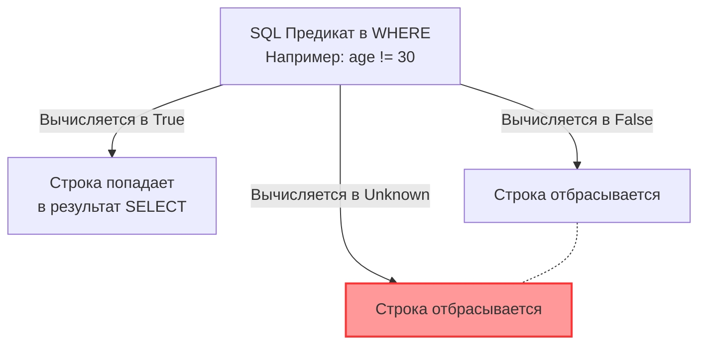

## Призрак реляционной модели

В мировоззрении программиста на Go царит кристальная двоичная ясность. Логическая переменная может быть либо строго `true`, либо `false`. Указатель либо адресует валидный участок памяти, либо равен `nil`. Целочисленная переменная не может превратиться в «ничто» — при объявлении она гарантированно получает дефолтное нулевое значение `0` (Zero Value). В таком предсказуемом мире комфортно писать детерминированный код.

Однако, переступая порог мира реляционных баз данных и языка SQL, мы сталкиваемся с фундаментальным сдвигом философской парадигмы. Проектируя реляционную алгебру, Эдгар Кодд исходил из того, что базы данных обязаны моделировать не идеальные математические абстракции, а реальный, физический и зачастую хаотичный мир. А в реальном мире информация очень часто бывает неполной: телефон клиента может быть еще не получен, дата окончания договора пока неизвестна, а девичья фамилия попросту неприменима к юридическому лицу.

Для представления этой неполноты Кодд ввел специальное состояние:  
**`NULL` — это не ноль, не пустая строка и не `false`. Это специальный маркер, означающий «значение неизвестно» или «значение неприменимо».**

Это решение разбило классическую двузначную логику Аристотеля и породило **Трехзначную логику (Three-Valued Logic, 3VL)**. Недопонимание 3VL — неиссякаемый источник коварнейших багов, финансовых расхождений в отчетах и скрытых просадок производительности.

---

## Трехзначная логика (3VL)

В стандарте SQL результат вычисления любого логического предиката может находиться в одном из трех взаимоисключающих состояний:
1.  **True** (Истина)
2.  **False** (Ложь)
3.  **Unknown** (Неизвестно — логическое следствие соприкосновения с `NULL`)

> [!warning] Ловушка / Gotcha: Сравнение с NULL
> В SQL синтаксически бессмысленно писать конструкцию `WHERE age = NULL`.  
> Поскольку `NULL` олицетворяет неизвестность, равны ли два неизвестных значения? Мы не можем этого утверждать.  
> Поэтому выражение `NULL = NULL` вычисляется как **Unknown**. Точно так же предикат `NULL != 10` дает не истину, а **Unknown**.  
> Для корректной проверки на наличие маркера пустоты в SQL предусмотрены специальные операторы: `IS NULL` и `IS NOT NULL`.

Как ведут себя классические булевы операторы `AND` и `OR` при встрече с состоянием `Unknown`?
* `True OR Unknown` = **True** (поскольку для истинности дизъюнкции достаточно хотя бы одной Истины).
* `False AND Unknown` = **False** (поскольку конъюнкция с заведомой Ложью не может стать истинной ни при каких обстоятельствах).
* `True AND Unknown` = **Unknown** (второй операнд неизвестен, следовательно, мы не можем гарантировать итоговую Истину).



> [!tip] Собеседование
> **Вопрос:** В таблице `users` 100 строк. У 30 из них `age = 20`, у 50 строк `age = 30`, и у 20 строк `age IS NULL`.  
> Сколько строк вернет запрос: `SELECT * FROM users WHERE age != 30;`?  
> **Ответ:** Ровно 30 строк. Строки, где `age IS NULL`, при подстановке в предикат `NULL != 30` вычисляются в состояние `Unknown`. А секция `WHERE` пропускает в результирующий набор **исключительно** те кортежи, для которых предикат строго равен `True`. Любое значение `Unknown` отбрасывается точно так же, как и `False`. Это классическая ошибка, из-за которой разработчики теряют до четверти данных в аналитических выборках.

### Смертельная ловушка: NOT IN и NULL

Это один из самых показательных и любимых вопросов на архитектурных собеседованиях уровня Middle+ и Senior.

Представьте невинную задачу: выбрать всех сотрудников, чья роль не входит в черный список:
```sql
-- Хотим найти юзеров, чьего role_id нет в черном списке
SELECT * FROM users WHERE role_id NOT IN (1, 2, NULL);
```

Этот запрос **всегда вернет 0 строк (абсолютно пустое множество)**, сколько бы миллионов пользователей ни хранилось в вашей таблице!

Почему так происходит?  
В соответствии со стандартом SQL, оператор `NOT IN` разворачивается оптимизатором базы данных в цепочку строгих неравенств, связанных через логическое `AND`:
```sql
role_id != 1 AND role_id != 2 AND role_id != NULL
```

Пусть у нас есть пользователь с `role_id = 5`. Подставим его в предикат:
`5 != 1` (True) `AND` `5 != 2` (True) `AND` `5 != NULL` (Unknown).  
Итоговое выражение: `True AND True AND Unknown` превращается в **Unknown**.  
А поскольку секция `WHERE` безжалостно отбрасывает всё, что не является `True`, ни одна строка в таблице никогда не пройдет фильтр.

Никогда не допускайте попадания `NULL` в список значений оператора `NOT IN` (особенно при использовании подзапросов!). В боевом коде всегда заменяйте такие конструкции на безопасный предикат `NOT EXISTS` (который мы разберем в [[10. EXISTS и IN]]).

---

## NULL в агрегатных функциях

Обычные скалярные математические операции при контакте с `NULL` немедленно обращаются в прах:
* `10 + NULL` = `NULL`
* `CONCAT('Hello ', NULL)` = `NULL` (в большинстве реляционных СУБД, хотя PostgreSQL предоставляет функции безопасной конкатенации).

Однако стандартные агрегатные функции SQL подчиняются совершенно иным правилам. Они попросту **игнорируют** значения `NULL`:

* `COUNT(*)` — считает общее количество физических кортежей в таблице, независимо от содержимого колонок.
* `COUNT(age)` — подсчитывает количество строк, в которых строго `age IS NOT NULL`.
* `SUM(balance)` — суммирует балансы, молча пропуская строки с `NULL` (вместо того, чтобы превратить всю сумму в `NULL`).

Если же вам необходимо включить `NULL` в математические вычисления как нейтральный элемент (например, считать неизвестный баланс как ноль), вы обязаны явно привести его с помощью функции `COALESCE`:
```sql
SELECT SUM(COALESCE(balance, 0)) FROM accounts;
```

---

## Mechanical Sympathy: Как NULL хранится на диске?

Казалось бы, если `NULL` — это отсутствие значения, он не должен занимать ни одного байта на накопителе. Однако СУБД обязана однозначно знать, какое именно поле в строке отсутствует. Как это организовано на уровне физических структур?

> [!info] Под капотом: NULL Bitmap
> Вернемся к устройству заголовка кортежа (`HeapTupleHeader`), описанному в статье [[5. Таблицы, строки, столбцы и ключи]].  
> Если в строке хотя бы одна колонка содержит значение `NULL`, СУБД выставляет специальный бит `HEAP_HASNULL` в 16-битном системном поле `t_infomask`.  
> 
> Непосредственно за фиксированным 23-байтовым заголовком резервируется **NULL Bitmap** — компактная битовая шкала, где на каждый столбец таблицы выделяется ровно 1 бит (бит `0` или `1` сигнализирует о присутствии данных).  
> 
> Это означает, что если вы записываете `NULL` в колонку типа `BIGINT` (которая в обычном состоянии занимает 8 байт), эти 8 байт **вообще не аллоцируются** в полезной нагрузке строки (payload). Значение `NULL` хранится как один-единственный бит в битовой карте заголовка! Такая архитектура делает `NULL` идеальным и сверхэкономичным инструментом для хранения сильно разреженных данных (Sparse Data).

### Индексы и NULL

Как B-Tree индексы относятся к маркерам `NULL`?  
В PostgreSQL B-Tree индекс **включает** значения `NULL` в общую структуру дерева (сохраняя их в самом начале или в самом конце в зависимости от директивы `NULLS FIRST / NULLS LAST`).

Это порождает серьезную проблему. Представьте таблицу на 20 миллионов пользователей, где 98% строк имеют статус `deleted_at IS NULL` (активные пользователи). Если вы создадите стандартный B-Tree индекс по полю `deleted_at`, вы получите колоссальное дерево, забитое миллионами записей `NULL`, которое будет занимать гигабайты ОЗУ.

Для решения этой задачи опытные инженеры используют **Частичные индексы (Partial Indexes)**:
```sql
CREATE INDEX idx_active_users ON users (id) WHERE deleted_at IS NULL;
```
Такой индекс будет компактным (займет доли мегабайта), сохранит в себе только «живые» записи и обеспечит максимальную производительность при фильтрации активных пользователей. Мы подробно разберем эту механику в статье [[7. Partial индекс]].

---

## Работа с NULL в Go (Idiomatic Go)

Поскольку язык Go исповедует строгую двузначную типизацию и не имеет встроенной концепции 3VL, стандартный пакет `database/sql` предлагает два архитектурных пути для преодоления Impedance Mismatch при переносе `NULL` из базы в код.

### Путь 1: sql.Null* типы (Значимая семантика)

Стандартная библиотека Go предоставляет готовые типы: `sql.NullString`, `sql.NullInt64`, `sql.NullBool`, `sql.NullTime` и т.д.  
Под капотом это простые структуры, состоящие из двух полей: целевого значения и булевого флага `Valid` (напрямую зеркалящего бит из NULL Bitmap СУБД):

```go
type User struct {
    ID    int64
    Name  string
    Phone sql.NullString // Может быть NULL в базе
}

func GetUserPhone(db *sql.DB, id int64) {
    var u User
    err := db.QueryRow("SELECT id, name, phone FROM users WHERE id = $1", id).Scan(&u.ID, &u.Name, &u.Phone)
    if err != nil {
        return
    }
    
    if u.Phone.Valid {
        fmt.Printf("Телефон: %s\n", u.Phone.String)
    } else {
        fmt.Println("Телефон не указан")
    }
}
```

**Преимущество для Highload:** Структура `sql.NullString` является значимым типом (Value Type). Она аллоцируется непосредственно на стеке горутины, не вызывает эскейп-анализа (Escape Analysis) в кучу (Heap) и не создает нагрузки на сборщик мусора (GC).

### Путь 2: Указатели (Ссылочная семантика)

Альтернативный подход — использование стандартных указателей языка Go. Драйверы СУБД (`pgx`, `go-sql-driver/mysql`) распознают `nil`-указатель как эквивалент SQL `NULL`:

```go
type User struct {
    ID    int64
    Name  string
    Phone *string // nil означает NULL в базе
}
```

**Минусы с точки зрения Mechanical Sympathy:** Создание указателя `*string` практически гарантированно приводит к аллокации в куче. При чтении потока в 1 000 000 строк приложение создаст миллион мелких объектов в памяти, спровоцировав всплеск накладных расходов CPU на работу сборщика мусора.

> [!tip] Собеседование
> **Резюме для архитектора:** Если в вашем сервисе критичны производительность, пропускная способность и нулевые аллокации — выбирайте `sql.Null*` или собственные типы, реализующие интерфейс `sql.Scanner`. Если же вы разрабатываете внутреннюю административную панель или CRUD с невысокой нагрузкой, где приоритетом является читаемость DTO и автоматический маршалинг в JSON через тег `omitempty`, использование указателей вполне оправдано.

## Итог

1.  **Трехзначная логика:** Любая операция сравнения с `NULL` порождает состояние `Unknown`. Секция `WHERE` пропускает в результирующий набор строго те строки, для которых предикат равен `True`.
2.  Критическая ловушка: оператор `NOT IN` при наличии хотя бы одного `NULL` всегда обращает весь фильтр в пустое множество. Всегда предпочитайте `NOT EXISTS`.
3.  Агрегатные функции (`COUNT(col)`, `SUM(col)`) игнорируют `NULL`. Для перевода неизвестности в дефолтное значение используйте `COALESCE`.
4.  На физическом уровне `NULL` практически не расходует дисковое пространство благодаря NULL Bitmap в заголовке `HeapTupleHeader`.
5.  В Go для высоконагруженных сервисов предпочтительнее типы `sql.Null*` со стековой аллокацией, предотвращающие фрагментацию кучи и снижающие давление на Garbage Collector.

Мы завершили знакомство с фундаментальными строительными кирпичиками реляционных данных: таблицами, ключами, ограничениями и поведением в трехзначной логике. Теперь мы готовы подняться на уровень архитектурного проектирования и научиться превращать хаотичные бизнес-сущности в элегантные схемы данных. В следующей статье мы познакомимся с фундаментальной дисциплиной схемотехники: переходим к [[9. Нормализация. Введение]].