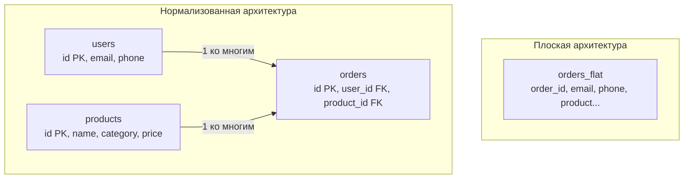

## Искусство разделять и властвовать

В предыдущих главах мы подробно изучали механику физического уровня: как байты укладываются в 8-килобайтные страницы, как работают индексы и что происходит внутри ядра СУБД при системных вызовах. Но сколь бы быстрым ни был ваш сервер и сколь бы производительными ни были NVMe-накопители, аппаратная мощь бессильна перед архитектурными ошибками. Небрежно спроектированная схема базы данных способна свести на нет любые усилия инженеров.

**Нормализация** — это математически выверенный процесс декомпозиции (разделения) отношений с целью полного устранения избыточности данных и предотвращения логических аномалий при их модификации.

Говоря простым инженерным языком: это строгий свод правил, предписывающий разбить одну гигантскую, рыхлую «плоскую» таблицу на компактные, логически независимые сущности, соединенные надежными связями через [[6. Первичные и внешние ключи]]. Зачем это необходимо и какую цену мы платим за этот порядок?

---

## Плоский мир и его проблемы (Аномалии данных)

Каждый разработчик в начале своего профессионального пути испытывает соблазн спроектировать единую плоскую таблицу. Это кажется естественным: ведь именно так данные отображаются в электронных таблицах Excel или возвращаются в JSON-ответах внешних API.

Представим наивную таблицу заказов интернет-магазина:

| order_id | user_email | user_phone | product_name | category | price |
| :--- | :--- | :--- | :--- | :--- | :--- |
| 1 | bob@go.dev | 555-01 | Gopher Plush | Toys | 20 |
| 2 | bob@go.dev | 555-01 | Go Book | Books | 40 |
| 3 | alice@go.dev | 555-02 | Gopher Plush | Toys | 20 |

На первый взгляд, такая структура выглядит привлекательно: один простой запрос `SELECT * FROM orders WHERE user_email = 'bob@go.dev'` моментально возвращает всю историю покупок Боба без единого JOIN-а. Однако в боевых условиях такая схема превращается в пороховую бочку. В реляционной теории это называется тремя классическими **Аномалиями данных**.

### 1. Аномалия обновления (Update Anomaly)
Пользователь Боб сменил номер телефона. Если Боб — постоянный клиент, у него в таблице накоплено 10 000 заказов за пять лет.  
Чтобы актуализировать один номер телефона, СУБД обязана найти и перезаписать все 10 000 физических строк.
* **Катастрофическое последствие:** Если посреди этой тяжелой операции произойдет аппаратный сбой, отвалится сетевое соединение или возникнет дедлок блокировок, часть строк обновится, а часть сохранит старый номер. База данных погрузится в неконсистентное состояние, а служба поддержки потеряет возможность связаться с клиентом.

### 2. Аномалия удаления (Deletion Anomaly)
Боб оформил лишь один пробный заказ (`order_id = 1`), но затем передумал и отменил его. Сервис выполняет операцию:  
`DELETE FROM orders WHERE order_id = 1`.
* **Катастрофическое последствие:** Вместе с удалением строки заказа мы безвозвратно стираем из базы данных учетную запись самого Боба — его email и телефон. Пользователь фактически перестает существовать в нашей системе лишь потому, что у него нет активных покупок.

### 3. Аномалия вставки (Insertion Anomaly)
Отдел маркетинга добавляет в товарный каталог новую позицию — фирменную кружку с логотипом Go, которую пока еще никто не успел купить.
* **Катастрофическое последствие:** Мы физически не можем вставить запись о товаре в таблицу, так как атрибут `order_id` является обязательным идентификатором. Единственный костыль — вставлять `NULL` во все поля заказа и пользователя, разрушая логику целостности и превращая базу в склад мусора.

---

## Mechanical Sympathy: Налог на избыточность

Помимо логических аномалий, плоские денормализованные структуры накладывают тяжелый «налог» на физическое оборудование сервера.

> [!info] Под капотом
> В нашей наивной таблице строка `bob@go.dev` дублируется 10 000 раз. В кодировке UTF-8 это 10 байт чистых данных (не считая заголовка кортежа и выравнивания). На 10 000 строк мы впустую расходуем 100 КБ дискового пространства на хранение одного и того же адреса.  
> 
> Масштабируем эту картину на систему с десятками миллионов пользователей и сотнями повторяющихся атрибутов (названия городов, стран, категорий, описания товаров):  
> 1. **Деградация Buffer Pool:** Оперативная память сервера заполняется бесконечными копиями одинаковых текстовых строк. Вместо того чтобы удерживать в кэше 100 000 уникальных заказов, ОЗУ вымывается дубликатами. Частота промахов (Cache Miss) лавинообразно нарастает, заставляя СУБД постоянно обращаться к медленному диску.  
> 2. **Взрывной рост Write-Ahead Log (WAL):** При изменении телефона Боба СУБД вынуждена зафиксировать в журнале предзаписи [[8. WAL. Write Ahead Log]] изменения всех 10 000 строк. Журнал раздувается на мегабайты, вызывая скачки дискового I/O и перегружая сетевую полосу при потоковой репликации на реплики.

Нормализация устраняет этот налог с математической строгостью: мы изолируем `user_email` в независимую таблицу `users`, а в таблице заказов сохраняем лишь компактный 8-байтный идентификатор `user_id` (`BIGINT`).



---

## Цена нормализации: Операция JOIN

В архитектуре высоконагруженных систем не существует бесплатных решений — инженерия всегда состоит из компромиссов. Нормализуя схему, мы побеждаем избыточность, ликвидируем аномалии, ускоряем операции вставки (`INSERT`) и модификации (`UPDATE`), а также экономим гигабайты памяти.

Однако платой за порядок становится **штраф на чтение (Read Penalty)**.

Чтобы сформировать страницу заказа для пользователя, бэкенд больше не может прочитать один непрерывный кусок данных с диска. Движок базы данных обязан выполнить операцию **JOIN** — вычислительное объединение независимых множеств в оперативной памяти.

> [!warning] Ловушка / Gotcha
> Выполнение JOIN сопряжено с серьезными накладными расходами процессора. Оптимизатор СУБД тратит такты CPU на выбор наилучшего физического алгоритма слияния: **Nested Loop** (вложенные циклы), **Hash Join** (построение хэш-таблицы в памяти) или **Merge Join** (слияние предварительно отсортированных списков).  
> Если проектировщик увлекся академической чистотой и нормализовал схему до абсурда (разбив простую бизнес-сущность на 15–20 крошечных таблиц), запрос `SELECT` будет вынужден собирать данные случайными прыжками по всему диску, порождая катастрофический объем случайного ввода-вывода (**Random I/O**).

---

## Архитектура в Go: Маппинг нормализованных данных

При разработке сервисов на Go мы редко транслируем нормализованные таблицы один к одному в доменные модели. На уровне транспортного слоя или сервиса бизнес-логики мы проектируем специализированные структуры — DTO (Data Transfer Object), которые аккумулируют результат JOIN-выборки за одно эффективное сетевое обращение к СУБД:

```go
package main

import (
	"context"
	"database/sql"
)

// OrderDetailsDTO - Data Transfer Object для ответа клиенту
// В Go мы собираем нормализованные данные из базы обратно в плоскую структуру
type OrderDetailsDTO struct {
	OrderID     int64
	UserEmail   string
	ProductName string
	Price       int
}

func getOrderDetails(ctx context.Context, db *sql.DB, orderID int64) (*OrderDetailsDTO, error) {
	// База данных делает тяжелую работу по объединению нормализованных таблиц
	query := `
		SELECT o.id, u.email, p.name, p.price
		FROM orders o
		JOIN users u ON o.user_id = u.id
		JOIN products p ON o.product_id = p.id
		WHERE o.id = $1
	`
	
	var dto OrderDetailsDTO
	err := db.QueryRowContext(ctx, query, orderID).Scan(
		&dto.OrderID, 
		&dto.UserEmail, 
		&dto.ProductName, 
		&dto.Price,
	)
	
	if err != nil {
		return nil, err
	}
	return &dto, nil
}
```

> [!tip] Собеседование
> **Вопрос:** Если операция JOIN влечет накладные расходы по CPU и памяти, почему бы изначально не хранить данные полностью денормализованными?  
> **Ответ:** Нормализация схемы данных — это фундаментальный дефолтный стандарт реляционного мира. В 95% промышленных сценариев схема проектируется до уровня Третьей нормальной формы (**3NF**). Это защищает данные от повреждения и гарантирует консистентность.  
> И лишь в тех редких точках системы, где реальные метрики APM и профилирование показывают, что конкретный JOIN под пиковой нагрузкой перегружает процессор СУБД (например, при формировании ленты новостей), инженер осознанно прибегает к денормализации (см. [[14. Денормализация и когда она оправдана]]), внедряет кэширование в **Redis** или реализует разделение чтения и записи по паттерну **CQRS**. Оптимизировать нужно узкие места, подтвержденные замерами, а не жертвовать надежностью архитектуры заранее.

## Итог

1. **Нормализация** — это математическая дисциплина декомпозиции отношений, устраняющая аномалии обновления, удаления и вставки.
2. На уровне физического «железа» нормализация снижает нагрузку на Buffer Pool, уменьшает объем генерируемого журнала предзаписи (WAL) и защищает оперативную память от замусоривания дубликатами.
3. Главный инженерный компромисс нормализации: ускорение операций записи ценой усложнения чтения через операции `JOIN` (Nested Loop, Hash Join, Merge Join).
4. Золотое правило индустрии: проектируйте схему нормализованной по умолчанию (3NF), а к денормализации и кэшированию прибегайте точечно на основе профилирования узких мест.

Теория реляционных баз данных выделяет шесть классических нормальных форм, каждая из которых последовательно устраняет определенные классы зависимостей. Наше погружение в алгоритмы нормализации мы начнем с первого и самого базового шага. Переходим к следующей главе: [[10. Первая нормальная форма 1NF]].