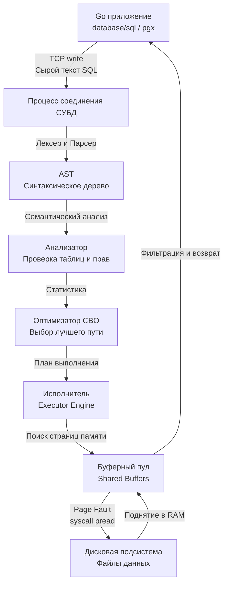
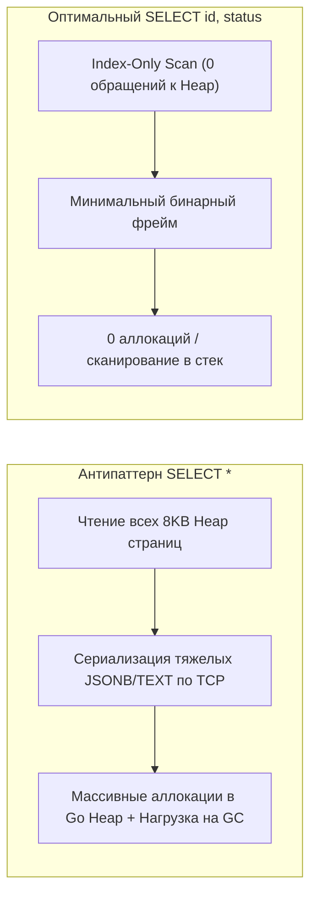

> *"The essence of a relational database is that it decouples what you want from how the machine fetches it. But never forget: behind every elegant declaration stands an uncompromising machine counting memory pages and disk seeks."*

## Декларативная природа SQL: Вы просите, СУБД решает

Как разработчики бэкенда на Go, C или Rust, мы привыкли мыслить строго императивно. Наш рабочий день состоит из пошагового инструктирования процессора: аллоцировать слайс в куче или на стеке, запустить цикл `for`, проверить граничное условие ветвлением `if`, вычислить хэш ключа и скопировать байты в буфер сетевого сокета. В императивном мире программист — это дирижер и исполнитель в одном лице; вы держите в голове состояние регистров, указателей и кэш-линий.

SQL (*Structured Query Language*, изначально *SEQUEL*, рожденный в стенах IBM Research на основе реляционной теории Эдгара Кодда) работает принципиально иначе. Это **декларативный** язык запросов, базирующийся на исчислении кортежей и реляционной алгебре. В SQL вы формулируете исключительно математическое требование к результату: *что* именно необходимо извлечь или изменить, но категорически не касаетесь того, *как* СУБД обязана это делать.

Вы не командуете ядру базы данных: *"Открой файловый дескриптор таблицы `users`, вычитай дисковые блоки по 8 КБ, десериализуй кортежи, отыщи байтовое смещение колонки `age`, и если значение строго больше 18, добавь указатель в результирующий кольцевой буфер"*. Вместо этого вы отправляете лаконичную декларацию:

```sql
SELECT * FROM users WHERE age > 18;
```

Превращение этого чистого математического намерения в высокопроизводительный машинный код C/C++ (на которых написаны PostgreSQL, MySQL, SQLite и ClickHouse), выполняющий вызовы к ядру Linux (`pread`, `epoll`, `mmap`), управление разделяемой памятью и блокировками — это и есть главная «магия» реляционных систем управления базами данных. Но магии, как известно, не бывает: под капотом трудится сложнейший конвейер компиляции и планирования.

---

## Анатомия выполнения SQL-запроса

Чтобы писать предсказуемый и надежный бэкенд, а не гадать на кофейной гуще при возникновении задержек в продакшене, инженер обязан видеть жизненный цикл SQL-запроса с момента вызова `db.QueryContext()` в Go до возврата результирующих структур по TCP.



### 1. Парсинг и семантический анализ (Parsing & Analysis)

Когда пакет с текстовой строкой запроса прилетает из TCP-сокета в выделенный процесс бэкенда СУБД (например, в отдельный процесс `postgres` или поток `mysqld`), база данных абсолютно ничего не знает о ваших намерениях:
1. **Лексический и синтаксический анализ (Lexer & Parser):** Текст разбивается на токены (`SELECT`, `*`, `FROM`, `users`). Парсер проверяет грамматику языка (не пропущена ли запятая, закрыты ли скобки) и конструирует абстрактное синтаксическое дерево — **AST (Abstract Syntax Tree)**.
2. **Семантический анализ (Analyzer / Traffic Cop):** На этом этапе сырое AST связывается с реальным системным каталогом СУБД (каталог метаданных `pg_class`, `pg_attribute` в Postgres). Анализатор проверяет:
   - Существуют ли таблицы `users` и `orders`, а также связанные схемы?
   - Существуют ли запрашиваемые колонки `age`?
   - Имеет ли текущий пользователь права доступа на чтение этих объектов?
   - Совместимы ли типы данных при операциях сравнения (например, числовой `age > 18`, а не строковый `age > 'восемнадцать'`)?

Если на этом этапе обнаружена ошибка, клиенту немедленно возвращается сетевой протокольный пакет с кодом ошибки, минуя тяжелые фазы вычислений.

### 2. Оптимизация (Query Optimization)

Это технологическое сердце и самый вычислительно сложный компонент любой реляционной СУБД. Проверенное дерево запроса передается в **Оптимизатор запросов (Cost-Based Optimizer - CBO)**.

Поскольку SQL декларативен, один и тот же запрос можно выполнить десятками разных способов. Можно сначала отфильтровать пользователей, а потом присоединить заказы `orders`. А можно наоборот. Можно читать таблицу целиком (Sequential Scan), а можно пойти в индекс (Index Scan).

Оптимизатор генерирует древовидное пространство возможных планов исполнения, оценивает стоимость (Cost) каждого узла на основе математической модели и собранной статистики (размеры таблиц в страницах, селективность предикатов, распределение частот значений по гистограммам) и выбирает самый дешевый. Подробнее мы разберем эти алгоритмы в статье [[11. Cost based optimizer]]. Результат работы этого этапа инженер может непосредственно исследовать через вызов [[10. План выполнения запроса. EXPLAIN]].

### 3. Исполнение (Execution)

Сформированный план выполнения передается в **Executor Engine** (движок исполнения). Большинство современных реляционных СУБД используют итераторную модель исполнения (*Volcano Iterator Model* или модель *Pipeline Execution*): каждый узел плана предоставляет метод `Next()`, запрашивающий очередной кортеж у нижележащего узла.

Исполнитель никогда не обращается напрямую к сырому диску в обход кэша:
1. Он запрашивает блок данных (в PostgreSQL стандартный размер страницы составляет 8 КБ, в InnoDB MySQL — 16 КБ) у подсистемы оперативной памяти — **Буферного пула (Buffer Pool / Shared Buffers)**.
2. Если страница уже находится в RAM (произошел *Buffer Hit*), кортеж немедленно отдается на фильтрацию в регистры CPU.
3. Если страница отсутствует в буферном пуле (*Buffer Miss*), ядро СУБД совершает синхронный или асинхронный системный вызов к ОС (например, `pread` или `io_uring` в современных ядрах Linux), читает 8 КБ с дискового накопителя в RAM, регистрирует страницу в таблице буферов и лишь затем приступает к извлечению строк.

> [!info] Под капотом: CPU Bound vs IO Bound в СУБД
> Эксплуатируя реляционные базы данных под высокой нагрузкой, критически важно дифференцировать профили потребления аппаратных ресурсов:
> 1. **CPU Bound фаза:** Парсинг текста запроса, семантический анализ, перебор комбинаций соединений и построение плана оптимизатором — это чисто процессорная нагрузка. На высоконагруженных OLTP-кластерах с сотнями тысяч простых запросов в секунду парсинг неэффективных запросов может сжигать до 30–40% мощности CPU сервера БД.
> 2. **IO Bound и Memory Bound фазы:** Само исполнение плана (Executor Engine) — это состязание за пропускную способность памяти и дисковой подсистемы. Если данные не помещаются в буферный пул, производительность упирается в задержки дискового ввода-вывода (IOPS и латентность NVMe/SSD).

---

## Mechanical Sympathy: Prepared Statements

Каждый раз, когда приложение отправляет в базу данных сырой текст запроса (или, что еще хуже, склеивает строки динамически — прямая дорога к катастрофическим уязвимостям, см. [[21. SQL Injection]]), СУБД обязана заново запустить весь цикл: лексер, парсер, семантический валидатор, генератор перестановок и калькулятор стоимости CBO. Это расточительное сжигание драгоценных тактов процессора базы данных.

Для кардинального ускорения и гарантированной безопасности архитектура клиент-серверного протокола баз данных предоставляет механизм **Prepared Statements (Подготовленные выражения)**. 

Под капотом это реализуется через двухфазный протокол (*Extended Query Protocol* в PostgreSQL):
1. **Фаза подготовки (`PREPARE` / Parse Step):** Клиент отправляет шаблон запроса с позиционными плейсхолдерами:
   ```sql
   PREPARE get_users_by_age AS SELECT * FROM users WHERE age > $1;
   ```
   СУБД выполняет синтаксический анализ, семантическую валидацию, строит обобщенный план выполнения и кэширует его во внутренней памяти текущего серверного сеанса (сессии соединения), возвращая клиенту легковесный числовой или строковый дескриптор.
2. **Фаза связывания и исполнения (`EXECUTE` / Bind & Execute Step):** Приложение отправляет только идентификатор стейтмента и бинарные аргументы (например, байты `int(25)`):
   ```sql
   EXECUTE get_users_by_age(25);
   ```
   СУБД берет готовый план из памяти и сразу переходит к исполнению. Никакого повторного парсинга текста, никакого поиска по системным каталогам и никаких затрат CPU на оптимизацию!

```go
// Пример канонического использования db.PrepareContext в Go
stmt, err := db.PrepareContext(ctx, "SELECT id, email FROM users WHERE age > $1")
if err != nil {
    return fmt.Errorf("prepare statement: %w", err)
}
defer stmt.Close()

rows, err := stmt.QueryContext(ctx, 18)
// ... обработка строк
```

> [!warning] Ловушка / Gotcha: Prepared Statements в Go
> При использовании стандартного пакета `database/sql` вызов метода `db.Query("SELECT ... WHERE id = $1", id)` **автоматически** создает Prepared Statement под капотом.
> 
> Однако, поскольку `database/sql` управляет конкурентным пулом соединений ([[2. Connection pool]]), возникает фундаментальная проблема: *стейтмент регистрируется в памяти конкретного TCP-соединения на стороне СУБД, а не пула в целом*.
> Если следующий вызов запроса берет из пула другое TCP-соединение, драйвер обнаруживает, что на нем этот стейтмент не подготовлен. Если вы делаете много одинаковых `db.Query()`, драйвер вынужден готовить стейтмент на свободном соединении, выполнять и затем закрывать его, провоцируя лавину лишних сетевых пересылок (*network round-trips*: создать-выполнить-удалить).
> 
> В высоконагруженных сервисах инженеры решают эту проблему двумя путями:
> 1. Явно создают долгоживущие `stmt := db.Prepare()` на старте сервиса (при этом `database/sql` берет на себя прозрачную ре-подготовку стейтмента на каждом новом соединении по требованию).
> 2. Используют специализированные драйверы, такие как `pgx` для PostgreSQL, в которых встроен автоматический кэш стейтментов на уровне каждого соединения пула (`pgxpool` кэширует разобранные планы прозрачно и без лишнего сетевого оверхеда). Подробный разбор архитектуры пулов ждет нас в статье [[1. Работа с БД в Go. database_sql]].

---

## Подъязыки SQL

Исторически и архитектурно команды SQL классифицируются на пять функциональных подъязыков. Понимание этих границ необходимо как при проектировании прав доступа пользователей СУБД, так и на технических собеседованиях:

1. **DDL (Data Definition Language)** — язык определения данных. Отвечает за структуру схемы, метаданные и физические объекты хранения.
   - Команды: `CREATE`, `ALTER`, `DROP`, `TRUNCATE`.
   - Механика: инициируют эксклюзивные блокировки таблиц в каталогах (`AccessExclusiveLock` в Postgres), меняя структуру системных таблиц.
2. **DML (Data Manipulation Language)** — язык манипуляции данными. Отвечает за мутацию содержимого строк и кортежей.
   - Команды: `INSERT`, `UPDATE`, `DELETE`.
   - Механика: порождает записи в журнале упреждающей записи (WAL) и изменяет кортежи в страницах данных с учетом уровней изоляции транзакций.
3. **DQL (Data Query Language)** — язык извлечения данных.
   - Команда: `SELECT`.
   - Механика: чтение данных без изменения персистентного состояния таблиц (хотя может вызывать создание временных файлов на диске при сортировке). Часто классификаторы относят `SELECT` к DML, однако семантически это изолированная ветвь, не мутирующая данные.
4. **DCL (Data Control Language)** — язык управления доступом.
   - Команды: `GRANT`, `REVOKE`.
   - Механика: модифицирует списки контроля доступа (ACL) в системных справочниках прав СУБД.
5. **TCL (Transaction Control Language)** — язык управления транзакциями.
   - Команды: `BEGIN` (или `START TRANSACTION`), `COMMIT`, `ROLLBACK`, `SAVEPOINT`.
   - Механика: координирует границы атомарности изменений, управляет состоянием снимков MVCC и фиксацией в WAL.

---

## Цена запроса `SELECT *`

В среде разработчиков, особенно под влиянием паттернов ORM (*Object-Relational Mapping*), часто укореняется вредная привычка запрашивать все столбцы сущности: `SELECT * FROM users WHERE id = 1`. С точки зрения механического сочувствия к оборудованию (*Mechanical Sympathy*) — это один из самых дорогих антипаттернов для высоконагруженного бэкенда:



1. **Дисковый и страничный I/O:** 
   Даже если у вас есть идеальный B-Tree индекс по полю `id`, запрос `SELECT *` вынуждает исполнитель базы совершать обращение к основной странице данных в куче (*Heap Tuple Fetch*), чтобы вычитать остальные 40 колонок. Это на корню уничтожает возможность применения [[6. Covering индекс]] (*Index-Only Scan*), когда СУБД могла бы вернуть ответ целиком из кэша самого индекса, вообще не касаясь страниц таблицы.
2. **Network I/O и насыщение каналов:** 
   СУБД обязана упаковать каждый столбец (включая тяжелые типы `TEXT`, `BYTEA` или гигантские структуры `JSONB`) в TCP-пакеты. Вы перегружаете интерфейсные очереди сетевых карт, увеличиваете задержки сериализации/десериализации и расходуете сетевой трафик между базой данных и серверами приложений.
3. **RAM и давление на Garbage Collector в Go:** 
   Получив гигантский кортеж из десятков колонок, Go-драйвер вынужден аллоцировать буферы в куче (`heap`), выделять память под промежуточные структуры `reflect.Value` или пустые интерфейсы `any`, распаковывать байты строк и затем передавать их сборщику мусора (`GC`). Замена `SELECT *` на строго типизированную проекцию `SELECT id, status` снижает потребление памяти приложением в десятки раз и устраняет пики задержек (*Stop-The-World* паузы) рантайма.

> [!tip] Собеседование
> **Вопрос:** В чем фундаментальная архитектурная разница между SQL и языками программирования общего назначения? Почему в промышленной разработке мы стараемся не выносить бизнес-логику в базу данных (хранимые процедуры, триггеры)?
> 
> **Ответ:** 
> 1. **Декларативность против императивности:** SQL декларативен и спроектирован для реляционной алгебры, преобразования множеств и фильтрации кортежей непосредственно рядом с накопителем данных. Языки общего назначения (Go, Rust, Java) императивны и идеально подходят для сложной бизнес-логики, ветвлений и интеграций с внешними API.
> 2. **Масштабирование состояния (Stateful vs Stateless):** База данных — это *stateful* компонент системы, хранящий консистентное состояние на персистентных дисках. Масштабировать СУБД горизонтально невероятно сложно и дорого (требуется кворумная репликация, распределенные транзакции, шардирование). Напротив, микросервисы на Go — это *stateless* приложения. Мы можем поднять 200 дополнительных реплик в Kubernetes за считанные секунды в ответ на всплеск трафика.
> 3. **Узкое горлышко ресурсов (Bottleneck):** Процессорные мощности базы данных — самый дефицитный ресурс всей инфраструктуры. Если загрузить СУБД вычислением бизнес-правил через PL/pgSQL или триггеры, база быстро станет непреодолимым «бутылочным горлышком», парализующим всю систему. Золотое правило System Design гласит: *выносите все CPU-емкие вычисления на масштабируемый уровень stateless-бэкенда, оставляя базе данных только роль эффективного, надежного хранилища и селектора данных*.

---

## Итог

1. SQL формулирует **что** требуется получить, полностью передавая планирование и способ обхода структур данных движку СУБД.
2. Конвейер исполнения SQL-запроса строго детерминирован: сетевой сокет → Лексер/Парсер (AST) → Семантический анализатор → Стоимостной оптимизатор (CBO) → Исполнитель (Buffer Pool / Системный вызов `pread`).
3. Фазы парсинга и оптимизации — чисто **CPU Bound**, тогда как выборка данных из страниц памяти и диска — **IO/Memory Bound**.
4. Механизм **Prepared Statements** устраняет накладные расходы на повторный парсинг и оптимизацию однотипных запросов, сохраняя процессорное время сервера СУБД и надежно защищая от SQL-инъекций.
5. Использование `SELECT *` в продакшене разрушает преимущества покрывающих индексов, перегружает сеть тяжелыми полями и кратно увеличивает нагрузку на аллокатор и Garbage Collector в Go.

Осознав анатомию выполнения запроса на физическом уровне, мы готовы погрузиться в фундаментальный синтаксис и механику работы главной команды чтения данных в следующей статье: [[2. SELECT. Основы]].