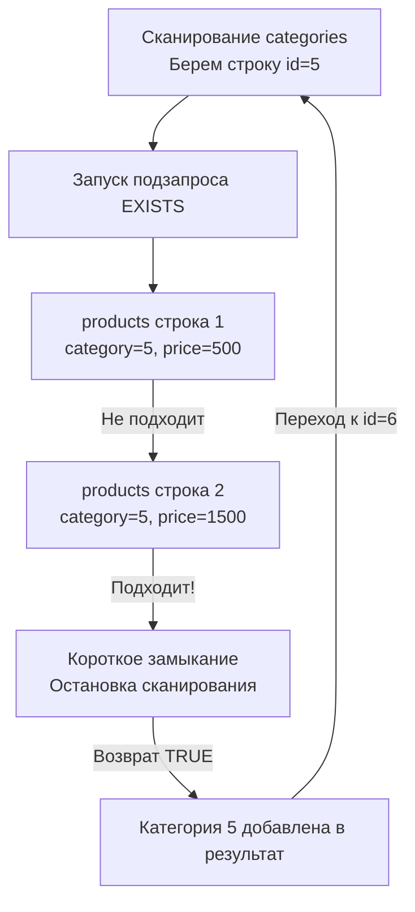

> *«Спросить, принадлежит ли элемент перечисленному списку — это вопрос о значении; спросить, существует ли свидетельство выполнения условия — это вопрос о состоянии. Различие тонко в синтаксисе, но колоссально в физике исполнения».*

В предыдущей статье [[9. Подзапросы]] мы исследовали композитную природу SQL, позволяющую вкладывать реляционные выражения друг в друга и выстраивать сложные декларативные конвейеры. Два наиболее востребованных и часто используемых оператора, сопровождающих работу с подзапросами — это предикаты **`IN`** и **`EXISTS`**.

В среде прикладных разработчиков бытует заблуждение, будто `IN` и `EXISTS` — это взаимозаменяемые синтаксические конструкции, различающиеся лишь вкусовыми предпочтениями автора. Однако на уровне ядра СУБД (системы управления базами данных) они инициируют принципиально разные реляционные алгоритмы. Глубокое понимание их механики, знание принципа короткого замыкания и осознание скрытой угрозы трехзначной логики при отрицании — визитная карточка зрелого бэкенд-инженера.

---

## Оператор IN: Проверка на вхождение

Оператор `IN` проверяет принадлежность значения левого операнда заданному множеству. Это классический предикат принадлежности кортежа ($v \in S$). Набор справа может быть задан статическим списком констант либо являться результатом выполнения скалярного или табличного подзапроса:

```sql
-- 1. Статический список констант
SELECT id, name FROM users WHERE role IN ('admin', 'moderator');

-- 2. Динамический список (результат подзапроса)
SELECT name FROM products WHERE category_id IN (
    SELECT id FROM categories WHERE is_active = true
);
```

### Mechanical Sympathy: Как БД выполняет IN

С точки зрения математической логики предикат `IN` представляет собой элегантный синтаксический сахар для дизъюнкции (серии логических операторов `OR`).
Выражение `id IN (1, 2, 3)` парсер СУБД при построении AST немедленно транслирует в эквивалентную цепочку:
```sql
id = 1 OR id = 2 OR id = 3
```

Если по колонке `id` построен B-Tree индекс, стоимостной оптимизатор трансформирует эту цепочку в серию независимых операций **Index Seek** (точечных спусков по ветвям B-Tree дерева) для каждого отдельного элемента списка. Если список насчитывает десяток значений, поиск отрабатывает за доли миллисекунды. Подробнее физику навигации по узлам мы изучим в статье [[2. B Tree индекс под капотом]].

> [!warning] Ловушка / Gotcha: Гигантские списки IN
> Если в динамический список `IN (...)` подставляется подзапрос или слайс из Go, содержащий сотни тысяч или миллионы идентификаторов, реляционный движок сталкивается с серьезной проблемой.
> 
> СУБД вынуждена аллоцировать гигантский массив в оперативной памяти или строить исполинское дерево выражений. Оптимизатор CBO подсчитывает стоимость и осознает: совершить миллион случайных спусков по B-Tree (**Index Seek**) суммарно окажется на порядки дороже, чем просто один раз последовательно вычитать все страницы таблицы подряд (**Sequential Scan**). 
> В итоге оптимизатор безжалостно отбрасывает индекс, и запрос уходит в тяжелейший полный скан таблицы, разогревая процессор до предела.

---

## Оператор EXISTS: Предикат существования

В отличие от `IN`, оператор `EXISTS` опирается на математический квантор существования ($\exists$). Он вообще не сравнивает конкретные значения колонок! `EXISTS` возвращает строго булево значение (`TRUE` или `FALSE`), отвечая на фундаментальный вопрос: **вернул ли вложенный подзапрос хотя бы один кортеж?**

В подавляющем большинстве промышленных запросов `EXISTS` применяется в тандеме с **коррелированными подзапросами** (где внутренний `SELECT` ссылается на строки внешней таблицы):

```sql
SELECT name 
FROM categories c
WHERE EXISTS (
    -- Подзапрос жестко коррелирован с внешним кортежем 'c'
    SELECT 1 
    FROM products p 
    WHERE p.category_id = c.id AND p.price > 1000
);
```

### Mechanical Sympathy: Короткое замыкание (Short-circuit)

Главное инженерное преимущество оператора `EXISTS` заключается в алгоритмической поддержке механизма **Semi-Join (Полусоединение)** и логике **короткого замыкания (Short-circuit evaluation)**.

Как только подсистема исполнения (Executor Engine) находит в таблице `products` **первую же строку**, удовлетворяющую предикату `p.category_id = c.id AND p.price > 1000`, она **немедленно прерывает дальнейшее сканирование** для текущей категории. Движку абсолютно неинтересно, сколько еще сотен тысяч дорогих товаров хранится в этой категории — для вычисления предиката достаточно факта наличия хотя бы одного свидетеля!



> [!info] Под капотом: SELECT 1
> В сообществе разработчиков десятилетиями не утихали споры: что эффективнее писать внутри `EXISTS` — `SELECT 1`, `SELECT *` или `SELECT NULL`?
> 
> Ответ однозначен: современным оптимизаторам (PostgreSQL, MySQL 8+, SQLite) **абсолютно безразлично**, что указано в списке проекции `SELECT`. 
> Парсер СУБД, распознавая обертку `EXISTS`, полностью аннулирует фазу проекции кортежа. Движок не считывает атрибуты строки с диска и не распаковывает колонки: он проверяет только видимость версии строки в MVCC или даже наличие индексированного ключа в B-Tree. Конструкция `SELECT 1` — это общепринятый, идиоматичный стандарт написания кода (Idiomatic SQL), сигнализирующий коллегам: *«здесь важен лишь факт существования»*.

---

## Что быстрее: IN или EXISTS?

В исторической ретроспективе (до появления продвинутых оптимизаторов) в литературе по базам данных формулировалось эвристическое правило:
- Если внешняя таблица огромна, а подзапрос возвращает крошечный список значений — выгоднее использовать **`IN`**.
- Если внешняя таблица компактна, а подзапрос фильтрует исполинский массив с хорошими индексами — выгоднее использовать **`EXISTS`** (благодаря ранней остановке по короткому замыканию).

**Современная реальность:**
Благодаря развитию стоимостных оптимизаторов ([[11. Cost based optimizer]]), эта искусственная грань в значительной степени нивелирована. В современных релизах PostgreSQL и MySQL запросы с `IN (SELECT ...)` и `EXISTS (SELECT ...)` на этапе логической оптимизации разворачиваются (Subquery Unnesting) в эквивалентные реляционные деревья. 
В 95% сценариев оптимизатор сформирует для них **абсолютно идентичные планы выполнения**, задействуя алгоритмы **Hash Semi Join** или **Merge Semi Join**.

---

## Фатальная ловушка: NOT IN и NULL

Если в позитивных предикатах `IN` и `EXISTS` взаимозаменяемы, то при переходе к отрицаниям — **`NOT IN`** и **`NOT EXISTS`** — программистов подстерегает самая разрушительная архитектурная ловушка SQL, порожденная трехзначной логикой.

Поставим типовую бизнес-задачу: *«Найти идентификаторы всех пользователей, которые ни разу не совершили заказ»*.

### ❌ Использование NOT IN (Смертельно опасный код)

```sql
SELECT id, email 
FROM users 
WHERE id NOT IN (SELECT user_id FROM orders);
```

Представьте, что в таблице `orders` из-за бага в коде или миграции появилась хотя бы **одна-единственная строка**, где колонка `user_id IS NULL`. 
Подзапрос вернет результирующее множество кортежей: `(1, 2, NULL)`.

Как ядро СУБД вычисляет условие `id NOT IN (1, 2, NULL)`?
По законам де Моргана отрицание дизъюнкции преобразуется в конъюнкцию строгих неравенств:
```sql
id != 1 AND id != 2 AND id != NULL
```

Вспомним трехзначную логику (3VL): любое сравнение с неопределенностью (`id != NULL`) **всегда вычисляется в `UNKNOWN`**!
Выражение принимает вид:
```sql
TRUE AND TRUE AND UNKNOWN  ==>  UNKNOWN
```

А поскольку предложение `WHERE` пропускает дальше по конвейеру исключительно кортежи с результатом строго `TRUE`, запрос **вернет ровно 0 строк**! 
Даже если в вашей базе зарегистрирован миллион пользователей без единого заказа, система бодро отрапортует, что таких пользователей нет вовсе. Бизнес-логика сломана на фундаментальном уровне.

### ✅ Использование NOT EXISTS (Абсолютно безопасно)

```sql
SELECT u.id, u.email 
FROM users u
WHERE NOT EXISTS (
    SELECT 1 FROM orders o WHERE o.user_id = u.id
);
```

Оператор `NOT EXISTS` оперирует исключительно кардинальностью строк: он проверяет, вернул ли подзапрос хоть одну запись. 
Ему глубоко безразлично, содержат ли колонки значения `NULL`. Если заказ для данного `user_id` отсутствует, подзапрос возвращает пустое множество (`FALSE`), а внешний оператор `NOT` инвертирует его в `TRUE`. Запрос гарантированно вернет корректный список пользователей.

Тончайшие нюансы поведения неизвестных значений мы продолжим исследовать в статье [[12. Работа с NULL в SQL]].

---

## Go Idioms: EXISTS вместо COUNT

В разработке серверных приложений на Go часто требуется проверить уникальность сущности перед созданием (например, *«не занят ли email при регистрации нового аккаунта»*).

**❌ Антипаттерн (Неоправданная нагрузка на СУБД):**

```go
var count int
// Антипаттерн: База данных найдет первый подходящий email, но продолжит
// сканировать индекс или таблицу до конца, чтобы подсчитать ВСЕ строки!
err := db.QueryRowContext(ctx, "SELECT COUNT(*) FROM users WHERE email = $1", email).Scan(&count)
if err != nil {
    return err
}
if count > 0 {
    return ErrEmailAlreadyTaken
}
```

Даже при наличии уникального индекса СУБД вынуждена выполнять подсчет. Если же колонка неуникальна (например, проверка наличия активных сессий), `COUNT(*)` просмотрит все строки, убивая производительность.

**✅ Идиоматичный Go (Использование короткого замыкания):**

```go
var exists bool
// Идиоматичный подход: СУБД останавливается на первой же найденной записи
// и возвращает нативный boolean прямо в рантайм Go!
const query = `SELECT EXISTS(SELECT 1 FROM users WHERE email = $1)`

err := db.QueryRowContext(ctx, query, email).Scan(&exists)
if err != nil {
    return fmt.Errorf("check email existence: %w", err)
}

if exists {
    return ErrEmailAlreadyTaken
}
```

Вызов `SELECT EXISTS(...)` мгновенно активирует короткое замыкание в ядре базы данных, возвращает ровно один логический бит по сети и экономит драгоценные процессорные такты сервера БД. В высоконагруженных сервисах паттерн `SELECT EXISTS(...)` вместо `SELECT COUNT(*) > 0` является обязательным индустриальным стандартом.

---

## Итог

1. **`IN`** проверяет вхождение в список значений, раскрываясь оптимизатором в цепочку `OR` и серию независимых `Index Seek`. Предостерегайтесь передачи гигантских списков в `IN`, способных спровоцировать `Sequential Scan`.
2. **`EXISTS`** оперирует квантором существования, реализуя реляционный алгоритм **Semi-Join** с логикой раннего прерывания (**Short-circuit**).
3. Внутри `EXISTS` традиционно пишут `SELECT 1`: оптимизатор полностью исключает этап проекции колонок.
4. В современных версиях СУБД оптимизаторы CBO выравнивают планы для `IN` и `EXISTS`, приводя их к **Hash Semi Join** или **Merge Semi Join**.
5. **Фундаментальное правило:** Никогда не используйте `NOT IN` с подзапросами из-за фатального искажения результатов трехзначной логикой `NULL`. Всегда отдавайте предпочтение **`NOT EXISTS`**.
6. В Go-микросервисах для валидации существования сущностей всегда используйте `SELECT EXISTS(...)` вместо расточительного `SELECT COUNT(*) > 0`.

Мы освоили извлечение, фильтрацию, соединения и вложенные предикаты существования. Но как быть, если прямо в процессе формирования выборки требуется применить ветвление бизнес-логики (аналог конструкции `switch` или `if-else` в Go)? Для этого реляционный стандарт предлагает мощное декларативное выражение, с которым мы познакомимся в следующей статье: [[11. CASE выражения]].