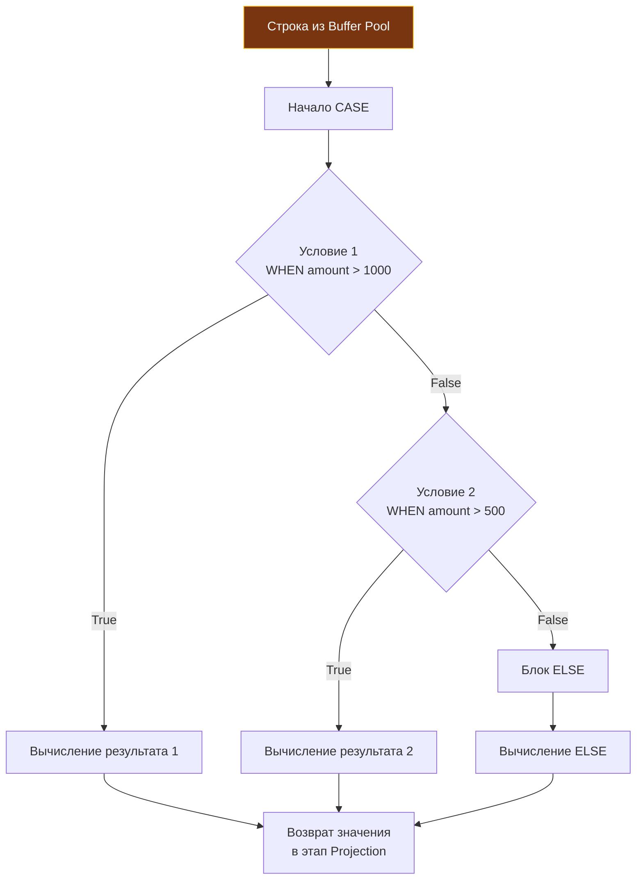

> *«В императивном коде ветвление направляет поток управления от одной инструкции к другой. В декларативном реляционном запросе ветвление преобразует значение выражения, ни на йоту не нарушая детерминированный поток кортежей».*

## Ветвление в декларативном мире: Условная логика в SQL

В парадигме реляционных баз данных мы оперируем строгими математическими множествами. Мы привыкли считать, что алгоритмическое ветвление (`if-else`, `switch-case`) — это исключительная прерогатива прикладных языков общего назначения, таких как Go или C++.

Однако при проектировании высоконагруженных серверных систем регулярно возникает архитектурная необходимость трансформировать данные «на лету» непосредственно на стороне СУБД. Вытягивать гигабайты сырых кортежей по сети, чтобы затем в памяти Go раскладывать их по условиям, сжигая пропускную способность сокетов и нагружая Garbage Collector — непозволительное расточительство. 

Для реализации выразительной условной логики стандарт ANSI SQL предоставляет мощную конструкцию **`CASE`**. 
С архитектурной точки зрения `CASE` — это не оператор потока управления, а **скалярное выражение**, которое можно органично встраивать в этапы проекции (`SELECT`), фильтрации (`WHERE`), группировки (`GROUP BY`), сортировки (`ORDER BY`) или обновления данных (`UPDATE`).

---

## Два формата CASE

Стандарт реляционного языка определяет выражение `CASE` в двух синтаксических вариациях:

### 1. Simple CASE (Простой CASE)

Синтаксически и семантически простая форма аналогична конструкции `switch x` в Go. Она сопоставляет результат одного базового выражения со списком фиксированных значений. Это идеальный инструмент для маппинга перечислений (enums) и кодов статусов:

```sql
SELECT 
    id,
    status,
    CASE status
        WHEN 'pending' THEN 'Ожидает'
        WHEN 'paid' THEN 'Оплачен'
        WHEN 'cancelled' THEN 'Отменен'
        ELSE 'Неизвестно'
    END AS status_ru
FROM orders;
```

Движок базы данных единожды вычисляет значение атрибута `status` и последовательно сравнивает его на равенство с константами в секциях `WHEN`.

### 2. Searched CASE (Поисковый CASE)

Поисковая форма представляет собой полноценный эквивалент каскадного ветвления `if - else if - else`. В каждом блоке `WHEN` задается произвольный независимый логический предикат любой степени сложности:

```sql
SELECT 
    id,
    amount,
    CASE 
        WHEN amount > 100000 THEN 'VIP'
        WHEN amount > 50000 AND status = 'paid' THEN 'Premium'
        ELSE 'Regular'
    END AS customer_segment
FROM orders;
```

---

## Под капотом: Ленивое вычисление (Short-circuit)

Как именно процессор базы данных физически исполняет вычисление конструкции `CASE` для миллионов кортежей?
В точности как логические операторы `&&` и `||` в рантайме Go, выражение `CASE` реализует детерминированное **короткое замыкание (Short-circuit evaluation)**.



Исполнитель СУБД валидирует условия строго сверху вниз в порядке их объявления. Как только очередная ветка `WHEN` возвращает `TRUE`:
1. Процессор немедленно вычисляет выражение соответствующего блока `THEN`;
2. Все последующие ветки `WHEN` и секция `ELSE` **полностью игнорируются и физически не исполняются**;
3. Результат мгновенно передается на следующий этап конвейера.

> [!warning] Ловушка / Gotcha: Защита от деления на ноль
> Благодаря гарантированному ленивому вычислению ветвей, паттерн `CASE` часто выступает надежным программным предохранителем от фатальных ошибок времени выполнения (Run-time errors) вроде `Division By Zero`, способных прервать тяжелую аналитическую транзакцию:
> ```sql
> -- Если total_orders = 0, правая ветка деления не будет вычисляться вовсе,
> -- и запрос гарантированно завершится успешно без ошибки Division By Zero!
> SELECT 
>     CASE 
>         WHEN total_orders = 0 THEN 0 
>         ELSE total_spent / total_orders 
>     END AS average_check
> FROM users;
> ```
> *Важное требование к типизации:* Все ветви `THEN` и альтернатива `ELSE` в пределах одного выражения `CASE` обязаны возвращать совместимые типы данных. Нельзя вернуть целое число в одной ветке и строковый литерал в другой — строгая система типов СУБД выбросит ошибку несоответствия типов еще на этапе семантического анализа.

---

## Паттерн: Условная агрегация (Conditional Aggregation / Pivot)

Это **главный промышленный паттерн** применения `CASE`, тестирование которого встречается на 9 из 10 технических собеседований на позицию Senior Backend Engineer.

**Практическая задача:** Сформировать финансовый отчет, отобразив в одной-единственной результирующей строке три метрики: совокупный оборот всех заказов, сумму только оплаченных покупок и сумму только отмененных заказов.

**❌ Решение на стороне Go (Архитектурный антипаттерн):**
Разработчик отправляет запрос `SELECT amount, status FROM orders`, вытягивает 5 000 000 строк по TCP в оперативную память Go-сервиса, аллоцирует огромный слайс структур и раскладывает суммы тремя ветвлениями `if` внутри цикла `for`.
*Последствия:* Сетевой канал перегружен (Network IO), рантайм Go захлебывается в аллокациях памяти, а сборщик мусора уходит в затяжную паузу Mark-and-Sweep.

**✅ Высокопроизводительное решение на стороне СУБД (Условная агрегация):**
Мы объединяем агрегатную функцию `SUM` из статьи [[7. GROUP BY и агрегатные функции]] с выражением `CASE`:

```sql
SELECT 
    SUM(amount) AS total_all,
    SUM(CASE WHEN status = 'paid' THEN amount ELSE 0 END) AS total_paid,
    SUM(CASE WHEN status = 'cancelled' THEN amount ELSE 0 END) AS total_cancelled
FROM orders;
```

**Mechanical Sympathy:** База данных последовательно читает таблицу ровно один раз (**Sequential Scan**). Выражение `CASE` вычисляется прямо в регистрах CPU сервера СУБД при обработке кортежа в Buffer Pool. В сетевой сокет Go-приложения отправляется **ровно одна компактная строка из трех чисел** (24 байта). Нагрузка на сеть и аллокатор Go равна абсолютному нулю!

---

## Паттерн: Кастомная сортировка в ORDER BY

В реальных бизнес-системах порядок выдачи сущностей часто диктуется сложной логикой приоритетов, не укладывающейся в стандартную сортировку по алфавиту или ID.
Например, в трекере инцидентов тикеты со статусом `CRITICAL` должны идти первыми, за ними — `HIGH`, затем — `MEDIUM`, а остальные упорядочиваться по дате создания.

```sql
SELECT id, title, severity, created_at
FROM tickets
ORDER BY 
    CASE severity
        WHEN 'CRITICAL' THEN 1
        WHEN 'HIGH' THEN 2
        WHEN 'MEDIUM' THEN 3
        ELSE 4
    END,
    created_at DESC;
```

> [!warning] Ловушка / Gotcha: Убийство индексов
> Внедрение конструкции `CASE` (или любой скалярной функции) внутрь блока сортировки [[4. ORDER BY, LIMIT]] **на корню уничтожает возможность использования B-Tree индексов для упорядочивания данных**.
> 
> B-Tree индекс отсортирован по физическому значению колонки `severity`, но ничего не знает о динамических числах 1, 2, 3, 4. 
> СУБД будет вынуждена вычитать все строки в оперативную память и запустить процессорный алгоритм сортировки **In-Memory Sort** (или тяжелый **FileSort** со сбросом на диск, если объем выборки превысит `work_mem`). Для каталогов из сотен строк это приемлемо, но для миллионных таблиц приведет к ощутимой деградации latency.

---

## Архитектурный холивар: SQL CASE vs Go Switch

Где на самом деле должна располагаться условная логика: в базе данных или на уровне бэкенд-сервисов?
Зрелый системный инженер всегда оценивает компромисс между дефицитным CPU базы данных и пропускной способностью сети:

1. **Используйте SQL CASE, если:**
   - Условие критично для редукции данных и агрегации (паттерн `SUM(CASE...)`), что кардинально снижает сетевой трафик.
   - Условие участвует в фильтрации `WHERE` или кастомной сортировке `ORDER BY` на стороне СУБД.
   - Выполняется атомарное пакетное обновление строк с разными состояниями:
     ```sql
     UPDATE users SET tier = CASE WHEN points > 1000 THEN 'Gold' ELSE 'Silver' END;
     ```

2. **Используйте Go Switch, если:**
   - Ветвление относится к уровню представления (Presentation / Transport Layer). Например, локализация кода статуса `order_status_created` в читаемую строку `"Заказ оформлен"` для вывода в JSON.
   - Процессор базы данных является узким местом (**bottleneck**). Манипуляции со строками, парсинг регулярных выражений и форматирование дат внутри `CASE` сжигают процессорные такты сервера СУБД. Процессор базы данных масштабировать невероятно дорого. Напротив, инстансы Go-микросервисов в Kubernetes масштабируются горизонтально за секунды. Держите базу свободной для хранения и выборки, а бизнес-маппинг выполняйте в Go.

> [!tip] Собеседование
> **Вопрос:** Что возвратит выражение `CASE`, если ни один из предикатов в секциях `WHEN` не выполнился, а ветвь `ELSE` не была указана явно?
> 
> **Ответ:** 
> Согласно стандарту ANSI SQL, если блок `ELSE` опущен и ни одно из условий `WHEN` не истинно, выражение неявно возвращает **`NULL`** (поведение эквивалентно неявному `ELSE NULL`). 
> Это коварный источник тихих багов при вычислениях, поэтому правилом хорошего тона (Idiomatic SQL) является **всегда явно указывать блок `ELSE`**, детерминированно фиксируя резервное значение.

---

## Итог

1. **`CASE`** — единственный стандартный механизм декларативного ветвления логики непосредственно внутри SQL-запроса.
2. `CASE` вычисляется по принципу **короткого замыкания** (short-circuit) сверху вниз, защищая от фатальных ошибок времени выполнения вроде деления на ноль.
3. **Условная агрегация (`SUM(CASE...)`)** — мощный инструмент для построения сводных отчетов (Pivot) за один последовательный проход таблицы без сетевого оверхеда.
4. Размещение `CASE` в секции `ORDER BY` дает гибкость кастомного ранжирования, но отключает использование B-Tree индексов для сортировки.
5. Опущенная ветвь `ELSE` неявно возвращает `ELSE NULL`.

Мы неоднократно убеждались, что пропущенные условия, пустые результаты агрегаций и опущенные ветки `ELSE` приводят к появлению `NULL`. Работа с отсутствующими значениями — это самая коварная область реляционной теории, порождающая трехзначную логику и ломающая базовую интуицию инженеров. Пришло время раз и навсегда расставить точки над `NULL` в следующей статье: [[12. Работа с NULL в SQL]].