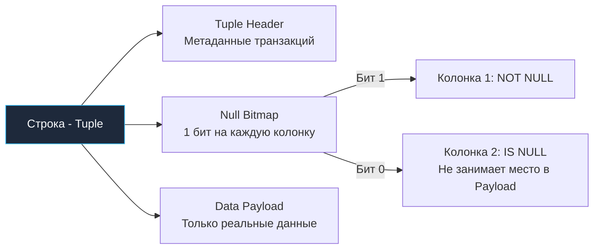

> *«В таких языках, как C или Go, null — это просто адрес: буквальный ноль в регистре указателя. В реляционной теории NULL — это эпистемологическое утверждение: оно означает не ноль и не пустоту, а „нам неизвестно“. И вычисления над неизвестностью подчиняются собственной логике».*

## Природа пустоты: Почему NULL ломает интуицию

В императивных языках программирования мы привыкли к детерминированной концепции отсутствия значения. В Go это константа `nil`, в C++ — типизированный `nullptr` или макрос `NULL` (разворачивающийся в целочисленный `0`). Во всех этих случаях «отсутствие» — это конкретный адрес в памяти (нулевой указатель), который можно легко проверить через `if ptr == nil`. В таком мире над указателем определена обычная булева алгебра.

В реляционных базах данных **`NULL` — это не значение, не число ноль, не пустая строка и не нулевой указатель в памяти.** 
`NULL` — это мета-маркер, обозначающий эпистемологическое *состояние «Неизвестно» (Unknown / Missing Information)*.

Если вы спросите базу данных: *«Равен ли неизвестный возраст Ивана неизвестному возрасту Петра?»* (`NULL = NULL`), процессор базы данных не ответит «Да» и не ответит «Нет». Он ответит строго: *«Я не знаю»* (`UNKNOWN`).

Непонимание трехзначной логики — источник самых коварных, трудноуловимых багов в бэкенде, способных годами прятаться в кодовой базе и приводить к незаметной потере бизнес-данных.

---

## Трехзначная логика (3VL)

В классических языках программирования вроде Go логика строго двузначна (Boolean): переменная может принимать значение либо `true`, либо `false`.
Стандарт SQL реализует **трехзначную логику (Three-Valued Logic — 3VL)**, оперирующую тремя состояниями истинности: `TRUE`, `FALSE` и `UNKNOWN`.

Любая арифметическая операция или предикат сравнения с участием маркера `NULL` неизбежно порождает `UNKNOWN`:
* `1 + NULL` → `UNKNOWN` (точнее, арифметический результат `NULL`, предикат проверки которого дает `UNKNOWN`)
* `NULL = NULL` → `UNKNOWN`
* `NULL != 1` → `UNKNOWN`

### Таблицы истинности для UNKNOWN

В реляционном конвейере предложение `WHERE` пропускает кортеж дальше в обработку **только и исключительно в том случае, если итоговое логическое выражение вычислено в строгое `TRUE`**. Значения `FALSE` и `UNKNOWN` безжалостно отбрасываются.

| Логическое выражение | Итоговый результат | Инженерная мнемоника (Mechanical Intuition) |
| :--- | :---: | :--- |
| `TRUE AND UNKNOWN` | `UNKNOWN` | Если неизвестное окажется FALSE, итог FALSE. Если TRUE — итог TRUE. Результат полностью зависит от неизвестности. |
| `FALSE AND UNKNOWN` | `FALSE` | Ложь в конъюнкции доминирует над всем: ложь, умноженная на неизвестность, всегда дает ложь (короткое замыкание). |
| `TRUE OR UNKNOWN` | `TRUE` | Истина в дизъюнкции доминирует над всем: истина плюс неизвестность гарантированно дает истину (короткое замыкание). |
| `FALSE OR UNKNOWN` | `UNKNOWN` | Ложь не дает определенности: итоговый статус целиком зависит от значения неизвестного операнда. |
| `NOT UNKNOWN` | `UNKNOWN` | Отрицание неизвестности оставляет нас в состоянии той же самой неизвестности. |

> [!warning] Ловушка / Gotcha: NOT IN
> Мы уже касались этой катастрофы в статье [[10. EXISTS и IN]], но ее важно закрепить на уровне рефлексов.
> Предикат `WHERE id NOT IN (1, 2, NULL)` логически раскрывается СУБД в цепочку:
> ```sql
> id != 1 AND id != 2 AND id != NULL
> ```
> Последнее сравнение `id != NULL` по законам 3VL дает `UNKNOWN`. Из таблицы выше следует:
> ```sql
> (TRUE AND TRUE) AND UNKNOWN  ==>  UNKNOWN
> ```
> Итог: предложение `WHERE` получило `UNKNOWN` и отбросило абсолютно все строки таблицы. Запрос вернет **ровно 0 строк**!

---

## Под капотом: Как физически хранится NULL

С позиций принципа **Mechanical Sympathy**, как современные СУБД (например, PostgreSQL) физически размещают «пустоту» в файлах на диске и в страницах буферного пула?
Наивно предполагать, будто колонка `VARCHAR(255)` со значением `NULL` заполняется 255 байтами нулей. Это привело бы к колоссальной деградации дисковой подсистемы.

В PostgreSQL каждый кортеж (Tuple) на дисковой странице имеет строгий бинарный формат:



1. **Заголовок кортежа (`Tuple Header`):** Содержит служебные поля транзакций (`xmin`, `xmax`) и битовую маску флагов.
2. **Битовая карта NULL-значений (`Null Bitmap`):** Если в таблице хотя бы одна колонка объявлена без ограничения `NOT NULL`, в заголовок кортежа помещается компактная битовая шкала (`t_bits`). Каждый бит строго соответствует порядковому номеру колонки:
   - Бит `1` — в колонке присутствуют физические данные;
   - Бит `0` — значение колонки равно `NULL`.
3. **Область данных (`Data Payload`):** Если бит в маске равен `0`, в полезную нагрузку кортежа **не записывается ни одного байта**! Колонка `NULL` занимает 0 байт в дисковом пространстве полезных данных.
4. **Аппаратная скорость проверки:** Проверка условий `IS NULL` или `IS NOT NULL` — это молниеносная побитовая инструкция процессора (bitwise AND над байтом заголовка). Процессору даже не требуется обращаться к телу строки и десериализовать байты данных.

---

## Функции спасения: Управление NULL

Поскольку традиционные операторы сравнения (`=`, `!=`, `<>`) в связке с `NULL` парализованы трехзначной логикой, стандарт SQL предоставляет специализированный математический инструментарий.

### 1. IS NULL / IS NOT NULL

Единственный синтаксически и семантически корректный способ проверки атрибутов на статус неопределенности:

```sql
-- ✅ Правильно: проверяет бит в Null Bitmap
SELECT email FROM users WHERE deleted_at IS NULL;

-- ❌ Неправильно: всегда возвращает UNKNOWN, запрос вернет 0 строк!
SELECT email FROM users WHERE deleted_at = NULL;
```

> [!tip] Собеседование: IS DISTINCT FROM
> **Вопрос:** Как сопоставить значения двух колонок `col1` и `col2` на равенство, если обе могут содержать `NULL`, и при этом два `NULL` должны считаться эквивалентными друг другу? Выражение `col1 = col2` ломается, возвращая `UNKNOWN`.
> 
> **Ответ:** 
> Для этого в стандарте ANSI SQL существует оператор **`IS NOT DISTINCT FROM`**:
> ```sql
> SELECT * FROM table WHERE col1 IS NOT DISTINCT FROM col2;
> ```
> В отличие от оператора `=`, предикат `IS NOT DISTINCT FROM` трактует `NULL` как обычное определенное значение:
> - Если `col1` и `col2` равны `NULL`, выражение возвращает `TRUE`.
> - Если одно поле `NULL`, а другое число — возвращает `FALSE`.
> - Если оба поля равны числам — возвращает `TRUE`.
> Аналогично работает предикат неравенства: `IS DISTINCT FROM`.

### 2. COALESCE (Слияние)

Функция `COALESCE` принимает переменное число аргументов и возвращает **первый аргумент, отличный от `NULL`**. Это фундаментальный инструмент бэкенд-инженера для подстановки значений по умолчанию прямо на уровне ядра базы данных:

```sql
-- Если balance равен NULL, вернет 0
SELECT COALESCE(balance, 0) AS current_balance FROM accounts;

-- Цепочка фоллбэков: берет телефон, если нет — email, если нет — дефолт
SELECT COALESCE(phone, email, 'Нет контактов') FROM users;
```

`COALESCE` вычисляется по принципу короткого замыкания: как только встречен первый не-NULL аргумент, вычисление остальных прекращается.

### 3. NULLIF (Предохранитель)

Функция `NULLIF(a, b)` сравнивает два аргумента:
- Если $a = b$, функция возвращает `NULL`;
- В противном случае возвращается значение $a$.

Это идеальный, элегантный предохранитель от ошибок деления на ноль (`Division by Zero`), выступающий лаконичной альтернативой громоздкому выражению `CASE`:

```sql
-- Если total_orders = 0, NULLIF вернет NULL.
-- Деление числа на NULL дает NULL, и запрос не падает с ошибкой деления на ноль!
SELECT total_spent / NULLIF(total_orders, 0) FROM users;
```

---

## Агрегация и NULL: Невидимые данные

Агрегатные функции стандарта SQL (рассмотренные в статье [[7. GROUP BY и агрегатные функции]]) содержат встроенный механизм обработки неопределенности, о котором постоянно забывают на собеседованиях.

Функции **`SUM`**, **`AVG`**, **`MIN`**, **`MAX`** **полностью игнорируют значения `NULL` при расчетах**.

Представьте таблицу зарплат сотрудников из трех строк: `100`, `200` и `NULL`.
- `SUM(salary)` вернет `300` (сложит только известные величины).
- `AVG(salary)` вернет **`150`** ($300 / 2$), а не $100$ ($300 / 3$)! Движок базы делит сумму на количество фактически присутствующих значений ($2$), а не на общее число строк в таблице.

Единственным исключением является функция **`COUNT(*)`**, которая подсчитывает физическое количество кортежей (строк), видимых транзакции, полностью игнорируя содержимое колонок:
- `COUNT(*)` для этой таблицы вернет `3`;
- `COUNT(salary)` вернет `2`.

---

## Go Idioms: Борьба с NULL на бэкенде

Десериализация колонок, содержащих `NULL`, в строго типизированные структуры Go — источник частых паник (`panic: runtime error`) и неэффективного расхода памяти.

При извлечении nullable-колонки `bio TEXT` в распоряжении разработчика есть три стратегии:

### Подход 1: Использование указателей (Удар по GC)

```go
var bio *string
err := rows.Scan(&bio)
```

Если в базе данных `NULL`, драйвер присвоит указателю значение `nil`. Если строка присутствует — выделит память под строку и вернет указатель.
* **Недостаток (Mechanical Sympathy):** Передача указателя на указатель в метод `rows.Scan` ломает оптимизацию компилятора Go (**Escape Analysis**). Строка гарантированно аллоцируется в куче (Heap), а не на быстром стеке горутины. При выборках в сотни тысяч строк это создает колоссальное давление на сборщик мусора Go. Кроме того, прикладной код обрастает бесконечными защитными проверками `if bio != nil`.

### Подход 2: Использование sql.Null* (Идиоматично, но многословно)

Стандартный пакет `database/sql` предоставляет набор специализированных оберток: `sql.NullString`, `sql.NullInt64`, `sql.NullFloat64`, `sql.NullTime`:

```go
var bio sql.NullString
err := rows.Scan(&bio)

if bio.Valid {
    fmt.Println("Биография:", bio.String)
} else {
    fmt.Println("Биографии нет")
}
```

* **Преимущество:** Тип `sql.NullString` представляет собой простую плоскую структуру (`struct { String string; Valid bool }`). Это `value-type`, который компилятор размещает на стеке, избавляя Garbage Collector от лишней работы.
* **Недостаток:** Засорение доменных моделей чистой бизнес-логики инфраструктурными типами из пакета `database/sql`.

### Подход 3: Делегирование через COALESCE (Mechanical Sympathy)

Самый зрелый архитектурный паттерн для большинства прикладных задач: **вообще не впускать `NULL` в рантайм Go**, если доменной логике не требуется строго различать «отсутствие значения» и «пустое значение»:

```sql
-- Преобразуем NULL в пустую строку непосредственно в ядре СУБД
SELECT COALESCE(bio, '') FROM users;
```

```go
// В коде Go используем нативный легковесный примитив string
var bio string
err := rows.Scan(&bio) // Всегда чистая строка, 0 проверок на nil!
```

Этот паттерн упрощает код, снижает сетевой оверхед (протокол не передает флаги NULL-значений) и оставляет структуры данных Go кристально чистыми.

---

## Итог

1. **`NULL` — это не значение, это маркер «Неизвестно» (Unknown).**
2. Любая операция сравнения с `NULL` через `=` дает результат `UNKNOWN`. Для фильтрации применяйте только `IS NULL` и `IS NOT NULL`.
3. Остерегайтесь оператора `NOT IN`: появление хотя бы одного `NULL` в списке приводит к аннулированию всей выборки (возвращается 0 строк).
4. На физическом уровне в PostgreSQL `NULL` почти не расходует места на диске благодаря битовой карте **Null Bitmap** в заголовке кортежа.
5. Агрегатные функции (`SUM`, `AVG`, `MIN`, `MAX`) полностью игнорируют `NULL`, меняя расчет средней величины.
6. Для проверки равенства с учетом NULL используйте оператор `IS NOT DISTINCT FROM`.
7. В Go избегайте указателей на примитивы при сканировании nullable-колонок. Отдавайте предпочтение `COALESCE` на стороне СУБД либо структурам `sql.Null*` для стековой аллокации.

Осознав механику пустоты, мы готовы перейти к завершающей базовой операции SQL, которая регулярно провоцирует споры о производительности памяти и процессора — устранению дубликатов с помощью команды [[13. DISTINCT и дубликаты]].