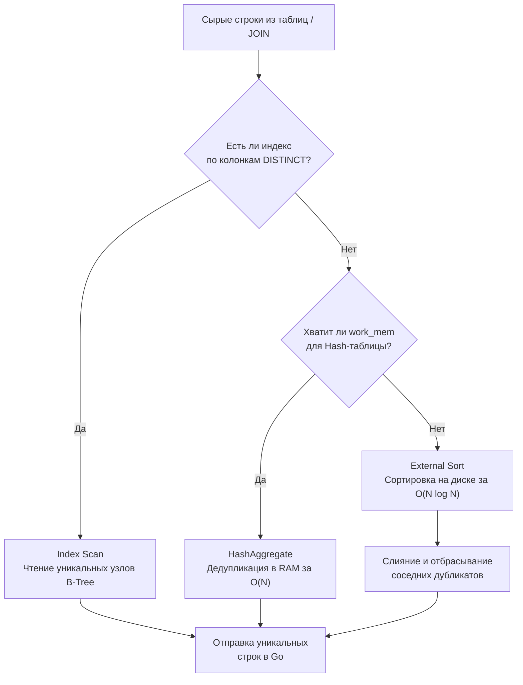

> *«В чистой математике множество не содержит дубликатов; в суровой реальности компьютеров поддержание уникальности при каждой записи обходится слишком дорого. И потому SQL выбрал мультимножества, возложив тяжкое бремя дедупликации на движок выполнения запросов».*

## Мультимножества: Почему базы данных допускают хаос

В канонической математической теории множеств, на которой Эдгар Кодд воздвиг реляционную модель, дубликаты невозможны по определению. Множество `{1, 2, 2, 3}` строго тождественно множеству `{1, 2, 3}`.

Однако реальный реляционный мир стандартов ANSI SQL пошел на сознательный инженерный компромисс: таблицы в реляционных базах данных представляют собой не чистые математические множества, а **мультимножества (Bags / Multisets)**. СУБД (система управления базами данных) исторически допускает сосуществование абсолютно идентичных физических кортежей. 
Этот выбор был продиктован суровыми законами производительности: если бы ядро СУБД при каждой операции `INSERT` проверяло новую строку на уникальность относительно всего массива данных таблицы (при отсутствии специализированного уникального индекса), скорость записи деградировала бы до полного коллапса.

Если нашему бэкенд-сервису требуется строгое математическое множество — только уникальные значения без повторов — мы обязаны явно задекларировать это требование с помощью ключевого слова **`DISTINCT`**:

```sql
-- Вернет все строки подряд, включая тысячи дубликатов 'paid'
SELECT status FROM orders;

-- Вернет строго уникальные статусы (например, 'paid', 'pending', 'cancelled')
SELECT DISTINCT status FROM orders;
```

---

## Под капотом: Механика дедупликации

С точки зрения принципа **Mechanical Sympathy**, операция `DISTINCT` не имеет ничего общего с «бесплатной магической фильтрацией». На физическом уровне процессора базы данных устранение дубликатов практически неотличимо от полноценной группировки `GROUP BY` по всем колонкам проекции (без агрегатных функций).

Когда оптимизатор запросов встречает директиву `DISTINCT`, он выбирает одну из трех физических стратегий дедупликации:



1. **Index Scan (Дедупликация по индексу):** Наиболее эффективный путь. Если по целевым колонкам построен подходящий B-Tree индекс, СУБД просто считывает уникальные значения прямо из листовых узлов дерева, вообще не затрачивая CPU на сортировку или построение хэш-таблиц.
2. **HashAggregate (Хэш-дедупликация в оперативной памяти):** Если индекса нет, но объем данных умеренный, СУБД читает строки потоком и строит хэш-таблицу в оперативной памяти (в пределах лимита `work_mem`). Встречая уже существующий хэш ключа, процессор отбрасывает дубликат. Метод отрабатывает за время $O(N)$, но расходует память.
3. **Sort / Unique (Внешняя сортировка и слияние):** Если уникальных комбинаций слишком много и хэш-таблица не помещается в `work_mem`, СУБД вынуждена активировать тяжелую внешнюю сортировку слиянием (**External Sort** со сбросом чанков во временные файлы на диск — **Spill to Disk**). После сортировки исполнитель применяет узел `Unique` (вы его увидите в плане [[10. План выполнения запроса. EXPLAIN]]): движок линейно считывает отсортированный массив и отбрасывает смежные идентичные строки. Это колоссальный удар по дисковой подсистеме и процессору.

> [!warning] Ловушка / Gotcha: DISTINCT по нескольким колонкам
> Ключевое слово `DISTINCT` всегда применяется **ко всему кортежу целиком** (ко всей совокупности столбцов в проекции `SELECT`), а не к какому-то одному отдельному полю.
> 
> Если вы напишете:
> ```sql
> SELECT DISTINCT id, status, created_at FROM orders;
> ```
> СУБД будет искать уникальные *комбинации* значений всех трех полей. А поскольку колонка `id` является уникальным первичным ключом (**Primary Key**), каждая строка в таблице заведомо уникальна!
> Конструкция `DISTINCT` в данном случае не отфильтрует ни одной строки, но заставит базу данных впустую сжигать такты CPU и выделять оперативную память под построение бесполезной хэш-таблицы.

---

## Архитектурное преступление: DISTINCT как костыль для JOIN

Это один из самых показательных критериев, разделяющих начинающих разработчиков и зрелых Senior-инженеров на собеседованиях.

При проектировании запросов с несколькими связанными таблицами (см. [[6. JOIN. INNER, LEFT, RIGHT]]) разработчики нередко сталкиваются с неприятным сюрпризом: в результирующей выборке начинают массово дублироваться родительские сущности. Это прямое следствие природы Декартова произведения при связях «один ко многим» ($1:M$), когда одна строка таблицы пользователей умножается на десятки связанных строк заказов.

**❌ Антипаттерн «Ленивый фикс» (Architectural Crime):**
Вместо того чтобы проанализировать модель связей и скорректировать предикаты, разработчик просто «затыкает» дубликаты добавлением ключевого слова `DISTINCT`:

```sql
-- Получить список всех пользователей, совершивших хотя бы одну оплату
SELECT DISTINCT u.id, u.email 
FROM users u
LEFT JOIN orders o ON u.id = o.user_id 
WHERE o.status = 'paid';
```

**Почему это катастрофа с позиций Mechanical Sympathy?**
1. СУБД добросовестно выполняет тяжелый `JOIN`. Если у активного клиента есть 10 000 совершенных покупок, база раздует промежуточный набор до 10 000 идентичных кортежей `(u.id, u.email)`.
2. Затем СУБД аллоцирует мегабайты в `work_mem` (или сбрасывает временные файлы на медленный диск), чтобы прохэшировать или отсортировать эти 10 000 строк и **уничтожить 9 999 из них**.
3. Вы сначала заставили сервер баз данных потратить гигабайты дискового I/O и тактов процессора на создание мусора, а затем потратили еще больше ресурсов на его героическую уборку.

**✅ Промышленное решение (Полусоединение через EXISTS):**
Дубликаты вообще не должны возникать в оперативной памяти базы данных! Нам требуется лишь проверить факт наличия хотя бы одного подходящего заказа (как мы изучили в [[10. EXISTS и IN]]):

```sql
SELECT u.id, u.email 
FROM users u
WHERE EXISTS (
    SELECT 1 FROM orders o 
    WHERE o.user_id = u.id AND o.status = 'paid'
);
```

Этот запрос отработает молниеносно благодаря механизму короткого замыкания (**Short-circuit evaluation**): исполнитель останавливается на первом же найденном заказе, не множит строки и не расходует ни одного байта на дедупликацию.

---

## Продвинутая магия: DISTINCT ON (PostgreSQL)

Классический стандарт ANSI SQL убирает дубликаты строго по всем колонкам проекции. Однако в практической бэкенд-разработке регулярно возникает задача класса **Top-1 per Group**: *«Получить детали САМОГО ПОСЛЕДНЕГО заказа для каждого зарегистрированного пользователя»*.

В диалектах MySQL или MS SQL для решения этой задачи приходится прибегать к тяжелым оконным функциям (`ROW_NUMBER() OVER (PARTITION BY ...)`) или коррелированным подзапросам. 

СУБД PostgreSQL предоставляет мощнейшее расширение реляционного стандарта — конструкцию **`DISTINCT ON`**. Она позволяет явно перечислить атрибуты, по которым определяется уникальность группы, сохранив при этом любые другие поля из первой попавшейся строки:

```sql
-- Получить детали самых свежих заказов в разрезе каждого покупателя
SELECT DISTINCT ON (user_id) 
    user_id, 
    id AS order_id, 
    amount, 
    created_at
FROM orders
ORDER BY user_id, created_at DESC;
```

**Как этот механизм работает на аппаратном уровне:**
1. СУБД упорядочивает кортежи: сначала по ключу группировки `user_id`, а затем внутри группы — по времени создания `created_at DESC` (самые свежие строки идут первыми).
2. Оператор `DISTINCT ON (user_id)` потоком сканирует отсортированный массив. Встречая новый `user_id`, база берет первую же строку (с максимальной датой), отдает ее в результат, а все последующие строки с этим же `user_id` моментально отбрасывает.

> [!tip] Собеседование
> **Вопрос:** В чем заключается коварный подвох оператора `DISTINCT ON`? Что произойдет, если в запросе опустить блок `ORDER BY`?
> 
> **Ответ:** 
> 1. Если предложение `ORDER BY` отсутствует либо его ведущие колонки не совпадают со списком в `DISTINCT ON (...)`, PostgreSQL вернет синтаксическую ошибку (`SELECT DISTINCT ON expressions must match initial ORDER BY expressions`).
> 2. Если указать `ORDER BY user_id`, но забыть уточнить вторичную сортировку (`created_at DESC`), СУБД вернет **случайную, недетерминированную строку** для каждого пользователя, так как физический порядок страниц на диске не гарантирован. Для получения стабильного результата сортировка обязана быть строго определена.

---

## Бэкенд на Go: Где лучше удалять дубликаты?

Рассмотрим типовой сценарий: приложению требуется собрать список уникальных категорий товаров из каталога. Перед инженером встает дилемма распределения вычислительной нагрузки.

### Путь 1: Дедупликация на стороне СУБД

```sql
SELECT DISTINCT category_id FROM products WHERE status = 'active';
```

* **Преимущества:** Минимальный сетевой трафик (**Network I/O**). По протоколу TCP передаются исключительно уникальные идентификаторы. Рантайм Go аллоцирует компактный слайс известного размера.
* **Недостатки:** Расход процессорного времени и оперативной памяти сервера БД (если по колонке `category_id` отсутствует индекс).

### Путь 2: Дедупликация на стороне Go (In-Memory Set)

```go
rows, err := db.QueryContext(ctx, "SELECT category_id FROM products WHERE status = 'active'")
if err != nil {
    return nil, err
}
defer rows.Close()

// Идиоматичный Set в Go на основе хеш-таблицы с пустыми структурами
uniqueCategories := make(map[int64]struct{})
for rows.Next() {
    var id int64
    if err := rows.Scan(&id); err != nil {
        return nil, err
    }
    uniqueCategories[id] = struct{}{}
}
```

* **Преимущества:** Разгрузка процессора сервера баз данных (база — разделяемый ресурс и узкое место).
* **Недостатки:** Колоссальный сетевой оверхед. Если в каталоге 1 000 000 товаров, а уникальных категорий всего 10, база передаст по сети миллион строк! Драйвер Go выполнит миллион вызовов `Scan()` с рантайм-рефлексией, а сборщик мусора Go будет утилизировать мегабайты временных буферов.

**Инженерное правило (Rule of Thumb):**
Всегда выполняйте дедупликацию через `DISTINCT` на стороне базы данных, **если операция обеспечивает существенную редукцию сетевого трафика** (коэффициент сжатия от 5:1 и более). 
Переносить дедупликацию в Go оправдано лишь тогда, когда сервер базы данных перегружен по CPU до 100%, сеть между базой и приложением обладает субмиллисекундной задержкой (например, внутри одного пода или стойки), а приложение имеет достаточный запас оперативной памяти.

---

## Итог

1. Таблицы в SQL по умолчанию представляют собой **мультимножества (Bags / Multisets)**, допускающие дублирование строк ради высокой скорости вставки `INSERT`.
2. Оператор **`DISTINCT`** заставляет реляционный движок соблюдать законы строгой теории множеств, выполняя устранение повторов через `HashAggregate` или `Sort / Unique`.
3. Использование `DISTINCT` для маскировки дубликатов от некорректного соединения таблиц `JOIN` — это тяжелейший антипаттерн. Устраняйте причину появления дубликатов через полусоединения **`WHERE EXISTS (...)`**.
4. `DISTINCT` применяется ко всей строке целиком: наличие первичного ключа в выборке превращает оператор в бесполезное сжигание ресурсов.
5. В PostgreSQL используйте конструкцию **`DISTINCT ON (...) ORDER BY ...`** как элегантное решение задачи выборки первой записи в группе (Top-1 per group).
6. Оценивайте сетевой баланс: дедупликация на стороне базы данных кардинально защищает сеть и память Go-приложения от мусорного трафика.

---

На этом мы завершаем фундаментальный блок по основам SQL. Мы детально препарировали выборку, фильтрацию, соединения отношений, агрегацию, ветвление логики, работу с неопределенностью `NULL` и устранение дубликатов. 

Однако в реальных промышленных сервисах запросы редко остаются однострочными. При усложнении бизнес-логики SQL рискует превратиться в нечитаемую «лапшу» из вложенных подзапросов. В следующем подразделе мы перейдем к продвинутым инструментам построения чистого, модульного и выразительного SQL-кода, начав с общей концепции табличных выражений: [[1. CTE. WITH выражения]].