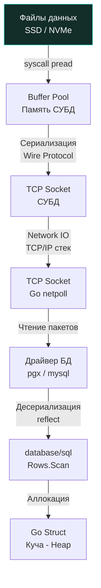

> *«Самый дешевый, быстрый и надежный байт при передаче по сети или обработке в памяти — это тот, который вы вовсе не запрашивали».*

## Проекция данных: Анатомия команды SELECT

В математических основаниях реляционной теории Эдгара Кодда операция извлечения подмножества атрибутов (колонок) из отношения (таблицы) называется **проекцией** (Projection, обозначается греческой буквой $\pi$). В диалектах языка SQL за эту фундаментальную операцию отвечает ключевая команда `SELECT`.

В кодовой базе любого серверного приложения `SELECT` — абсолютный чемпион по частоте вызовов. На базовом синтаксическом уровне запрос выглядит предельно лаконично:

```sql
SELECT id, email, created_at
FROM users;
```

В этой декларации мы даем СУБД строгое математическое указание: *какие именно* атрибуты кортежей (строк) требуются нашему доменному слою. Движок базы данных считывает блоки данных (в терминологии PostgreSQL — *pages* фиксированного размера 8 КБ) из своего буферного пула, отсекает ненужные байтовые смещения кортежа, упаковывает результирующие колонки в бинарный сетевой фрейм (например, PostgreSQL Wire Protocol, сообщение `DataRow` с типом `'D'`) и передает их по открытому TCP-соединению в сокет нашего бэкенда на Go.

### Алиасы (AS) и вычисляемые поля

Команда `SELECT` — это не просто пассивный считыватель дисковых колонок. Она представляет собой полноценный вычислительный конвейер, способный выполнять скалярные преобразования «на лету» прямо на стороне СУБД: математические расчеты, конкатенацию бинарных и текстовых строк, приведение типов и вызовы встроенных функций ядра. При этом результирующему выражению можно присвоить понятный псевдоним (алиас) через ключевое слово `AS`:

```sql
SELECT 
    id,
    first_name || ' ' || last_name AS full_name, -- Конкатенация в PostgreSQL
    salary * 1.15 AS projected_salary -- Вычисляемое поле
FROM employees;
```

Здесь `full_name` и `projected_salary` не существуют в физической структуре таблицы на диске. База данных динамически вычисляет их для каждой строки, формируя виртуальный кортеж перед отправкой в сеть.

> [!info] Под капотом: Вычисления в БД vs Бэкенд
> Возникает вечный архитектурный спор: где правильнее выполнять вычисления — в SQL-запросе (конкатенация, округление, математика с плавающей точкой) или запросить сырые колонки и обработать их в коде на Go?
> 
> **Mechanical Sympathy:** База данных — это разделяемый ресурс и главный *bottleneck* (узкое место) архитектуры. Каждая операция конкатенации строк или математический расчет в СУБД расходует процессорные такты (CPU) сервера баз данных. Бэкенд на Go, напротив, stateless: мы можем горизонтально масштабировать его, подняв десятки подов в Kubernetes за секунды, тогда как масштабирование базы данных — сложнейшая инженерная задача.
> 
> *Инженерное правило (Rule of Thumb):*
> 1. Если вычисление требуется для **фильтрации или сортировки** на стороне БД (условия `WHERE`, `ORDER BY`, группировка `GROUP BY`), его необходимо выполнять в SQL, чтобы СУБД могла использовать индексы или минимизировать передаваемый объем строк.
> 2. Если же это форматирование данных для UI или бизнес-логики (собрать полное имя, применить скидку, отформатировать дату), всегда извлекайте сырые колонки и выполняйте трансформацию на бэкенде в Go, где процессорные мощности дешевы и линейно масштабируемы.

---

## Исполнение SELECT в Go: Жизненный цикл данных

Для разработчика на Go жизнь SQL-запроса отнюдь не завершается успешным ответом дискового движка СУБД. Настоящая работа только начинается: байты обязаны преодолеть многослойный путь сквозь сетевой стек ядра Linux, внутренний планировщик Go, драйвер СУБД и механизм распределения памяти.



Когда Go-приложение выполняет `SELECT`, сетевой поллер рантайма Go (`netpoll`), интегрированный с системным вызовом ядра Linux `epoll`, асинхронно считывает входящие TCP-пакеты. Драйвер базы данных парсит бинарные сообщения протокола, после чего метод `Rows.Scan` производит десериализацию типов СУБД в нативные типы Go.

### Идиоматичный паттерн извлечения множества строк

Рассмотрим классический промышленный код чтения выборки пользователей с безупречной обработкой системных ресурсов:

```go
package main

import (
	"context"
	"database/sql"
	"fmt"
	"time"
)

type User struct {
	ID        int64
	Email     string
	CreatedAt time.Time
}

func GetActiveUsers(ctx context.Context, db *sql.DB) ([]User, error) {
	const query = `SELECT id, email, created_at FROM users`

	// 1. Выполняем запрос с привязкой к контексту
	rows, err := db.QueryContext(ctx, query)
	if err != nil {
		return nil, fmt.Errorf("db.QueryContext failed: %w", err)
	}
	// КРИТИЧЕСКИ ВАЖНО: всегда освобождаем сетевой ресурс через defer
	defer rows.Close()

	// Оптимизация аллокаций: если примерный размер выборки известен,
	// используйте make([]User, 0, expectedCap) для снижения реаллокаций слайса.
	var users []User

	// 2. Итерируемся по потоку кортежей
	for rows.Next() {
		var u User
		// 3. Десериализуем колонки в поля структуры
		if err := rows.Scan(&u.ID, &u.Email, &u.CreatedAt); err != nil {
			return nil, fmt.Errorf("rows.Scan failed: %w", err)
		}
		users = append(users, u)
	}

	// 4. Проверяем ошибки сетевого потока после цикла
	if err := rows.Err(); err != nil {
		return nil, fmt.Errorf("rows iteration failed: %w", err)
	}

	return users, nil
}
```

### Разбор механики и Gotchas

Каждая строчка в приведенном паттерне написана кровью упавших в продакшене сервисов. Разберем ключевые ловушки и механические детали.

> [!warning] Ловушка / Gotcha: Утечка соединений (Connection Leak)
> Метод `db.QueryContext` запрашивает одно активное TCP-соединение из конкурентного пула ([[2. Connection pool]]) и монопольно привязывает его к возвращаемому объекту `*sql.Rows`. Это физическое сетевое соединение **не вернется в пул**, пока вы явно не вызовете `rows.Close()` или пока `rows.Next()` не дойдет до конца выборки и не вернет `false`.
> 
> Если внутри цикла `for rows.Next()` произойдет паника, вызов `return` при ошибке `Scan`, или контекст будет отменен, а `defer rows.Close()` забыт, соединение останется «зависшим» навсегда. 
> При высоком трафике пул соединений исчерпается за считанные секунды. Новые горутины встанут в бесконечную очередь ожидания коннекта, база данных перестанет отвечать, а сервис перестанет проходить health check'и (произойдет каскадный отказ). Поэтому правило железобетонно: `defer rows.Close()` пишется строго сразу после успешной проверки ошибки `db.QueryContext`. Повторные вызовы `rows.Close()` идемпотентны и безопасны.

> [!info] Под капотом: Цена Rows.Scan и Escape Analysis
> Стандартный метод `rows.Scan(&u.ID, ...)` принимает аргументы как `...any` (пустой интерфейс). Под капотом стандартный драйвер `database/sql` вынужден запускать машинерию пакета `reflect` для рантайм-инспекции типов переданных указателей.
> 
> 1. **Рефлексия и ветвления:** На каждой итерации цикла процессор тратит такты на разбор типов (`reflect.TypeOf`), распаковку указателей и валидацию совместимости бинарных данных драйвера с типами Go.
> 2. **Escape Analysis (Анализ побега):** Передача указателей на локальные переменные в `Scan(...any)` заставляет компилятор Go (при фазе Escape Analysis) аллоцировать структуру `User` в куче (Heap), а не на стеке, что добавляет работы Garbage Collector-у при выборках из десятков тысяч строк.
> 
> В ультра-высоконагруженных системах стандартный `database/sql` часто заменяют на генераторы типобезопасного кода (например, `sqlc` в связке с `pgx`), которые генерируют парсинг без использования `reflect` и минимизируют аллокации (подробнее в [[1. Работа с БД в Go. database_sql]]).

> [!tip] Собеседование: QueryRow и sql.ErrNoRows
> **Вопрос:** Как правильно извлечь ровно одну строку из базы данных в Go и как корректно обработать ситуацию, когда запись отсутствует?
> 
> **Ответ:** 
> Для выборки одиночной строки используется метод `db.QueryRowContext()`. Архитектурно он избавляет программиста от необходимости вручную вызывать `rows.Close()`, так как закрывает соединение автоматически после `Scan()`:
> ```go
> var u User
> err := db.QueryRowContext(ctx, "SELECT id, email, created_at FROM users WHERE id = $1", userID).
>     Scan(&u.ID, &u.Email, &u.CreatedAt)
> if err != nil {
>     if errors.Is(err, sql.ErrNoRows) {
>         // Это нормальная бизнес-ситуация: сущность не найдена
>         return nil, ErrUserNotFound
>     }
>     // Реальная ошибка: сетевой сбой, синтаксис, отмена контекста
>     return nil, fmt.Errorf("query user: %w", err)
> }
> ```
> Ключевой нюанс: если запрос вернул 0 строк, метод `Scan()` возвращает маркерную ошибку-сентинель `sql.ErrNoRows`. На собеседовании важно подчеркнуть: `sql.ErrNoRows` в доменной логике — это не инфраструктурный сбой базы данных, а штатная ситуация («пользователь не найден»). Ее необходимо перехватывать через `errors.Is(err, sql.ErrNoRows)` и преобразовывать в доменную ошибку (`ErrUserNotFound`) либо возвращать `nil`, если отсутствие данных — это норма.

---

## Итог

1. **`SELECT`** — это классическая реляционная операция проекции. Выбирайте исключительно те колонки, которые строго необходимы сервису. Запрос лишних колонок убивает производительность диска, сети и аллокатора Go. Никаких `SELECT *` в production-коде.
2. Вычисляемые поля и алиасы (`AS`) удобны, но CPU базы данных дорог. Выносите форматирование и презентационную логику на масштабируемый уровень бэкенда Go.
3. При работе с массивом строк в Go жизненно необходимо использовать `defer rows.Close()` во избежание утечки соединений (connection pool exhaustion).
4. Обязательно проверяйте `rows.Err()` после завершения цикла итерации, так как обрыв TCP-соединения во время передачи потока данных может произойти на середине результата.
5. Для одиночных строк используйте `QueryRowContext` и всегда разделяйте инфраструктурные сбои и доменное отсутствие записи `sql.ErrNoRows`.

Базовый `SELECT` возвращает все строки подряд. Однако реальный бэкенд практически всегда оперирует точечными выборками. В следующей статье мы разберем механику предикатов и фильтрации данных: [[3. WHERE и фильтрация]].