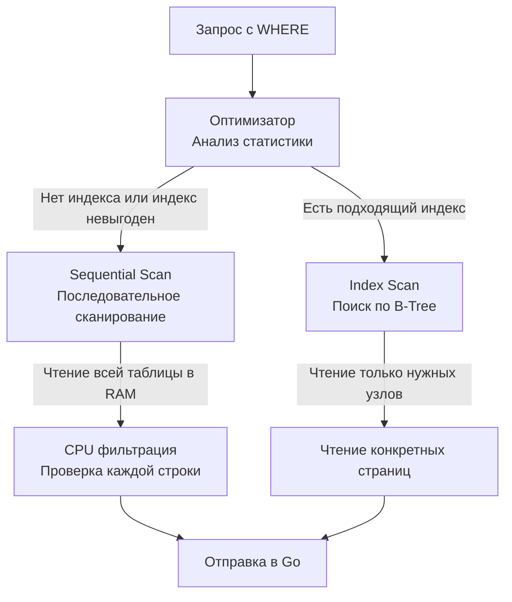

> *«Самая эффективная строка кода — та, которая никогда не исполняется, а самая быстрая запись базы данных — та, которую вы отфильтровали еще до того, как она коснулась оперативной памяти».*

## Предикаты и ограничение выборки

В математическом аппарате реляционной алгебры операция, которая отсекает ненужные кортежи по заданному логическому условию, называется **селекцией (Selection)** или **ограничением (Restriction)** (традиционно обозначается греческой буквой $\sigma$). В синтаксисе языка SQL за реализацию этой операции отвечает предложение `WHERE`.

Если проекция `SELECT` сжимает ширину потока данных (отсекая лишние атрибуты и колонки), то предикаты `WHERE` сжимают его длину (отсекая строки). С точки зрения принципа **Mechanical Sympathy** (механического сочувствия к оборудованию), фильтрация данных непосредственно на уровне движка СУБД — это первая линия обороны всей вашей бэкенд-системы. Раннее отсечение строк кардинально разгружает три критических физических узла:
1. **Дисковая подсистема (Disk IO):** Существенно снижается объем страниц данных, которые СУБД вынуждена считывать в свой буферный пул (Shared Buffers), особенно при наличии селективных индексов.
2. **Процессор (CPU):** Минимизируется количество строк, которые ядро базы данных десериализует, декодирует и передает в конвейер вычислений.
3. **Сетевой стек (Network IO):** Исключается передача миллионов «мусорных» байтов по протоколу TCP в сетевой поллер (`netpoll`) вашего Go-приложения.

---

## Как БД выполняет WHERE: Seq Scan vs Index Scan

Когда парсер СУБД встречает блок `WHERE`, он транслирует логический предикат в узлы синтаксического дерева и передает их стоимостному оптимизатору. На физическом уровне у базы данных есть два фундаментально противоположных пути исполнения фильтра:



1. **Sequential Scan (Полное последовательное сканирование таблицы):**
   СУБД последовательно вычитывает с диска в оперативную память (Shared Buffers) **каждую** страницу таблицы (по 8 КБ в PostgreSQL). Затем исполнитель запросов последовательно перебирает каждый кортеж на странице и процессор вычисляет значение предиката (например, `age > 18`). Если условие ложно, кортеж отбрасывается. Если таблица насчитывает 50 миллионов строк, а вам требовалось найти аккаунт одного пользователя, подобный подход сжигает гигабайты пропускной способности памяти и миллиарды процессорных тактов впустую.
2. **Index Scan (Сканирование индекса):**
   СУБД спускается по сбалансированному дереву индекса (классический B-Tree), выполняя логарифмический поиск $\mathcal{O}(\log N)$. В листовых узлах индекса база находит точные физические указатели — **TID (Tuple Identifier)**, содержащие номер дисковой страницы и смещение строки внутри страницы. Исполнитель обращается исключительно к целевым страницам таблицы, полностью минуя чтение гигабайтов остального массива. Подробнее архитектуру B-Tree и устройство индексов мы разберем в статье [[1. Что такое индекс и зачем он нужен]].

> [!info] Под капотом: Короткое замыкание (Short-circuit evaluation)
> Разработчики на Go привыкли к детерминированному поведению логических выражений: в конструкции `if a != nil && a.IsValid()`, если `a == nil`, вторая часть гарантированно не вычисляется (короткое замыкание / short-circuit).
> 
> В реляционных СУБД (включая PostgreSQL) порядок вычисления предикатов `WHERE A AND B` **не гарантируется слева направо**! 
> Оптимизатор CBO волен переставить проверки местами, если статистика показывает, что предикат `B` обладает гигантской селективностью (отсекает 99% строк), а предикат `A` дорог в вычислении или отсекает лишь 10%. Никогда не пишите SQL-запросы в расчете на то, что левая часть защитит правую от деления на ноль или ошибки парсинга (`WHERE x != 0 AND 100/x > 1` может завершиться ошибкой runtime division by zero).

---

## SARGability: Главный секрет производительного WHERE

На собеседованиях уровня Middle+ и Senior вопрос о **SARGability** предикатов задают с завидной регулярностью. 
Аббревиатура **SARGable** (*Search ARGument ABLE*) определяет способность СУБД использовать существующий индекс для непосредственного поиска по предикату вместо деградации в полный перебор таблицы (`Sequential Scan`).

Золотое правило SARGability: **колонка индекса обязана стоять слева от оператора сравнения в первозданном, немодифицированном виде**. Любое применение функции, математической операции, приведения типов или конкатенации к индексируемому полю "ломает" возможность спуска по B-Tree.

### ❌ Non-SARGable примеры (Индекс НЕ будет использован):

```sql
-- 1. Функция над колонкой: СУБД вынуждена вычислить YEAR() для КАЖДОЙ строки таблицы!
SELECT id FROM users WHERE YEAR(created_at) = 2023;

-- 2. Арифметика над колонкой: B-Tree не знает значения выражения price * 0.9.
SELECT id FROM products WHERE price * 0.9 < 100;

-- 3. Поиск по шаблону с префиксным подстановочным знаком:
-- B-Tree отсортирован слева направо и не способен совершить бинарный спуск с конца слова.
SELECT email FROM users WHERE email LIKE '%@gmail.com';
```

### ✅ SARGable примеры (Индекс будет использован):

```sql
-- 1. Диапазон дат: B-Tree моментально позиционируется на начало диапазона
-- и сканирует листовые страницы до верхней границы.
SELECT id FROM users WHERE created_at >= '2023-01-01' AND created_at < '2024-01-01';

-- 2. Математика перенесена вправо: константа 100 / 0.9 вычисляется один раз
-- на этапе компиляции запроса, а колонка price остается чистым операндом.
SELECT id FROM products WHERE price < 100 / 0.9;

-- 3. Префиксный поиск: B-Tree находит узел с префиксом 'john.doe@' за O(log N).
SELECT email FROM users WHERE email LIKE 'john.doe@%';
```

> [!tip] Собеседование
> **Вопрос:** У нас создана таблица `orders` с B-Tree индексом по колонке `status`. Однако запрос `SELECT * FROM orders WHERE status != 'CANCELLED'` выполняется мучительно долго, и `EXPLAIN` показывает полный `Seq Scan`. Почему оптимизатор СУБД проигнорировал готовый индекс?
> 
> **Ответ:** 
> Операторы неравенства (`!=`, `<>`) в подавляющем большинстве бизнес-моделей обладают крайне низкой селективностью (*Low Selectivity*). В реальном интернет-магазине отмененных заказов может быть 5%, а неотмененных — 95%.
> Если оптимизатор решит использовать индекс для 95% строк таблицы, ему придется для каждой записи сначала прочитать листовой блок B-Tree, извлечь TID, а затем совершить случайное дисковое чтение (*Random IO*) соответствующей страницы в Heap. Случайный доступ к диску в сотни раз медленнее, чем чтение подряд (*Sequential IO*). Поэтому CBO абсолютно оправданно выбирает `Sequential Scan`: прочитать всю таблицу одним непрерывным потоком блоков выходит в разы дешевле. Индекс эффективен только тогда, когда предикат отбирает незначительную долю таблицы (обычно менее 5–10%). Проверить оценку селективности оптимизатором всегда позволяет инструмент [[10. План выполнения запроса. EXPLAIN]].

---

## Ловушки при работе с WHERE в Go

При проектировании серверного слоя на Go динамическое конструирование фильтров в предложении `WHERE` таит в себе две классические архитектурные ловушки.

### 1. Срез в операторе IN

Одна из распространенных потребностей — запросить сущности по списку идентификаторов: `WHERE id IN (1, 2, 3)`. Начинающие разработчики часто пытаются скормить срез Go (`slice`) напрямую в качестве одиночного аргумента:

```go
// ❌ ГРУБАЯ ОШИБКА: Драйвер database/sql не умеет автоматически раскрывать срез Go 
// в перечисление SQL-аргументов. Запрос завершится синтаксической ошибкой СУБД.
ids := []int{1, 2, 3}
db.Query("SELECT name FROM users WHERE id IN ($1)", ids)
```

В стандартном протоколе базы данных плейсхолдер `$1` соответствует ровно одному скалярному значению, а не списку.

**✅ Правильный идиоматичный подход (чистый Go без сторонних библиотек):**
Мы динамически генерируем строку с позиционными параметрами `($1, $2, $3)` и передаем распакованный срез интерфейсов `args...`:

```go
package repository

import (
	"context"
	"database/sql"
	"fmt"
	"strings"
)

type User struct {
	ID   int64
	Name string
}

func GetUsersByIDs(ctx context.Context, db *sql.DB, ids []int) ([]User, error) {
	if len(ids) == 0 {
		return nil, nil // Быстрый возврат: предотвращаем бессмысленный network round-trip к БД
	}

	// Аллоцируем буферы под строковые плейсхолдеры и аргументы
	placeholders := make([]string, len(ids))
	args := make([]any, len(ids)) // interface{} срез для передачи в variadic QueryContext

	for i, id := range ids {
		placeholders[i] = fmt.Sprintf("$%d", i+1)
		args[i] = id
	}

	query := fmt.Sprintf(
		"SELECT id, name FROM users WHERE id IN (%s)",
		strings.Join(placeholders, ", "),
	)

	// args... разворачивает срез []any в вариативные параметры
	rows, err := db.QueryContext(ctx, query, args...)
	if err != nil {
		return nil, fmt.Errorf("query execute error: %w", err)
	}
	defer rows.Close()

	var users []User
	for rows.Next() {
		var u User
		if err := rows.Scan(&u.ID, &u.Name); err != nil {
			return nil, fmt.Errorf("scan user: %w", err)
		}
		users = append(users, u)
	}

	if err := rows.Err(); err != nil {
		return nil, fmt.Errorf("rows iteration: %w", err)
	}

	return users, nil
}
```

> [!info] Под капотом
> Чтобы не писать ручную конкатенацию плейсхолдеров в каждом репозитории, в промышленной Go-разработке применяются два зрелых подхода:
> 1. **SQL-билдеры** (такие как `squirrel` или `goqu`), динамически собирающие безопасные параметризованные запросы.
> 2. **Кодогенерация через `sqlc`**, которая самостоятельно генерирует эффективный типобезопасный Go-код на основе статического анализа схемы и SQL-файлов. В случае PostgreSQL драйвер `pgx` также поддерживает нативный синтаксис массивов `WHERE id = ANY($1)`, позволяя передавать слайс Go как одиночный параметр `pq.Array` / `pgtype`. Подробнее эти инструменты мы разберем в статье [[1. Работа с БД в Go. database_sql]].

### 2. Трехзначная логика и NULL

Вторая классическая ошибка разработчиков, пришедших из языков с булевой алгеброй — попытка проверить поле на отсутствие данных через знак равенства:

```sql
-- ❌ НЕВЕРНО: Всегда вернет 0 строк!
SELECT id FROM users WHERE deleted_at = NULL;
```

Реляционный мир SQL оперирует не классической булевой логикой, а **трехзначной логикой (Three-Valued Logic, 3VL)**, включающей три состояния: `TRUE`, `FALSE` и `UNKNOWN`.

`NULL` в реляционной теории — это не число ноль и не пустая строка. Это *маркер отсутствия информации* или неопределенности. Нельзя утверждать, равно ли «неизвестное» другому «неизвестному». Поэтому любое математическое или логическое сравнение с `NULL` (даже парадоксальное `NULL = NULL` или `NULL != NULL`) всегда возвращает результат `UNKNOWN`.

А предложение `WHERE` пропускает кортеж дальше по конвейеру **только и исключительно в том случае, если итоговое выражение вычислено в строгое `TRUE`**. Значения `FALSE` и `UNKNOWN` безжалостно отбрасываются.

Для проверки отсутствия данных стандарт SQL предоставляет специализированные предикаты:

```sql
-- ✅ ВЕРНО: Корректная проверка на присутствие или отсутствие значения
SELECT id FROM users WHERE deleted_at IS NULL;
SELECT id FROM users WHERE deleted_at IS NOT NULL;
```

Глубокий разбор трехзначных таблиц истинности и подводных камней агрегации ждет нас в статье [[12. Работа с NULL в SQL]].

---

## Итог

1. **`WHERE`** выполняет операцию селекции ($\sigma$), фильтруя кортежи максимально близко к физическому накопителю. Никогда не вычитывайте миллионы строк в Go, чтобы отфильтровать их циклом `for`.
2. Архитектура предикатов определяет способ доступа: высокоселективные условия ведут к быстрому **Index Scan**, а неселективные или сломанные предикаты провоцируют тяжелый **Sequential Scan**.
3. Соблюдайте **SARGability**: держите индексируемые колонки "голыми" слева от оператора сравнения. Любая функция над колонкой уничтожает возможность поиска по B-Tree.
4. Передача срезов Go в `WHERE ... IN` требует генерации списка плейсхолдеров (`$1, $2, ...`) либо использования оператора `= ANY($1)` в связке с драйвером Postgres.
5. `NULL` подчиняется трехзначной логике (3VL): сравнение через `=` всегда дает `UNKNOWN`. Для проверки маркера отсутствия используйте только `IS NULL` и `IS NOT NULL`.

Ограничив выборку нужными предикатами, мы часто хотим упорядочить результат или ограничить размер пачки для постраничного вывода (пагинации). О том, как сортировка влияет на оперативную память и дисковый Spilling, мы поговорим в следующей статье: [[4. ORDER BY, LIMIT]].