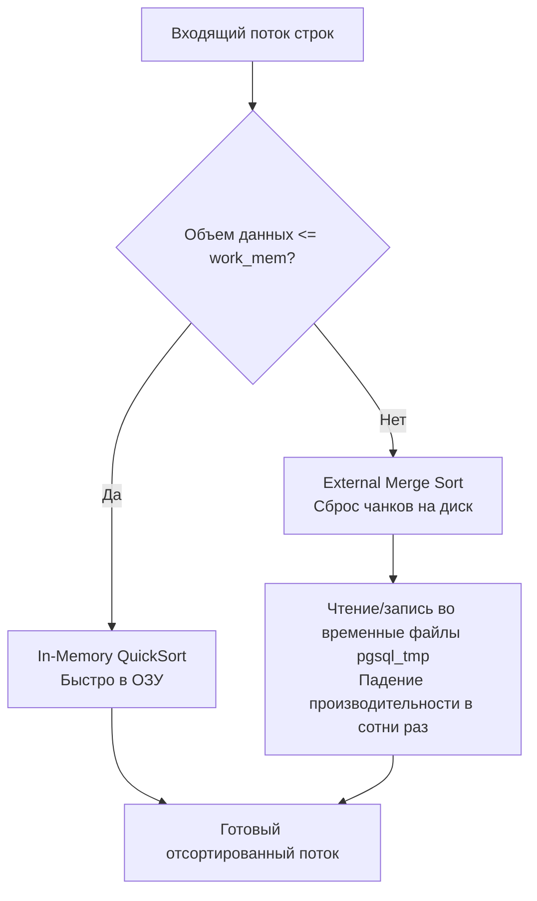
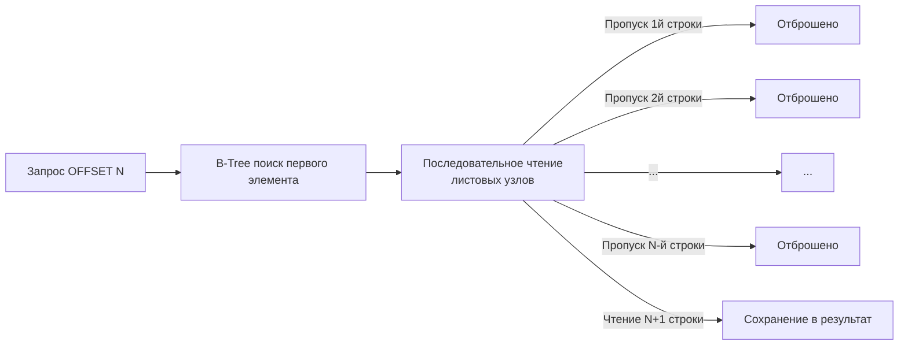

> *«Порядок не является естественным свойством реляционных данных; это иллюзия, создаваемая осознанными вычислениями. Если вы явно не требуете от машины упорядочивания, вы отдаете себя на милость физической фрагментации страниц».*

## Упорядочивание хаоса: Иллюзия порядка в реляционной алгебре

Одно из первых заблуждений, с которым сталкивается начинающий инженер — убеждение, что данные в таблице базы данных хранятся «по порядку добавления». 
В строгой математической модели Эдгара Кодда **таблицы представляют собой неупорядоченные множества (sets)** кортежей. В теории множеств элементы не обладают порядковыми индексами.

Если вы отправляете запрос `SELECT * FROM users` без явной директивы сортировки, СУБД имеет полное законное право вернуть строки в произвольной последовательности. Более того, эта последовательность может непредсказуемо меняться от секунды к секунде. 
Физический порядок отдачи строк определяется тем:
- В каком порядке дисковые блоки (*pages*) вытесняются или поднимаются в буферный пул (`Buffer Pool`);
- Как сработал параллельный сканер нескольких воркеров;
- Как отработал фоновый сборщик мусора базы (например, процесс `VACUUM` в PostgreSQL, который очищает мертвые кортежи и освобождает пустоты внутри 8-килобайтных страниц для повторной записи новых строк).

Единственный способ гарантировать детерминированный, воспроизводимый порядок следования строк в реляционной базе данных — явное использование конструкции `ORDER BY`.

---

## Механика ORDER BY: RAM, Диск и B-Tree

С точки зрения **Mechanical Sympathy**, операция сортировки — один из самых тяжелых вычислительных этапов во всем конвейере базы данных. Процессор вынужден сравнивать значения ключей для миллионов пар записей, переставляя указатели в памяти. 
На физическом уровне СУБД выбирает один из двух принципиально разных механизмов сортировки:

### 1. Сортировка в памяти (In-Memory Sort / FileSort)

Если результирующий набор строк невелик, СУБД собирает все отфильтрованные кортежи и выполняет их упорядочивание непосредственно в оперативной памяти (применяя оптимизированный QuickSort или Radix Sort).

В архитектуре PostgreSQL объем оперативной памяти, выделяемый под одну операцию сортировки внутри одного процесса бэкенда, жестко лимитируется параметром конфигурации `work_mem` (значение по умолчанию часто составляет скромные 4MB).



> [!warning] Ловушка / Gotcha: Spill to Disk (Сброс на диск)
> Если массив данных, подлежащих сортировке, превышает значение `work_mem`, СУБД не завершает транзакцию паникой Out Of Memory (OOM). 
> Вместо этого движок активирует алгоритм внешней сортировки слиянием (**External Merge Sort**): данные разбиваются на порции, сортируются в RAM и сбрасываются во временные файлы на диск (каталог `pgsql_tmp` в PostgreSQL), после чего сливаются обратно. 
> 
> Задержки при сбросе на диск возрастают экспоненциально: вместо наносекунд доступа к оперативной памяти запрос упирается в миллисекунды дискового ввода-вывода. Запрос, который безупречно работал на тестовых данных, в продакшене под нагрузкой внезапно деградирует до минутного зависания. Диагностировать эту проблему позволяет утилита [[10. План выполнения запроса. EXPLAIN]] (обращайте пристальное внимание на строки `Sort Method: external merge Disk`).
> 
> *Важное предостережение:* Не поддавайтесь соблазну бездумно задрать `work_mem` до гигабайтов в `postgresql.conf`! Параметр `work_mem` выделяется **на каждый узел сортировки каждого активного соединения**. Если 200 параллельных клиентов выполнят сложный запрос с тремя операциями сортировки и соединения, база мгновенно попытается аллоцировать $200 \times 3 \times \text{work\_mem}$, спровоцировав безжалостный Linux OOM Killer, который убьет процесс СУБД.

### 2. Сортировка по индексу (Index Sort)

Это наивысший стандарт производительности: **лучшая сортировка — это та, которой не было вовсе**.
Индекс B-Tree (B-дерево) хранит ключи в строго отсортированном порядке на уровне листовых узлов (*leaf pages*). Листовые страницы связаны между собой двусвязным списком (**Doubly Linked List**).

Если в запросе указано `ORDER BY created_at`, и по колонке `created_at` существует B-Tree индекс, оптимизатор полностью исключает этап сортировки!
Исполнитель базы просто выполняет спуск к первому листовому узлу индекса и последовательно считывает уже упорядоченные указатели на строки. 
- Для сортировки по возрастанию (`ASC`) B-Tree читается слева направо (Forward Index Scan).
- Для сортировки по убыванию (`DESC`) двусвязный список листовых страниц сканируется справа налево (Backward Index Scan).

Это классический **Index Scan**, отрабатывающий практически с нулевыми затратами процессорного времени. Внутреннее устройство B-Tree страниц и навигацию по связным спискам мы детально препарируем в статье [[2. B Tree индекс под капотом]].

---

## LIMIT и паттерн Top-N

Команда `LIMIT N` (в некоторых СУБД вроде MS SQL или Sybase — `TOP N`, а в стандартах ANSI SQL — `FETCH FIRST N ROWS ONLY`) представляет собой директиву раннего выхода (*Early Stop*). Как только конвейер исполнителя сгенерировал `N` строк, удовлетворяющих критериям, он немедленно обрывает дальнейшее чтение данных.

Комбинация `ORDER BY` и `LIMIT` без использования индекса включает в СУБД специальную оптимизацию — **Top-N Heapsort**.

Представьте запрос `ORDER BY score DESC LIMIT 10` по таблице из 10 миллионов записей. Наивный подход потребовал бы отсортировать все 10 миллионов строк (с неизбежным сбросом на диск). 
Но движок базы данных создает в оперативной памяти компактную структуру данных «двоичная куча» (Priority Queue / Bounded Heap) размером ровно в $N=10$ элементов. Проходя по таблице полным сканированием, СУБД удерживает в куче только 10 максимальных элементов, вытесняя меньшие значения. Эта операция требует ничтожного объема RAM, укладывается в микросекунды и никогда не сбрасывает данные на диск.

### Mechanical Sympathy в Go: Аллокация памяти

Если SQL-запрос завершается директивой `LIMIT N`, ваше Go-приложение на этапе компиляции получает ценнейшую информацию: *точный верхний предел размера результирующего слайса*. 
Игнорирование этого факта превращает код в источник избыточных аллокаций и фрагментации кучи.

**❌ Неэффективный код (Серия реаллокаций и лишняя нагрузка на GC):**

```go
var users []User // nil slice: len = 0, cap = 0
rows, _ := db.QueryContext(ctx, "SELECT id FROM users LIMIT 100")
defer rows.Close()

for rows.Next() {
    var u User
    _ = rows.Scan(&u.ID)
    // append вынужден многократно вызывать runtime.growslice,
    // выделять новые блоки памяти в куче и копировать старые элементы.
    users = append(users, u) 
}
```

**✅ Идиоматичный Go (Zero Reallocations / Механическое сочувствие):**

```go
// Мы точно знаем верхнюю границу выборки, поэтому выделяем емкость (capacity) заранее.
// Длина (len) равна 0, чтобы append корректно заполнял элементы без лишних проверок.
users := make([]User, 0, 100) 

rows, err := db.QueryContext(ctx, "SELECT id FROM users LIMIT 100")
if err != nil {
    return nil, err
}
defer rows.Close()

for rows.Next() {
    var u User
    if err := rows.Scan(&u.ID); err != nil {
        return nil, err
    }
    // runtime.growslice НИКОГДА не будет вызван! Память аллоцирована ровно один раз.
    users = append(users, u)
}
```

---

## Убийца производительности: OFFSET и глубокая пагинация

Подавляющее большинство веб-сервисов реализуют постраничную навигацию наивным сочетанием `LIMIT` и `OFFSET`:

```sql
SELECT id, name FROM users ORDER BY created_at DESC LIMIT 50 OFFSET 100000;
```

Кажется, что мы элегантно запрашиваем 50 строк, начиная со стотысячной. Однако для сервера СУБД это катастрофа.

> [!tip] Собеседование
> **Вопрос:** Почему запрос с глубоким смещением `OFFSET 100000` драматически замедляет базу данных, даже если колонка `created_at` покрыта идеальным B-Tree индексом?
> 
> **Ответ:** 
> Директива `OFFSET` физически **не способна перепрыгнуть через строки в файле данных**.
> В силу архитектуры многоверсионного управления конкурентным доступом (**MVCC**), хранящейся в ядре реляционных СУБД, база данных не может знать заранее, какие из предшествующих 100 000 кортежей действительно "живы" и видимы текущему снимку транзакции, а какие были удалены или обновлены параллельными сессиями.
> 
> Чтобы отдать 50 строк, исполнитель СУБД обязан **прочитать из индекса и страниц кучи, проверить видимость по MVCC и выбросить в мусор ровно 100 000 строк**. 
> Вычислительная сложность классической пагинации через `OFFSET` составляет `O(N)`. Чем глубже страница, тем медленнее запрос. Чем дальше пользователь листает страницы каталога, тем ближе база к температурному шоку и истощению буферного пула.



### Альтернатива: Keyset Pagination (Cursor / Seek Method)

В архитектуре высоконагруженных систем глубокий `OFFSET` находится под строжайшим запретом. Промышленным стандартом построения масштабируемых API является **Keyset Pagination** (пагинация по ключу или курсорный метод).

Его суть проста и гениальна: клиент запоминает значения граничных колонок последней записи на текущей странице и передает их в качестве фильтра `WHERE` для следующего запроса.

```sql
-- 1. Запрос первой страницы
SELECT id, name, created_at 
FROM users 
ORDER BY created_at DESC, id DESC 
LIMIT 50;

-- Предположим, последний пользователь в полученной пачке имел:
-- created_at = '2023-10-01 12:00:00', id = 1042

-- 2. Запрос второй страницы (СТРОГО БЕЗ OFFSET!)
SELECT id, name, created_at 
FROM users 
WHERE (created_at, id) < ('2023-10-01 12:00:00', 1042)
ORDER BY created_at DESC, id DESC 
LIMIT 50;
```

**Почему Keyset Pagination работает молниеносно при любом объеме данных?**
Конструкция `WHERE (created_at, id) < (...)` позволяет СУБД выполнить точечный поиск по составному B-Tree индексу (*Index Seek*) за константное логарифмическое время `O(log N)`. База спускается по дереву точно к записи `1042` и читает следующие 50 листовых записей. Вне зависимости от того, находится ли клиент на 2-й странице или на 2 000 000-й, время выполнения запроса остается стабильным — менее 1 миллисекунды. Сравните: сложность `O(N)` у `OFFSET` против `O(log N)` у Keyset Pagination!

> [!info] Под капотом: Зачем нужен `id` в сортировке?
> Обратите внимание на составную сортировку: `ORDER BY created_at DESC, id DESC`.
> В высоконагруженных системах поле метки времени `created_at` не обладает абсолютной уникальностью: в одну и ту же миллисекунду могут быть созданы десятки учетных записей. 
> Если курсор будет опираться исключительно на `created_at`, условие `created_at < $1` пропустит строки с идентичной меткой времени. Чтобы пагинация была строго детерминированной (**Strictly Deterministic**), сортировка обязана замыкаться уникальным идентификатором сущности (обычно суррогатным первичным ключом `id`).

---

## Итог

1. Таблицы в SQL — это математические множества без врожденного порядка. Любой детерминированный вывод требует явного `ORDER BY`.
2. Сортировка без индексов ограничена параметром `work_mem`. Превышение лимита вызывает сброс временных файлов на диск (**External Merge Sort**), обрушивая производительность.
3. Индекс B-Tree позволяет выполнять сортировку даром через обход связанного списка листовых узлов (**Index Scan**).
4. `LIMIT N` в сочетании с сортировкой включает экономичный алгоритм **Top-N Heapsort**, предотвращающий сброс на диск для небольших выборок.
5. В Go всегда предварительно аллоцируйте слайсы `make([]T, 0, limit)`, исключая вызовы `growslice` и лишнее давление на сборщик мусора.
6. `OFFSET` обладает катастрофической сложностью $\mathcal{O}(N)$ из-за особенностей MVCC. В масштабируемом бэкенде пагинация обязана строиться через **Keyset Pagination (Cursor / Seek Method)**.

Мы досконально изучили чтение, фильтрацию и упорядочивание данных. Пришло время перейти к мутациям состояния базы данных и атомарным изменениям кортежей в следующей статье: [[5. INSERT, UPDATE, DELETE]].