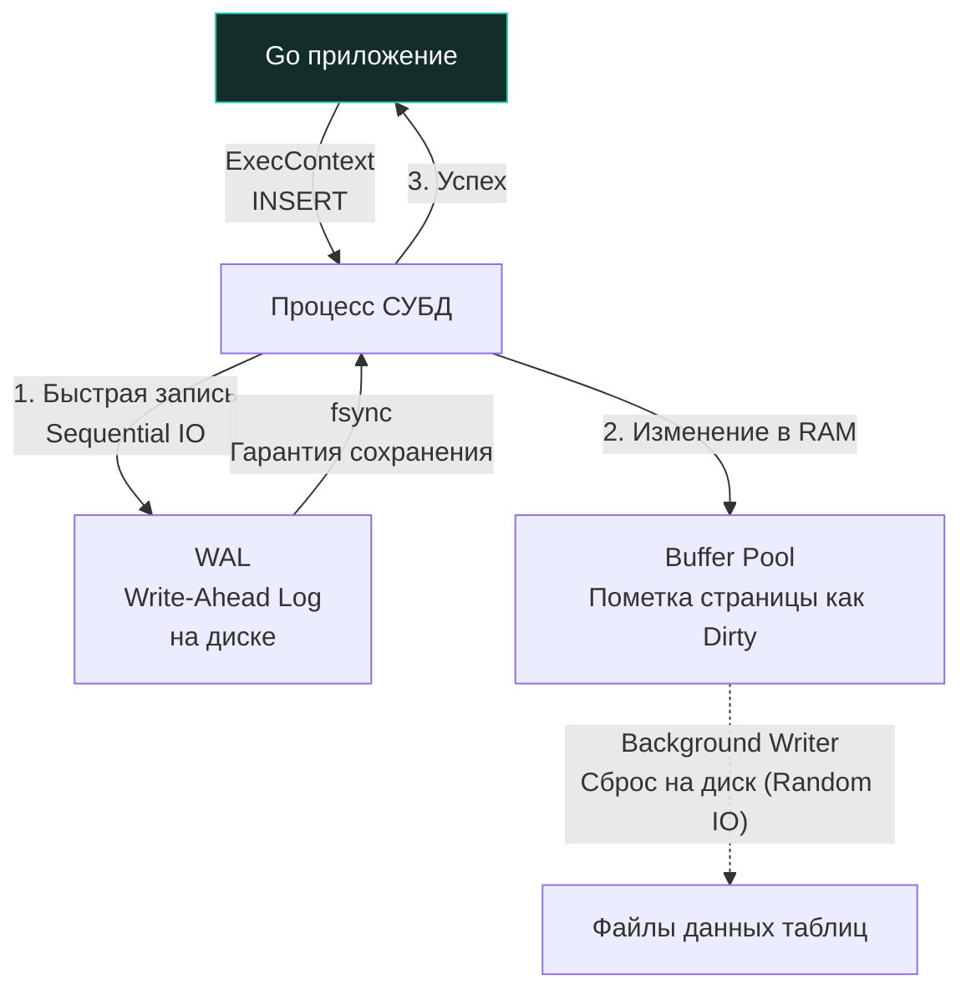

> *«Чтение — это созерцание; запись — это обязательство. Выполняя INSERT или UPDATE, вы вверяете частицу реальности диску, и физика кремния и магнитных пластин спросит с вас за каждый отдельный байт».*

## Мутация состояния: DML операции

Если выборка данных `SELECT` (DQL) представляет собой операцию чтения, оставляющую состояние Вселенной неизменным, то тройка команд `INSERT`, `UPDATE` и `DELETE` (Data Manipulation Language — DML) — это непосредственные инструменты мутации. Они изменяют самое уязвимое и ценное достояние любого проекта — консистентное состояние персистентного хранилища.

Для бэкенд-инженера операции модификации данных требуют на порядок более строгой дисциплины, чем чтение. Ошибка в предикатах `SELECT` приведет к искажению отчета в UI или пустой странице. Ошибка в `UPDATE` или `DELETE` с пропущенным или неверным условием `WHERE` способна мгновенно уничтожить или перезаписать данные во всей таблице (печально известный "Mass Update / Mass Delete" инцидент, стоивший карьеры не одному десятку специалистов).

---

## INSERT: Рождение данных

Базовый синтаксис вставки нового кортежа в реляционную таблицу выглядит лаконично:

```sql
INSERT INTO users (email, password_hash, created_at) 
VALUES ('user@example.com', 'hash', '2023-10-01');
```

В этой инструкции мы явно декларируем целевые столбцы и набор константных значений. Если колонка имеет значение по умолчанию (`DEFAULT`), ее можно опустить в списке полей.

### Массовая вставка (Bulk Insert / Batching)

Когда в бэкенд-сервис поступает пачка данных (например, импорт файла, синхронизация из очереди сообщений или пакетная обработка событий), начинающие разработчики совершают типичную ошибку: запускают одиночный `INSERT` в цикле `for` на стороне Go.

```go
// ❌ АНТИПАТТЕРН: Катастрофическая просадка производительности
for _, u := range users {
    _, _ = db.ExecContext(ctx, "INSERT INTO users (email, created_at) VALUES ($1, $2)", u.Email, u.CreatedAt)
}
```

Каждая итерация такого цикла инициирует отдельный сетевой раунд-трип (Network Round-Trip), переключение контекста ядра ОС, создание отдельной неявной транзакции в СУБД, парсинг запроса и отдельный вызов синхронизации журнала на диск (`fsync`). Скорость вставки падает с десятков тысяч до жалких сотен строк в секунду.

**✅ Промышленный стандарт (Многострочный Bulk Insert):**

```sql
INSERT INTO users (email, created_at) VALUES 
('user1@mail.com', '2023-10-01'),
('user2@mail.com', '2023-10-01'),
('user3@mail.com', '2023-10-01');
```

Такой запрос выполняется в рамках одного сетевого пакета, одной транзакции и одного обращения к журналу упреждающей записи.

> [!warning] Ловушка / Gotcha: Лимит параметров
> При динамической сборке запросов множественной вставки в Go необходимо учитывать аппаратные и протокольные ограничения СУБД на число позиционных плейсхолдеров (`$1, $2...`).
> 
> В бинарном протоколе PostgreSQL максимальное количество параметров в одном Prepared Statement жестко ограничено двухбайтовым беззнаковым целым числом: **65535** ($2^{16} - 1$).
> Если ваша таблица содержит 10 колонок, предельный размер одного батча составляет:
> $$\lfloor 65535 / 10 \rfloor = 6553 \text{ строк}.$$
> Попытка передать 6554 строки завершится аварийной ошибкой драйвера или СУБД. Поэтому массив данных в Go обязан разбиваться на порции (чанковаться) с запасом (например, батчами по 1 000 – 2 000 строк). Для сверхмассивной заливки миллионов записей в Postgres используется специализированная утилита протокола `COPY` (поддерживаемая в `pgx.CopyFrom`).

### Получение сгенерированного ID

В реальных сценариях первичный ключ таблицы (`id`) генерируется непосредственно ядром СУБД (через `AUTOINCREMENT`, `SERIAL` или `UUID`). Сразу после вставки Go-приложению жизненно необходимо получить созданный идентификатор для дальнейшей бизнес-логики.

Исторически в API баз данных существовал метод `res.LastInsertId()`. Однако в архитектуре PostgreSQL и других продвинутых СУБД он **не поддерживается**, так как в условиях высокой многопоточной конкуренции чтение «последнего ID» порождает гонки и архитектурную двусмысленность.

Идиоматичный и безопасный стандарт реляционных СУБД — использование суффикса **`RETURNING`**:

```sql
INSERT INTO users (email) VALUES ('test@test.com') RETURNING id, created_at;
```

Конструкция `RETURNING` превращает результат вставки в полноценный возвращаемый кортеж. В Go такой запрос обрабатывается точно так же, как обычный `SELECT`, через вызов `db.QueryRowContext`:

```go
func CreateUser(ctx context.Context, db *sql.DB, email string) (int64, error) {
    const query = `INSERT INTO users (email) VALUES ($1) RETURNING id`

    var id int64
    // Используем QueryRowContext, так как RETURNING возвращает строку с результатом
    err := db.QueryRowContext(ctx, query, email).Scan(&id)
    if err != nil {
        return 0, fmt.Errorf("failed to insert user: %w", err)
    }

    return id, nil
}
```

---

## Под капотом: Mechanical Sympathy записи

Что в действительности происходит на физическом уровне накопителя (NVMe/SSD) и оперативной памяти сервера при выполнении `INSERT` или `UPDATE`?

Наивное представление предполагает, что база данных берет строку и немедленно записывает ее в основной файл таблицы на диске. Если бы реляционные СУБД работали так, их пропускная способность была бы уничтожена: случайная запись (*Random Write*) в произвольные блоки файлов данных приводит к катастрофическим задержкам дисковых очередей.

Современные СУБД организуют запись через строгий двухфазный конвейер:



1. **WAL (Write-Ahead Log):**
   База данных исповедует фундаментальный принцип: *ни один байт страницы данных не может быть сброшен на диск до тех пор, пока соответствующая операция изменения не зафиксирована в журнале предзаписи*. 
   Запись в WAL является **строго последовательной (Sequential I/O)**: новые байты просто дописываются в конец лог-файла. Как только системный вызов ядра Linux `fsync(2)` подтверждает физический сброс буфера контроллера накопителя на энергонезависимый диск, СУБД гарантирует долговечность (Durability в ACID) и отправляет ответ клиенту.
2. **Buffer Pool (Разделяемая память):**
   Фактическая модификация кортежа таблицы происходит **только в оперативной памяти** (Shared Buffers). Соответствующая 8-килобайтная страница помечается специальным битовым флагом как «грязная» (Dirty Page).
3. **Background Writer и Checkpointer:**
   В фоновом режиме выделенные процессы СУБД (в PostgreSQL — `bgwriter` и `checkpointer`) плавно и асинхронно сбрасывают накопившиеся грязные страницы из RAM в основные файлы данных таблиц, сглаживая пики дискового ввода-вывода.

Если в этот момент произойдет аварийное отключение питания, данные в оперативной памяти испарятся. Однако при следующем старте ядро СУБД активирует процедуру аварийного восстановления (*Crash Recovery / Redo Replay*), вычитает WAL с диска и накатит все подтвержденные транзакции обратно в страницы памяти.

---

## UPDATE: Изменение состояния и MVCC

Синтаксис модификации существующих строк интуитивен:

```sql
UPDATE users 
SET status = 'active', updated_at = '2023-10-02'
WHERE id = 42;
```

Однако за внешней простотой скрывается сложнейшая механика конкурентного доступа.

> [!info] Под капотом: UPDATE в PostgreSQL — это DELETE + INSERT
> В ряде традиционных движков хранения (например, MySQL InnoDB) операция `UPDATE` старается модифицировать байты строки прямо на месте (*in-place update*), если размер записи не изменился.
> 
> В PostgreSQL, в силу бескомпромиссной архитектуры **MVCC** (Multi-Version Concurrency Control), кортежи данных **строго иммутабельны**. 
> Когда вы выполняете `UPDATE`, Postgres **никогда не перезаписывает старую запись**! 
> Вместо этого ядро:
> 1. Помечает старую версию кортежа как логически удаленную (записывает идентификатор текущей транзакции в системный заголовок `xmax`).
> 2. Создает и вставляет **абсолютно новую версию кортежа** со свежими данными и новым значением `xmin`.
> 
> *Инженерное следствие:* Частые и массивные апдейты в PostgreSQL приводят к стремительному «раздуванию» таблиц и связанных B-Tree индексов (**Table Bloat**). Пространство на диске не освобождается само по себе — зачистку мертвых версий строк выполняет асинхронный фоновый демон `Autovacuum` (подробно разобранный в [[11. VACUUM и garbage collection]]).

### Go Idiom: Проверка RowsAffected

Классический вопрос на собеседованиях для уровня Middle+:
Представьте вызов: `UPDATE users SET status = 'active' WHERE id = 99999;`. В базе данных заведомо нет пользователя с `id=99999`. Какую ошибку возвратит метод `db.ExecContext()` в Go?

**Ответ: Ошибки не будет. `err` вернет строго `nil`.**

С точки зрения реляционного ядра, запрос абсолютно валиден. Он успешно выполнил поиск, нашел ровно 0 строк, соответствующих предикату, и успешно модифицировал 0 строк.

Чтобы в коде приложения зафиксировать факт отсутствия сущности и возвратить клиенту понятный статус (например, HTTP 404 Not Found), инженер обязан запросить количество затронутых строк через `RowsAffected()`:

```go
func UpdateStatus(ctx context.Context, db *sql.DB, id int64, status string) error {
    const query = `UPDATE users SET status = $1 WHERE id = $2`

    // Для любых мутаций состояния без вычитывания кортежей используем строго ExecContext!
    res, err := db.ExecContext(ctx, query, status, id)
    if err != nil {
        return fmt.Errorf("exec failed: %w", err)
    }

    // Проверяем, сколько кортежей было физически модифицировано
    affected, err := res.RowsAffected()
    if err != nil {
        return fmt.Errorf("failed to get rows affected: %w", err)
    }

    if affected == 0 {
        // Доменное событие: запись не найдена
        return fmt.Errorf("user with id %d not found", id)
    }

    return nil
}
```

> [!warning] Ловушка / Gotcha: db.Query для UPDATE
> Если разработчик по невнимательности выполнит `UPDATE` или `DELETE` через метод `db.QueryContext` вместо `db.ExecContext`, запрос физически выполнится в СУБД.
> 
> Однако метод `QueryContext` возвращает структуру `*sql.Rows`, которая захватывает сетевое TCP-соединение из пула. Если программист не итерируется по результату и не вызывает `rows.Close()` (наивно полагая, что раз данных нет, то и закрывать нечего: `_ = db.Query(...)`), **соединение навсегда утекает из пула**. Пул коннектов быстро истощается, и приложение намертво зависает. 
> Для всех запросов на мутацию без `RETURNING` применяйте **исключительно `db.ExecContext()`**!

---

## DELETE и архитектурный паттерн Soft Delete

Удаление строк выполняется командой:

```sql
DELETE FROM users WHERE id = 42;
```

**Mechanical Sympathy:** СУБД не стирает физические байты на диске нулями и не схлопывает 8-килобайтную страницу. Движок лишь помечает строку маркером удаления (устанавливает системный заголовок `xmax` в PostgreSQL или бит удаления в заголовке записи InnoDB). Страница данных сохраняет свой прежний размер, а на месте удаленной записи образуется свободный слот для будущих вставок.

### Hard Delete vs Soft Delete

В промышленных распределенных системах прямое физическое удаление (**Hard Delete**) применяется крайне осмотрительно из-за юридических требований аудита, анализа инцидентов и защиты от случайных ошибок операторов.

Индустриальным стандартом стал архитектурный паттерн **Soft Delete (Мягкое удаление)**:

```sql
-- 1. Добавляем колонку времени удаления
ALTER TABLE users ADD COLUMN deleted_at TIMESTAMP NULL;

-- 2. "Удаление" строки превращается в безопасный UPDATE
UPDATE users SET deleted_at = NOW() WHERE id = 42;
```

После внедрения Soft Delete каждый запрос на чтение в приложении обязан фильтровать удаленные сущности:
```sql
SELECT * FROM users WHERE deleted_at IS NULL;
```

> [!tip] Собеседование: Проблемы Soft Delete
> **Вопрос:** В таблице `users` используется Soft Delete (колонка `deleted_at`). По полю `email` создан уникальный индекс (`UNIQUE CONSTRAINT`). Пользователь удалил учетную запись (`deleted_at = NOW()`), а затем регистрируется заново с тем же адресом электронной почты. Что произойдет при `INSERT`?
> 
> **Ответ:** 
> Произойдет ошибка нарушения уникальности (**Unique Violation**). 
> Стандартный B-Tree индекс уникальности индексирует все строки таблицы, включая те, у которых проставлен `deleted_at`. Для индекса «мягко удаленная» строка ничем не отличается от живой.
> 
> **Инженерное решение:** 
> В PostgreSQL эта проблема элегантно решается созданием **Partial Index (Частичного индекса)**:
> ```sql
> CREATE UNIQUE INDEX idx_users_email_active ON users(email) WHERE deleted_at IS NULL;
> ```
> Благодаря предикату `WHERE deleted_at IS NULL`, кортежи с заполненной датой удаления автоматически исключаются из структуры B-Tree. Пользователь сможет беспрепятственно зарегистрироваться повторно, а индекс останется компактным и быстрым (подробности в статье [[7. Partial индекс]]).

---

## Итог

1. Мутации (`INSERT`, `UPDATE`, `DELETE`) меняют персистентное состояние СУБД. Они гарантируют надежность за счет архитектуры **WAL (Последовательный диск) -> Buffer Pool (Оперативная память)**.
2. Для массовой вставки всегда используйте многострочный Bulk Insert батчами, помня о лимите параметров ($65535$ в Postgres), избегая одиночных запросов в цикле Go.
3. В Go для генерации и получения ID при вставке используйте связку `RETURNING` и `db.QueryRowContext()`.
4. Для `UPDATE` и `DELETE` всегда используйте `db.ExecContext()` и проверяйте `RowsAffected()`. Нулевое количество измененных строк не порождает системной ошибки базы данных.
5. Помните о цене `UPDATE` в MVCC СУБД: изменение строки порождает создание нового кортежа и требует внимания к процессам очистки `Autovacuum`.
6. Реализация Soft Delete требует использования частичных индексов (**Partial Indexes**) для поддержания уникальных ограничений.

Мы освоили полный жизненный цикл изолированных кортежей в пределах одной таблицы. Но подлинная мощь реляционной модели раскрывается в объединении сущностей. В следующей статье мы разберем математику и физику соединения таблиц: [[6. JOIN. INNER, LEFT, RIGHT]].