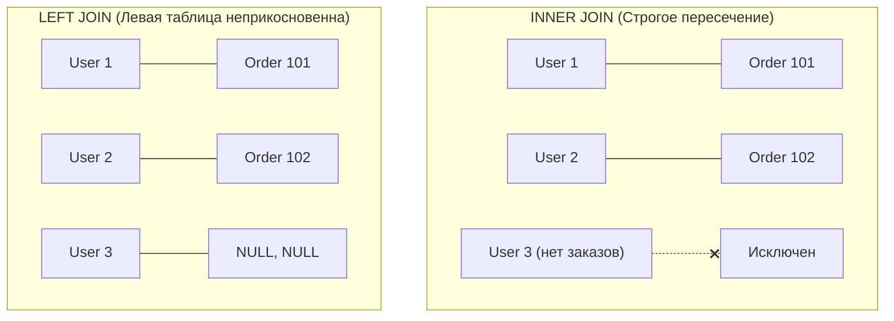
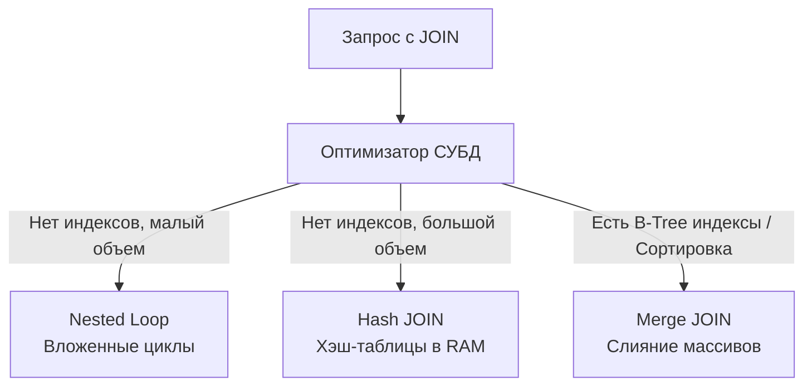
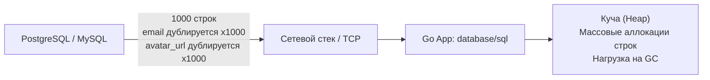

> *«Нормализация данных — это искусство разбирать вещи на части так, чтобы они не могли противоречить друг другу. А операция JOIN — это наука собирать их воедино, не спалив при этом процессор».*

## Декартово проклятие: Почему базы данных нормализуют

В наивной идеальной картине мира разработчик хранил бы все данные системы в одной исполинской плоской таблице. Однако в реальном мире такой подход немедленно приводит к катастрофической избыточности дискового пространства и аномалиям изменения данных: если адрес клиента продублирован в миллионе строк его заказов, опечатка или сбой при обновлении приведут к тому, что база данных станет внутренне противоречивой.

Чтобы гарантировать целостность, реляционная теория Эдгара Кодда предписывает декомпозировать сущности на независимые нормализованные отношения (таблицы `users`, `orders`, `products`). 
Операция **JOIN (Соединение)** — это фундаментальный механизм реляционной алгебры, который динамически собирает нормализованные данные обратно воедино в момент выполнения запроса.

> [!info] Под капотом: Декартово произведение (Cartesian Product)
> Математически любая операция соединения отношений берет свое начало в **CROSS JOIN (Декартовом произведении)**. 
> Если в таблице $A$ содержится 1 000 строк, а в таблице $B$ — 2 000 строк, то их Декартово произведение $A \times B$ представляет собой виртуальную матрицу размером в $1000 \times 2000 = 2\,000\,000$ кортежей, где абсолютно каждая строка $A$ скомбинирована с каждой строкой $B$.
> 
> Предикат соединения `ON` — это логический фильтр, отсекающий из этого двухмиллионного гиганта только те строки, где ключи совпали (`u.id = o.user_id`). Современные стоимостные оптимизаторы СУБД достаточно изощрены, чтобы никогда не материализовать полное декартово произведение в оперативной памяти, однако осознание этой комбинаторной природы жизненно важно: плохой или пропущенный `ON` способен мгновенно парализовать любой сервер баз данных.

---

## Анатомия соединений: INNER, LEFT и RIGHT

В популярных учебниках операции JOIN часто визуализируют с помощью диаграмм Эйлера-Венна (пересекающихся кругов). Для бэкенд-инженера это **крайне вредная и вводящая в заблуждение аналогия**. Круги Венна описывают операции над плоскими множествами (`UNION`, `INTERSECT`), но совершенно не отражают природу умножения кортежей. Опираясь на круги, невозможно понять, почему при соединении таблицы с 10 пользователями и таблицы с 50 заказами на выходе получается 50 строк, а не 10.



### 1. INNER JOIN (Внутреннее соединение)

`INNER JOIN` оставляет в результирующем потоке только те пары кортежей, для которых предикат соединения в условии `ON` вычислился в строгое `TRUE`.
Если у пользователя нет ни одного заказа, он будет полностью исключен из итоговой выборки:

```sql
SELECT u.id, u.email, o.amount
FROM users u
INNER JOIN orders o ON u.id = o.user_id;
```

### 2. LEFT JOIN (Левое внешнее соединение)

`LEFT JOIN` (или `LEFT OUTER JOIN`) гарантирует, что **каждая строка из «левой» таблицы** (указанной первой в секции `FROM`) обязательно попадет в результирующий набор. 
Если для конкретной левой строки в правой таблице не нашлось ни одного соответствия по условию `ON`, СУБД все равно вернет левую строку, заполнив все колонки правой таблицы значениями `NULL`:

```sql
SELECT u.id, u.email, o.amount
FROM users u
LEFT JOIN orders o ON u.id = o.user_id;
```

> [!tip] Собеседование: RIGHT JOIN
> **Вопрос:** В чем заключается глубинная архитектурная разница между `LEFT JOIN` и `RIGHT JOIN`, и в каких случаях в продакшене предпочтительнее использовать второй?
> 
> **Ответ:** 
> Физически и алгоритмически разницы нет никакой. Конструкция `A RIGHT JOIN B` математически эквивалентна `B LEFT JOIN A`. Оптимизатор СУБД формирует для них абсолютно идентичные внутренние планы выполнения.
> 
> Однако в промышленном коде (Idiomatic SQL) использование `RIGHT JOIN` считается грубым нарушением стиля и дурным тоном. Человеческий мозг и западная письменность структурируют информацию слева направо: мы определяем базовую сущность в `FROM` (например, `users`), а затем последовательно обогащаем ее зависимыми сущностями через `LEFT JOIN`. Появление `RIGHT JOIN` переворачивает логический поток вспять и провоцирует глупые ошибки при код-ревью. Инженерное правило: **используйте только `LEFT JOIN`**.

---

## Mechanical Sympathy: Алгоритмы выполнения JOIN

Декларативный SQL не сообщает СУБД, *каким именно алгоритмом* процессор должен сопоставить миллионы строк. Выбор физической стратегии возложен на стоимостной оптимизатор (CBO).



Разберем три фундаментальных алгоритма соединения (глубокий разбор профилирования и настройки оптимизатора мы продолжим в статье [[14. Оптимизация JOIN]]):

### 1. Nested Loop (Вложенные циклы)

Самый прямолинейный алгоритм. Процессор берет первую строку из внешней (левой) таблицы и последовательно перебирает всю внутреннюю (правую) таблицу в поисках совпадений. Затем берет вторую строку и повторяет сканирование.
- **Алгоритмическая сложность:** `O(N * M)`.
- Если обе таблицы велики и не имеют индексов, такой алгоритм мгновенно сжигает все ядра CPU сервера базы данных.
- **Index Nested Loop:** Критическое ускорение! Если по внешнему ключу правой таблицы (`o.user_id`) создан B-Tree индекс, процессор для каждой строки левой таблицы выполняет не полный перебор, а логарифмический спуск по дереву индекса. Сложность снижается до `O(N * log M)`. Это самый быстрый метод соединения небольших наборов строк в OLTP-системах.

### 2. Hash Join (Хеширование)

Если необходимо соединить два крупных набора данных, для которых нет подходящих индексов, вложенные циклы неприменимы. На помощь приходит двухфазный **Hash Join**:
1. **Фаза построения (Build Phase):** СУБД выбирает меньшую из двух таблиц и строит в оперативной памяти (в пределах лимита `work_mem`) компактную хэш-таблицу, где ключом выступает колонка соединения (`user_id`).
2. **Фаза зондирования (Probe Phase):** СУБД последовательно сканирует вторую (большую) таблицу потоком, за время `O(1)` вычисляя хэш ключа и проверяя наличие совпадений в оперативной хэш-таблице.
- **Алгоритмическая сложность:** `O(N + M)`.
- **Mechanical Sympathy:** Алгоритм экономит процессорные такты, но требует существенного объема RAM. Если хэш-таблица не помещается в `work_mem`, СУБД сбрасывает сегменты на диск (Batching / Hybrid Hash Join), что резко снижает скорость.

### 3. Merge Join (Слияние)

Если оба набора данных **уже отсортированы** по ключу соединения (например, считываются напрямую из B-Tree индексов или предварительно отсортированы):
- Процессор устанавливает два указателя на начало каждого списка и продвигает их параллельно, сопоставляя одинаковые ключи (наподобие работы застежки-молнии).
- **Алгоритмическая сложность:** `O(N + M)`.
- **Mechanical Sympathy:** Требует минимального объема памяти, не создает промежуточных хэш-таблиц и великолепно утилизирует последовательный доступ к кэш-линиям CPU. Идеален для массивных аналитических выборок.

---

## Фатальные ловушки разработчиков (Gotchas)

### Ловушка 1: Непреднамеренный INNER JOIN

Самая распространенная ошибка при проектировании SQL-запросов, регулярно приводящая к багам в проде. Разработчик хочет получить список всех зарегистрированных пользователей, прикрепив к ним активные заказы.

**❌ Ошибка: Фильтрация правой таблицы в предложении WHERE**

```sql
SELECT u.email, o.amount 
FROM users u
LEFT JOIN orders o ON u.id = o.user_id
WHERE o.status = 'active'; 
```

*Что происходит под капотом:*
1. Фаза `LEFT JOIN` честно присоединяет заказы. Для пользователей без заказов генерируется виртуальный кортеж, где поле `o.status` равно `NULL`.
2. Затем управление передается фазе `WHERE`. Для пользователей без заказов вычисляется выражение `NULL = 'active'`.
3. По законам трехзначной логики SQL (см. [[12. Работа с NULL в SQL]]) результат равен `UNKNOWN`.
4. Предложение `WHERE` безжалостно отбрасывает все строки с результатом `UNKNOWN`. 
5. **Итог:** Ваш `LEFT JOIN` незаметно и гарантированно превратился в `INNER JOIN`! Все пользователи без заказов исчезли из ответа.

**✅ Корректное решение: Перенос предиката в блок ON**

```sql
SELECT u.email, o.amount 
FROM users u
LEFT JOIN orders o ON u.id = o.user_id AND o.status = 'active';
```

Условие в секции `ON` оценивается непосредственно в момент соединения: фильтруются только строки правой таблицы. Если у пользователя нет активных заказов, он останется в результирующей выборке с полями `NULL`.

---

### Ловушка 2: Дублирование данных (Data Bloat) и Сеть

Рассмотрим типичный запрос связи «Один ко многим» ($1:M$), где у одного активного покупателя есть 1 000 совершенных заказов:

```sql
SELECT u.id, u.email, u.avatar_url, o.id, o.amount
FROM users u
INNER JOIN orders o ON u.id = o.user_id;
```

СУБД возвращает строго плоскую двумерную таблицу. Это фундаментальное ограничение реляционного протокола.
В результате текстовые поля родителя (`email`, тяжелый бинарный или строковый `avatar_url`) будут **продублированы по сети ровно 1 000 раз** — для каждого отдельного заказа.



Вы на ровном месте забиваете пропускную способность сетевого адаптера и вынуждаете сборщик мусора Go (`GC`) аллоцировать и десериализовать тысячи идентичных дубликатов строк в куче.
В высоконагруженных системах для связей $1:M$ часто выгоднее выполнить два изолированных параллельных запроса (один для пользователей, а второй для заказов через оператор `IN (...)` со списком ID):
1. `SELECT id, email, avatar_url FROM users WHERE id IN (...);`
2. `SELECT user_id, id, amount FROM orders WHERE user_id IN (...);`
чем гонять мегабайты дублирующегося сетевого трафика через плоский `JOIN`.

---

## JOIN в контексте Go

Стандартный пакет `database/sql` спроектирован в духе минимализма Unix: он оперирует плоским курсором `*sql.Rows` и ничего не знает о вложенных структурах. Маппинг плоского соединения в древовидные сущности ложится на плечи бэкенд-инженера.

```go
package repository

import (
	"context"
	"database/sql"
	"fmt"
)

type Order struct {
	ID     int64
	Amount float64
}

type User struct {
	ID     int64
	Email  string
	Orders []Order
}

func GetUsersWithOrders(ctx context.Context, db *sql.DB) ([]*User, error) {
	const query = `
		SELECT u.id, u.email, o.id, o.amount
		FROM users u
		LEFT JOIN orders o ON u.id = o.user_id
		ORDER BY u.id
	`

	rows, err := db.QueryContext(ctx, query)
	if err != nil {
		return nil, fmt.Errorf("query join: %w", err)
	}
	defer rows.Close()

	// Хэш-таблица для дедупликации родителей и сбора заказов
	usersMap := make(map[int64]*User)
	var orderedUsers []*User

	for rows.Next() {
		var (
			uID     int64
			uEmail  string
			oID     sql.NullInt64   // Заказа может не быть из-за LEFT JOIN
			oAmount sql.NullFloat64 // Поле может быть NULL
		)

		if err := rows.Scan(&uID, &uEmail, &oID, &oAmount); err != nil {
			return nil, fmt.Errorf("scan join row: %w", err)
		}

		user, exists := usersMap[uID]
		if !exists {
			user = &User{
				ID:     uID,
				Email:  uEmail,
				Orders: make([]Order, 0),
			}
			usersMap[uID] = user
			orderedUsers = append(orderedUsers, user)
		}

		// Если заказ физически существует (не NULL)
		if oID.Valid {
			user.Orders = append(user.Orders, Order{
				ID:     oID.Int64,
				Amount: oAmount.Float64,
			})
		}
	}

	if err := rows.Err(); err != nil {
		return nil, fmt.Errorf("rows iteration: %w", err)
	}

	return orderedUsers, nil
}
```

> [!info] Под капотом: ORM и N+1
> Большинство ORM (включая GORM в мире Go или Hibernate в Java) стремятся избавить разработчика от написания ручного маппинга. Однако при небрежной настройке механизма подгрузки связей (*Lazy Loading* вместо *Eager Loading*) ORM совершает фатальную архитектурную ошибку: делает один запрос на получение $N$ пользователей, а затем в цикле запускает $N$ отдельных сетевых запросов к БД за заказами каждого из них. 
> Это классическая [[13. N+1 проблема]], способная обрушить задержки сервиса с 5 миллисекунд до десятков секунд.

---

## Итог

1. **JOIN** — инструмент восстановления связей нормализованных данных, фундаментально восходящий к Декартову произведению.
2. Используйте `INNER JOIN` для строгого пересечения множеств и `LEFT JOIN` для гарантированного сохранения ведущей сущности. `RIGHT JOIN` исключите из своего лексикона.
3. Физические алгоритмы соединения — **Nested Loop**, **Hash Join** и **Merge Join**. Наличие индекса по внешнему ключу (`Foreign Key`) — абсолютная аксиома для производительного `Index Nested Loop`.
4. Предикаты фильтрации правой таблицы при `LEFT JOIN` обязаны находиться в блоке `ON`, иначе запрос вырождается в `INNER JOIN`.
5. Помните о цене денормализации сетевого трафика при плоском соединении $1:M$.
6. В Go используйте `sql.Null*` типы для полей nullable-таблиц и защищайте сервисы от скрытой проблемы N+1 при использовании ORM.

Зачастую бэкенду вовсе не требуется передавать миллионы строк связанных таблиц по сети. Бизнес-логику интересует сводный итог: суммарный оборот, средний чек или количество транзакций. О том, как делегировать вычисления ядру СУБД с минимальным расходом ресурсов, мы поговорим в следующей статье: [[7. GROUP BY и агрегатные функции]].