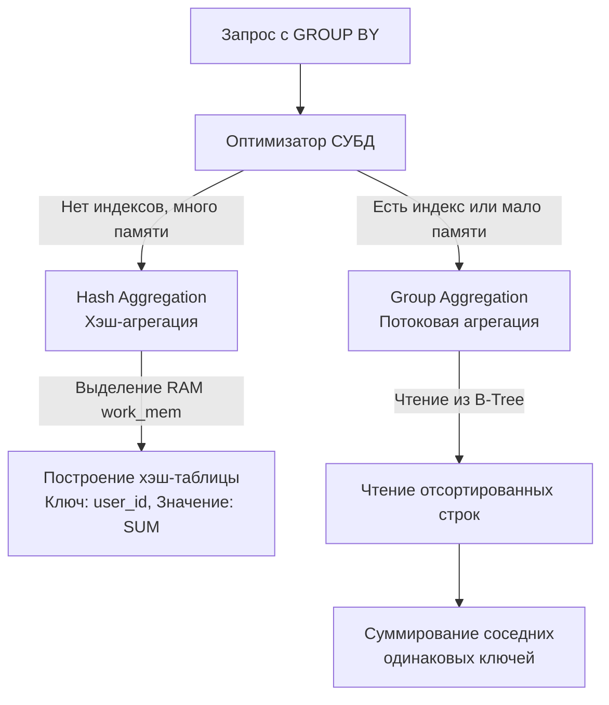

> *«Высшая добродетель вычислений — это редукция данных. Гонять десять миллионов записей по сетевой шине лишь для того, чтобы сложить их в пользовательском пространстве — это не инженерия; это неуважение к машине».*

## Редукция данных: Почему мы не считаем суммы в цикле

В предыдущих главах мы исследовали методы извлечения и фильтрации сырых кортежей. Однако в реальной жизни бизнесу и доменному слою приложения редко требуется бесконечный поток необработанных записей журнала. Руководителям и аналитическим сервисам нужны агрегированные метрики: совокупный дневной оборот, количество активных сессий в час, средний чек или пиковое время отклика.

Начинающие разработчики нередко поддаются соблазну «императивного комфорта»: выполнить простой запрос `SELECT amount FROM orders WHERE status = 'paid'`, вычитать миллион чисел с плавающей точкой по сети в слайс `[]float64` в памяти Go-сервиса и затем сложить их циклом `for`.

**Mechanical Sympathy:** С точки зрения системной инженерии — это грубейшая архитектурная ошибка:
1. **Сетевой оверхед (Network I/O):** Вместо передачи компактного 8-байтового скаляра (`int64` или `float64`) приложение гоняет по TCP-стеку сотни мегабайт десериализуемых данных, перегружая системные буферы сокетов ядра Linux.
2. **Память и сборщик мусора (RAM & GC):** Рантайм Go вынужден аллоцировать гигантский непрерывный массив в куче (Heap). Как только цикл завершится, миллионы байтов превратятся в мусор, спровоцировав тяжелую фазу разметки (*Mark Phase*) сборщика мусора и вызывая ощутимые пики латентности (*Stop-The-World* задержки).

Реляционные базы данных математически спроектированы для редукции (свертки множеств). Операции агрегации обязаны выполняться в непосредственной близости к дисковым блокам и кэшу страниц — на процессоре сервера СУБД.

---

## Базовые агрегатные функции

Стандарт ANSI SQL предоставляет классический набор функций редукции кортежей:
- `COUNT()` — вычисление кардинальности (количества) строк.
- `SUM()` — вычисление арифметической суммы значений.
- `AVG()` — вычисление среднего арифметического значения.
- `MIN()` / `MAX()` — поиск экстремумов (наименьшего и наибольшего элементов).

> [!warning] Ловушка / Gotcha: COUNT(*) vs COUNT(column)
> На технических собеседованиях уровня Middle+ один из классических вопросов звучит так: *«В чем заключается физическая разница между `COUNT(*)`, `COUNT(1)` и `COUNT(email)`?»*
> 
> - **`COUNT(*)` (или эквивалентный ему `COUNT(1)`):** Подсчитывает **общее количество физических строк** в результирующей выборке или группе, удовлетворяющих предикату `WHERE`. Оптимизатор СУБД даже не инспектирует значения отдельных колонок: проверяется только видимость версии строки в рамках снимка транзакции MVCC.
> - **`COUNT(email)`:** Вычисляет количество строк, в которых значение атрибута `email` **строго НЕ РАВНО `NULL`**. База данных вынуждена для каждой строки извлекать значение поля и проверять бит в битовой карте NULL-значений кортежа (*null bitmap*).
> 
> Если цель — узнать число зарегистрированных пользователей, всегда пишите `COUNT(*)`. Использование конструкций вроде `COUNT(id)` (даже если `id` — Primary Key) заставляет некоторые СУБД выполнять избыточные семантические проверки на `NULL`, тратя лишние такты процессора.

---

## Механика GROUP BY

Агрегатные функции без дополнительных условий сворачивают всю таблицу в единственный итоговый кортеж. Если же бизнесу требуется срез метрик по категориям (например, *«сумма покупок в разрезе каждого отдельного клиента»*), в игру вступает оператор `GROUP BY`.

```sql
SELECT 
    user_id, 
    COUNT(*) AS orders_count,
    SUM(amount) AS total_spent
FROM orders
WHERE status = 'paid'
GROUP BY user_id;
```

### Железное правило SQL

Любая колонка, указанная в блоке проекции `SELECT`, **обязана либо находиться внутри агрегатной функции (`SUM`, `MAX`, `AVG`), либо быть явно перечислена в секции `GROUP BY`**.

Если вы попытаетесь добавить в приведенный выше запрос поле `created_at` без агрегации:
```sql
-- ❌ ОШИБКА: column "orders.created_at" must appear in the GROUP BY clause or be used in an aggregate function
SELECT user_id, created_at, SUM(amount) FROM orders GROUP BY user_id;
```
СУБД выдаст ошибку компиляции запроса. Причина фундаментальна: для одного `user_id` может существовать 50 различных заказов с 50 разными временными метками `created_at`. База данных не имеет права гадать, какую из этих 50 дат вы хотите получить.

*(Историческая справка: устаревшие версии MySQL до версии 5.7 по умолчанию позволяли нарушать это правило, возвращая случайное первое попавшееся значение из физического блока. Это порождало трудноуловимые баги в финансовых системах. В современных версиях это поведение жестко заблокировано системным флагом `ONLY_FULL_GROUP_BY`).*

---

## Под капотом: Алгоритмы агрегации (HashAgg vs SortAgg)

Когда стоимостной оптимизатор запросов (см. [[11. Cost based optimizer]]) обрабатывает выражение `GROUP BY`, он должен выбрать один из двух кардинально различных физических алгоритмов агрегации. Понимание их работы незаменимо при анализе планов запросов через [[10. План выполнения запроса. EXPLAIN]].



### 1. Hash Aggregation (Хэш-агрегация / HashAgg)

СУБД последовательно сканирует входной поток строк и строит в оперативной памяти хэш-таблицу. 
- **Ключ хэш-таблицы:** значение колонок группировки (например, `user_id`).
- **Значение слота:** внутреннее состояние агрегатора (текущая накопленная сумма, счетчик элементов, минимальное значение).

При поступлении новой строки ядро СУБД вычисляет хэш от `user_id`, находит нужный слот за `O(1)` и обновляет аккумулятор.
* **Преимущества:** Временная сложность `O(N)`. Великолепная производительность на несортированных массивах данных.
* **Недостатки и Mechanical Sympathy:** Требует существенного объема RAM. Если мощность множества уникальных групп (**Cardinality**) исчисляется миллионами, и хэш-таблица превышает выделенный лимит `work_mem`, СУБД вынуждена разбивать хэш-таблицу на батчи и сбрасывать их во временные файлы на диск (**Spill to Disk**), что приводит к драматической деградации скорости.

### 2. Stream / Group Aggregation (Потоковая агрегация / SortAgg)

Если входной поток данных **уже отсортирован** по колонкам группировки (например, строки считываются напрямую через B-Tree индекс или прошли через узел предварительной сортировки `Sort`):
- СУБД последовательно читает кортежи. Пока идет один и тот же ключ `user_id`, аккумулятор накапливает сумму `amount`.
- Как только в потоке появляется новый `user_id`, база мгновенно «сбрасывает» накопленный агрегат в результирующий поток и обнуляет аккумулятор для следующей группы.
* **Преимущества:** Алгоритм требует строго константного объема оперативной памяти `O(1)`! Нет необходимости хранить все группы в RAM одновременно.
* **Недостатки:** Если данные не отсортированы и нет подходящего B-Tree индекса, предварительная сортировка массива займет `O(N log N)` времени процессора.

---

## Go Idioms: Опасность пустого SUM()

При интеграции агрегатных запросов в Go-сервисы разработчики регулярно сталкиваются с коварным поведением реляционной модели и трехзначной логики `NULL`.

Рассмотрим типичный репозиторий подсчета баланса пользователя:

```go
func GetTotalSpent(ctx context.Context, db *sql.DB, userID int64) (float64, error) {
    const query = `SELECT SUM(amount) FROM orders WHERE user_id = $1 AND status = 'paid'`

    var total float64
    err := db.QueryRowContext(ctx, query, userID).Scan(&total)
    // ... обработка ошибок
}
```

> [!warning] Ловушка / Gotcha: SUM() над пустым множеством
> Представьте нового пользователя, у которого в базе пока **нет ни одного оплаченного заказа**. Условие `WHERE` отфильтрует 100% записей. 
> Что возвратит агрегатная функция `SUM()` по абсолютно пустому множеству кортежей?
> 
> Интуиция подсказывает, что сумма должна быть равна `0`. **Но в стандарте SQL результат `SUM()` над пустым множеством равен `NULL`!**
> 
> В результате метод Go `Scan(&total)` (где переменная `total` объявлена как примитивный тип `float64`) завершится панической ошибкой:
> `sql: Scan error on column index 0, name "sum": converting NULL to float64 is unsupported`

### ✅ Инженерные решения проблемы пустого множества

Существует два идиоматичных способа нейтрализации этой ловушки:

**1. Архитектурно верный путь: Использование COALESCE на стороне СУБД (Рекомендуется)**
Мы делегируем подстановку дефолтного значения ядру базы данных с помощью функции `COALESCE`:
```sql
SELECT COALESCE(SUM(amount), 0) FROM orders WHERE user_id = $1 AND status = 'paid';
```
Если `SUM()` вычислится в `NULL`, функция `COALESCE` вернет второй аргумент — `0`. В Go такой результат безопасно и чисто сканируется в обычный примитив `float64`.

**2. Решение на стороне Go через Nullable-типы:**
Если изменить SQL-запрос невозможно, используйте специализированную структуру `sql.NullFloat64` из пакета `database/sql`:

```go
var total sql.NullFloat64
err := db.QueryRowContext(ctx, query, userID).Scan(&total)
if err != nil {
    return 0, fmt.Errorf("scan total spent: %w", err)
}

if total.Valid {
    return total.Float64, nil
}
return 0, nil // Если в базе NULL, возвращаем доменный ноль
```

Все тонкости и подводные камни неопределенных состояний мы подробно разберем в статье [[12. Работа с NULL в SQL]].

---

## Итог

1. **Агрегация данных** — важнейший инструмент разгрузки сети и экономии оперативной памяти Go-сервиса. Выполняйте агрегацию как можно ближе к носителю данных.
2. `COUNT(*)` производит физический подсчет строк с учетом MVCC, в то время как `COUNT(col)` производит проверку на `NOT NULL`, расходуя дополнительные такты.
3. Любое поле в выборке `SELECT` при наличии `GROUP BY` обязано быть либо частью ключа группировки, либо аргументом агрегатной функции.
4. Знание разницы между **HashAgg** и **GroupAgg / SortAgg** позволяет правильно выбирать индексы: B-Tree индекс обеспечивает константное потребление памяти `O(1)` при потоковой агрегации.
5. Агрегатные функции `SUM()` и `AVG()` над пустым множеством строк возвращают `NULL`. Защищайте свой код с помощью `COALESCE(SUM(...), 0)` или типа `sql.NullFloat64` в Go.

Агрегация сворачивает исходные кортежи в группы. Но что делать, если бизнес-логика требует отфильтровать уже сформированные агрегированные группы? (Например, отобрать только клиентов, у которых `SUM(amount) > 1000`). Предикат `WHERE` здесь не поможет, так как он выполняется *до* вычисления агрегатов. Для этого в SQL существует специальный механизм, который мы препарируем в следующей статье: [[8. HAVING]].