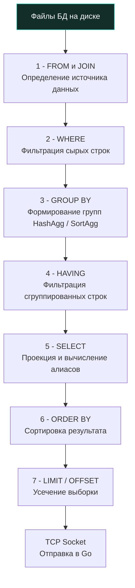

> *«В вычислениях порядок решает всё. Нельзя отфильтровать то, что еще не было вычислено, точно так же, как нельзя собрать урожай, не засеяв поле. Понимание того, когда выполняется каждая фаза — отличительный признак истинного системного инженера».*

## Парадокс фильтрации: Как отсеять то, чего еще нет

В предыдущей главе [[7. GROUP BY и агрегатные функции]] мы исследовали математику свертки тысяч строк в компактные агрегированные показатели. Однако в инженерной практике бизнес-требования часто формулируются с обратным условием: *"Выгрузить только тех клиентов, у которых суммарный объем оплаченных покупок превысил 100 000 рублей"*.

Естественный импульс инженера, привыкшего к фильтрации через предикаты из главы [[3. WHERE и фильтрация]] — подставить агрегат прямо в условие отбора:

```sql
-- ❌ ОШИБКА: СУБД вернет синтаксическую ошибку
SELECT user_id, SUM(amount)
FROM orders
WHERE SUM(amount) > 100000
GROUP BY user_id;
```

Компилятор любой реляционной СУБД (будь то PostgreSQL, MySQL или SQLite) немедленно прервет транзакцию с сообщением: `ERROR: aggregate functions are not allowed in WHERE`.

Этот парадокс обнажает фундаментальную основу реляционного конвейера: **Порядок выполнения (Order of Execution)**. СУБД физически не способна отфильтровать кортежи по предикату `SUM(amount)` на этапе `WHERE`, поскольку в этот момент времени агрегат еще математически не существует! Операция `WHERE` выполняется над сырыми дисковыми строками задолго до того, как база приступит к группировке и суммированию.

Для разрешения этого архитектурного противоречия стандарт SQL вводит специализированный оператор **`HAVING`** — предикат, применяемый строго к уже сформированным и сгруппированным кортежам:

```sql
-- ✅ ВЕРНО: Каноническое использование HAVING
SELECT user_id, SUM(amount) AS total_spent
FROM orders
WHERE status = 'paid'
GROUP BY user_id
HAVING SUM(amount) > 100000;
```

---

## Жизненный цикл запроса: Конвейер СУБД

Чтобы писать высокопроизводительный бэкенд и безошибочно читать вывод планов выполнения, инженер обязан четко разграничивать **лексический порядок** написания запроса (как мы его пишем в коде) и **логический порядок выполнения** (в каком порядке ядро СУБД обрабатывает операторы).

На технических интервью для позиций Middle+ и Senior вопрос о фазах конвейера SQL входит в число обязательных.



Разберем эту строгую последовательность шагов:
1. **`FROM` и `JOIN`:** Определение отношений, декартово умножение и соединение таблиц по условиям `ON`.
2. **`WHERE`:** Первичная селекция — отсечение сырых кортежей до любых группировок (с использованием B-Tree индексов).
3. **`GROUP BY`:** Разделение оставшихся строк на корзины эквивалентности (алгоритмами `HashAgg` или `SortAgg`).
4. **`HAVING`:** Вторичная фильтрация — отбрасывание целых групп по вычисленным агрегатным критериям.
5. **`SELECT`:** Формирование проекции, вычисление скалярных выражений и связывание имен псевдонимов (алиасов).
6. **`ORDER BY`:** Упорядочивание результирующего потока (может опираться на алиасы из `SELECT`, так как выполняется позже).
7. **`LIMIT` / `OFFSET`:** Физическое усечение количества возвращаемых строк.

### Почему нельзя использовать алиасы в HAVING?

> [!warning] Ловушка / Gotcha: Алиасы
> В приведенном запросе мы назначили вычисляемому полю понятный алиас: `SUM(amount) AS total_spent`. Возникает непреодолимое желание написать:
> ```sql
> HAVING total_spent > 100000
> ```
> В строгом стандарте ANSI SQL и в СУБД PostgreSQL в классическом режиме это **категорически запрещено**: база вернет ошибку `column "total_spent" does not exist`.
> 
> *Физическая причина:* Взгляните на конвейер выше. Фаза `HAVING` (шаг 4) отрабатывает **до** фазы `SELECT` (шаг 5), где имя `total_spent` физически регистрируется в таблице символов. На этапе `HAVING` движок базы данных просто не знает о существовании такого идентификатора.
> 
> *Исключение:* Некоторые диалекты (например, MySQL) ради снижения порога входа нарушают канонический стандарт, выполняя предварительную перезапись абстрактного синтаксического дерева (AST Rewrite) и подставляя формулу вместо алиаса. Однако в переносимом промышленном коде всегда следует дублировать агрегатную функцию в `HAVING`: `HAVING SUM(amount) > 100000`.

---

## Mechanical Sympathy: WHERE vs HAVING

Различие между `WHERE` и `HAVING` — это не академический спор о синтаксисе, а вопрос выживания аппаратных ресурсов (CPU и памяти `work_mem`) вашего сервера базы данных.

Рассмотрим практическую задачу: *"Получить идентификаторы категорий товаров, в которых насчитывается более 10 активных позиций"*.

**❌ Антипаттерн: Фильтрация через поздний HAVING**

```sql
SELECT category_id, COUNT(*) 
FROM products 
GROUP BY category_id 
HAVING status = 'active' AND COUNT(*) > 10;
```

*Что происходит с аппаратурой:*
1. СУБД вынуждена вычитать с диска в буферный пул **всю таблицу `products` целиком**, включая устаревшие, заблокированные и удаленные товары.
2. Ядро базы аллоцирует массивную хэш-таблицу в оперативной памяти (`work_mem`) под механизм **HashAgg**. Процессор честно подсчитывает количество абсолютно всех товаров по всем категориям.
3. И лишь затем, на шаге `HAVING`, СУБД анализирует предикат `status = 'active'` и выбрасывает 95% проделанной работы на помойку!

**✅ Высокопроизводительный стандарт: Раннее отсечение через WHERE**

```sql
SELECT category_id, COUNT(*) 
FROM products 
WHERE status = 'active' 
GROUP BY category_id 
HAVING COUNT(*) > 10;
```

*Что происходит с аппаратурой:*
1. На этапе `WHERE` СУБД использует B-Tree индекс по полю `status` и мгновенно отсекает весь балласт неактивных строк через быстрый `Index Scan`.
2. В память механизма группировки (`work_mem`) поступает на два порядка меньше кортежей. Хэш-таблица гарантированно удерживается в L3-кэше или быстрой RAM, полностью исключая аварийный сброс временных файлов на диск (**Spill to Disk**).
3. Оператор `HAVING` выполняет только свою непосредственную работу — фильтрует уже свернутые счетчики `COUNT(*) > 10`.

> [!tip] Собеседование
> **Вопрос:** Допустимо ли в стандарте SQL использовать оператор `HAVING` без предшествующего предложения `GROUP BY`?
> 
> **Ответ:** 
> Да, абсолютно допустимо. Если `GROUP BY` опущен, реляционный движок интерпретирует весь результирующий набор (прошедший сквозь `WHERE`) как **одну-единственную глобальную группу**.
> 
> Например:
> ```sql
> SELECT SUM(amount) FROM orders HAVING SUM(amount) > 100;
> ```
> Если общая сумма по всем заказам превышает 100, запрос вернет одну строку со значением суммы. Если сумма меньше или равна 100 — запрос вернет ровно 0 строк (пустой набор). В практической бэкенд-разработке этот трюк применяется редко, однако на собеседованиях он безошибочно демонстрирует глубокое понимание математики агрегации.

---

## Архитектура: Бэкенд на Go и агрегация

Перенос логики пост-фильтрации групп из базы данных в код приложения на Go — распространенная системная ошибка при проектировании микросервисов.

Рассмотрим антипаттерн, при котором разработчик решает «разгрузить базу» и отфильтровать агрегаты вручную в памяти Go:

```go
// ❌ АНТИПАТТЕРН: Эмуляция HAVING в рантайме Go
rows, err := db.QueryContext(ctx, `SELECT user_id, SUM(amount) FROM orders GROUP BY user_id`)
if err != nil {
    return nil, err
}
defer rows.Close()

var premiumUsers []int64
for rows.Next() {
    var userID int64
    var totalAmount float64
    if err := rows.Scan(&userID, &totalAmount); err != nil {
        return nil, err
    }

    // Эмуляция HAVING в памяти приложения
    if totalAmount > 100000 {
        // Слайс вынужден динамически расти через runtime.growslice
        premiumUsers = append(premiumUsers, userID)
    }
}
```

Почему этот подход катастрофичен с позиций **Mechanical Sympathy**?
1. **Network IO:** База данных вынуждена сериализовать в TCP-сокет данные сотен тысяч мелких покупателей с суммой `< 100000`. Пропускная способность сетевого интерфейса тратится впустую.
2. **Go Runtime и рефлексия:** Метод `rows.Scan` пакета `database/sql` вынужден для каждой лишней строки вызывать машинерию `reflect`, валидируя соответствие типов в рантайме и нагревая ядра CPU на стороне Go-сервиса.
3. **Garbage Collector и аллокации:** Срез `premiumUsers` при заполнении многократно вызывает `runtime.growslice`, копируя буферы в куче. Миллионы временных структур после выхода из функции создают колоссальное давление на сборщик мусора Go, провоцируя частые фазы **Mark & Sweep**.

Делегирование фильтрации предложению `HAVING` на стороне СУБД превращает этот кошмар в передачу ровно нескольких десятков байтов: база возвращает готовый список целевых идентификаторов, Go-сервер аллоцирует минимальный буфер, а процессор приложения остается свободным для полезной бизнес-логики. Для подтверждения корректности планов всегда привлекайте инструмент [[10. План выполнения запроса. EXPLAIN]].

---

## Итог

1. **Конвейер выполнения:** `WHERE` работает **до** агрегации (фильтрует сырые строки), а `HAVING` — **после** (фильтрует агрегированные группы).
2. Никогда не помещайте в `HAVING` предикаты, которые можно проверить по сырым колонкам (например, `status = 'active'`). Это перегружает процессор и оперативную память базы данных. Оставляйте `HAVING` исключительно для вычисленных агрегатных метрик (`SUM`, `COUNT`, `AVG`).
3. Попытка эмулировать `HAVING` на стороне Go-приложения — верный путь к деградации сети и перегрузке Garbage Collector-а.
4. Помните про запрет использования алиасов из `SELECT` в блоке `HAVING` согласно стандарту ANSI SQL.
5. `HAVING` без `GROUP BY` синтаксически валиден и трактует всю таблицу как единую неделимую группу.

Мы изучили полный цикл фильтрации, соединений и агрегации в пределах одного составного выражения. Однако в архитектуре систем часто возникает необходимость использовать результат одного вычисления в качестве динамического фильтра для другого. О том, как безопасно и эффективно встраивать одни запросы внутрь других, мы поговорим в следующей статье: [[9. Подзапросы]].