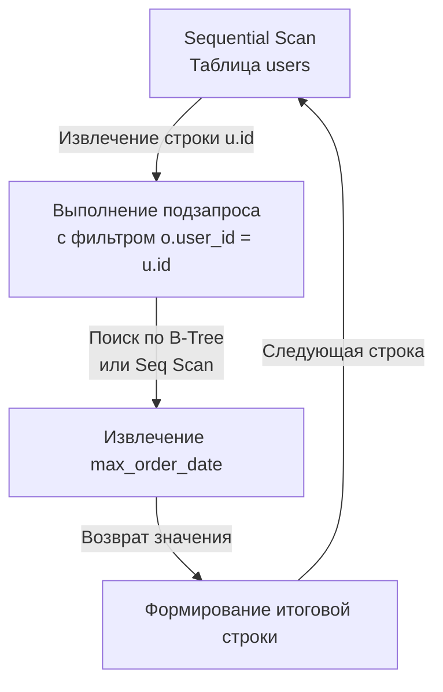

> *"The beauty of Unix pipelines lies in the fact that the output of one program becomes the input of another. In the relational world, this property is called closure: every query produces a relation, and any relation can be queried anew."*

## Композитная природа SQL: Запрос внутри запроса

Реляционная теория Эдгара Кодда зиждется на элегантном математическом свойстве — **замкнутости (closure)**. Это фундаментальное правило гласит: *результатом применения любой реляционной операции к отношению (таблице) всегда является новое отношение (таблица)*.

Именно благодаря свойству замкнутости язык SQL функционирует как идеальный конструктор: мы можем взять результат выполнения одного запроса и встроить его внутрь другого туда, где синтаксис ожидает таблицу, строку или скалярное значение. Такое вложенное выражение называется **подзапросом (Subquery)**.

Для бэкенд-инженера подзапросы — это первоклассный способ делегирования бизнес-логики и трансформации данных непосредственно ядру СУБД. Грамотное использование подзапросов позволяет кардинально сократить объем сетевого трафика (Network IO) и навсегда устранить коварную проблему [[13. N+1 проблема]] в приложениях на Go.

---

## Типология подзапросов

Понимание классификации подзапросов необходимо для того, чтобы предугадывать, как именно оптимизатор СУБД будет трансформировать абстрактное синтаксическое дерево (AST) в физический план исполнения.

### 1. Скалярные подзапросы (Scalar Subqueries)

Скалярным называется подзапрос, который возвращает строго **одну строку и одну колонку** (ровно одно скалярное значение). С точки зрения системы типов СУБД обращается с таким выражением в точности так же, как с литералом — числом, строкой или временной меткой. Их можно размещать в секциях `SELECT`, `WHERE` или `HAVING`.

```sql
-- Пример в WHERE: Найти товары, стоимость которых превышает среднюю по каталогу
SELECT name, price 
FROM products 
WHERE price > (SELECT AVG(price) FROM products);
```

> [!warning] Ловушка / Gotcha: Run-time ошибка скалярного запроса
> Если ваш скалярный подзапрос в силу изменения данных неожиданно вернет более одной строки, СУБД не станет «угадывать» ваше намерение и не возьмет первую попавшуюся запись. 
> Транзакция немедленно оборвется с фатальной runtime-ошибкой ядра: `ERROR: more than one row returned by a subquery used as an expression`.
> Если вы проектируете скалярный запрос и бизнес-правила допускают множественные совпадения, всегда явно защищайте выражение детерминированной сортировкой и директивой `LIMIT 1`.

### 2. Табличные подзапросы в FROM (Derived Tables)

Если подзапрос возвращает двумерный массив (множество строк и столбцов), его можно подставить в секцию `FROM`. В терминологии реляционной теории это называется **производной таблицей (Derived Table)** — временным отношением, материализуемым в памяти на время жизни запроса.

```sql
-- Пример в FROM: Предварительная агрегация перед операцией JOIN
SELECT u.email, stat.total_spent
FROM users u
JOIN (
    SELECT user_id, SUM(amount) AS total_spent 
    FROM orders 
    GROUP BY user_id
) stat ON u.id = stat.user_id;
```

*Синтаксическое требование:* Любой производной таблице в предложении `FROM` **в обязательном порядке должен быть присвоен алиас** (в примере выше — `stat`), иначе парсер СУБД завершит разбор синтаксической ошибкой.

В современной промышленной разработке громоздкие подзапросы во `FROM` принято выносить в более читаемые и композируемые общие табличные выражения — [[1. CTE. WITH выражения]]. Под капотом оптимизатор обрабатывает их по схожим алгоритмам.

---

## Производительность: Некоррелированные vs Коррелированные

Это ключевой концептуальный рубеж при проектировании высоконагруженных систем. Разница между этими типами подзапросов — это разница между запросом, выполняющимся за 2 миллисекунды, и запросом, способным положить сервер базы данных намертво.

### Некоррелированный подзапрос (Uncorrelated)

Подзапрос называется некоррелированным, если он **абсолютно автономен** и не ссылается ни на один атрибут или колонку внешнего (родительского) запроса.

В выражении `WHERE price > (SELECT AVG(price) FROM products)` внутренний `SELECT` ничего не знает о внешнем контексте.

**Mechanical Sympathy:** Оптимизатор СУБД выполняет такой подзапрос **ровно один раз** в самом начале исполнения плана, сохраняет результат в оперативной памяти и затем использует вычисленную константу во всех последующих итерациях фильтрации. Алгоритмическая сложность суммируется: $O(N + M)$.

### Коррелированный подзапрос (Correlated)

Подзапрос называется коррелированным, если он **прямо зависит от текущего кортежа внешней таблицы**, используя ее колонки в своих фильтрах.

```sql
-- Извлечь пользователей и дату их самого дорогого заказа
SELECT 
    u.email,
    (
        SELECT o.created_at 
        FROM orders o 
        WHERE o.user_id = u.id -- КРИТИЧЕСКАЯ СВЯЗЬ: обращение к внешней строке u
        ORDER BY o.amount DESC 
        LIMIT 1
    ) AS max_order_date
FROM users u;
```

**Mechanical Sympathy:** На физическом уровне коррелированный подзапрос ведет себя в точности как вложенный цикл `for` в императивном программировании на Go. Ядро СУБД вынуждено заново запускать исполнение внутреннего подзапроса **для каждой отдельной строки внешнего запроса**!

Если во внешней таблице `users` насчитывается 100 000 записей, СУБД выполнит внутренний `SELECT ... FROM orders` ровно 100 000 раз! Сложность взлетает до `O(N * M)` (или `O(N * log M)` при наличии селективного индекса по внешнему ключу). Это классический алгоритм `Nested Loop` (см. [[6. JOIN. INNER, LEFT, RIGHT]]).



---

## Subquery Flattening: Магия оптимизатора

Может показаться, что коррелированных подзапросов нужно избегать любой ценой. В 1990-х годах это действительно было так. Однако современные оптимизаторы СУБД (PostgreSQL 12+, MySQL 8.0+) оснащены мощным математическим аппаратом преобразования реляционных выражений (см. [[11. Cost based optimizer]]).

Когда оптимизатор встречает подзапросы с предикатами `IN` или `EXISTS`, он запускает эвристику **развертывания подзапросов (Subquery Unnesting / Flattening)**. Оптимизатор на этапе логического планирования трансформирует синтаксическое дерево, переписывая коррелированный вложенный цикл в плоскую операцию соединения (**Hash JOIN** или **Merge JOIN**).

С точки зрения ядра современной СУБД между следующими двумя конструкциями практически нет разницы:

```sql
-- Вариант 1: Подзапрос через IN
SELECT * FROM users WHERE id IN (SELECT user_id FROM orders);

-- Вариант 2: Соединение через JOIN
SELECT DISTINCT u.* FROM users u JOIN orders o ON u.id = o.user_id;
```

В подавляющем большинстве случаев стоимостной оптимизатор построит для них **абсолютно идентичный план выполнения** (Semi-Join / Hash Join), избавив систему от квадратичной сложности.

> [!info] Под капотом: Когда Flattening не работает
> Оптимизатор не всесилен. Он вынужден капитулировать и оставить тяжелый вложенный цикл `Nested Loop`, если внутри коррелированного подзапроса присутствуют:
> - Агрегатные функции с `GROUP BY`;
> - Оконные функции (`OVER (...)`);
> - Специфические комбинации `LIMIT/OFFSET`, которые математически невозможно безопасно слить с родительским отношением.
> 
> В подобных ситуациях оптимизация ложится на плечи инженера: подзапрос переписывают вручную, вынося агрегацию во `FROM` или используя конструкции `LEFT JOIN` с фильтрацией.

---

## Go Idioms: Подзапросы спасают Network IO

Рассмотрим классическую архитектурную ошибку начинающего разработчика на Go. 
Поставлена задача: *заблокировать всех пользователей, которые не совершили ни одной покупки за последний год*.

**❌ Антипаттерн: Перенос логики в Go (Уничтожение сетевого стека):**

```go
// 1. Выкачиваем первичные ключи всех пользователей в память Go
rows, err := db.QueryContext(ctx, "SELECT id FROM users")
// ... сканирование в users []int64

for _, id := range users {
    // 2. Делаем отдельный сетевой вызов для КАЖДОГО пользователя (N+1 запросов!)
    var count int
    _ = db.QueryRowContext(ctx, 
        "SELECT COUNT(*) FROM orders WHERE user_id = $1 AND created_at > ...", id).Scan(&count)

    if count == 0 {
        // 3. Отправляем еще один сетевой запрос на модификацию
        _, _ = db.ExecContext(ctx, "UPDATE users SET status = 'blocked' WHERE id = $1", id)
    }
}
```

Этот фрагмент порождает сотни тысяч сетевых TCP-пакетов, парализует пул соединений к базе данных и заставляет Garbage Collector в Go непрерывно очищать временные структуры.

**✅ Идиоматичный бэкенд: Один атомарный запрос с подзапросом:**

```go
// Отправляем РОВНО ОДИН сетевой запрос. Вся обработка выполняется ядром СУБД 
// рядом со страницами данных без накладных расходов на сеть (Zero Network IO overhead).
const query = `
    UPDATE users 
    SET status = 'blocked'
    WHERE id NOT IN (
        SELECT user_id 
        FROM orders 
        WHERE created_at > NOW() - INTERVAL '1 year'
    )
`
res, err := db.ExecContext(ctx, query)
if err != nil {
    return fmt.Errorf("bulk block users: %w", err)
}

affected, _ := res.RowsAffected()
log.Printf("Successfully blocked %d inactive users", affected)
```

Вся вычислительная нагрузка остается внутри базы данных, запрос выполняется в единой транзакции и гарантирует абсолютную атомарность изменений.

---

## Итог

1. **Подзапросы** опираются на свойство реляционной замкнутости (**closure**), превращая SQL в модульный декларативный язык.
2. **Скалярные подзапросы** возвращают ровно одно значение ($1 \times 1$). Защищайте их от случайных множественных совпадений с помощью `LIMIT 1`.
3. Табличные подзапросы в секции `FROM` (**Derived Tables**) требуют обязательного указания алиаса.
4. Различайте **некоррелированные** подзапросы (вычисляются 1 раз, кэшируются в памяти) и **коррелированные** (вычисляются для каждой строки внешнего отношения, потенциально вызывая `Nested Loop` со сложностью `O(N*M)`).
5. Современные CBO реализуют **Subquery Flattening**, автоматически преобразуя многие подзапросы в эффективные `Hash JOIN`.
6. В Go-разработке один выверенный SQL-запрос с подзапросом на порядки эффективнее, чем циклы `for` с обращениями к БД по сети (защита от задержек сетевого ввода-вывода).

Среди всех вариантов подзапросов чаще всего инженеры используют операторы `IN` и `EXISTS`. Какой из них работает быстрее, как оптимизатор применяет короткое замыкание (*Short-circuit*) и почему `NOT IN` таит смертельную опасность при наличии `NULL`? Ответы ждут нас в следующей статье: [[10. EXISTS и IN]].