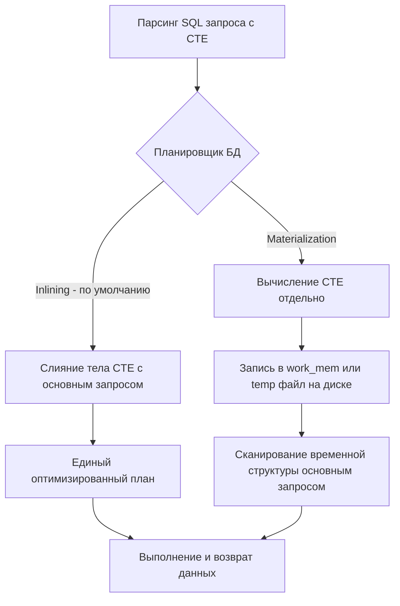

> *«Управление сложностью — вот суть программирования. Когда SQL-запрос начинает походить на византийский лабиринт вложенных подзапросов, приходит время дать имена своим промежуточным мыслям. Именно для этого и служат обобщенные табличные выражения — CTE».*

## Что такое CTE и зачем отказываться от подзапросов?

В процессе эволюции прикладного бэкенда аналитические и отчетные запросы неизбежно усложняются. Без должной дисциплины SQL-код стремительно превращается в трудночитаемую конструкцию из многократно вложенных `SELECT`. 

В императивных языках, таких как Go или C, мы интуитивно декомпозируем сложную функцию: выделяем вспомогательные локальные переменные, объявляем чистые функции и формируем понятный линейный поток исполнения. В классическом SQL до появления стандарта SQL:1999 единственным инструментом структурирования были вложенные подзапросы (**Ad-hoc subqueries**) или создание временных таблиц (**`CREATE TEMP TABLE`**).

**CTE (Common Table Expression)** — это именованный временный набор результатов, определяемый непосредственно перед выполнением основного запроса и существующий исключительно в рамках жизненного цикла единичной инструкции `SELECT`, `INSERT`, `UPDATE` или `DELETE`. В синтаксисе SQL блок CTE декларируется ключевым словом **`WITH`**.

### Эволюция: от подзапросов к CTE

Рассмотрим типичную бизнес-задачу: *«Найти пользователей, чья совокупная сумма покупок строго превышает средний чек среди всех покупателей системы»*.

**Решение через ad-hoc подзапросы (Антипаттерн читаемости):**

```sql
SELECT u.id, u.name, o_total.sum
FROM users u
JOIN (
    SELECT user_id, SUM(amount) as sum
    FROM orders
    GROUP BY user_id
) o_total ON u.id = o_total.user_id
WHERE o_total.sum > (
    SELECT AVG(total_sum) FROM (
        SELECT SUM(amount) as total_sum
        FROM orders
        GROUP BY user_id
    ) avg_query
);
```

Этот запрос мучителен в сопровождении. Человеческий мозг вынужден читать его «изнутри наружу»: сначала найти глубоко вложенный блок `avg_query`, осознать его назначение, затем подняться на уровень выше к фильтру `WHERE`, а затем вернуться к главному блоку `FROM`. Кроме того, подзапрос агрегации заказов физически продублирован дважды.

**Элегантное решение через CTE:**

```sql
WITH user_totals AS (
    SELECT user_id, SUM(amount) as total_sum
    FROM orders
    GROUP BY user_id
),
avg_order AS (
    SELECT AVG(total_sum) as avg_sum
    FROM user_totals
)
SELECT u.id, u.name, ut.total_sum
FROM users u
JOIN user_totals ut ON u.id = ut.user_id
JOIN avg_order ao ON ut.total_sum > ao.avg_sum;
```

Код приобрел безупречную линейную структуру: мы последовательно объявляем именованные абстракции (`user_totals`, затем производный `avg_order`), после чего лаконично объединяем их в финальной проекции.

---

## Под капотом: Как СУБД исполняет CTE

Для системного инженера критически важно понимать физическую разницу между синтаксическим сахаром и механикой выполнения. В отличие от временных таблиц (`CREATE TEMP TABLE`), CTE не регистрируется в системных каталогах СУБД. Это синтаксическая конструкция AST, которую обрабатывает стоимостной оптимизатор запросов.

### Inlining vs Materialization

Существуют две принципиально противоположные стратегии физического исполнения CTE:



1. **Inlining (Подстановка / Слияние):**
   Планировщик СУБД «разворачивает» тело CTE и внедряет его узлы непосредственно в дерево основного запроса (в точности как инлайнинг функций в компиляторе Go). 
   В этом режиме CTE — чистый синтаксический сахар. Оптимизатор свободно проталкивает предикаты (`WHERE`) внутрь CTE (**Predicate Pushdown**), выбирает оптимальный порядок соединений и задействует индексы базовых таблиц.
2. **Materialization (Материализация):**
   СУБД вычисляет результат CTE как изолированную подпрограмму, материализует все кортежи во временную структуру в оперативной памяти (`work_mem`) или сбрасывает на диск, после чего основной запрос последовательно сканирует эту промежуточную область.

> [!info] Под капотом
> В PostgreSQL до версии 12 действовало историческое правило: выражения CTE **всегда являлись оптимизационным забором (Optimization Fence)**. Они безусловно материализовались в памяти. С одной стороны, это позволяло разработчикам гарантировать, что тяжелое выражение вычислится строго один раз. С другой стороны, оптимизатор не мог протолкнуть фильтры `WHERE` сквозь этот забор, что приводило к катастрофическим замедлениям.
> 
> Начиная с PostgreSQL 12, ядро базы по умолчанию **инлайнит** CTE (выполняет слияние с основным запросом). Принудительная материализация включается автоматически только в четырех случаях:
> - CTE объявлено рекурсивным (ключевое слово `RECURSIVE`, подробнее в [[2. Рекурсивные запросы]]);
> - CTE ссылается само на себя или используется во внешнем запросе более одного раза;
> - Внутри CTE содержатся операции модификации данных (`INSERT`, `UPDATE`, `DELETE`) либо вызовы волатильных функций (например, `random()`);
> - Разработчик явно потребовал материализации через директиву `AS MATERIALIZED`.

### Mechanical Sympathy: Материализация и IO

Когда CTE материализуется, а его объем превышает размер оперативной памяти, выделенной процессу параметром `work_mem`, движок СУБД сбрасывает кортежи во временные файлы на диске (`temp_files`).

Посмотрим на этот процесс глазами операционной системы Linux и аппаратного обеспечения:
- **Аллокация памяти:** Ядро базы данных запрашивает память через системные вызовы `mmap` или `brk`.
- **Переполнение буфера:** Превышение `work_mem` инициирует системные вызовы ядра `write()`. Данные оседают в Page Cache Linux, а при дефиците памяти ядро ОС выполняет принудительный сброс на накопитель через `fsync`.
- **Чтение и Cache Misses:** Основной запрос вынужден считывать данные временного файла через системные вызовы `read()`, что разрушает кэш-линии процессора L1/L2 и приводит к задержкам дискового ввода-вывода.
- **Отсутствие индексов:** На временную материализованную структуру CTE **невозможно построить B-Tree индекс**. Любая выборка из материализованного CTE превращается в полный перебор строк (Sequential Scan).

> [!warning] Ловушка / Gotcha
> Разработчики, привыкшие к старым версиям баз данных, иногда вручную добавляют директиву `WITH cte AS MATERIALIZED (...)`, полагая, что спасают сервер от повторных вычислений. 
> 
> Если после этого во внешнем запросе стоит высокоселективный фильтр `WHERE id = 42`, ключевое слово `AS MATERIALIZED` превратит запрос в катастрофу: база сначала материализует 10 000 000 строк во временный файл на диске, а затем полным сканированием найдет строку с `id = 42`. 
> Без `MATERIALIZED` планировщик протолкнул бы предикат внутрь CTE и мгновенно извлек бы одну запись по индексу! Применяйте `AS MATERIALIZED` только тогда, когда вам осознанно необходимо изолировать «тяжелое» вычисление от повторного запуска.

---

## CTE с побочными эффектами (DML в CTE)

Одно из мощнейших практических преимуществ современных реляционных СУБД (в частности, PostgreSQL) — поддержка модифицирующих инструкций (**Writable CTE**) внутри блока `WITH`. Это позволяет объединить вставку, изменение и выборку данных в рамках единого атомарного обращения по сети.

Рассмотрим задачу: перевести пользователя в статус `ACTIVE` и в том же запросе извлечь список его заказов:

```sql
WITH updated_user AS (
    UPDATE users
    SET status = 'ACTIVE', updated_at = NOW()
    WHERE id = 123
    RETURNING id, status, updated_at
)
SELECT u.id, u.status, o.id as order_id
FROM updated_user u
LEFT JOIN orders o ON u.id = o.user_id;
```

**Mechanical Sympathy:** Запрос выполняется строго в рамках единого снимка транзакции MVCC. Мы устраняем лишний сетевой раунд-трип между бэкендом и базой данных, гарантируя абсолютную согласованность состояния.

---

## Работа с CTE в Go

При интеграции сложных CTE в бэкенд на Go разработчики часто сталкиваются с проблемой поддержки раздутых запросов.

### Подход 1: database/sql (Ванильный Go)

При использовании стандартного драйвера `database/sql` позиционные плейсхолдеры (`$1`, `$2`, `$3`) размазываются по всему многострочному запросу. Ошибка в порядке передачи аргументов в `QueryContext` приводит к непредсказуемым багам во время выполнения.

```go
package repository

import (
	"context"
	"database/sql"
	"fmt"
)

// Структуры для маппинга данных
type UserOrderSummary struct {
	UserID     int64
	UserName   string
	TotalSpent float64
}

const complexCteQuery = `
WITH user_totals AS (
    SELECT user_id, SUM(amount) AS total_sum
    FROM orders
    WHERE created_at > $1 -- Первый аргумент
    GROUP BY user_id
),
filtered_users AS (
    SELECT id, name
    FROM users
    WHERE status = $2 -- Второй аргумент
)
SELECT u.id, u.name, ut.total_sum
FROM filtered_users u
JOIN user_totals ut ON u.id = ut.user_id
WHERE ut.total_sum > $3 -- Третий аргумент
`

// GetHighRollers демонстрирует выполнение CTE запроса через database/sql
func GetHighRollers(ctx context.Context, db *sql.DB, since string, status string, minAmount float64) ([]UserOrderSummary, error) {
	rows, err := db.QueryContext(ctx, complexCteQuery, since, status, minAmount)
	if err != nil {
		return nil, fmt.Errorf("failed to execute CTE query: %w", err)
	}
	defer rows.Close()

	var results []UserOrderSummary
	for rows.Next() {
		var u UserOrderSummary
		if err := rows.Scan(&u.UserID, &u.UserName, &u.TotalSpent); err != nil {
			return nil, fmt.Errorf("failed to scan row: %w", err)
		}
		results = append(results, u)
	}
	if err := rows.Err(); err != nil {
		return nil, fmt.Errorf("rows iteration error: %w", err)
	}
	return results, nil
}
```

### Подход 2: Кодогенерация (sqlc)

В современной промышленной разработке на Go написание сложных CTE вручную через `database/sql` считается антипаттерном. Зрелым инженерным решением является кодогенератор **`sqlc`**. Вы описываете SQL с именованными параметрами:

```sql
-- name: GetHighRollers :many
WITH user_totals AS (
    SELECT user_id, SUM(amount) AS total_sum
    FROM orders
    WHERE created_at > @since
    GROUP BY user_id
),
filtered_users AS (
    SELECT id, name
    FROM users
    WHERE status = @status
)
SELECT u.id, u.name, ut.total_sum
FROM filtered_users u
JOIN user_totals ut ON u.id = ut.user_id
WHERE ut.total_sum > @min_amount;
```

Инструмент `sqlc` выполняет статический семантический анализ схемы базы данных и генерирует типобезопасный Go-код со структурами `GetHighRollersRow` и параметрами `GetHighRollersParams`, полностью исключая рефлексию и риск перепутать аргументы местами.

---

## Сравнение с другими подходами

| Характеристика | Вложенные подзапросы (Subqueries) | Временные таблицы (Temp Tables) | CTE (`WITH`) |
| :--- | :--- | :--- | :--- |
| **Читаемость кода** | Низкая (чтение изнутри наружу) | Хорошая (линейная структура) | Превосходная (декларативная линейность) |
| **Изоляция плана** | Отсутствует (оптимизатор видит всё дерево) | Полная (изолированная таблица) | Гибкая (Inlining по умолчанию, либо Materialization) |
| **Переиспользование** | Требует дублирования кода | Доступны в рамках сессии/транзакции | В пределах одного запроса |
| **Индексация** | Используются индексы базовых таблиц | Можно создавать B-Tree индексы на лету | Индексы отсутствуют (материализация требует полного сканирования) |
| **Жизненный цикл** | Время исполнения запроса | Время жизни соединения или сессии | Время исполнения запроса |

> [!tip] Собеседование
> **Вопрос:** В чем заключается глубинное различие между CTE и обычным подзапросом в PostgreSQL 16? Что происходит на физическом уровне, если разработчик указывает `WITH cte AS MATERIALIZED ...`?
> 
> **Ответ:** 
> В современных версиях PostgreSQL (начиная с 12-й) оптимизатор по умолчанию производит **Inlining** однократно используемых CTE, подставляя их в основной план точно так же, как обычные подзапросы. Разницы в производительности между ними нет, но CTE обеспечивает на порядок лучшую читаемость и устраняет дублирование кода при повторном обращении.
> 
> Если разработчик явно указывает директиву `AS MATERIALIZED`, он устанавливает **оптимизационный барьер (Optimization Fence)**. Движок СУБД сначала вычисляет результат подзапроса изолированно, записывает его в память (`work_mem`) или во временный файл на диске, и только затем внешний запрос сканирует эту промежуточную структуру. 
> Поскольку на материализованном результате нет индексов, поиск по нему всегда вырождается в полный перебор (`Seq Scan`). Поэтому `AS MATERIALIZED` применяют точечно: либо для предотвращения многократного повторного расчета тяжелого общего выражения, либо для изоляции волатильных функций.

---

## Итог

1. **CTE (`WITH`)** — стандарт декомпозиции и повышения выразительности сложных реляционных запросов, превращающий запутанные подзапросы в читаемый линейный пайплайн.
2. В современных версиях СУБД простые CTE по умолчанию **инлайнятся** планировщиком, сохраняя возможность проталкивания предикатов `WHERE` и использования индексов.
3. Принудительная **материализация** отсекает оптимизатор барьером и при больших объемах сбрасывает данные на диск (`temp_files`), превращая последующий доступ в неиндексированный `Seq Scan`.
4. CTE поддерживают модификацию данных (**Writable DML CTE**), позволяя объединять `UPDATE/INSERT ... RETURNING` и выборку в единую атомарную операцию.
5. При интеграции с Go используйте инструмент `sqlc` для автоматической кодогенерации типобезопасных структур и устранения путаницы с позиционными плейсхолдерами.

Мы изучили линейные табличные выражения. Однако подлинный триумф конструкции `WITH` наступает при добавлении ключевого слова `RECURSIVE`. В следующей статье мы разберем, как обходить деревья, графы и иерархические структуры данных средствами самого реляционного движка: [[2. Рекурсивные запросы]].
