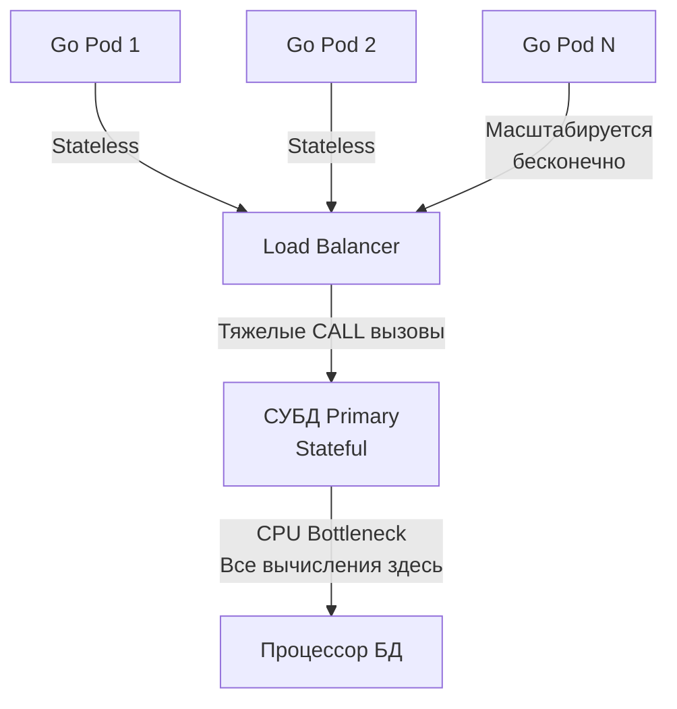

## Парадигма Code-to-Data: Когда логика переезжает в СУБД

В современной архитектуре микросервисов мы почти всегда безоговорочно следуем парадигме **Data-to-Code**: мы извлекаем сырые данные из базы через `SELECT`, транспортируем их по локальной сети (Network IO) в оперативную память сервиса на Go, выполняем бизнес-вычисления на процессоре прикладного пода и при необходимости отправляем изменения обратно через мутирующие запросы `INSERT` или `UPDATE`.

Эта модель прозрачна, великолепно ложится на горизонтальное масштабирование сервисов и прекрасно поддерживается современными средствами мониторинга. Но у нее есть предел: представьте финансовый биллинг или расчет складских остатков, где для принятия решения требуется проанализировать 500 000 транзакционных строк, а итогом вычислений станет обновление ровно пяти балансовых счетов. Перекачка полумиллиона сырых кортежей по TCP-сокетам забьет сетевой стек, заставит сетевые драйверы делать сотни тысяч системных вызовов чтения, а десериализация в структуры Go создаст миллионы временных объектов в куче (Heap), парализуя Garbage Collector длительными паузами.

В подобных критических сценариях на сцену выходит альтернативная парадигма — **Code-to-Data**. Вместо того чтобы гнать гигабайты данных к коду, мы отправляем сам код выполняться непосредственно внутри ядра СУБД. База данных считывает дисковые страницы прямо в свой горячий Buffer Pool, обрабатывает данные в регистрах локального процессора на наносекундных скоростях и возвращает вызывающему приложению лишь компактный готовый результат.

Инструментами реализации парадигмы Code-to-Data служат **Хранимые функции (User-Defined Functions, UDF)** и **Хранимые процедуры (Stored Procedures)**. Поскольку чистый декларативный SQL тьюринг-неполон, для написания логики применяются процедурные языки расширения: PL/pgSQL в PostgreSQL, PL/SQL в Oracle, T-SQL в Microsoft SQL Server.

---

## Хранимые функции (UDF)

Хранимая функция — это детерминированная или недетерминированная подпрограмма, которая принимает входные параметры, производит вычисления и **обязана вернуть конкретное значение** (скалярный тип, пользовательский составной тип, массив или целую реляционную таблицу через `RETURNS TABLE` или `RETURNS SETOF`). 

Поскольку функция гарантированно возвращает значение, ее можно вызывать непосредственно внутри выражений стандартных SQL-запросов: в секциях `SELECT`, `WHERE`, `JOIN` и `HAVING`.

Пример простой функции на языке PL/pgSQL для вычисления персональной скидки:

```sql
CREATE OR REPLACE FUNCTION calculate_discount(price NUMERIC, user_tier TEXT)
RETURNS NUMERIC AS $$
DECLARE
    discount NUMERIC := 0;
BEGIN
    IF user_tier = 'VIP' THEN
        discount := 0.20;
    ELSIF user_tier = 'PREMIUM' THEN
        discount := 0.10;
    END IF;
    
    RETURN price - (price * discount);
END;
$$ LANGUAGE plpgsql;
```

Вызов функции из прикладного кода на Go происходит так же, как и обращение к любому штатному математическому выражению:

```sql
SELECT id, calculate_discount(amount, tier) AS final_price 
FROM orders;
```

### Mechanical Sympathy: Категории изменчивости (Volatility)

Один из самых фундаментальных и недооцененных механизмов оптимизатора PostgreSQL — это категоризация функций по степени изменчивости (**Volatility**). Если разработчик при создании функции не указал категорию явно, СУБД по умолчанию выставляет самый консервативный и неэффективный режим — `VOLATILE`.

Стандарт PostgreSQL разделяет три категории чистоты функций:

1. **VOLATILE (Изменчивая):** Функция может вернуть разные результаты при абсолютно идентичных входных аргументах (классические примеры — системные функции `random()`, `clock_timestamp()` или `now()`), либо производит побочные эффекты (выполняет `UPDATE` или пишет во внешние таблицы). Оптимизатор **не имеет права** кэшировать результат или выносить вызов за пределы цикла: в запросе `SELECT func() FROM table` функция будет физически вызываться для каждой строки.
2. **STABLE (Стабильная):** Функция гарантирует, что внутри **одного снимка транзакции** при одинаковых входных данных результат будет строго идентичным (хотя между разными транзакциями значение может изменяться). Оптимизатор получает право вычислить значение функции один раз для сканирования и повторно использовать результат для одинаковых аргументов.
3. **IMMUTABLE (Неизменяемая / Чистая):** Абсолютно чистая математическая функция без побочных эффектов. При одних и тех же аргументах она возвращает строго один и тот же результат в любой момент времени (`2 + 2 = 4`). Оптимизатор умеет свертывать такие вызовы (Constant Folding) еще на этапе построения плана запроса до начала сканирования страниц!

> [!warning] Ловушка / Gotcha: Индексы по функциям
> В PostgreSQL вы можете создать функциональный индекс по вычисляемому выражению:  
> `CREATE INDEX idx_discount ON orders (calculate_discount(amount, tier));`  
> Однако СУБД позволит создать такой индекс **исключительно в том случае**, если функция объявлена со спецификатором `IMMUTABLE`! 
> 
> Если разработчик слукавит и пометит функцию, обращающуюся к внешним таблицам или времени, как `IMMUTABLE`, база данных поверит на слово. Индекс будет построен по значениям на момент создания, но при последующих изменениях внешних данных индекс разойдется с реальностью, что приведет к скрытой порче данных (Data Corruption) и возврату фантомных строк в отчетах.

---

## Хранимые процедуры

Долгие годы в PostgreSQL существовали только функции. Полноценная поддержка стандартизированных хранимых процедур (`PROCEDURE`) появилась лишь в версии PostgreSQL 11.

> [!tip] Собеседование
> **Вопрос:** В чем заключается фундаментальное архитектурное отличие между хранимой функцией (`FUNCTION`) и хранимой процедурой (`PROCEDURE`) в SQL?
> 
> **Ответ:** Различие проявляется в трех ключевых плоскостях:
> 1. **Управление транзакциями:** Функция всегда исполняется строго в рамках внешней родительской транзакции. Функция физически не способна выполнить промежуточный `COMMIT` или `ROLLBACK`. Процедура обладает собственным автономным контролем транзакций: она может фиксировать промежуточные этапы и сбрасывать блокировки прямо посреди выполнения цикла.
> 2. **Возврат данных:** Функция обязана вернуть значение (хотя бы `VOID`). Процедура не возвращает результирующее значение в явном виде (для передачи данных наружу используются выходные аргументы `INOUT`).
> 3. **Синтаксис вызова:** Функции вызываются внутри выражений `SELECT`. Процедуры вызываются только отдельной специальной командой `CALL`.

Возможность автономного управления транзакциями внутри процедур критически важна для пакетных фоновых задач обслуживания (Batch Processing), когда требуется удалить или перенести миллионы устаревших записей, не парализуя работу всей СУБД длинными блокировками:

```sql
CREATE OR REPLACE PROCEDURE archive_old_logs()
LANGUAGE plpgsql
AS $$
DECLARE
    batch_size INT := 1000;
    deleted_count INT;
BEGIN
    LOOP
        -- Удаляем данные небольшими пачками, минимизируя время удержания строчных блокировок
        DELETE FROM logs 
        WHERE created_at < NOW() - INTERVAL '1 year' 
          AND id IN (
              SELECT id FROM logs 
              WHERE created_at < NOW() - INTERVAL '1 year' 
              LIMIT batch_size
          );
        
        GET DIAGNOSTICS deleted_count = ROW_COUNT;
        
        -- Коммитим транзакцию! Сбрасываем блокировки и освобождаем буферы WAL. Функция так не умеет.
        COMMIT;
        
        -- Если удалять больше нечего, выходим из цикла
        EXIT WHEN deleted_count = 0;
    END LOOP;
END;
$$;
```

Вызов такой процедуры из сервиса на Go выполняется через метод `ExecContext`:

```go
// Для вызова хранимых процедур всегда используется ExecContext
_, err := db.ExecContext(ctx, "CALL archive_old_logs()")
```

---

## Архитектурный холивар: Backend vs Database

Вопрос «Где должна жить бизнес-логика — в приложении или в базе данных?» десятилетиями раскалывает сообщество разработчиков и администраторов баз данных (DBA).

### Плюсы логики в СУБД (Почему это любят DBA)

1. **Zero Network IO:** Данные не покидают сервер базы данных. Исключаются задержки сетевого стека, фрагментация TCP-пакетов и накладные расходы на маршалинг.
2. **Безопасность и жесткая инкапсуляция:** Приложению вообще не выдаются права на прямое чтение (`SELECT`) или мутацию (`UPDATE`/`DELETE`) таблиц. Сервисной учетной записи делегируются только права на выполнение (`EXECUTE`) строго ограниченного перечня процедур. Атака типа [[21. SQL Injection]] становится математически невозможной в принципе.
3. **Единая точка истины:** Если инфраструктура компании гетерогенна (бэкенд на Go, аналитические ML-скрипты на Python, мобильные бэкенды на Java), единые финансовые формулы и правила валидации, зашитые в UDF, гарантированно работают консистентно для всех потребителей.

### Минусы логики в СУБД (Почему это ненавидят Backend-разработчики)

Включаем **Mechanical Sympathy** на масштабе распределенного кластера:



1. **CPU Bottleneck (Бутылочное горлышко процессора):** Сервер базы данных — это централизованное состояние (Stateful). Основной узел Primary, принимающий пишущие транзакции, принципиально нельзя легко масштабировать горизонтально. Если тяжелые математические расчеты загрузят CPU базы данных на 100%, «ляжет» весь бизнес целиком. При этом stateless-поды Go в Kubernetes масштабируются горизонтально за секунды добавлением десятков дешевых узлов. Перекладывать вычисления с дешевых масштабируемых серверов приложений на драгоценный процессор СУБД — опаснейшая архитектурная ошибка для Highload.
2. **Developer Experience (DX):** Языки процедурных расширений (PL/pgSQL) крайне примитивны по сравнению с Go: там нет встроенного линтера, модульного тестирования (фреймворк `pgTAP` неудобен), отсутствуют привычные отладчики вроде `dlv`, а рефакторинг сопряжен с огромными рисками.
3. **Версионирование и CI/CD:** Обновление процедур требует наката DDL-миграций через `CREATE OR REPLACE`. Если у процедуры изменяется набор входных аргументов, СУБД не может автоматически заменить ее и требует сначала явного `DROP PROCEDURE`, что делает невозможным бесшовный деплой без простоя (Zero-Downtime Deployment).
4. **Vendor Lock-in:** Если бизнес решит мигрировать сервис с PostgreSQL на CockroachDB, ClickHouse или MySQL, переписать чистый SQL в Go-коде не составит большого труда. Переписать же 50 000 строк запутанного процедурного кода PL/pgSQL на чужой диалект — задача на годы работы целого отдела.

---

## Go Idioms: Интеграция с UDF

Если архитектура проекта осознанно предполагает использование табличных UDF, в коде на Go их результаты сканируются с помощью стандартного пакета `database/sql`.

Функции, возвращающие реляционный набор строк (`RETURNS TABLE (id INT, email TEXT)` или `RETURNS SETOF users`), выступают в роли виртуальных таблиц:

```sql
CREATE OR REPLACE FUNCTION get_active_users(min_score INT)
RETURNS TABLE (id INT, email TEXT) AS $$
    SELECT id, email FROM users WHERE score >= min_score AND status = 'active';
$$ LANGUAGE sql STABLE;
```

В коде на Go мы помещаем имя функции в секцию `FROM` и передаем аргументы как позиционные параметры:

```go
package repository

import (
	"context"
	"database/sql"
	"fmt"
)

type User struct {
	ID    int
	Email string
}

func GetActiveUsers(ctx context.Context, db *sql.DB, minScore int) ([]User, error) {
	// Вызываем табличную UDF как источник данных во FROM
	query := `SELECT id, email FROM get_active_users($1)`

	rows, err := db.QueryContext(ctx, query, minScore)
	if err != nil {
		return nil, fmt.Errorf("failed to call get_active_users: %w", err)
	}
	defer rows.Close() // Предотвращаем утечку соединений в пуле

	var users []User
	for rows.Next() {
		var u User
		if err := rows.Scan(&u.ID, &u.Email); err != nil {
			return nil, fmt.Errorf("failed to scan user: %w", err)
		}
		users = append(users, u)
	}

	if err := rows.Err(); err != nil {
		return nil, fmt.Errorf("rows iteration error: %w", err)
	}

	return users, nil
}
```

---

## Итог

1. **Парадигма Code-to-Data** устраняет сетевой оверхед (Zero Network IO), выполняя вычисления непосредственно в памяти Buffer Pool СУБД.
2. **Хранимые функции (UDF)** вызываются внутри выражений `SELECT` и обязаны возвращать результат, но работают строго в контексте вызывающей транзакции.
3. **Хранимые процедуры (`PROCEDURE`)** вызываются через `CALL`, не возвращают значения напрямую, но обладают автономным управлением транзакциями (`COMMIT/ROLLBACK`), что делает их идеальными для батчевой очистки данных.
4. Всегда указывайте категорию **Volatility** (`IMMUTABLE`, `STABLE`, `VOLATILE`): это дает оптимизатору карт-бланш на кэширование и построение функциональных индексов.
5. **Архитектурный баланс:** Используйте процедуры для пакетной обработки данных на месте, но держите основную бизнес-логику в горизонтально масштабируемых stateless-сервисах на Go, защищая CPU базы данных от перегрузки.

Функции и процедуры требуют явного вызова из приложения. Однако в реляционных движках существует механизм неявного исполнения кода, срабатывающий автоматически при модификации таблиц. Это мощный, но опасный инструмент автоматизации — [[11. Триггеры]].