## Невидимая магия: Событийно-ориентированная база данных

В предыдущей статье [[10. Хранимые процедуры и функции]] мы детально разбирали парадигму явного вызова серверного кода внутри СУБД: прикладной сервис отправляет команду `SELECT func()` или `CALL proc()`, и движок базы данных предсказуемо берет ее на исполнение. 

**Триггеры (Triggers)** представляют собой совершенно иную парадигму. Это аппаратная реализация классического паттерна проектирования **Observer (Наблюдатель)**, зашитая непосредственно в транзакционное ядро СУБД. Триггер — это хранимая процедура, которая активируется **неявно и автоматически** в ответ на определенные низкоуровневые события модификации данных (DML-операции: `INSERT`, `UPDATE`, `DELETE`, а в некоторых диалектах — и `TRUNCATE`).

В арсенале backend-инженера триггеры — классический обоюдоострый меч. С точки зрения администратора базы данных (DBA), они выглядят идеальным инструментом: железная консистентность, гарантия соблюдения инвариантов и нулевая зависимость от ошибок прикладных разработчиков. С точки зрения разработчика на Go, привыкшего к явному, читаемому и прозрачному потоку управления (Control Flow), триггеры олицетворяют то самое «жуткое дальнодействие» (**Spooky Action at a Distance**), которое превращает отладку распределенных систем в кошмар: вы выполняете тривиальную вставку одной строки, а база данных невидимо модифицирует пять других таблиц, эскалирует блокировки и роняет производительность.

---

## Анатомия триггера: Векторы выполнения

В современных реляционных СУБД (в частности, в архитектуре PostgreSQL) поведение триггера строго определяется тремя координатами: **Событие (Event)**, **Время срабатывания (Timing)** и **Уровень детализации (Level)**.

### 1. Время срабатывания (BEFORE vs AFTER)

- **`BEFORE` (До операции):** Функция триггера вызывается *до* того, как ядро СУБД попытается физически записать кортеж в страницу таблицы и журнал упреждающей записи WAL.  
  *Механика:* Внутри `BEFORE`-обработчика у вас есть доступ к мутабельной служебной переменной `NEW` (новому состоянию строки). Вы можете перехватить входящие данные, нормализовать поля (например, принудительно проставить системное время `updated_at = NOW()`), заполнить значения по умолчанию или прервать операцию, вернув `NULL`, не допустив запись кортежа на диск.
- **`AFTER` (После операции):** Триггер вызывается *после* того, как строка физически модифицирована на странице данных, а все табличные ограничения целостности (Constraints) успешно проверены.  
  *Механика:* Модифицировать переменную `NEW` здесь уже бессмысленно — транзакционные страницы зафиксированы. Это каноническое место для формирования записей аудита, репликации во внешние таблицы истории или каскадного обновления денормализованных агрегатов.

### 2. Уровень срабатывания (ROW vs STATEMENT)

Этот параметр имеет фундаментальное значение для аппаратной производительности (**Mechanical Sympathy**):

- **`FOR EACH ROW` (Строковый уровень):** Функция триггера вызывается индивидуально для **каждой затронутой строки**. Если ваш пакетный запрос `UPDATE` затронул 10 000 записей, СУБД выполнит вызов триггерной процедуры ровно 10 000 раз.
- **`FOR EACH STATEMENT` (Уровень запроса):** Функция вызывается ровно **один раз на весь SQL-запрос**, независимо от того, сколько строк было изменено (даже если предикат `WHERE` не совпал ни с одной строкой и было изменено 0 записей). Идеально подходит для грубого логирования самого факта выполнения операции над таблицей.

```mermaid
flowchart TD
    classDef process  fill:#1e293b,stroke:#38bdf8,stroke-width:1px,color:#f8fafc
    classDef success  fill:#064e3b,stroke:#34d399,stroke-width:1px,color:#f8fafc
    classDef error    fill:#7f1d1d,stroke:#f87171,stroke-width:1px,color:#f8fafc
    classDef warning  fill:#78350f,stroke:#fbbf24,stroke-width:1px,color:#f8fafc
    classDef entry    fill:#1e3a5f,stroke:#38bdf8,stroke-width:2px,color:#f8fafc
    classDef aux      fill:#334155,stroke:#64748b,stroke-width:1px,color:#f8fafc
    classDef system   fill:#312e81,stroke:#a78bfa,stroke-width:1px,color:#f8fafc
    classDef data     fill:#132d29,stroke:#2dd4bf,stroke-width:1px,color:#f8fafc
    classDef network  fill:#881337,stroke:#fb7185,stroke-width:1px,color:#f8fafc
    classDef accent   fill:#1e1b4b,stroke:#818cf8,stroke-width:1px,color:#f8fafc
    Start["Запрос UPDATE users"]:::entry --> CheckBeforeS{"Есть BEFORE STATEMENT?"}
    CheckBeforeS -->|Да| ExecBeforeS["Выполнение функции"]
    CheckBeforeS -->|Нет| LoopRows["Итерация по строкам"]
    ExecBeforeS --> LoopRows
    
    LoopRows --> RowStart["Взятие строки N"]
    RowStart --> CheckBeforeR{"Есть BEFORE ROW?"}
    CheckBeforeR -->|Да| ExecBeforeR["Модификация переменной NEW"]
    CheckBeforeR -->|Нет| Mutate["Применение изменений<br>Проверка Constraints"]
    ExecBeforeR --> Mutate
    
    Mutate --> CheckAfterR{"Есть AFTER ROW?"}
    CheckAfterR -->|Да| ExecAfterR["Аудит строки N"]
    CheckAfterR -->|Нет| RowEnd["Переход к строке N+1"]
    ExecAfterR --> RowEnd
    
    RowEnd -->|Все строки обработаны| CheckAfterS{"Есть AFTER STATEMENT?"}
    CheckAfterS -->|Да| ExecAfterS["Финальная логика"]
    CheckAfterS -->|Нет| Commit["Ожидание COMMIT"]
    ExecAfterS --> Commit
```



---

## Идиоматичный пример: Автоматический updated_at

Классический и наиболее оправданный сценарий применения `BEFORE ROW` триггера — гарантированная поддержка актуальности таймстемпа `updated_at`. Если переложить эту обязанность на прикладной слой Go, при наличии десятков микросервисов и разработчиков кто-то гарантированно забудет передать актуальное время в запросе `UPDATE`.

Триггер на уровне СУБД решает эту задачу бескомпромиссно:

```sql
-- Шаг 1: Создаем процедурную триггерную функцию на PL/pgSQL
CREATE OR REPLACE FUNCTION set_updated_at()
RETURNS TRIGGER AS $$
BEGIN
    -- Принудительно перезаписываем значение поля системным временем сервера СУБД
    NEW.updated_at = NOW();
    RETURN NEW; -- Обязательно возвращаем кортеж NEW для продолжения цепочки записи
END;
$$ LANGUAGE plpgsql;

-- Шаг 2: Связываем функцию с событием таблицы users
CREATE TRIGGER trigger_users_updated_at
BEFORE UPDATE ON users
FOR EACH ROW
EXECUTE FUNCTION set_updated_at();
```

> [!info] Под капотом: Переменные NEW и OLD
> В оперативной памяти СУБД (на уровне подсистемы Executor) служебные переменные `NEW` и `OLD` не являются физическими записями на диске. Это компактные кортежи в памяти (Tuples), на которые ссылается виртуальная машина PL/pgSQL. 
> 
> Чтение и перезапись полей внутри структуры `NEW` происходят на уровне процессорных регистров и кэша L1/L2 без единого дополнительного системного вызова дискового ввода-вывода:
> - Для операции `INSERT` доступна только структура `NEW` (`OLD` имеет значение `NULL`).
> - Для операции `DELETE` доступна только структура `OLD` (`NEW` имеет значение `NULL`).
> - Для операции `UPDATE` доступны обе структуры одновременно, позволяя анализировать разницу значений до и после мутации.

---

## Архитектурные ловушки и Gotchas

### Ловушка 1: Каскадная рекурсия (Infinite Loops)

Представьте неосторожный триггер на событие `AFTER UPDATE` таблицы `orders`, который для пересчета скидки выполняет прямой запрос `UPDATE orders SET total = ... WHERE id = NEW.id`. 

Этот второй `UPDATE` немедленно вызывает тот же самый триггер, который порождает третий `UPDATE`. В СУБД запускается бесконечный каскадный цикл (Infinite Loops). В современных движках предусмотрены аппаратные предохранители (в PostgreSQL транзакция будет аварийно прервана при превышении максимальной глубины стека вызовов `max_stack_depth`), но пользовательский запрос завершится тяжелой ошибкой и откатит всю бизнес-транзакцию.

*Инженерное правило:* Никогда не выполняйте операторы мутации над той же самой таблицей, к которой привязан триггер! Если вам необходимо изменить значения в текущей строке, делайте это исключительно в триггере типа `BEFORE ROW`, просто присваивая новые значения полям переменной `NEW`.

### Ловушка 2: Убийство Bulk Inserts (Деградация CPU)

Когда сервис на Go выполняет оптимизированную пакетную вставку (Bulk Insert) 10 000 строк единым запросом (`INSERT INTO ... VALUES (...), (...), ...`), дисковая подсистема СУБД работает в идеальном потоковом режиме последовательной записи (Sequential IO).

Однако если на целевой таблице активирован строковый триггер `FOR EACH ROW`, СУБД вынуждена **разорвать потоковый конвейер**: для каждой отдельной строки из 10 000 исполнитель делает паузу, переключает контекст, инициализирует изолированный фрейм виртуальной машины PL/pgSQL и вызывает тело функции. Нагрузка на процессор (CPU) базы данных мгновенно взлетает до 100%, время выполнения запроса увеличивается на два порядка, а пропускная способность сервиса деградирует.

> [!tip] Собеседование: Триггеры и транзакции
> **Вопрос:** Если внутри `AFTER`-триггера выполняется запись события в служебную таблицу аудита `audit_logs`, а после завершения триггера внешняя транзакция в коде на Go откатывается через `Rollback`, сохранится ли запись в таблице `audit_logs`?
> 
> **Ответ:** Категорически **нет**. В архитектуре реляционных СУБД триггеры всегда выполняются строго внутри контекста той же самой транзакции, которая инициировала DML-операцию. При откате транзакции откатываются абсолютно все побочные эффекты триггеров.
> 
> У этого фундаментального правила есть и критическая обратная сторона: если вспомогательный триггер аудита упадет с ошибкой (например, закончится дисковая квота таблицы аудита или сработает строковый констрейнт), он **автоматически отменит и откатит основную бизнес-операцию**, даже если исходный `UPDATE` был абсолютно валиден!

---

## Архитектура: Triggers vs Domain Events (Go Backend)

В современном проектировании высоконагруженных распределенных систем (System Design) существует устойчивый консенсус: сложную бизнес-логику категорически не следует размещать в триггерах.

**Классический пример антипаттерна:** При регистрации нового пользователя (`users`) бизнес требует автоматически создать ему бонусный кошелек в таблице `wallets` и начислить приветственные баллы.

Если реализовать это через триггер на стороне БД:
1. Код репозитория Go выполняет прямолинейный `INSERT INTO users`.
2. В исходном коде сервиса на Go нет ни малейшего упоминания о таблице `wallets`.
3. Новый инженер в команде читает код сервиса и часами пытается понять, какая невидимая сила создает кошельки. Прозрачность архитектуры разрушена.
4. Если бизнес завтра потребует отправить приветственное письмо на Email или опубликовать событие в Kafka, триггер базы данных окажется бессилен (отправлять синхронные сетевые HTTP-запросы из транзакционного ядра СУБД — смертный грех в бэкенде).

**Как проектируют масштабируемые системы на Go:**  
Бизнес-логика обязана быть явной, управляемой и тестируемой. Разработчики отказываются от скрытых триггеров в пользу явных транзакций в Go либо применяют архитектурный паттерн транзакционного исходящего ящика (**Transactional Outbox pattern**, см. [[11. Outbox pattern]]):

```go
package service

import (
	"context"
	"database/sql"
	"fmt"
)

func RegisterUser(ctx context.Context, db *sql.DB, username, email string) error {
	// Явное управление транзакцией в коде сервиса
	tx, err := db.BeginTx(ctx, nil)
	if err != nil {
		return fmt.Errorf("failed to begin tx: %w", err)
	}
	defer tx.Rollback()

	// 1. Создаем пользователя
	var userID int64
	err = tx.QueryRowContext(ctx, 
		"INSERT INTO users (username, email) VALUES ($1, $2) RETURNING id", 
		username, email,
	).Scan(&userID)
	if err != nil {
		return fmt.Errorf("failed to insert user: %w", err)
	}

	// 2. Явно инициализируем кошелек
	_, err = tx.ExecContext(ctx, 
		"INSERT INTO wallets (user_id, balance) VALUES ($1, 100)", 
		userID,
	)
	if err != nil {
		return fmt.Errorf("failed to create wallet: %w", err)
	}

	// 3. Фиксируем событие доменной модели в таблице Outbox для асинхронной публикации в Kafka
	_, err = tx.ExecContext(ctx, 
		"INSERT INTO outbox_events (event_type, payload) VALUES ($1, $2)",
		"USER_REGISTERED", fmt.Sprintf(`{"user_id": %d, "email": "%s"}`, userID, email),
	)
	if err != nil {
		return fmt.Errorf("failed to write outbox: %w", err)
	}

	return tx.Commit()
}
```

### Когда триггеры ДЕЙСТВИТЕЛЬНО нужны?

Несмотря на скептицизм прикладных разработчиков, существует класс сугубо инфраструктурных задач, где триггеры абсолютно незаменимы:

1. **Непреложный аудит изменений (History Tables):** Создание неизменяемых журналов версионирования. Триггер протоколирует состояния `OLD` и `NEW` в защищенную таблицу истории. Даже если администратор базы данных выполнит ручной `UPDATE` мимо сервисов приложений, факт мутации будет зафиксирован ядром СУБД.
2. **Сложные кросс-табличные ограничения:** Когда бизнес-правило требует валидации, которую невозможно описать декларативным `CHECK` (например, проверка отсутствия пересечений временных интервалов с данными других таблиц).
3. **Атомарные счетчики денормализации:** Если у нас есть счетчик `total_comments` в таблице `articles`, триггер на `INSERT/DELETE` в таблице `comments` обновит его атомарно и надежно (хотя при экстремальной конкурентности это создаст конкуренцию за строчные блокировки).

---

## Итог

1. **Триггеры** реализуют неявную событийно-ориентированную модель исполнения логики на уровне ядра базы данных.
2. Различайте фазы: триггеры **`BEFORE`** перехватывают и изменяют кортеж `NEW` до записи на диск; триггеры **`AFTER`** безопасно фиксируют побочные эффекты и аудит.
3. **Mechanical Sympathy:** Избегайте триггеров `FOR EACH ROW` на таблицах с интенсивным потоком пакетных вставок (Bulk Inserts), чтобы не вызывать перегрузку процессора СУБД частыми переключениями контекста.
4. Триггеры выполняются строго внутри вызывающей транзакции. Откат родительской транзакции аннулирует записи триггера, а сбой в триггере отменяет основную операцию.
5. Не прячьте бизнес-логику приложения в триггеры: для координации микросервисных эффектов используйте явный код на Go и паттерн [[11. Outbox pattern]].

Мы разобрались со скрытой логикой и вычислениями «под капотом» базы данных. Следующий шаг — научиться инкапсулировать сложные аналитические запросы за чистыми и быстрыми фасадами виртуальных таблиц. В следующей статье мы разберем: [[12. Представления и materialized views]].