```mermaid
flowchart TD
    classDef process  fill:#1e293b,stroke:#38bdf8,stroke-width:1px,color:#f8fafc
    classDef success  fill:#064e3b,stroke:#34d399,stroke-width:1px,color:#f8fafc
    classDef error    fill:#7f1d1d,stroke:#f87171,stroke-width:1px,color:#f8fafc
    classDef warning  fill:#78350f,stroke:#fbbf24,stroke-width:1px,color:#f8fafc
    classDef entry    fill:#1e3a5f,stroke:#38bdf8,stroke-width:2px,color:#f8fafc
    classDef aux      fill:#334155,stroke:#64748b,stroke-width:1px,color:#f8fafc
    classDef system   fill:#312e81,stroke:#a78bfa,stroke-width:1px,color:#f8fafc
    classDef data     fill:#132d29,stroke:#2dd4bf,stroke-width:1px,color:#f8fafc
    classDef network  fill:#881337,stroke:#fb7185,stroke-width:1px,color:#f8fafc
    classDef accent   fill:#1e1b4b,stroke:#818cf8,stroke-width:1px,color:#f8fafc
    subgraph View ["Обычное представление - View"]
        Q1["SELECT из View"]:::process --> AST["Развертывание макроса"]
        AST --> Exec1["Тяжелые вычисления<br>CPU & Disk IO"]
        Exec1 --> Res1["Результат"]
    end

    subgraph MatView ["Материализованное - MatView"]
        Q2["SELECT из MatView"]:::success --> Read["Чтение готового<br>файла с SSD / RAM"]
        Read --> Res2["Результат"]
    end
```

## Виртуализация данных: Абстракция над таблицами

По мере эволюции программного проекта и приведения реляционной схемы к строгим нормальным формам (3NF и выше) внутренняя топология базы данных неизбежно усложняется. Чтобы собрать целостный профиль пользователя — с его назначенными ролями, состоянием платежного баланса, настройками профиля и атрибутами последнего заказа — разработчик вынужден составлять тяжеловесные запросы `SELECT` с цепочками из 5–7 операторов `JOIN`.

Если копировать такие многострочные SQL-конструкции по всему кодовому репозиторию на Go, мы грубо нарушаем фундаментальный принцип проектирования **DRY (Don't Repeat Yourself)**. Любое изменение физической схемы таблицы (переименование колонки, вынос сущности в отдельную связь) потребует синхронного рефакторинга и пересборки десятков микросервисов.

Для решения этой архитектурной проблемы реляционные СУБД предоставляют мощный инструмент виртуализации — **Представления (Views)**. Они позволяют возвести чистый логический фасад над физическими таблицами, полностью инкапсулируя сложность внутренних связей.

---

## Представления (Views): Проекции без хранения

**Обычное представление (View)** — это именованный, сохраненный в системном каталоге текст SQL-запроса, к которому клиенты могут обращаться точно так же, как к обычной физической таблице.

Синтаксис создания предельно прост:

```sql
CREATE OR REPLACE VIEW user_profiles AS
SELECT 
    u.id,
    u.email,
    r.name AS role,
    COALESCE(w.balance, 0) AS balance
FROM users u
JOIN roles r ON u.role_id = r.id
LEFT JOIN wallets w ON u.id = w.user_id;
```

Теперь сервис на Go обращается к этому представлению так, словно перед ним плоская денормализованная таблица:

```sql
SELECT email, balance 
FROM user_profiles 
WHERE id = 42;
```

### Под капотом: Макросы и AST-деревья

Главное и опаснейшее заблуждение начинающих разработчиков звучит так: *«Если обернуть медленный запутанный запрос с пятью джойнами в представление View, база данных закэширует его и он станет работать молниеносно»*.

**Это фундаментальная ошибка.** Обычное представление **вообще не хранит данные на диске**. Оно не занимает ни единого байта в файловой системе под хранение кортежей (за исключением нескольких строк метаданных в системном каталоге СУБД).

С точки зрения **Mechanical Sympathy**, обращение к View — это классическая **макроподстановка (Macro Expansion)** на этапе синтаксического анализа запроса:
1. Приложение на Go отправляет запрос `SELECT * FROM user_profiles WHERE id = 42`.
2. Подсистема СУБД (в PostgreSQL за это отвечает **Rule System** / **Query Rewriter**) анализирует имя объекта и обнаруживает, что `user_profiles` — это представление.
3. Движок извлекает из каталога сохраненное абстрактное синтаксическое дерево (**AST**) исходного запроса представления.
4. Переписыватель запросов прозрачно «вклеивает» это AST-дерево в пользовательский запрос, объединяя предикаты `WHERE` и проекции.
5. Оптимизатор генерирует физический план выполнения для итогового составного монолита.

Запрос к обычному представлению выполняется **ровно столько же миллисекунд**, сколько и прямой сырой запрос со всеми `JOIN`, сжигая ровно те же такты CPU и генерируя аналогичный объем дискового ввода-вывода.

> [!warning] Ловушка / Gotcha: Обновляемые представления (Updatable Views)
> Можно ли выполнить мутацию через представление: `INSERT INTO user_profiles (email, balance) VALUES (...)`?
> 
> По стандарту SQL, если представление объединяет несколько таблиц через `JOIN`, содержит агрегации (`GROUP BY`), оконные функции или клаузы `DISTINCT`/`LIMIT`, СУБД категорически запретит прямую мутацию. Причина проста: реляционный движок математически не способен определить, в какую именно физическую таблицу направить вставляемые поля.
> 
> Для реализации записи через составные View применяются специальные триггеры типа **`INSTEAD OF`** (срабатывающие *вместо* операции). Разработчик пишет триггерную процедуру, которая перехватывает оператор `INSERT` во View, декомпозирует кортеж и вручную вставляет данные сначала в `users`, а затем в `wallets`.

---

## Материализованные представления (Materialized Views)

Если обычные View служат инструментом инкапсуляции и безопасности, то **Материализованные представления (Materialized Views, MatViews)** созданы для кардинального ускорения аналитических выборок за счет инвестиций в дисковое пространство.

Представим тяжелый аналитический OLAP-запрос: *«Рассчитать агрегированную дневную выручку интернет-магазина в разрезе категорий товаров за все время»*. На боевой таблице в 50 000 000 строк этот расчет сканирует гигабайты дисковых страниц и занимает 10 секунд процессорного времени. Если несколько десятков аналитиков и менеджеров одновременно обновят дашборд, процессор СУБД окажется парализован.

Решение — материализация результатов:

```sql
CREATE MATERIALIZED VIEW daily_revenue AS
SELECT 
    DATE(created_at) AS report_date,
    category_id,
    SUM(amount) AS total_revenue
FROM orders
WHERE status = 'paid'
GROUP BY 1, 2;
```

### Под капотом: Физическое хранение

В отличие от виртуального View, **Materialized View представляет собой полноценную физическую таблицу на диске**:
1. При выполнении команды `CREATE MATERIALIZED VIEW` движок базы данных единожды выполняет указанный аналитический запрос.
2. Подсистема хранения аллоцирует реальные дисковые страницы (Pages) на NVMe/SSD накопителе.
3. Результирующие агрегированные кортежи физически записываются в эти страницы.

При последующих запросах `SELECT * FROM daily_revenue WHERE report_date = CURRENT_DATE`:
- База данных **вообще не обращается** к 50-миллионной таблице заказов `orders`.
- Исполнитель считывает готовые, предрассчитанные агрегаты прямо из предвыделенных страниц (или из оперативной памяти **Buffer Pool**). Запрос, требовавший 10 секунд, выполняется за 1–2 миллисекунды!
- Поскольку MatView является физической таблицей, на него **можно и нужно создавать индексы**:

```sql
CREATE UNIQUE INDEX idx_daily_revenue_date_cat 
ON daily_revenue (report_date, category_id);
```



---

## Проблема инвалидации: Механика REFRESH

Главный компромисс материализации данных — неизбежная потеря абсолютной свежести. Когда в основную таблицу `orders` вставляется новая строка, материализованное представление `daily_revenue` не обновляется автоматически. Его состояние зафиксировано на момент создания или последнего обновления.

Для актуализации данных используется специализированная команда:

```sql
REFRESH MATERIALIZED VIEW daily_revenue;
```

> [!warning] Ловушка / Gotcha: Блокировки при REFRESH
> Стандартный вызов `REFRESH MATERIALIZED VIEW` накладывает на таблицу MatView самую жесткую эксклюзивную блокировку в СУБД — **`AccessExclusiveLock`**. 
> 
> Движок удаляет старые страницы данных и заново перезаписывает таблицу результатом повторного вычисления запроса. **На все время обновления (те самые 10–30 секунд) абсолютно любые запросы `SELECT` к этому дашборду зависнут в ожидании блокировки!** Для высоконагруженных систем это означает кратковременный отказ в обслуживании (Downtime).

**✅ Промышленный стандарт: CONCURRENTLY**

```sql
REFRESH MATERIALIZED VIEW CONCURRENTLY daily_revenue;
```

Ключевое слово `CONCURRENTLY` кардинально меняет механику обновления:
1. СУБД создает невидимую временную таблицу и выполняет тяжелый расчет в фоне.
2. Движок сравнивает новое состояние со старыми строками (вычисляет дифференциал по первичному ключу).
3. На основную таблицу MatView накладывается слабая блокировка, и измененные строки точечно обновляются. 
4. Параллельные запросы `SELECT` от пользователей **вообще не блокируются** и продолжают мгновенно читать предыдущую версию данных до момента фиксации диффа.

*(Критическое аппаратное требование: для работы `CONCURRENTLY` на материализованном представлении обязан существовать хотя бы один уникальный индекс `UNIQUE`).*

---

## Архитектура: Go Cache vs MatView

На этапах архитектурного проектирования (System Design) регулярно звучит вопрос: *«Зачем усложнять базу данных материализованными представлениями, если мы можем написать фоновый воркер (крон) на Go, который раз в час выгрузит аналитику и сохранит JSON в Redis (Go Cache)?»*

**Преимущества MatView перед кэшированием в Redis:**
1. **Реляционные возможности:** Материализованное представление можно соединять через `JOIN` с другими живыми таблицами и представлениями в пределах транзакции. С внешним Redis это невозможно: вам придется выгружать оба массива данных в память Go-сервиса и вручную писать джойны в куче.
2. **Zero Network IO при пересчете:** База данных выполняет расчет и материализацию локально внутри своего Buffer Pool. В случае с Go-кроном приложению придется прокачать миллионы строк по сети из СУБД в память пода, агрегировать их и заново отправить по сети в Redis.
3. **Единая инфраструктура:** СУБД обеспечивает консистентность, бэкапы и репликацию данных в рамках единого контура без необходимости администрировать отдельный распределенный кэш.

**Оркестрация обновления из Go:**  
В микросервисной архитектуре Go-сервер выступает надежным планировщиком фоновых задач. Используя стандартную библиотеку `time` или планировщик вроде `robfig/cron`, сервис периодически инициирует неблокирующее обновление:

```go
package worker

import (
	"context"
	"database/sql"
	"log"
	"time"
)

// RefreshRevenueWorker периодически актуализирует материализованное представление
func RefreshRevenueWorker(ctx context.Context, db *sql.DB) {
	ticker := time.NewTicker(1 * time.Hour)
	defer ticker.Stop()

	for {
		select {
		case <-ctx.Done():
			return
		case <-ticker.C:
			// Запускаем фоновое обновление без блокировки читающих запросов
			query := "REFRESH MATERIALIZED VIEW CONCURRENTLY daily_revenue"
			_, err := db.ExecContext(ctx, query)
			if err != nil {
				log.Printf("Failed to refresh materialized view daily_revenue: %v", err)
				// Отправляем метрику в Prometheus или алерт в Sentry
			}
		}
	}
}
```

---

## Инкапсуляция и безопасность (Security Layer)

Еще одна важнейшая сфера применения обычных виртуальных View — реализация разграничения доступа на уровне строк и колонок (**Security Layer**).

В корпоративной среде база данных часто используется совместно: к ней обращаются прикладные микросервисы, BI-инструменты аналитиков, операторы техподдержки и аудиторы. Предоставлять аналитикам прямой доступ к таблице `users` недопустимо, так как она содержит хэши паролей (`password_hash`), платежные токены и персональные данные (PII).

Мы создаем защищенную проекцию:

```sql
CREATE VIEW public_users AS
SELECT id, username, created_at 
FROM users 
WHERE is_banned = false;
```

И делегируем права: `GRANT SELECT ON public_users TO analytics_role;`. Аналитики физически лишаются возможности запросить закрытые поля или увидеть заблокированные аккаунты, поскольку ядро СУБД подменяет их запрос проверенным, безопасным AST-деревом.

---

## Итог

1. **Обычные представления (Views)** — это синтаксические макросы (Macro Expansion). Они упрощают код и инкапсулируют логику, но не кэшируют данные и не ускоряют время исполнения запросов.
2. **Материализованные представления (MatViews)** — это физические таблицы на SSD, хранящие предрассчитанный результат тяжелых запросов. Они многократно ускоряют чтение за счет расхода диска.
3. В производственных средах всегда обновляйте MatViews через **`REFRESH MATERIALIZED VIEW CONCURRENTLY`**, чтобы избежать эксклюзивных блокировок таблицы (`AccessExclusiveLock`) и простоев сервиса. Для этого требуется обязательный индекс `UNIQUE`.
4. С точки зрения системного дизайна MatViews служат высокоэффективной альтернативой внешним кэшам для сложных аналитических связей, полностью исключая Network I/O при актуализации.
5. Обычные View незаменимы в качестве слоя безопасности (**Security Layer**), скрывая конфиденциальные колонки от внешних пользователей и систем аналитики.

Мы освоили практически весь арсенал языка SQL: от базовых выборок и обобщенных выражений CTE до рекурсии, оконных функций, массивов, процедур и материализованных представлений. Однако даже самые изощренные SQL-конструкции теряют смысл, если база данных сканирует миллиарды строк последовательно, а процессор сервера закипает под нагрузкой. 

Мы переходим к главному и фундаментальному разделу базы данных для любого инженера уровня Middle+/Senior — к тому, как СУБД физически организует структуры быстрого поиска информации. Открываем новый подраздел: [[1. Что такое индекс и зачем он нужен]].