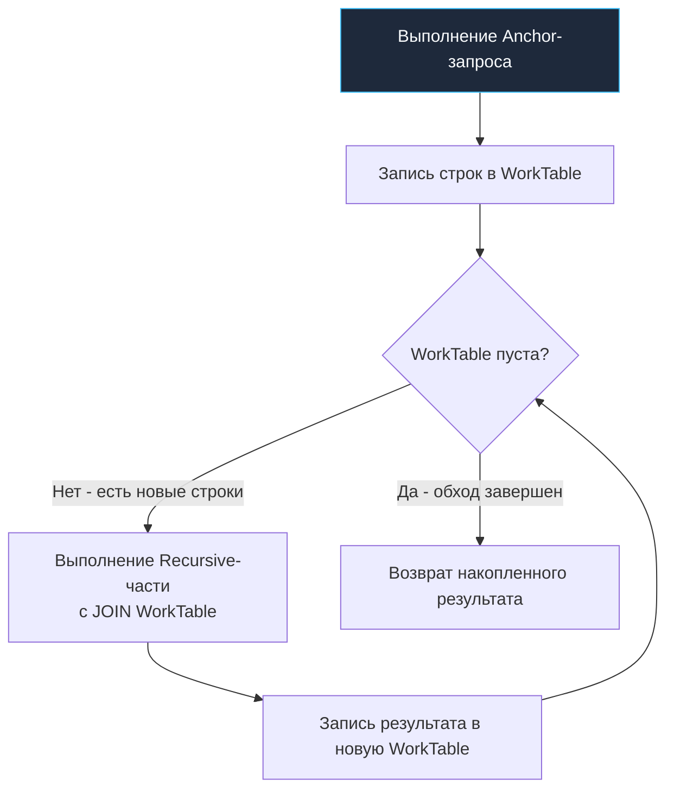

## Рекурсивные запросы: Обход деревьев и графов средствами SQL

В предыдущей статье [[1. CTE. WITH выражения]] мы познакомились с обобщенными табличными выражениями (CTE) как с элегантным инженерным инструментом: они позволяют разбить запутанный монолитный SQL-запрос на понятные, изолированные логические блоки, подобные хорошо спроектированным функциям в классическом программировании. Однако истинная алгоритмическая мощь конструкции `WITH` раскрывается в тот момент, когда к ней добавляется ключевое слово `RECURSIVE`.

Реляционная модель данных Эдгара Кодда изначально проектировалась для строгих плоских отношений — двумерных таблиц и операций реляционной алгебры над множествами. Но реальный мир упорно сопротивляется идеальной плоскости. Организационные структуры предприятий, деревья категорий товаров в e-commerce, вложенные ветки комментариев, списки зависимостей пакетов в пакетных менеджерах и графы маршрутов — все это иерархические структуры. 

В классических императивных языках (Go, C, Java) обход графа или дерева — задача тривиальная: программист берет указатели на структуры в памяти и запускает обход в глубину (DFS) или ширину (BFS). В SQL же долгое время для подобных задач приходилось либо писать медленные императивные хранимые процедуры с курсорами, либо выгружать сырые таблицы в память сервиса и собирать граф вручную. Конструкция `WITH RECURSIVE` возвращает баланс: она позволяет выполнять полноценный обход графов и деревьев непосредственно на стороне реляционного движка, вблизи от дисковых страниц, избавляя сервер приложений от передачи избыточных данных по сети.

---

## Анатомия рекурсивного CTE

Синтаксически рекурсивное CTE состоит из двух принципиально разных запросов, объединенных строгой операцией `UNION ALL`:

1. **Anchor Member (Базовый запрос / Якорь)**: Обычный нерекурсивный `SELECT`, который задает начальное состояние — корневые элементы дерева или стартовые вершины графа. Движок выполняет его ровно один раз на старте.
2. **Recursive Member (Рекурсивная часть)**: Запрос, который в секции `FROM` или `JOIN` ссылается на собственное имя CTE. Он выполняется итеративно шаг за шагом, получая на вход результат предыдущего шага, пока очередная итерация не вернет пустое множество строк.

Рассмотрим классическую задачу построения дерева категорий каталога:

```sql
WITH RECURSIVE tree AS (
    -- 1. Anchor Member: находим корневые элементы (категории верхнего уровня)
    SELECT id, parent_id, name, 1 AS depth
    FROM categories
    WHERE parent_id IS NULL

    UNION ALL

    -- 2. Recursive Member: находим дочерние узлы для элементов предыдущего шага
    SELECT c.id, c.parent_id, c.name, t.depth + 1
    FROM categories c
    JOIN tree t ON c.parent_id = t.id
)
SELECT id, parent_id, name, depth 
FROM tree;
```

### Пошаговое исполнение под капотом

Слово «рекурсивный» здесь выступает в роли понятной человеку высокоуровневой абстракции. В процессоре и рантаймах языков программирования рекурсия означает последовательное выделение фреймов в стеке вызовов (сдвиг указателя стека `RSP`, сохранение регистров и адресов возврата). В реляционных базах данных рекурсии в таком виде нет. Движок СУБД оперирует множествами кортежей, поэтому исполнение рекурсивного CTE на физическом уровне представляет собой **строгий итеративный цикл с перекладыванием данных между временными буферами**.

> [!info] Под капотом
> В PostgreSQL механизм рекурсивных CTE опирается на две служебные структуры: **Working Table (WorkTable)** и **Intermediate Table**:
> 1. **Старт (Anchor)**: Исполнитель запросов выполняет нерекурсивный `Anchor Member`. Полученные строки помещаются в накопительный результирующий буфер и одновременно копируются в рабочую таблицу `WorkTable`.
> 2. **Итерация**: Движок запускает `Recursive Member`. При этом ссылка на имя самого CTE (`tree`) не вызывает никакого рекурсивного поиска — вместо нее подставляется текущее содержимое `WorkTable`.
> 3. **Промежуточное сохранение**: Строки, сгенерированные рекурсивной частью, записываются во временную таблицу `Intermediate Table`.
> 4. **Проверка условия останова (Fixpoint)**: Если `Intermediate Table` пуста (новые потомки не найдены, граф исчерпан), итерационный цикл немедленно завершается.
> 5. **Ротация буферов**: Если строки есть, они дописываются в итоговый результирующий буфер. Содержимое `Intermediate Table` перемещается в `WorkTable`, а `Intermediate Table` очищается для следующего круга (шаг 2).
> 6. Итоговый накопитель кортежей возвращается клиенту.



---

## Mechanical Sympathy: Память, Диск и IO

Понимание того, что под капотом рекурсивного запроса непрерывно перезаписываются временные таблицы `WorkTable`, подводит внимательного инженера к вопросу о физических ресурсах: где физически живут эти таблицы и сколько тактов CPU / операций ввода-вывода тратится на каждый шаг?

- **Оптимальный сценарий (In-Memory)**: Если объем строк, порождаемых на каждом уровне иерархии, укладывается в конфигурационный лимит рабочей памяти сессии `work_mem`, `WorkTable` размещается исключительно в RAM (в виде хэш-таблицы или кортежей в памяти процесса backend worker). Чтение и запись происходят на наносекундных скоростях процессорного кэша и шины памяти.
- **Пессимистичный сценарий (Spill to Disk)**: Если дерево разрастается до сотен тысяч или миллионов узлов на одном уровне, промежуточный результат неизбежно превысит `work_mem`. В этот момент PostgreSQL переключается в аварийный режим: буфер сбрасывается на накопитель во временные файлы (`spill to disk`). Каждая последующая итерация и `JOIN` превращаются в тяжелые системные вызовы ядра `write` и `read`, порождая взрывной рост I/O Wait, сброс страниц из Page Cache ОС и деградацию дискового массива NVMe/SSD. Запрос, который в тестах на 50 строках отрабатывал за 2 мс, в продакшене под нагрузкой зависает на десятки минут.

> [!warning] Ловушка / Gotcha
> В отличие от обычных CTE, которые в современных версиях PostgreSQL (начиная с 12) оптимизатор умеет прозрачно «встраивать» (inline) в основной запрос, рекурсивные CTE **всегда материализуются** и являются жестким барьером оптимизации (Optimization Fence). Планировщик не способен пробросить внешнее условие фильтрации `WHERE` вглубь рекурсивной ветки. Если вы напишете:
> ```sql
> WITH RECURSIVE tree AS (...)
> SELECT * FROM tree WHERE depth = 5;
> ```
> база данных все равно добросовестно развернет **все дерево целиком** вплоть до листьев (например, все 50 уровней вложенности), запишет промежуточные данные в `WorkTable`, и лишь в самом финале отфильтрует ненужные строки. Чтобы ограничить глубину, условие `WHERE t.depth < 5` обязано стоять непосредственно внутри `Recursive Member`!

---

## Практика: Построение пути (Materialized Path)

В интерфейсах каталогов и файловых системах часто недостаточно знать лишь глубину узла: требуется восстановить полный человекочитаемый путь от корня до текущего элемента (хлебные крошки вроде `Электроника / Смартфоны / Apple`).

Для этого в рекурсивном шаге конкатенируют строки:

```sql
WITH RECURSIVE category_path AS (
    -- Базовый шаг: корень задает начало пути
    SELECT id, parent_id, name, name::TEXT AS path
    FROM categories
    WHERE parent_id IS NULL

    UNION ALL

    -- Рекурсивный шаг: дописываем имя текущего узла через разделитель
    SELECT c.id, c.parent_id, c.name, (cp.path || ' / ' || c.name)::TEXT
    FROM categories c
    JOIN category_path cp ON c.parent_id = cp.id
)
SELECT id, name, path 
FROM category_path;
```

Обратите внимание на физическую сторону операции: конкатенация строк в PostgreSQL на глубоких деревьях создает существенный оверхед по памяти, так как строковые типы неизменяемы (immutable), и на каждой итерации выделяется новый фрагмент памяти под расширяющуюся строку. 

Для гигантских деревьев предпочтительнее использовать массивы идентификаторов (например, `cp.path || c.id`), так как добавление элемента в конец массива эффективнее склеивания длинных строк.

---

## Защита от циклов (Cyclic Graphs)

Идеальные деревья ацикличны по определению. Однако на практике данные часто поступают из внешних источников или редактируются людьми, и таблица связей легко превращается в ориентированный граф с циклами (`A -> B -> C -> A`).

Если запустить обычный `WITH RECURSIVE` на графе с замкнутым контуром, СУБД уйдет в бесконечный цикл. `WorkTable` на каждом шаге будет получать циклические строки, условие останова никогда не выполнится, сервер исчерпает `work_mem`, забьет временными файлами диск и в итоге аварийно завершит транзакцию по таймауту или `Out of Memory`.

Начиная с **PostgreSQL 13**, стандарт SQL:2008 был реализован во всей красе через встроенную конструкцию `CYCLE`:

```sql
WITH RECURSIVE graph AS (
    SELECT id, parent_id, name
    FROM nodes
    WHERE id = 1

    UNION ALL

    SELECT n.id, n.parent_id, n.name
    FROM nodes n
    JOIN graph g ON n.parent_id = g.id
)
CYCLE id SET is_cycle TO true DEFAULT false USING path
SELECT * 
FROM graph 
WHERE NOT is_cycle;
```

Под капотом движок СУБД самостоятельно внедряет в `WorkTable` две невидимые служебные структуры: логический флаг `is_cycle` и массив пройденных первичных ключей `path`. На каждой итерации перед добавлением строки оптимизатор проверяет вхождение текущего `id` в массив `path`. Если значение уже встречалось, выставляется `is_cycle = true`, строка исключается из следующей рекурсивной итерации, и бесконечный шторм предотвращается на аппаратном уровне.

---

## Взаимодействие с Go: Сборка дерева в памяти

С точки зрения сетевого протокола PostgreSQL и драйверов Go (`pgx`, `database/sql`), результат любого SQL-запроса всегда возвращается в виде плоского tabular stream (набора кортежей из строк и столбцов). Но прикладному сервису на Go практически всегда требуется древовидный граф вложенных структур для сериализации в JSON.

Инженер стоит перед архитектурной дилеммой: где трансформировать плоский список в иерархическое дерево?

### Подход 1: Рекурсивный CTE + Сборка в Go (Рекомендуемый)

База данных делает то, в чем ей нет равных: быстро по индексам фильтрует, соединяет таблицы и отдает компактный плоский поток данных с полями `id`, `parent_id` и `depth`. Сервер на Go берет этот поток и собирает вложенную структуру в памяти за линейное время.

```go
package model

// Category представляет плоскую строку из БД
type Category struct {
	ID       int64  `db:"id"`
	ParentID *int64 `db:"parent_id"` // NULL для корней
	Name     string `db:"name"`
	Depth    int    `db:"depth"`
}

// CategoryTree представляет собранное дерево
type CategoryTree struct {
	Category
	Children []*CategoryTree
}
```

```go
package repository

import (
	"context"
	"fmt"

	"github.com/jmoiron/sqlx"
)

const recursiveTreeSQL = `
WITH RECURSIVE tree AS (
    SELECT id, parent_id, name, 1 AS depth
    FROM categories
    WHERE parent_id IS NULL

    UNION ALL

    SELECT c.id, c.parent_id, c.name, t.depth + 1
    FROM categories c
    JOIN tree t ON c.parent_id = t.id
)
SELECT id, parent_id, name, depth FROM tree ORDER BY depth, name
`

// FetchCategoryTree получает плоский список и собирает дерево
func FetchCategoryTree(ctx context.Context, db *sqlx.DB) ([]*model.CategoryTree, error) {
	var flatList []model.Category
	err := sqlx.SelectContext(ctx, db, &flatList, recursiveTreeSQL)
	if err != nil {
		return nil, fmt.Errorf("failed to fetch recursive tree: %w", err)
	}

	// Мапа для быстрого поиска узлов за O(1)
	nodeMap := make(map[int64]*model.CategoryTree, len(flatList))
	// Слайс корневых элементов
	var roots []*model.CategoryTree

	// Первый проход: аллокация узлов и сохранение в хэш-таблицу
	for _, item := range flatList {
		nodeMap[item.ID] = &model.CategoryTree{
			Category: item,
		}
	}

	// Второй проход: связывание родителей и детей по ссылкам
	for _, item := range flatList {
		if item.ParentID == nil {
			// Узел без родителя — корень верхнего уровня
			roots = append(roots, nodeMap[item.ID])
		} else {
			// Находим родительский узел в мапе и добавляем ссылку на потомка
			parentNode, exists := nodeMap[*item.ParentID]
			if exists {
				parentNode.Children = append(parentNode.Children, nodeMap[item.ID])
			}
		}
	}

	return roots, nil
}
```

> [!info] Под капотом (Go)
> Обратите пристальное внимание на реализацию связывания через вспомогательную хэш-мапу `nodeMap`. Это канонический двухпроходный алгоритм со сложностью O(N) по времени и O(N) по памяти. 
> 
> Если бы мы неосмотрительно попытались искать детей «в лоб» через вложенные циклы (проходя весь слайс в поисках элементов с `ParentID == current.ID`), алгоритмическая сложность подскочила бы до O(N^2). При каталоге всего в 10 000 товаров это означает 100 000 000 сравнений, гигантские промахи мимо кэша процессора (L1/L2 Cache Misses) и чудовищную нагрузку на сборщик мусора Go из-за неконтролируемых аллокаций.

### Подход 2: JSON-агрегация на стороне БД

PostgreSQL обладает богатыми возможностями агрегации реляционных данных в бинарный JSON с помощью функций `jsonb_agg` и `to_jsonb`. Соблазн переложить всю работу на СУБД велик:

```sql
-- Упрощенный пример агрегации
WITH RECURSIVE tree AS ( ... )
SELECT jsonb_agg(to_jsonb(t))
FROM tree t;
```

**Почему в Highload-системах этот подход опасен:**  
Сборка сложных вложенных JSON-деревьев в ядре СУБД — это крайне тяжелая процессорная операция, сопровождающаяся интенсивным выделением памяти в процессах backend worker. В масштабируемой микросервисной архитектуре сервер приложений (Go) горизонтально масштабируется добавлением дешевых подов в Kubernetes за секунды, тогда как мастер-инстанс базы данных масштабируется тяжело и дорого. 

Кроме того, передача огромных сплошных JSON-строк по сети и последующий парсинг через `json.Unmarshal` в Go создают лавинообразные аллокации в куче (heap allocations) и заставляют GC работать с максимальной задержкой. Разгружайте базу данных: отдавайте плоские строки и собирайте дерево в Go.

---

> [!tip] Собеседование
> **Вопрос:** Что произойдет, если в определении рекурсивного CTE соединить Anchor и Recursive части через обычный `UNION` вместо обязательного `UNION ALL`?
> 
> **Ответ:** Оператор `UNION` по стандарту реляционной алгебры требует обязательной дедупликации строк. На каждой итерации рекурсии СУБД будет вынуждена выполнять сортировку всего накопленного множества данных (`Sort / Unique`) или строить колоссальную промежуточную хэш-таблицу для фильтрации дубликатов. 
> 
> Это не только уничтожает производительность в ноль (сортировка миллионов промежуточных кортежей гарантированно вызовет сброс во временные файлы на диске и заблокирует CPU), но и **исказит логику обхода**: если один и тот же узел законно встречается в разных ветвях графа на разных уровнях, `UNION` отбросит его как дубликат. Всегда используйте `UNION ALL` в рекурсивных CTE, если только у вас нет специфической математической задачи поиска уникальных путей в циклическом графе без клаузы `CYCLE`.

---

## Итог

1. **Рекурсивные CTE** — это специализированный инструмент для обхода иерархических и сетевых структур (деревьев, DAG, графов), где логическая рекурсия преобразуется планировщиком в итеративный табличный цикл через `WorkTable`.
2. В PostgreSQL рекурсивные CTE **всегда материализуются**. Они действуют как Optimization Fence: внешние условия `WHERE` не проникают в тело рекурсии, поэтому условия фильтрации глубины необходимо задавать внутри тела CTE.
3. Механическое сочувствие к памяти: превышение объема промежуточных результатов над `work_mem` приводит к механизму `spill to disk` и обрушению пропускной способности подсистемы ввода-вывода.
4. Для циклических графов всегда предусматривайте защиту от зацикливания через конструкцию `CYCLE` (в PostgreSQL 13+) или ведение массива посещенных вершин `path`.
5. В связке с Go придерживайтесь канонического паттерна: получайте от СУБД плоскую выборку узлов и собирайте иерархическое дерево в памяти сервиса через хэш-мапу `nodeMap` за строгое линейное время O(N).

Рекурсивные запросы мастерски справляются с иерархиями, где важен порядок обхода вершин. В следующей статье мы перейдем к фундаментальному инструменту аналитической обработки данных, позволяющему заглядывать в соседние строки без группировки и схлопывания выборки — [[3. Оконные функции. OVER]].
