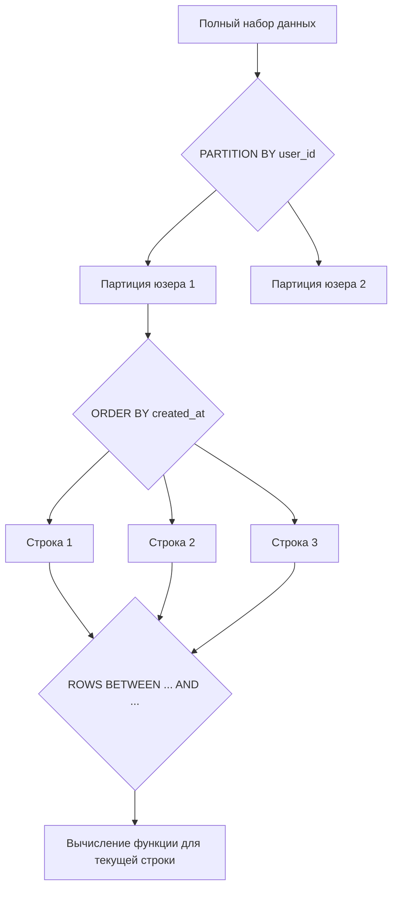

## Оконные функции: Аналитика без потери строк

В классическом реляционном SQL агрегатные функции (`SUM`, `COUNT`, `AVG`, `MIN`, `MAX`) неразрывно ассоциируются с оператором `GROUP BY`. Однако у традиционной группировки есть фундаментальное свойство, которое часто превращается в серьезное ограничение: она неизбежно **схлопывает** строки исходного набора данных. Если вы группируете таблицу заказов по идентификатору клиента, чтобы рассчитать суммарный объем его покупок, СУБД возвращает ровно одну итоговую строку на каждого пользователя. Все отдельные заказы, их даты, составы и уникальные идентификаторы безвозвратно растворяются в агрегате.

Но в реальной инженерной практике нам непрерывно требуется противоположное: вывести детальный список всех заказов клиента и одновременно в соседней колонке отобразить средний чек или общую сумму его покупок; рассчитать разницу во времени между текущим и предыдущим заказом; вычислить долю конкретной позиции в обороте категории.

До появления стандарта SQL:2003 инженеры были вынуждены решать эту задачу архитектурно неуклюжими способами: либо писать коррелированные подзапросы в блоке `SELECT` (что приводило к катастрофическому вложенному циклу $O(N^2)$ с миллионами повторных чтений страниц), либо рассчитывать агрегаты во временных таблицах и через `JOIN` соединять их обратно с исходными данными.

**Оконные функции (Window Functions)** совершили революцию в аналитическом SQL: они позволяют производить сложные агрегатные и ранжирующие вычисления по подмножеству строк, логически связанных с текущей строкой, **не теряя при этом индивидуальности самих строк**. Каждая строка результирующей выборки сохраняет свои детальные поля, обогащаясь вычисленным значением по своему «окну».

---

## Анатомия: Ключевое слово OVER

Любая оконная функция вызывается с синтаксической клаузой `OVER()`. Именно наличие `OVER()` сообщает парсеру и планировщику СУБД, что перед ним не обычная групповая агрегация, а оконное вычисление.

```sql
SELECT 
    order_id,
    user_id,
    amount,
    -- Обычная агрегация: схлопнет все строки в одну
    SUM(amount) AS total_amount,
    -- Оконная функция: добавит колонку к каждой строке
    SUM(amount) OVER () AS total_amount_window
FROM orders;
```

В приведенном примере `SUM(amount) OVER ()` с пустыми круглыми скобками определяет окно размером во всю результирующую выборку: каждая строка получит дополнительную колонку с глобальной суммой всех заказов в таблице.

Конструкция `OVER()` определяет геометрию так называемого «окна» — виртуального фрейма данных, в пределах которого производятся вычисления. Окно настраивается с помощью трех базовых компонентов:

1. **PARTITION BY** — разделяет весь набор данных на независимые секции (партиции). Это прямой смысловой аналог `GROUP BY`, но без физического схлопывания строк. Внутри каждой партиции вычисления начинаются заново с нуля.
2. **ORDER BY** — определяет жесткий порядок следования строк внутри каждой отдельной партиции. Это критически важно для функций ранжирования (`ROW_NUMBER`, `RANK`) и вычисления накопительных итогов (running totals).
3. **ROWS/RANGE (Frame Clause)** — задает точные физические или логические границы подмножества строк внутри партиции относительно текущей обрабатываемой строки (скользящее окно).



---

## Под капотом: Как СУБД исполняет оконные функции

Понимание физического плана выполнения оконных функций — непременное условие для backend-разработчика, проектирующего производительные сервисы. Оконные функции не бесплатны: за возможность заглядывать в соседние строки база данных платит процессорным временем и памятью.

Когда планировщик запросов встречает клаузу `OVER()`, он не может отдавать строки клиенту в потоковом режиме по мере их чтения с диска, как при тривиальном `SELECT * FROM orders`. Чтобы применить оконную функцию, движок обязан увидеть **весь набор строк партиции целиком**, сгруппировать их и отсортировать.

### План выполнения (EXPLAIN)

Если проанализировать запрос с оконной функцией через команду `EXPLAIN`, ключевым элементом плана станет специализированный узел исполнителя — **WindowAgg** (в PostgreSQL) или его эквивалент в других СУБД.

Физический конвейер обработки состоит из следующих шагов:
1. Исполнитель выполняет все предшествующие реляционные операции: сканирование таблиц (`Seq Scan` или `Index Scan`), соединения (`Hash Join`, `Nested Loop`), фильтрацию по предикатам `WHERE`, классическую группировку `GROUP BY` и фильтрацию групп `HAVING`.
2. Полученный промежуточный поток кортежей отправляется в узел **Sort**. Данные сортируются сначала по ключам `PARTITION BY`, а затем внутри партиций — по колонкам `ORDER BY`. Если в одном запросе используется несколько разных оконных функций с несовпадающими секциями `OVER()`, оптимизатор вынужден вставлять в план несколько последовательных узлов сортировки, что многократно увеличивает время выполнения.
3. Узел `WindowAgg` последовательно сканирует отсортированный поток. Пока значение ключа `PARTITION BY` остается неизменным, узел удерживает состояние агрегатов текущей партиции. Как только ключ меняется, текущая партиция закрывается, внутренние аккумуляторы сбрасываются, и начинается расчет для следующей группы.

> [!info] Под капотом
> В архитектуре PostgreSQL узел `WindowAgg` спроектирован так, чтобы удерживать в памяти только одну активную партицию за раз. Это разумный компромисс: если партиции компактны (например, история заказов одного пользователя), они целиком помещаются в локальный буфер сессии `work_mem`. В этом случае все расчеты выполняются на максимальной скорости оперативной памяти.
> 
> Однако если партиция оказывается колоссальной (например, `PARTITION BY date`, где за один день накоплен миллион строк), а внутри нее требуется сортировка `ORDER BY created_at`, лимита `work_mem` оказывается недостаточно. PostgreSQL переключается на внешний алгоритм сортировки и начинает сбрасывать промежуточные порции данных на диск во временные файлы (`spill to disk`).

### Mechanical Sympathy: Цена сортировки

Почти любая оконная функция с `ORDER BY` опирается на алгоритмическую сортировку. Классическая сортировка в худшем и среднем случаях требует вычислительной сложности $O(N \log N)$.

На уровне процессорной архитектуры сортировка — одна из самых ресурсоемких операций:
- Алгоритмы быстрой сортировки (Quicksort) или гибридной сортировки (Timsort), используемые современными реляционными движками, непрерывно сравнивают и перемещают кортежи, разнесенные в виртуальной памяти.
- Это вызывает постоянные промахи мимо кэша процессора первого и второго уровней (Cache Misses). Ядро CPU вынуждено простаивать сотни тактов в ожидании подгрузки строк из основной памяти RAM.
- Если же объем данных выходит за пределы `work_mem` и данные сбрасываются на диск во временные файлы, производительность деградирует экспоненциально: дисковые контроллеры захлебываются случайными операциями чтения и записи, а Go-сервер зависает в ожидании ответа от СУБД, блокируя ресурсы пула соединений.

---

## Границы окна (Frame Clause): Нарастающие итоги

Когда вы добавляете в клаузу `OVER()` секцию `ORDER BY`, но опускаете явное указание границ окна (Frame Specification), поведение СУБД кардинально меняется. 

По стандарту SQL, неявным значением по умолчанию для окна с сортировкой становится:  
`RANGE BETWEEN UNBOUNDED PRECEDING AND CURRENT ROW`

Это означает, что агрегат рассчитывается не по всей партиции разом, а **накопительно — от самой первой строки партиции до текущей строки включительно**. Это идеальный фундамент для построения нарастающих итогов (Running Total) и скользящих средних:

```sql
SELECT 
    order_id,
    user_id,
    amount,
    -- Сумма от первого заказа юзера до текущего
    SUM(amount) OVER (PARTITION BY user_id ORDER BY created_at) AS running_total
FROM orders;
```

Если же вам необходимо получить агрегат по **всей** партиции целиком, но при этом сохранить строгий порядок строк внутри окна для другой функции, границы окна требуется переопределить явно:

```sql
SUM(amount) OVER (
    PARTITION BY user_id 
    ORDER BY created_at 
    ROWS BETWEEN UNBOUNDED PRECEDING AND UNBOUNDED FOLLOWING
)
```

> [!warning] Ловушка / Gotcha
> Тонкое различие между `ROWS` и `RANGE` в спецификации границ окна — классическая ловушка, в которую попадают даже опытные инженеры на собеседованиях и в проде:
> - **`ROWS`** оперирует **физическими строками**. Конструкция `ROWS BETWEEN UNBOUNDED PRECEDING AND CURRENT ROW` остановит суммирование строго на текущей физической записи в памяти.
> - **`RANGE`** (поведение по умолчанию!) оперирует **логическими значениями** ключа сортировки. Если во фрейме присутствуют строки-дубликаты с одинаковым значением поля `created_at`, `RANGE` включит в окно **все** строки с идентичным таймстемпом разом! В результате для дублирующихся строк нарастающий итог сделает резкий скачок вперед, показав одинаковую суммарную величину для всех записей с одинаковым временем. Чтобы гарантировать детерминированный физический накопительный итог, всегда явно указывайте спецификатор `ROWS`.

---

## Порядок выполнения SQL и оконные функции

Один из самых частых вопросов начинающих backend-разработчиков: почему СУБД выдает синтаксическую ошибку при попытке отфильтровать строки по значению оконной функции в блоке `WHERE`?

Причина кроется в фундаментальном логическом порядке обработки SQL-запроса движком базы данных:

1. `FROM` и `JOIN` (определение табличных источников и связей).
2. `WHERE` (строчная фильтрация исходных кортежей).
3. `GROUP BY` (схлопывание строк в группы).
4. `HAVING` (фильтрация полученных агрегированных групп).
5. **Оконные функции и узел `WindowAgg`** (вычисление окон поверх отфильтрованных строк).
6. `SELECT` (проекция результирующих колонок).
7. `DISTINCT` (дедупликация).
8. `ORDER BY` (финальная сортировка вывода клиенту).
9. `LIMIT` и `OFFSET` (пагинация).

Оконные функции вычисляются **строго после** `WHERE`, `GROUP BY` и `HAVING`, но **до** финального `ORDER BY`. В момент выполнения фильтра `WHERE` оконные значения еще попросту физически не существуют в конвейере данных!

```sql
-- ЭТО НЕ СРАБОТАЕТ: СУБД вернет синтаксическую ошибку
SELECT order_id, user_id, amount, 
       ROW_NUMBER() OVER (PARTITION BY user_id ORDER BY amount DESC) as rn
FROM orders
WHERE rn = 1; -- ОШИБКА: колонка rn не существует на этапе фильтрации
```

Чтобы применить предикат фильтрации к результату оконной функции, этот шаг необходимо изолировать во внешнем контексте — через обобщенное табличное выражение (CTE) или вложенный подзапрос (подробнее о механике CTE читайте в [[1. CTE. WITH выражения]]):

```sql
WITH ranked_orders AS (
    SELECT order_id, user_id, amount, 
           ROW_NUMBER() OVER (PARTITION BY user_id ORDER BY amount DESC) as rn
    FROM orders
)
SELECT * 
FROM ranked_orders 
WHERE rn = 1;
```

---

## Интеграция с Go: Обработка скользящих окон

Поскольку оконные функции обогащают строки вычислениями, но принципиально не сокращают их количество (в отличие от `GROUP BY`), сервисный слой на Go должен бережно относиться к выделению памяти при получении больших наборов данных.

Если аналитический запрос возвращает сотни тысяч строк с нарастающим итогом, наивное считывание всей выборки в слайс структур без предварительной аллокации вызовет многократные реаллокации буфера (с ростом среза в 1.5–2 раза) и спровоцирует сильное давление на сборщик мусора Go (Garbage Collector).

```go
package repository

import (
	"context"
	"fmt"

	"github.com/jmoiron/sqlx"
)

// OrderStats отражает строку с результатами оконной функции
type OrderStats struct {
	OrderID      int64   `db:"order_id"`
	UserID       int64   `db:"user_id"`
	Amount       float64 `db:"amount"`
	RunningTotal float64 `db:"running_total"` // Результат оконной функции
}

const runningTotalSQL = `
SELECT 
    order_id, 
    user_id, 
    amount, 
    SUM(amount) OVER (PARTITION BY user_id ORDER BY created_at) AS running_total
FROM orders
WHERE created_at > $1
`

// GetRunningTotals использует sqlx для маппинга сканируемого ряда
func GetRunningTotals(ctx context.Context, db *sqlx.DB, since string) ([]OrderStats, error) {
	rows, err := db.QueryxContext(ctx, runningTotalSQL, since)
	if err != nil {
		return nil, fmt.Errorf("failed to query running totals: %w", err)
	}
	defer rows.Close()

	// Предварительно аллоцируем слайс с разумной емкостью (capacity),
	// чтобы избежать каскадных реаллокаций памяти в куче (heap) и снизить нагрузку на GC.
	results := make([]OrderStats, 0, 1000)

	for rows.Next() {
		var stat OrderStats
		// Примечание: StructScan опирается на пакет reflect в рантайме.
		// В критических к задержкам hot path надежнее использовать явный rows.Scan(&stat.OrderID, ...)
		if err := rows.StructScan(&stat); err != nil {
			return nil, fmt.Errorf("failed to scan row: %w", err)
		}
		results = append(results, stat)
	}

	if err := rows.Err(); err != nil {
		return nil, fmt.Errorf("rows iteration error: %w", err)
	}

	return results, nil
}
```

---

> [!tip] Собеседование
> **Вопрос:** В чем принципиальная разница между `GROUP BY` и оконными функциями с клаузой `PARTITION BY`? Какой подход эффективнее с точки зрения нагрузки на СУБД?
> 
> **Ответ:** `GROUP BY` схлопывает сходные строки, возвращая строго по одному кортежу на каждую уникальную группу. `PARTITION BY` сохраняет детальность исходных строк неизменной, прикрепляя к каждой строке вычисленный агрегат.
> 
> С точки зрения физической производительности `GROUP BY` практически всегда быстрее: для его выполнения движок базы данных может применить однопроходный алгоритм **Hash Aggregate**, накапливая суммы в хэш-таблице «на лету» без предварительной сортировки всего набора данных. 
> 
> Оконные функции почти всегда требуют обязательной сортировки (Sort), потребляют существенно больше оперативной памяти `work_mem` и не могут возвращать строки в потоковом режиме, пока текущая партиция не будет отсортирована. Оконные функции оправданы только тогда, когда вам критически необходим доступ к индивидуальным полям исходных записей.

---

## Итог

1. **Оконные функции** производят вычисления по связанному подмножеству строк (окну), сохраняя уникальность и количество каждой записи исходной таблицы.
2. Синтаксис `OVER (PARTITION BY ... ORDER BY ...)` задает группировку, сортировку и границы вычислений фрейма.
3. **Физический план:** Оконные функции обрабатываются в узле `WindowAgg`. Они требуют предварительной сортировки потока, что создает квадратично-логарифмическую сложность $O(N \log N)$ и риски сброса временных данных на диск (`spill to disk`) при нехватке `work_mem`.
4. Из-за строгого порядка фаз выполнения SQL оконные функции недоступны в секции `WHERE`. Для фильтрации их результатов используйте CTE или вложенные запросы.
5. Различайте спецификаторы границ `ROWS` (физический подсчет строк) и `RANGE` (логические группы значений), чтобы избежать искажений в накопительных итогах при дубликатах.

Оконные функции открывают колоссальные возможности не только для накопительных сумм, но и для упорядочивания данных. В следующей статье мы детально разберем ключевые функции ранжирования строк — [[4. ROW_NUMBER, RANK, DENSE_RANK]].
