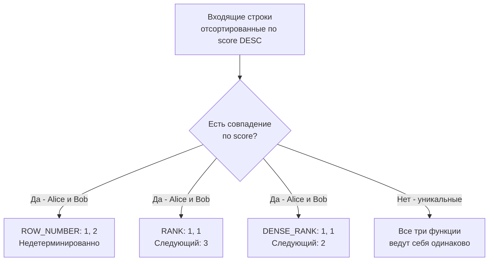

## Функции ранжирования: ROW_NUMBER, RANK, DENSE_RANK

В предыдущей статье [[3. Оконные функции. OVER]] мы заглянули под капот механизма оконных вычислений и познакомились с физическим узлом `WindowAgg`. Теперь настало время перейти к практическому оружию номер один в арсенале любого backend-разработчика — **функциям ранжирования**.

В прикладной разработке постоянно возникают задачи упорядочивания: составить турнирную таблицу (лидерборд), пронумеровать строки отчета, отобрать по три самых свежих заказа для каждого пользователя или вычистить дублирующиеся события из очереди. На технических собеседованиях глубокое понимание различий между функциями ранжирования и уверенное владение паттерном «Top-N per group» служит надежным маркером зрелого инженера уровня Middle+.

---

## Тройка лидеров: В чем разница?

Стандарт SQL определяет три фундаментальные функции ранжирования: `ROW_NUMBER()`, `RANK()` и `DENSE_RANK()`. Все три функции возвращают целочисленный ранг для каждой строки внутри текущей партиции в соответствии с порядком, заданным в блоке `ORDER BY`.

Принципиальная разница между ними проявляется ровно в одном месте: **как алгоритм поступает при возникновении «ничьей»** — когда две или более строк имеют абсолютно одинаковые значения в колонках сортировки.

Для кристальной наглядности рассмотрим турнирную таблицу игроков и набранных ими очков:

| player | score |
|---|---|
| Alice | 100 |
| Bob | 100 |
| Charlie | 90 |
| Dave | 80 |

У Alice и Bob одинаковый результат — 100 очков. Как с ними поступит каждая из функций?

### 1. ROW_NUMBER()

Функция `ROW_NUMBER()` работает прямолинейно, как счетчик тактов: она просто присваивает каждой строке строго инкрементируемый порядковый номер: 1, 2, 3, 4...

```sql
SELECT player, score,
       ROW_NUMBER() OVER (ORDER BY score DESC) as rn
FROM players;
```

Если строки имеют одинаковые значения в `ORDER BY` (как у Alice и Bob), `ROW_NUMBER()` все равно обязан присвоить им уникальные номера (1 и 2). Однако кто именно окажется на первом месте, а кто на втором — **абсолютно недетерминировано**, если в секции `ORDER BY` не указаны дополнительные уникальные колонки. СУБД может вернуть `Alice: 1, Bob: 2`, а при следующем перезапуске запроса — `Bob: 1, Alice: 2`.

*Результат: Alice (1), Bob (2), Charlie (3), Dave (4).*

### 2. RANK()

Функция `RANK()` реализует классическую модель спортивных соревнований (например, Олимпийских игр). Строкам с одинаковыми значениями присваивается один и тот же ранг. Но при переходе к следующему уникальному значению номер позиции «перепрыгивает» через количество участников с одинаковым счетом.

```sql
SELECT player, score,
       RANK() OVER (ORDER BY score DESC) as rnk
FROM players;
```

Поскольку Alice и Bob разделили 1-е место, 2-е место исчезает из выдачи. Следующий за ними Charlie получает сразу 3-е место.

*Результат: Alice (1), Bob (1), Charlie (3), Dave (4).*

### 3. DENSE_RANK()

Функция `DENSE_RANK()` («плотный ранг») ведет себя аналогично `RANK` при обработке совпадений, но никогда не создает «дыр» в нумерации.

```sql
SELECT player, score,
       DENSE_RANK() OVER (ORDER BY score DESC) as drnk
FROM players;
```

Alice и Bob делят между собой 1-е место, но следующий игрок Charlie получает строго следующий по порядку ранг — 2.

*Результат: Alice (1), Bob (1), Charlie (2), Dave (3).*



---

## Под капотом: Peer Groups и Детерминизм

Чтобы понять, как исполнитель запросов СУБД (например, узел `WindowAgg` в PostgreSQL) рассчитывает ранги, необходимо познакомиться с внутренней концепцией **Peer Groups (группы равных)**.

Когда отсортированный поток кортежей поступает в `WindowAgg`, движок сравнивает соседние строки по выражению `ORDER BY`:
- Все строки с одинаковыми значениями ключа объединяются во временную группу равных — Peer Group.
- Функции `RANK()` и `DENSE_RANK()` работают исключительно на уровне peer groups: всем строкам одной группы присваивается единый ранг. `RANK` прибавляет к номеру ранга размер предыдущей группы, а `DENSE_RANK` просто делает инкремент `+1` при переходе к новой группе.
- Функция `ROW_NUMBER()` полностью игнорирует разбиение на peer groups: она держит в регистре процессора счетчик и тупо инкрементирует его на каждом кортеже.
- Все эти операции требуют сортировки партиций: если объем данных превышает лимит `work_mem`, движок начинает сбрасывать промежуточные результаты на диск (spill to disk).

> [!warning] Ловушка / Gotcha
> **Недетерминированность `ROW_NUMBER`** — коварный источник плавающих «багов-призраков» в продакшене.
> 
> Представьте, что вы отбираете последнее состояние сущности:  
> `ROW_NUMBER() OVER (PARTITION BY user_id ORDER BY created_at DESC)`  
> Если пользователь совершил два действия в одну и ту же секунду (или таймстемп округлился), у них будет одинаковый `created_at`. СУБД вернет строки в том порядке, в каком они физически считались со страниц буферного пула. Сегодня первой придет строка A, а завтра, после выполнения фонового процесса очистки `VACUUM` или перестроения индекса, порядок страниц изменится, и станет первой строка B!
> 
> **Золотое инженерное правило:** Если в сортировке окна возможны совпадения, всегда добавляйте детерминированный **tie-breaker (разрешитель ничьей)** — уникальную колонку, например, первичный ключ:  
> `ORDER BY created_at DESC, id DESC`.

### Mechanical Sympathy: Параллельное исполнение

В современных версиях СУБД (начиная с PostgreSQL 11+) оконные вычисления умеют распараллеливаться по нескольким ядрам процессора. Планировщик строит план с узлом **Gather Merge**, который собирает предварительно отсортированные потоки кортежей от фоновых воркеров (`Parallel Worker`).

Если оконная сортировка недетерминирована, параллельное исполнение превратит вывод в хаос: ядра CPU завершают свои порции работы с микросекундной разницей во времени в зависимости от задержек L3-кэша и планировщика ОС. Порядок строк на входе в `Gather Merge` будет случайным при каждом запуске. Пагинация по `ROW_NUMBER` в таких условиях станет отдавать дубликаты на соседних страницах или терять записи.

---

## Паттерн "Top-N per Group" в Go

Классическая инженерная задача: «Для каждого активного пользователя вернуть 3 его последних выполненных заказа». 

В SQL эту задачу элегантно решает связка обобщенного табличного выражения (CTE, см. [[1. CTE. WITH выражения]]) и функции `ROW_NUMBER()` с предикатом `rn <= 3`:

```sql
WITH ranked_orders AS (
    SELECT 
        user_id,
        order_id,
        amount,
        created_at,
        ROW_NUMBER() OVER (PARTITION BY user_id ORDER BY created_at DESC, order_id DESC) as rn
    FROM orders
    WHERE status = 'COMPLETED'
)
SELECT user_id, order_id, amount, created_at
FROM ranked_orders
WHERE rn <= 3;
```

### Работа с результатом в Go

Главная архитектурная ловушка на стороне приложения на Go — попытка строить вложенные структуры данных «на лету» неэффективными алгоритмами. Поскольку результат всё еще плоский (строки с `rn=1, 2, 3` идут подряд для каждого юзера), эффективнее использовать подход с преаллоцированными слайсами и мапами.

```go
package repository

import (
	"context"
	"fmt"

	"github.com/jmoiron/sqlx"
)

// UserLatestOrders содержит юзера и его последние заказы
type UserLatestOrders struct {
	UserID int64
	Orders []Order
}

type Order struct {
	ID        int64
	Amount    float64
	CreatedAt string
}

const topNPerUserSQL = `
WITH ranked_orders AS (
    SELECT 
        user_id, order_id, amount, created_at,
        ROW_NUMBER() OVER (PARTITION BY user_id ORDER BY created_at DESC, order_id DESC) as rn
    FROM orders
    WHERE status = $1
)
SELECT user_id, order_id, amount, created_at
FROM ranked_orders
WHERE rn <= 3
`

// GetTop3OrdersPerUser извлекает плоский набор и группирует в Go
func GetTop3OrdersPerUser(ctx context.Context, db *sqlx.DB, status string) (map[int64]*UserLatestOrders, error) {
	rows, err := db.QueryxContext(ctx, topNPerUserSQL, status)
	if err != nil {
		return nil, fmt.Errorf("failed to query top N orders: %w", err)
	}
	defer rows.Close()

	// Результирующая хэш-таблица. Храним указатель на структуру (*UserLatestOrders),
	// чтобы при добавлении заказов модифицировать объект на месте без копирования.
	result := make(map[int64]*UserLatestOrders)

	for rows.Next() {
		var (
			userID    int64
			orderID   int64
			amount    float64
			createdAt string
		)

		if err := rows.Scan(&userID, &orderID, &amount, &createdAt); err != nil {
			return nil, fmt.Errorf("failed to scan row: %w", err)
		}

		// Проверяем наличие агрегата пользователя в мапе за O(1)
		userData, exists := result[userID]
		if !exists {
			userData = &UserLatestOrders{
				UserID: userID,
				// Мы достоверно знаем, что заказов на юзера будет не более 3:
				// преаллоцируем слайс с cap=3, избегая лишних расширений буфера в куче.
				Orders: make([]Order, 0, 3),
			}
			result[userID] = userData
		}

		// Добавляем заказ в уже аллоцированный буфер
		userData.Orders = append(userData.Orders, Order{
			ID:        orderID,
			Amount:    amount,
			CreatedAt: createdAt,
		})
	}

	if err := rows.Err(); err != nil {
		return nil, fmt.Errorf("rows iteration error: %w", err)
	}

	return result, nil
}
```

> [!info] Под капотом (Go)
> Обратите внимание на тонкий нюанс: тип карты объявлен как `map[int64]*UserLatestOrders` (указатель), а слайс `Orders` инициализируется с `cap = 3`. 
> 
> Если бы мы объявили карту по значению — `map[int64]UserLatestOrders`, то вызов `result[userID].Orders = append(...)` привел бы к ошибке компиляции (элементы мапы неадресуемы в Go), либо потребовал бы извлечения копии всей структуры, выполнения `append` и обратной записи в мапу. Каждое такое копирование вызывало бы лишние аллокации в куче (Heap) и заставляло сборщик мусора Go (GC) работать на износ.

---

## Удаление дубликатов через ROW_NUMBER

Еще один классический сценарий — очистка таблиц от дублирующихся записей, когда в БД по ошибке записалось несколько одинаковых событий:

```sql
DELETE FROM events
WHERE id NOT IN (
    SELECT id
    FROM (
        SELECT id,
               ROW_NUMBER() OVER (PARTITION BY user_id, event_type ORDER BY created_at DESC) as rn
        FROM events
    ) t
    WHERE t.rn = 1
);
```

*Инженерное предупреждение о масштабе:* На гигантских таблицах (десятки миллионов строк) такой массовый `DELETE` заблокирует страницы данных, переполнит журнал упреждающей записи WAL и приведет к жесткой деградации ввода-вывода (IO). 

В высоконагруженных системах вместо каскадного `DELETE` часто применяют паттерн **CTAS (Create Table As Select)**: отбирают уникальные записи с `rn = 1` в новую чистую таблицу, создают на ней индексы, после чего выполняют мгновенный `TRUNCATE` старой таблицы или переключение имен (`ALTER TABLE ... RENAME`).

---

> [!tip] Собеседование
> **Вопрос:** В чем фундаментальная разница между `RANK()` и `DENSE_RANK()`? Приведите реальный сценарий, когда использование `ROW_NUMBER()` вместо них приведет к критическому багу.
> 
> **Ответ:** `RANK()` при наличии одинаковых значений оставляет пропуски в номерах последующих рангов (1, 1, 3), отражая реальное количество опережающих элементов. `DENSE_RANK()` нумерует группы значений строго подряд без разрывов (1, 1, 2).
> 
> Использование `ROW_NUMBER()` приведет к багу при попытке отобрать лидеров («наградить всех пользователей с максимальным баллом»). Если пять участников набрали максимальные 100 баллов, `ROW_NUMBER() <= 1` вернет только одного случайного счастливчика, а остальных четырех несправедливо отбросит из-за недетерминированного разделения мест. В этом сценарии бизнес-логика требует исключительно `DENSE_RANK() <= 1`.

---

## Итог

1. `ROW_NUMBER()` присваивает каждой строке уникальный порядковый номер. Требует строго детерминированного `ORDER BY` с tie-breaker (например, первичным ключом), иначе порядок строк случаен.
2. `RANK()` и `DENSE_RANK()` группируют строки с одинаковыми значениями в Peer Groups: `RANK()` оставляет пропуски в нумерации, `DENSE_RANK()` сохраняет непрерывную последовательность рангов.
3. Под капотом ранжирование опирается на физическую сортировку партиций в узле `WindowAgg`. При параллельном выполнении недетерминированный `ROW_NUMBER` приводит к искажению страниц и результатов из-за гонок воркеров в `Gather Merge`.
4. Для реализации паттерна «Top-N per group» в Go забирайте плоский отфильтрованный срез кортежей из CTE и группируйте его через `map[int64]*Struct` с точной емкостью слайса `cap = N`, сводя аллокации к минимуму.

Функции ранжирования позволяют сопоставлять строки в пределах групп. Но как быть, если нужно не просто пронумеровать записи, а сравнить значение текущей строки со значением в предыдущей или следующей строке (например, посчитать рост выручки к прошлому месяцу)? Об этом мы поговорим в следующей статье: [[5. LEAD, LAG]].
