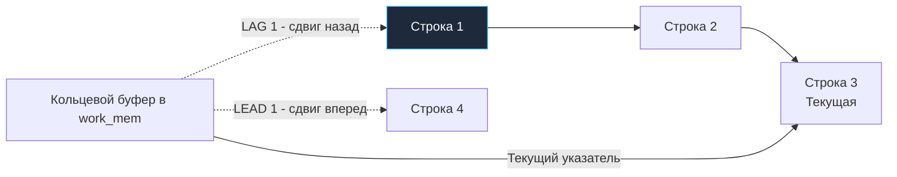

## Смещения во времени: LEAD и LAG

В предыдущей статье мы научились присваивать строкам номера и ранги с помощью [[4. ROW_NUMBER, RANK, DENSE_RANK]]. Но в повседневной инженерной практике часто встает принципиально иная задача: сравнить текущую строку не с абстрактным порядковым номером, а с реальными данными из предыдущей или последующей записи. 

Сколько времени прошло между первым и вторым заказом покупателя? На сколько процентов выросла дневная выручка интернет-магазина по сравнению со вчерашним днем? Изменился ли статус сетевого интерфейса по сравнению с предыдущим замером телеметрии?

В классическом реляционном SQL до появления оконных функций ответ на этот вопрос превращался в настоящий кошмар из само-джойнов (Self-Joins). Разработчикам приходилось соединять таблицу саму с собой через предикат вида `JOIN table t1 ON t1.id = t2.id - 1`. Мало того, что такая конструкция мгновенно ломалась при первом же пропуске в автоинкрементных идентификаторах (например, после отката транзакции или удаления записи), она еще и вызывала квадратичный взрыв вычислительной сложности запроса.

Оконные функции смещения **LEAD** и **LAG** решают эту задачу с предельной математической элегантностью: они позволяют «заглядывать» вперед или назад по отсортированному набору данных без единого `JOIN`, сохраняя строгую линейную сложность обработки.

---

## Синтаксис и базовая логика

Обе функции работают по симметричному принципу: они извлекают значение выражения (обычно имени колонки) со смещением (offset) относительно текущей позиции строки внутри заданной партиции.

- **LAG** — смещение **назад** (в прошлое). Функция обращается к строкам, расположенным *до* текущей в порядке сортировки.
- **LEAD** — смещение **вперед** (в будущее). Функция обращается к строкам, расположенным *после* текущей.

Каноническая сигнатура вызова:

```sql
LAG  (expression, offset, default) OVER (...)
LEAD (expression, offset, default) OVER (...)
```

Параметры функций:
- `expression` — целевая колонка или вычисляемое выражение, значение которого требуется получить из соседней строки.
- `offset` — целое положительное число, задающее величину смещения в строках (по умолчанию равно `1`, параметр необязательный).
- `default` — константное значение или выражение, которое возвращается в том случае, если строка по указанному смещению выходит за границы партиции (например, для самой первой строки в `LAG`). Если не указано, по умолчанию возвращается `NULL` (необязательный параметр).

Простой пример: вычисление даты предыдущего заказа для каждого пользователя:

```sql
SELECT 
    user_id,
    order_id,
    created_at,
    -- Берем дату предыдущего заказа текущего пользователя
    LAG(created_at, 1) OVER (PARTITION BY user_id ORDER BY created_at) AS prev_order_at
FROM orders;
```

---

## Под капотом: Sequential Scan и Spooling

Чтобы оценить механическое превосходство `LAG` над само-джойнами, заглянем в архитектуру исполнителя запросов на уровне физического узла `WindowAgg`.

В отличие от агрегатных функций вроде `SUM()` и `AVG()` или алгоритмов вычисления `DENSE_RANK()`, функциям относительного позиционного смещения не требуется удерживать в оперативной памяти всю партицию целиком.

### Mechanical Sympathy: Доступ к памяти

Вспомним, как физически выполняется само-джойн (`Self-Join`) для сопоставления соседних строк:
1. Движок базы данных строит в памяти объемную хэш-таблицу по ключу связи либо выполняет двукратную внешнюю сортировку таблицы.
2. Для каждой строки внешнего отношения исполнитель производит поиск соответствия в хэш-таблице или индексном дереве.
3. На аппаратном уровне это означает нерегулярный случайный доступ (Random Access) к страницам оперативной памяти. Кэш-линии процессора непрерывно сбрасываются (Cache Misses), а вычислительные ядра простаивают сотни тактов, ожидая доставку данных по системной шине из медленной оперативной памяти RAM вместо мгновенных регистров и L1/L2 кэша.

Теперь сравним это с тем, как исполняется `LAG` внутри узла `WindowAgg`:
1. Результирующий поток строк сортируется ровно один раз.
2. Исполнитель считывает строки строго **последовательно** (Sequential Scan).
3. Для поддержки смещения `LAG(offset)` движок выделяет компактную кольцевую структуру данных типа FIFO (Circular Buffer) в рабочей памяти `work_mem`. Размер этого буфера равен всего лишь величине смещения `offset + 1`.
4. Когда запрашивается `LAG(col, 1)`, исполнитель просто считывает значение из предыдущей ячейки кольцевого буфера. Эти данные были обработаны буквально микросекунды назад — они со 100% вероятностью все еще находятся в горячем L1/L2 кэше процессора! Никаких промахов по кэшу, доступ происходит со скоростью процессорного регистра.



> [!info] Под капотом
> В ядре PostgreSQL механизм упреждающего чтения для `LEAD` носит название **Spooling** (перемотка / спулинг).
> 
> Поскольку движок сканирует данные строго последовательно в одном направлении, для вычисления `LEAD(1)` на строке $N$ он обязан сначала заглянуть вперед и физически прочитать строку $N+1$. 
> Внутри узла `WindowAgg` для этого предусмотрен специализированный режим выполнения `WINDOW_SEEK_CURRENT`: исполнитель читает строку $N$, вычисляет для нее значение `LAG`, но задерживает отдачу кортежа наверх клиенту до тех пор, пока не подгрузит строку $N+1$. Как только значение для `LEAD` получено, строка $N$ окончательно формируется и мгновенно отдается в выходной поток. Это обеспечивает чистую потоковую модель обработки без необходимости материализовать всю выборку на диск.

---

## Практика: Сессионизация данных

Классическая и излюбленная задача на собеседованиях уровня Senior Backend — **сессионизация логов пользовательской активности**. 

Дана таблица `user_events`, куда стекается непрерывный поток телеметрии (клики, просмотры страниц). Требуется сгруппировать события каждого пользователя в отдельные пользовательские «сессии»: если между двумя последовательными событиями одного пользователя прошло более 30 минут, мы считаем, что предыдущая сессия завершилась и началась новая.

Без функций смещения разработчики пытаются городить рекурсивные CTE или тяжелые хранимые процедуры с курсорами. С помощью связки `LAG` и накопительной суммы эта задача решается за три элегантных шага:

```sql
WITH event_gaps AS (
    -- Шаг 1: Вычисляем временной зазор между текущим и предыдущим событием пользователя
    SELECT 
        user_id,
        event_time,
        event_time - LAG(event_time) OVER (PARTITION BY user_id ORDER BY event_time) AS time_diff
    FROM user_events
),
session_markers AS (
    -- Шаг 2: Если зазор превышает 30 минут (или это первое событие), выставляем маркер новой сессии (1), иначе 0
    SELECT 
        user_id,
        event_time,
        CASE WHEN time_diff > INTERVAL '30 minutes' OR time_diff IS NULL THEN 1 ELSE 0 END AS is_new_session
    FROM event_gaps
)
-- Шаг 3: Нарастающим итогом суммируем маркеры, получая монотонно растущий session_id
SELECT 
    user_id,
    event_time,
    SUM(is_new_session) OVER (PARTITION BY user_id ORDER BY event_time) AS session_id
FROM session_markers;
```

Обратите внимание на архитектурную красоту решения: первый шаг использует `LAG` для расчета разницы во времени, а третий шаг применяет оконный `SUM() OVER()` для формирования монотонного `session_id`. Весь запрос выполняется в потоковом режиме за один проход по отсортированным данным, без единого объединения таблиц!

---

## Взаимодействие с Go: Проблема NULL

Основная практическая сложность при переносе результатов `LAG/LEAD` в прикладной код на Go связана со значениями `NULL`. По законам логики, у самой первой строки в партиции для `LAG` физически не существует предшественника. СУБД возвращает `NULL`.

Если наивно попытаться отсканировать такое поле в примитивный тип `time.Time` или `float64` в Go, стандартный метод `rows.Scan()` немедленно завершится ошибкой рантайма:  
`sql: Scan error on column index 1: unsupported Scan, storing driver.Value type <nil> into type *time.Time`.

Перед разработчиком встают два пути решения.

### Путь 1: Обработка на уровне SQL (Рекомендуемый)

Самый надежный и чистый инженерный подход — устранять `NULL` непосредственно в базе данных с помощью третьего аргумента `default` или обертки `COALESCE`. Это упрощает маппинг в структуры Go, защищает от ошибок парсинга и полностью исключает накладные расходы на вспомогательные типы-обертки:

```sql
-- Если предыдущего значения нет (первый заказ), подставляем текущее время (дельта = 0)
LAG(created_at, 1, created_at) OVER (PARTITION BY user_id ORDER BY created_at) AS prev_order_at
```

В этом случае разница во времени `created_at - prev_order_at` для первой записи будет строго равна нулю, а в коде на Go поле спокойно сканируется в базовый тип `time.Time` без дополнительных проверок.

### Путь 2: Использование sql.Null* в Go

Если бизнес-логика сервиса требует строго различать ситуации «дельта равна 0 секунд» и «это самая первая запись в истории, предыдущей не было», в структурах Go приходится использовать специальные типы из пакета `database/sql` (`sql.NullTime`, `sql.NullString`, `sql.NullFloat64`).

```go
package repository

import (
	"context"
	"database/sql"
	"fmt"
	"time"

	"github.com/jmoiron/sqlx"
)

// OrderWithLag отражает строку с потенциально NULL полем
type OrderWithLag struct {
	OrderID   int64
	CreatedAt time.Time
	PrevAt    sql.NullTime // Обертка для NULLable time
}

const lagQuery = `
SELECT 
    order_id, 
    created_at,
    LAG(created_at) OVER (PARTITION BY user_id ORDER BY created_at) AS prev_at
FROM orders
WHERE user_id = $1
`

// GetUserOrdersWithLag демонстрирует работу с sql.NullTime
func GetUserOrdersWithLag(ctx context.Context, db *sqlx.DB, userID int64) ([]OrderWithLag, error) {
	rows, err := db.QueryxContext(ctx, lagQuery, userID)
	if err != nil {
		return nil, fmt.Errorf("failed to query orders with lag: %w", err)
	}
	defer rows.Close()

	var results []OrderWithLag
	for rows.Next() {
		var o OrderWithLag
		if err := rows.Scan(&o.OrderID, &o.CreatedAt, &o.PrevAt); err != nil {
			return nil, fmt.Errorf("failed to scan row: %w", err)
		}

		// Безопасная обработка NullTime: проверяем флаг Valid
		if o.PrevAt.Valid {
			// Вычисляем зазор между последовательными заказами
			duration := o.CreatedAt.Sub(o.PrevAt.Time)
			_ = duration // используем duration по бизнес-логике
		}

		results = append(results, o)
	}

	if err := rows.Err(); err != nil {
		return nil, fmt.Errorf("rows iteration error: %w", err)
	}

	return results, nil
}
```

> [!warning] Ловушка / Gotcha
> Применение типов-оберток вроде `sql.NullTime` и `sql.NullString` влечет за собой скрытые микроаллокации в куче (Heap), если компилятор Go в процессе анализа побега (Escape Analysis) не сможет доказать, что переменная гарантированно остается на стеке текущего фрейма. 
> 
> В высоконагруженных сетевых хэндлерах (десятки тысяч запросов в секунду) сканирование выборки из 10 000 строк с множеством `Null*` структур многократно увеличивает темп выделения памяти и заставляет Garbage Collector работать в агрессивном режиме STW (Stop-The-World) задержек. В критических к производительности контурах всегда нормализуйте данные в SQL через значения по умолчанию, отдавая в Go чистые примитивные типы.

---

> [!tip] Собеседование
> **Вопрос:** Почему оконная функция `LAG` работает драматически быстрее, чем классический `Self-Join` для расчета смещения строк? Что происходит в этот момент на уровне аппаратуры?
> 
> **Ответ:** Классический `Self-Join` требует физического соединения таблицы с ее копией (через Hash Join или Merge Join). Это влечет алгоритмическую сложность как минимум $O(N \log N)$ или даже $O(N^2)$ в худшем сценарии, а главное — порождает случайный доступ (Random Access) к оперативной памяти, вызывая постоянные Cache Misses в кэш-линиях CPU. 
> 
> Напротив, функция `LAG` исполняется узлом `WindowAgg` в режиме строго последовательного чтения (Sequential Scan). Движок использует крошечный циклический буфер FIFO (Circular Buffer) в памяти `work_mem`. Предыдущая строка, к которой обращается `LAG`, была обработана буквально мгновение назад и уже гарантированно лежит в горячем L1/L2 кэше текущего процессорного ядра, сводя время выборки к долям наносекунды.

---

## Итог

1. **LEAD и LAG** — это функции позиционного смещения в окнах, позволяющие обращаться к соседним строкам временных или упорядоченных рядов без дорогостоящих само-джойнов (`Self-Joins`).
2. **Mechanical Sympathy:** Под капотом `LAG` опирается на кольцевые буферы и последовательное потоковое чтение, сохраняя данные в L1/L2 кэше процессора и устраняя промахи памяти.
3. Для заглядывания вперед (`LEAD`) планировщик задействует механизм **Spooling** (отложенная отдача строки клиенту до считывания следующей), сохраняя потоковый конвейер.
4. Канонический паттерн промышленного применения — **сессионизация логов** активности пользователей через вычисление временных разрывов.
5. Для исключения `NULL` на границах партиций передавайте третий аргумент в функцию `LAG(col, offset, default)` или применяйте `COALESCE` в SQL, чтобы избежать лишних аллокаций в куче от `sql.Null*` типов в сервисах на Go.

Функции позиционного смещения дают огромную силу при сравнении единичных записей. В следующей статье мы объединим концепцию окон со сложными агрегатами и разберем скользящие средние и динамические накопительные окна: [[6. Агрегация с оконными функциями]].
