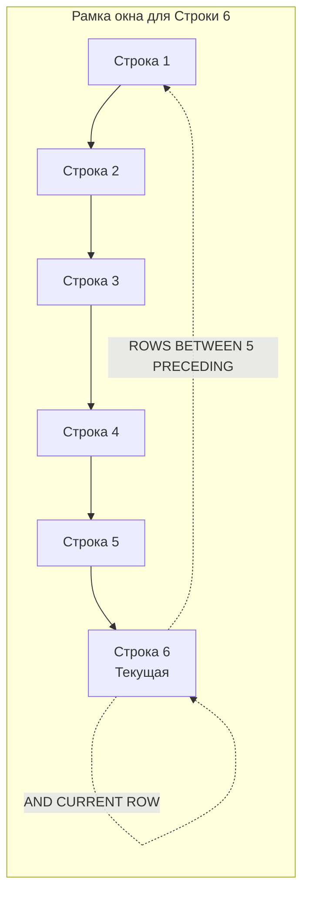

## Агрегация в окнах: Нарастающие итоги и скользящие средние

В предыдущих статьях мы подробно изучили функции ранжирования строк ([[4. ROW_NUMBER, RANK, DENSE_RANK]]) и позиционные смещения во времени ([[5. LEAD, LAG]]). Теперь мы подошли к самой фундаментальной причине, ради которой оконные механизмы вообще были введены в международный стандарт SQL:1999 — к вычислению классических **агрегатных функций** (`SUM`, `AVG`, `COUNT`, `MIN`, `MAX`) без катастрофического схлопывания исходного набора данных.

Если к привычной сумме добавить клаузу `SUM() OVER (...)`, мы получаем мгновенный нарастающий итог (Running Total). Если уточнить границы виртуальной рамки — получаем скользящее среднее (Moving Average), являющееся краеугольным камнем технического анализа, мониторинга сетевых метрик и финансовых отчетов. Однако за кажущейся декларативной простотой скрываются сложнейшие алгоритмы рантайма СУБД и неочевидные ловушки производительности.

---

## Спецификация рамки окна (Frame Specification)

Когда вы объявляете агрегатную оконную функцию с секцией `ORDER BY`, исполнитель запросов СУБД автоматически активирует понятие **рамки (Frame)** — точного подмножества строк внутри текущей партиции, над которым в данный момент вычисляется агрегат.

Согласно стандарту SQL, если в блоке `OVER()` присутствует `ORDER BY`, но границы рамки не заданы явно, СУБД применяет неявное правило по умолчанию:  
`RANGE BETWEEN UNBOUNDED PRECEDING AND CURRENT ROW`

В переводе на физический язык это означает: «Возьми все строки от самого начала текущей партиции вплоть до текущей позиции включительно и посчитай по ним агрегат». Именно эта неявная рамка и превращает обычную сумму в классический накопительный итог:

```sql
SELECT 
    transaction_id,
    amount,
    -- Нарастающий итог: сумма всех транзакций от первой до текущей
    SUM(amount) OVER (ORDER BY transaction_id) AS running_total
FROM transactions;
```

Если же секция `ORDER BY` внутри `OVER()` вообще опущена (например, `SUM(amount) OVER (PARTITION BY user_id)`), то рамкой по умолчанию становится **вся партиция целиком**:  
`RANGE BETWEEN UNBOUNDED PRECEDING AND UNBOUNDED FOLLOWING`

В этом случае каждая строка партиции получит одинаковое значение — полную сумму всех записей этой группы.

### Явное управление рамкой: Скользящее окно

В прикладной аналитике (биллинговые системы, трейдинг, анализ сетевого трафика) агрегация «от сотворения мира» нужна далеко не всегда. Гораздо чаще требуется скользящее окно фиксированной ширины — например, скользящая средняя цена актива за 5 последних замеров.

Синтаксическая конструкция явного управления рамкой строится из трех элементов:
- **Тип смещения**:
  - `ROWS` — физическое смещение, измеряемое строгим количеством строк.
  - `RANGE` — логическое смещение, вычисляемое по значениям выражения в `ORDER BY`.
- **Границы диапазона**: `BETWEEN ... AND ...` (между левой и правой границей).
- **Ключевые ориентиры**:
  - `UNBOUNDED PRECEDING` — от самого начала партиции;
  - `N PRECEDING` — $N$ строк до текущей;
  - `CURRENT ROW` — текущая строка;
  - `N FOLLOWING` — $N$ строк после текущей;
  - `UNBOUNDED FOLLOWING` — до самого конца партиции.

```sql
SELECT 
    date,
    price,
    -- Скользящее среднее: текущая строка и 5 предшествующих ей строк
    AVG(price) OVER (
        ORDER BY date 
        ROWS BETWEEN 5 PRECEDING AND CURRENT ROW
    ) AS moving_avg_5
FROM stock_prices;
```



---

## Под капотом: Инверсивные функции (Moving-Aggregate)

Наивный алгоритм вычисления скользящего агрегата в базе данных выглядел бы катастрофично: при переходе к каждой следующей строке движок заново сканировал бы всю рамку из $W$ строк и суммировал их с нуля. Сложность такого наивного подхода составляет $O(N \cdot W)$, где $N$ — число строк в таблице, а $W$ — размер окна. Для таблицы в миллион строк со скользящим окном в 1 000 записей это потребовало бы один миллиард операций суммирования!

> [!info] Под капотом
> Чтобы исключить квадратичные задержки, современные СУБД (включая PostgreSQL начиная с версии 11) реализуют специализированный режим вычислений — **Moving-Aggregate Mode**.
> 
> Внутреннее представление агрегатной функции в каталоге СУБД разделено на две подфункции:
> 1. **State Transition Function** (`sfunc`) — принимает текущее накопленное состояние и прибавляет к нему новое входящее значение.
> 2. **Inverse Transition Function** (`invfunc`) — принимает текущее накопленное состояние и **вычитает** из него значение строки, покидающей рамку окна.
> 
> Когда узел `WindowAgg` сдвигает рамку на одну строку вперед (строка 7 становится текущей вместо строки 6), исполнитель не пересчитывает сумму заново:
> - Он вызывает `invfunc`, чтобы вычесть значение выбывшей строки 1 из аккумулятора.
> - Он вызывает `sfunc`, чтобы прибавить значение вошедшей строки 7 к аккумулятору.
> 
> Благодаря этому вычисление скользящего агрегата превращается из $O(N \cdot W)$ в строго линейное **$O(N)$**! В оперативной памяти поддерживается лишь компактная структура аккумулятора (для `AVG` это всего два числа: текущая сумма и текущее количество элементов в рамке).

Однако здесь есть принципиальное алгоритмическое ограничение: **не для всех математических агрегатов существует обратная функция**. 

Функции `SUM()`, `AVG()` и `COUNT()` тривиально обратимы через вычитание. Но для `MIN()` и `MAX()` инверсивной функции не существует в природе: если текущий минимум покидает окно, невозможно угадать новое минимальное значение без повторного анализа оставшихся элементов! Для `MIN` и `MAX` в скользящих окнах PostgreSQL вынужден поддерживать внутри рамки двоичное дерево поиска (Tree), что увеличивает сложность до $O(N \log W)$ и требует дополнительного расхода оперативной памяти.

### Mechanical Sympathy: Память и Диск

При вычислении скользящих агрегатов узел `WindowAgg` обязан сохранять строки текущей рамки в памяти, чтобы передавать их аргументами в `invfunc` в момент выбывания.

Все эти буферы размещаются в пределах сессионного лимита `work_mem`. Если рамка оказывается гигантской (например, `ROWS BETWEEN 100000 PRECEDING AND CURRENT ROW`), а размер строки составляет несколько сотен байт, буфер рамки переполняет `work_mem`. В этот момент PostgreSQL сбрасывает содержимое фрейма во временные файлы на накопителе (`spill to disk`). Мгновенные процессорные операции на регистрах сменяются блокирующими системными вызовами ввода-вывода, и легковесный аналитический запрос парализует дисковую подсистему сервера.

---

## Ловушки ROWS vs RANGE

Путаница между спецификаторами `ROWS` и `RANGE` — одна из самых дорогостоящих ошибок в финансовом и биллинговом коде.

> [!warning] Ловушка / Gotcha
> По стандарту SQL неявная рамка при наличии `ORDER BY` — это `RANGE BETWEEN UNBOUNDED PRECEDING AND CURRENT ROW`.
> 
> Ключевое отличие:
> - `ROWS` отсчитывает строго **физические строки** в порядке следования в буфере памяти.
> - `RANGE` группирует строки по **логическому значению** ключа сортировки.
> 
> Если колонка `ORDER BY` содержит одинаковые значения (например, несколько финансовых транзакций произошли в одно и то же время `created_at = '12:00'`), спецификатор `RANGE` объединит **все** эти транзакции в одну логическую группу Peer Group. В результате для всех трех записей функция `SUM()` выдаст одинаковую общую сумму дня, перескочив через промежуточные нарастающие значения!
> 
> Если вам требуется честный, детерминированный нарастающий итог по каждой отдельной физической проводке, **всегда явно объявляйте спецификатор `ROWS`**:  
> `SUM(amount) OVER (ORDER BY created_at ROWS BETWEEN UNBOUNDED PRECEDING AND CURRENT ROW)`

---

## Взаимодействие с Go: Точность и типы данных

При извлечении результатов аналитических расчетов (в особенности накопительных сумм и средних значений) в сервисный слой на Go критически важно правильно выбрать типы данных для сканирования.

В СУБД операция `SUM(decimal)` возвращает точный тип `decimal`, а функция `AVG(integer)` в PostgreSQL возвращает тип `numeric`. Если попытаться отсканировать такое поле в стандартный примитив `float64` в Go, программа столкнется с фундаментальной проблемой неточности вещественной арифметики стандарта IEEE-754 (когда `0.1 + 0.2 = 0.30000000000000004`), либо драйвер базы данных завершит сканирование ошибкой, вернув точное число в виде `string`.

Для финансовых вычислений и ответственной аналитики в Go **категорически запрещено** использовать `float64`. Канонический подход — применение специализированных библиотек фиксированной точности, таких как `github.com/shopspring/decimal`.

```go
package repository

import (
	"context"
	"fmt"

	"github.com/jmoiron/sqlx"
	"github.com/shopspring/decimal"
)

// TransactionStats хранит результаты аналитики
type TransactionStats struct {
	TransactionID int64
	Amount        decimal.Decimal
	RunningTotal  decimal.Decimal
	MovingAvg     decimal.Decimal
}

const analyticsSQL = `
SELECT 
    transaction_id,
    amount,
    SUM(amount) OVER (
        ORDER BY created_at 
        ROWS BETWEEN UNBOUNDED PRECEDING AND CURRENT ROW
    ) AS running_total,
    AVG(amount) OVER (
        ORDER BY created_at 
        ROWS BETWEEN 6 PRECEDING AND CURRENT ROW
    ) AS moving_avg
FROM transactions
WHERE user_id = $1
ORDER BY created_at
`

// GetUserAnalytics демонстрирует безопасное сканирование денежных агрегатов
func GetUserAnalytics(ctx context.Context, db *sqlx.DB, userID int64) ([]TransactionStats, error) {
	rows, err := db.QueryxContext(ctx, analyticsSQL, userID)
	if err != nil {
		return nil, fmt.Errorf("failed to query user analytics: %w", err)
	}
	defer rows.Close()

	var results []TransactionStats

	for rows.Next() {
		var stat TransactionStats
		// Драйверы СУБД часто возвращают тип NUMERIC в виде текстовой строки или float64.
		// Наиболее надежный способ без потери точности — сканировать в строковые буферы.
		var (
			txID      int64
			amountStr string
			totalStr  string
			avgStr    string
		)

		if err := rows.Scan(&txID, &amountStr, &totalStr, &avgStr); err != nil {
			return nil, fmt.Errorf("failed to scan analytics row: %w", err)
		}

		stat.TransactionID = txID
		// Парсим строки в точные десятичные числа decimal.Decimal
		stat.Amount, _ = decimal.NewFromString(amountStr)
		stat.RunningTotal, _ = decimal.NewFromString(totalStr)
		stat.MovingAvg, _ = decimal.NewFromString(avgStr)

		results = append(results, stat)
	}

	if err := rows.Err(); err != nil {
		return nil, fmt.Errorf("rows iteration error: %w", err)
	}

	return results, nil
}
```

> [!info] Под капотом (Go)
> У математической точности `decimal.Decimal` есть физическая цена в памяти. 
> Пакет `shopspring/decimal` представляет число в виде структуры с указателем на `big.Int` или слайсом байтов для мантиссы. Каждое создание и арифметическая операция порождают аллокацию объекта в куче (Heap). 
> При выборке 10 000 строк парсинг строковых полей в `decimal` создаст десятки тысяч мелких объектов в куче, создав ощутимую нагрузку на Garbage Collector Go. Если абсолютная точность до копейки не требуется (например, вы анализируете метрики нагрузки CPU или RPS веб-сервера), смело используйте стандартный `float64` — он обрабатывается регистрами FPU/SSE процессора без единой аллокации памяти.

---

## Архитектурный выбор: БД vs Приложение

При проектировании высоконагруженных систем перед архитектором встает выбор: где производить расчет нарастающих итогов и скользящих окон — в базе данных средствами SQL или в коде приложения на Go?

- **Вычисления в БД (SQL):** Идеальны для аналитических панелей управления, выгрузок отчетов и умеренных нагрузок. Запрос формулируется декларативно и возвращает клиенту готовый обогащенный массив данных. Однако помните: ресурсы CPU базы данных — самый дорогой ресурс инфраструктуры, масштабируемый преимущественно вертикально.
- **Вычисления в Go:** Если через сервис проходят миллионы RPS (например, непрерывный поток телеметрии с датчиков IoT), перекладывать расчет скользящих средних на СУБД нерационально. Эффективнее забирать плоские потоковые данные и рассчитывать скользящие агрегаты в памяти сервиса на Go с помощью кольцевого буфера (Circular Buffer). Сервисы на Go тривиально масштабируются горизонтально в кластере Kubernetes, а кольцевой буфер фиксированного размера вычисляет скользящее среднее без единой аллокации в куче.

---

> [!tip] Собеседование
> **Вопрос:** В чем принципиальная разница между спецификаторами `ROWS` и `RANGE` в клаузе границ окна? Как это отразится на результате вычисления `SUM() OVER (ORDER BY date)`?
> 
> **Ответ:** Спецификатор `ROWS` оперирует физическим порядком строк в результирующем наборе (строки 1, 2, 3...). Спецификатор `RANGE` оперирует логическими значениями ключевого столбца `ORDER BY`. 
> 
> По стандарту SQL при наличии `ORDER BY` рамка по умолчанию неявно выставляется в `RANGE BETWEEN UNBOUNDED PRECEDING AND CURRENT ROW`. Если колонка `date` содержит дубликаты (несколько событий в один день), `RANGE` объединит их в одну группу и посчитает сумму всех событий этой даты целиком, вернув абсолютно одинаковое значение для всех строк этого дня. Если же требуется строгий нарастающий итог от строки к строке, необходимо явно объявлять `ROWS BETWEEN UNBOUNDED PRECEDING AND CURRENT ROW`.

---

## Итог

1. Агрегатные функции (`SUM`, `AVG`, `COUNT`, `MIN`, `MAX`) в оконных выражениях позволяют рассчитывать накопительные итоги и скользящие окна без схлопывания строк таблицы через `GROUP BY`.
2. Конструкция рамки окна `ROWS/RANGE BETWEEN ... AND ...` управляет глубиной и границами вычислений относительно текущей строки.
3. **Mechanical Sympathy:** Для скользящих окон СУБД задействует режим Moving-Aggregate с инверсивными функциями (`invfunc`), обеспечивая линейную сложность $O(N)$. Для неинвертируемых функций (`MIN`/`MAX`) алгоритмическая сложность возрастает до $O(N \log W)$.
4. Следите за размером рамки: фреймы на сотни тысяч строк переполняют буфер `work_mem` и вызывают аварийный сброс во временные файлы на диск (`spill to disk`).
5. В финансовом коде на Go используйте точные типы вроде `decimal.Decimal`, чтобы избежать погрешностей чисел с плавающей точкой, но учитывайте цену аллокаций в куче для GC.

Оконные функции и CTE дают исчерпывающий инструментарий для анализа данных вдоль строк. Но как быть, если аналитика требует транспонировать данные — превратить строки в столбцы сводной таблицы? В следующей статье мы разберем построение аналитических сводок: [[7. Pivot и аналитические запросы]].
