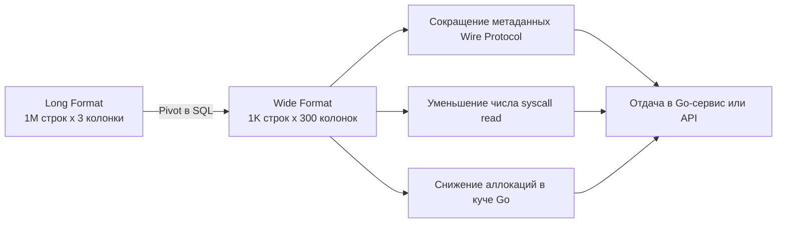

## Трансформация данных: Pivot (сводные таблицы) и аналитические запросы

В классических транзакционных реляционных хранилищах (OLTP, см. подробнее в [[3. Типы баз данных. OLTP vs OLAP]]) данные традиционно хранятся в «длинном» или «узком» формате (Long Format / Narrow). Каждая строка отражает ровно один атомарный факт или одну характеристику сущности: идентификатор пользователя, название купленного товара, сумму транзакции. Такой формат безупречно оптимизирован для вставок, нормализации данных и точечных обновлений по первичному ключу.

Однако человеческое восприятие устроено иначе. Финансовые директора, продуктовые аналитики и пользователи бизнес-интерфейсов мыслят категориями «сводных таблиц» (Pivot Tables / Wide Format). В них категории разворачиваются в заголовки столбцов, а на пересечении строк и колонок отображаются агрегированные значения. В офисных электронных таблицах вроде Excel сводная таблица строится парой движений мыши. В мире же реляционной алгебры трансформация плоских строк в динамические колонки требует от инженера глубокого понимания механики СУБД.

---

## Ручной Pivot через агрегацию и FILTER

Исторически разворот строк в столбцы на чистом SQL выполнялся через комбинацию группировки `GROUP BY` и условных конструкций `CASE WHEN`:

```sql
SELECT 
    user_id,
    SUM(CASE WHEN product = 'A' THEN amount ELSE 0 END) AS product_a,
    SUM(CASE WHEN product = 'B' THEN amount ELSE 0 END) AS product_b
FROM orders
GROUP BY user_id;
```

Этот подход абсолютно переносим между любыми реляционными движками, но страдает от двух недостатков: избыточного многословия и алгоритмической неэффективности. Для каждого обрабатываемого кортежа процессор СУБД вынужден последовательно вычислять все ветки условий `CASE`, даже если строка относится к совершенно другому товару (например, `product = 'C'`).

Современный стандарт SQL (нативно и эффективно поддерживаемый PostgreSQL) предлагает гораздо более производительную альтернативу — специализированную клаузу **`FILTER`**:

```sql
SELECT 
    user_id,
    SUM(amount) FILTER (WHERE product = 'A') AS product_a,
    SUM(amount) FILTER (WHERE product = 'B') AS product_b,
    SUM(amount) FILTER (WHERE product = 'C') AS product_c
FROM orders
GROUP BY user_id;
```

> [!info] Под капотом
> На аппаратном уровне клауза `FILTER` работает принципиально быстрее классического `CASE WHEN`. 
> 
> Когда физический узел агрегации `Aggregate` в PostgreSQL обрабатывает кортеж, он проверяет логический предикат клаузы `FILTER` **до** вызова функции перехода состояния (State Transition Function, `sfunc`).
> 
> Для `SUM(CASE WHEN ...)` СУБД вызывает функцию перехода для каждой строки, передавая 0. При использовании `SUM(...) FILTER (...)` движок мгновенно отбрасывает строку на уровне дешевой битовой проверки предиката, вообще не дергая `sfunc`. Для простых сумм это экономит такты процессора, а для тяжелых агрегатов (вроде `array_agg` или пользовательских агрегатов с выделением динамической памяти) дает взрывной выигрыш в скорости и расходе RAM.

---

## Crosstab (tablefunc): Нативный Pivot в PostgreSQL

Когда категорий много, ручное перечисление десятков блоков `FILTER` превращает SQL-скрипт в нечитаемую портянку кода. В экосистеме PostgreSQL существует штатное расширение `tablefunc`, предоставляющее специализированную функцию `crosstab`.

```sql
-- Шаг 1: Активируем расширение (выполняется однократно на уровне БД)
CREATE EXTENSION IF NOT EXISTS tablefunc;

-- Шаг 2: Выполняем транспонирование через функцию crosstab
SELECT *
FROM crosstab(
    'SELECT user_id, product, amount FROM orders ORDER BY 1,2'
) AS ct(user_id INT, product_a INT, product_b INT, product_c INT);
```

Функция `crosstab` принимает на вход параметризованный текст запроса, возвращающего три колонки: идентификатор строки (`row_name`), имя категории (`category`) и значение ячейки (`value`).

> [!warning] Ловушка / Gotcha
> Несмотря на кажущееся изящество, функция `crosstab` обладает серьезным архитектурным недостатком: она требует **жесткого статического объявления схемы вывода** в секции `AS ct(...)`. Если в таблице появится новый продукт `'D'`, `crosstab` просто проигнорирует его, пока разработчик вручную не изменит DDL/SQL запроса.
> 
> Кроме того, базовый вариант `crosstab` жестко завязан на порядок сортировки (`ORDER BY 1,2`). Если у какого-то пользователя отсутствует покупка продукта `'A'`, следующая категория `'B'` ошибочно встанет в первую колонку, вызвав тихое искажение данных! Чтобы избежать этого, приходится использовать двухпараметрическую версию `crosstab(source_sql, category_sql)`, что резко усложняет запрос.

---

## Mechanical Sympathy: Широкие строки и Сеть

При проектировании аналитических микросервисов на Go backend-инженер обязан учитывать физические аспекты передачи данных по локальной сети и шине памяти:

Сравним две модели представления одинакового объема информации (скажем, 3 000 000 значений):
- **Длинная таблица:** 1 000 000 строк $\times$ 3 колонки.
- **Широкая сводная таблица:** 1 000 строк $\times$ 3 000 колонок.

Хотя общее количество ячеек идентично, их сетевая и процессорная стоимость различается на порядки:

1. **Бинарный протокол СУБД (PostgreSQL Wire Protocol):** Протокол передачи данных между PostgreSQL и Go (`pgx` / `libpq`) является строго строчно-ориентированным (Row-based). Каждая строка обрамляется служебным протокольным заголовком с длинами полей и служебными OID типов данных. Передача 1 000 000 строк генерирует колоссальный сетевой оверхед по метаданным.
2. **Системные вызовы ядра и IO:** Чтение миллиона мелких строк заставляет сетевой стек Go-приложения выполнять миллионы циклов чтения из сокета и совершать лавинообразные системные вызовы `syscall read`. Транспонирование в широкую таблицу агрегатов на стороне БД сокращает количество строк до 1 000, сокращая число syscalls и снижая нагрузку на планировщик Go.
3. **Линии кэша процессора (CPU Cache Lines):** Внутри памяти сервера на Go широкие структуры плохо укладываются в стандартные 64-байтные кэш-линии CPU. Если пытаться делать транспонирование и агрегацию в Go-коде вручную, процессор будет непрерывно промахиваться мимо L1/L2 кэша при обходе столбцов. СУБД оптимизирует работу с дисковыми страницами и промежуточными буферами на порядок лучше, поэтому выполнять Pivot необходимо в ядре базы данных.



---

## Динамический Pivot в Go: Кошмар сканирования

В реальных бизнес-задачах список категорий для колонок сводной таблицы часто неизвестен заранее (например, месяцы продаж, динамические теги товаров или перечень активных регионов). В реляционной алгебре нельзя объявить `SELECT *`, колонки которого зависят от значений строк данных.

В результате мы не можем описать статическую структуру Go под результат запроса: библиотечный метод `sqlx.StructScan` здесь бессилен. Вам придется использовать динамическое сканирование через `sql.Rows.Columns()`.

```go
package repository

import (
	"context"
	"fmt"
	"strings"

	"github.com/jmoiron/sqlx"
)

// DynamicPivot возвращает срез мап, где ключ — динамическое имя колонки
type DynamicPivot = []map[string]any

// GetDynamicSalesReport генерирует и выполняет динамический Pivot
func GetDynamicSalesReport(ctx context.Context, db *sqlx.DB, year int) (DynamicPivot, error) {
	// Шаг 1: Извлекаем список уникальных категорий для колонок сводки
	var categories []string
	catQuery := `SELECT DISTINCT product FROM orders ORDER BY product`
	if err := sqlx.SelectContext(ctx, db, &categories, catQuery); err != nil {
		return nil, fmt.Errorf("failed to get categories: %w", err)
	}

	// Шаг 2: Программно формируем динамический SQL с клаузой FILTER
	pivotCols := make([]string, 0, len(categories))
	for _, cat := range categories {
		// ВАЖНО: Экранируем кавычки для защиты от синтаксических ошибок в именах колонок
		safeCat := strings.ReplaceAll(cat, "'", "''")
		pivotCols = append(pivotCols, fmt.Sprintf(
			`SUM(amount) FILTER (WHERE product = '%s') AS "%s"`, safeCat, cat,
		))
	}

	query := fmt.Sprintf(`
		SELECT user_id, %s 
		FROM orders 
		WHERE EXTRACT(YEAR FROM created_at) = $1
		GROUP BY user_id
	`, strings.Join(pivotCols, ", "))

	// Шаг 3: Выполняем динамический запрос к БД
	rows, err := db.QueryxContext(ctx, query, year)
	if err != nil {
		return nil, fmt.Errorf("failed to execute pivot query: %w", err)
	}
	defer rows.Close()

	// Извлекаем имена колонок из метаданных ответа СУБД
	colNames, err := rows.Columns()
	if err != nil {
		return nil, fmt.Errorf("failed to get columns: %w", err)
	}

	var result DynamicPivot

	for rows.Next() {
		// Выделяем массив пустых интерфейсов для сканирования произвольных типов
		values := make([]any, len(colNames))
		valuePtrs := make([]any, len(colNames))
		for i := range values {
			valuePtrs[i] = &values[i]
		}

		if err := rows.Scan(valuePtrs...); err != nil {
			return nil, fmt.Errorf("failed to scan dynamic row: %w", err)
		}

		// Маппим значения в динамическую хэш-таблицу
		rowMap := make(map[string]any, len(colNames))
		for i, colName := range colNames {
			val := values[i]
			// Драйверы СУБД часто возвращают байтовые слайсы для строк и чисел
			if b, ok := val.([]byte); ok {
				val = string(b)
			}
			rowMap[colName] = val
		}

		result = append(result, rowMap)
	}

	if err := rows.Err(); err != nil {
		return nil, fmt.Errorf("rows iteration error: %w", err)
	}

	return result, nil
}
```

> [!warning] Ловушка / Gotcha
> Динамическое сканирование в `map[string]any` и слайсы интерфейсов `[]any` — тяжелый архитектурный антипаттерн для высоконагруженных сервисов. 
> 
> На каждой строке выделяется динамическая хэш-таблица, а упаковка примитивных чисел в пустые интерфейсы `any` вызывает boxing и аллокации в куче (Heap). На выборке в 10 000 строк с 50 колонками этот код совершит сотни тысяч мелких аллокаций памяти, что приведет к катастрофической деградации GC Go и взрывному росту 99-го перцентиля задержки (p99 latency). 
> 
> Если данные предназначены для передачи во фронтенд через REST API, не разбирайте их в Go: поручите СУБД упаковать сводные данные прямо в бинарный JSON на уровне SQL (подробнее об этом в [[8. JSON в SQL]]), отдавая клиенту готовый срез байтов.

---

## Unpivot: Обратная операция

В процессах построения хранилищ данных (DWH) и интеграции с колоночными СУБД (ClickHouse) часто требуется обратная процедура — **Unpivot (де-пивотизация)**: развернуть широкую таблицу с десятками колонок обратно в узкий плоский формат.

В диалекте PostgreSQL отсутствует специализированный оператор `UNPIVOT` (известный по Oracle или MS SQL Server). Наивный способ — объединение через цепочку `UNION ALL`:

```sql
SELECT user_id, 'A' AS product, product_a AS amount FROM wide_table
UNION ALL
SELECT user_id, 'B' AS product, product_b AS amount FROM wide_table
UNION ALL
SELECT user_id, 'C' AS product, product_c AS amount FROM wide_table;
```

Главный физический порок такого решения: СУБД будет вынуждена выполнить три полных последовательных сканирования таблицы `wide_table`!

В PostgreSQL существует профессиональное и быстрое решение через связку **`LATERAL JOIN`** и функцию **`unnest`**:

```sql
SELECT 
    t.user_id, 
    v.product, 
    v.amount
FROM wide_table t,
LATERAL unnest(
    ARRAY['A', 'B', 'C'], 
    ARRAY[t.product_a, t.product_b, t.product_c]
) AS v(product, amount)
WHERE v.amount IS NOT NULL; -- Исключаем пустые пересечения
```

При таком подходе СУБД считывает страницу таблицы с диска ровно один раз, распаковывая массивы колонок в строки кортежей «на лету» в оперативной памяти процесса.

---

> [!tip] Собеседование
> **Вопрос:** Возможно ли средствами стандартного SQL построить динамический Pivot, если список значений для формирования колонок заранее неизвестен?
> 
> **Ответ:** Чистый реляционный SQL фундаментально запрещает динамическое изменение схемы колонок в секции `SELECT` во время исполнения: парсер и планировщик обязаны зафиксировать типы и количество колонок кортежа до начала физического сканирования данных. 
> 
> Существуют два инженерных решения этой проблемы:
> 1. **На стороне СУБД:** Использование процедурного языка PL/pgSQL, где хранимая процедура выполняет первый запрос за уникальными категориями, конструирует текст SQL-запроса в виде строки и выполняет его через команду `EXECUTE`.
> 2. **На стороне Go-бэкенда (Рекомендуемый):** Приложение выполняет легкий запрос за уникальными значениями, программно генерирует безопасный SQL-запрос с клаузой `FILTER`, выполняет его и сканирует результат через `rows.Columns()` либо сразу запрашивает агрегацию в JSONB на стороне базы данных.

---

## Итог

1. **Pivot** преобразует данные из длинного формата (Long/Narrow) в широкий (Wide/Pivot), создавая аналитические сводные таблицы.
2. Всегда отдавайте предпочтение современной клаузе **`FILTER (WHERE ...)`** вместо архаичного `CASE WHEN`: она отсекает строки до вызова функции перехода состояния агрегата (`sfunc`), экономя такты CPU.
3. Расширение `crosstab` (`tablefunc`) требует жесткого описания результирующей схемы колонок и чувствительно к пропускам данных.
4. **Mechanical Sympathy:** Сворачивание строк через Pivot в СУБД сокращает сетевой оверхед PostgreSQL Wire Protocol и количество системных вызовов `syscall read` в Go, но создает широкие строки, требующие осторожности с кэш-линиями CPU.
5. Для обратной операции (**Unpivot**) избегайте каскадных `UNION ALL`: используйте конструкцию `LATERAL JOIN` с функцией `unnest` над массивами для однократного чтения таблицы.

Трансформация строк и столбцов — мощнейший аналитический прием. Однако в современной веб-разработке все чаще требуется работать не просто со строками, а со сложными полуструктурированными документами. В следующей статье мы разберем, как SQL эффективно оперирует форматом JSON: [[8. JSON в SQL]].
