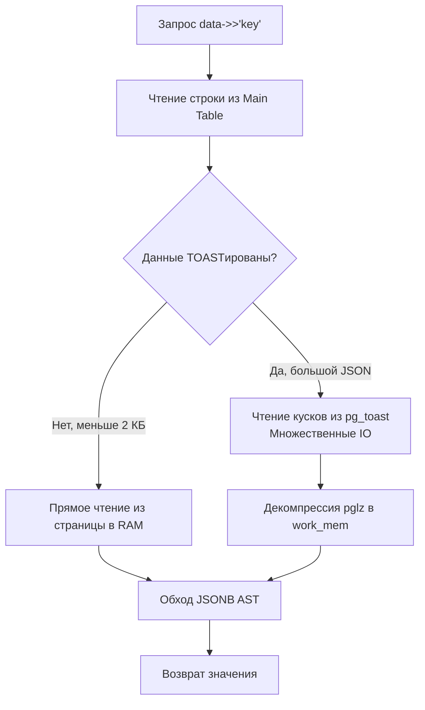

## JSON в SQL: Когда реляционности не хватает

Долгое время между миром реляционных баз данных и движением NoSQL шла непримиримая идеологическая война. Реляционные СУБД стояли на страже строгой нормализации, жестких схем данных и транзакционной целостности ACID. Документоориентированные хранилища (вроде MongoDB) предлагали разработчикам свободу от миграций схемы и возможность сохранять произвольные иерархические структуры данных прямо из кода на лету.

Сегодня эта граница окончательно стерта. Современные реляционные СУБД (в первую очередь PostgreSQL и MySQL) превратились в мощные гибридные платформы, умеющие хранить, индексировать и эффективно запрашивать полуструктурированные JSON-документы прямо внутри классических реляционных таблиц.

Для backend-разработчика на Go это открывает колоссальные возможности: вы можете сохранить «сырой» ответ от внешнего платежного шлюза, гибко расширять метаданные пользовательских профилей или конфигурировать виджеты интерфейса без выполнения болезненных DDL-миграций схемы на проде. Однако работа с JSON в реляционной базе таит в себе серьезные аппаратные ловушки, если не понимать физики его размещения на дисковых страницах.

---

## JSON vs JSONB в PostgreSQL

В PostgreSQL исторически поддерживаются два типа данных для работы с форматом JSON: текстовый `json` и бинарный `jsonb`. Выбор между ними — это фундаментальный инженерный компромисс между скоростью записи и эффективностью чтения:

- **`json` (Текстовый формат)**: Хранит точную посимвольную копию входной текстовой строки, включая исходные пробелы, переносы строк и порядок ключей. При каждом обращении вида `SELECT data->>'key'` движок СУБД вынужден на лету вызывать текстовый парсер, строить абстрактное синтаксическое дерево (AST) в оперативной памяти процесса, находить нужное поле и немедленно уничтожать AST. На интенсивном потоке чтений текстовый `json` превращается в беспощадного пожирателя тактов CPU.
- **`jsonb` (Декомпилированный бинарный формат)**: Преобразует входящую строку в оптимизированное бинарное представление непосредственно в момент записи. Парсинг происходит **ровно один раз**. На диск сохраняется не текст, а структурированное бинарное дерево. Запись обходится чуть дороже по тактам CPU, но чтение, фильтрация и извлечение атрибутов происходят с наносекундной скоростью. Самое главное: тип `jsonb` поддерживает индексацию через инвертированные индексы GIN.

> [!info] Под капотом
> Как устроен `jsonb` на физическом уровне? Это компактный бинарный контейнер, архитектурно родственный формату BSON.
> 
> Внутреннее представление опирается на служебные заголовки `JEntry`, содержащие битовые флаги типа данных и смещение значения в байтовом массиве. При сохранении в `jsonb` движок СУБД:
> 1. Сортирует все ключи объекта в лексикографическом (алфавитном) порядке, что позволяет искать нужный ключ методом быстрого бинарного поиска за $O(\log K)$ вместо линейного перебора всей строки.
> 2. Удаляет повторяющиеся ключи-дубликаты (сохраняя только последнее значение).
> 3. Отбрасывает незначимые пробелы и форматирование.
> 
> В результате два внешне разных JSON-текста с переставленными полями в типе `jsonb` преобразуются в абсолютно побайтово идентичные структуры данных.

---

## Mechanical Sympathy: TOAST и огромные документы

Физическая архитектура PostgreSQL построена вокруг дисковых страниц фиксированного размера — ровно **8 КБ**. Если размер строки таблицы вместе со всеми ее атрибутами превышает четверть страницы (около 2 КБ), активируется системный механизм **TOAST (The Oversized-Attribute Storage Technique)**.

Когда прикладной сервис сохраняет в колонку объемный JSONB-документ (например, массив событий телеметрии на 500 КБ), СУБД физически не способна разместить его на основной странице таблицы:

1. Движок сжимает документ встроенным алгоритмом компрессии pglz (или современным LZ4 в актуальных версиях PostgreSQL).
2. Сжатый бинарный блоб разрезается на чанки фиксированного размера (обычно по 2 КБ).
3. Чанки записываются в скрытую системную таблицу `pg_toast_<OID_таблицы>`, а в основной строке остается лишь компактный указатель (TOAST pointer) размером в несколько байт.



**Что происходит в железе при запросе `SELECT data->>'key' FROM users WHERE id = 1`:**
- Исполнитель мгновенно находит строку в основной таблице по индексу первичного ключа.
- Обнаружив TOAST-указатель, движок инициирует серию дополнительных дисковых обращений (Random IO) для последовательного считывания всех чанков из таблицы `pg_toast`.
- В оперативной памяти процесса выделяется буфер `work_mem`, куда алгоритм декомпрессии распаковывает исходный бинарник.
- Процессор выполняет обход дерева `jsonb` в поисках ключа `key`.

Если такой запрос выполняется с частотой в сотни раз в секунду, дисковая подсистема мгновенно захлебывается в состоянии IO wait, а ядра CPU утилизируются декомпрессией. 

**Золотое правило архитектора:** Храните в JSONB-колонках только компактные метаданные, непосредственно участвующие в бизнес-логике. Гигантские сырые пейлоады и логи выносите в объектные хранилища (S3 / MinIO), сохраняя в реляционной таблице лишь строковый URL.

---

## Операторы и индексация

Для навигации по структурам JSONB в SQL предусмотрен набор специализированных операторов:
- **`->`** извлекает поле объекта или элемент массива, **сохраняя тип `jsonb`**. Это позволяет строить цепочки вызовов: `data->'address'->'city'`.
- **`->>`** извлекает значение поля в виде скалярного текста **`text`** (примитив SQL).

Критический нюанс: операторы `->` и `->>` являются функциями. Попытка выполнить фильтрацию `WHERE data->>'status' = 'paid'` по неиндексированной таблице вызовет последовательное чтение всей таблицы (Seq Scan) с поштучной распаковкой каждого JSONB-документа на каждой строке.

Для индексации документов `jsonb` применяется специализированный инвертированный индекс **GIN (Generalized Inverted Index)**. Инвертированный индекс хранит ссылки вида «элемент JSON $\rightarrow$ список строк, где он встречается».

По умолчанию GIN-индекс (`jsonb_ops`) индексирует каждый отдельный ключ и значение. Но в реальных сервисах поиск ведется по целостным путям. Для минимизации размера индекса применяют класс операторов **`jsonb_path_ops`**, который хэширует полные пути:

```sql
-- Создание легковесного и быстрого GIN индекса
CREATE INDEX idx_orders_metadata ON orders USING GIN (metadata jsonb_path_ops);

-- Этот запрос ЭФФЕКТИВНО ИСПОЛЬЗУЕТ GIN-индекс (оператор @> - "содержит")
SELECT * FROM orders WHERE metadata @> '{"status": "paid"}';

-- Этот запрос НЕ МОЖЕТ ИСПОЛЬЗОВАТЬ данный GIN-индекс!
SELECT * FROM orders WHERE metadata->>'status' = 'paid';
```

> [!warning] Ловушка / Gotcha
> Из-за внутренней структуры GIN-индекса с классом `jsonb_path_ops` запрос с оператором извлечения текста `metadata->>'status' = 'paid'` будет проигнорирован планировщиком и приведет к полному сканированию таблицы (Full Table Scan)!
> 
> Всегда формулируйте поисковые предикаты через оператор вхождения **`@>`**. Если же бизнес-логика требует сравнений на больше/меньше (например, поиск пользователей с возрастом `age > 18`), используйте синтаксис JSON-path (`jsonb_path_query`) либо постройте функциональный B-tree индекс на вычисляемом выражении (Expression Index):  
> `CREATE INDEX idx_user_age ON users (((data->>'age')::int));`

---

## Взаимодействие с Go: Проблема двойного парсинга

При интеграции Go-сервисов с JSON-колонками базы данных разработчики регулярно попадают в классическую архитектурную ловушку — **двойной парсинг (Double Unmarshal)**.

Проследим цепочку трансформаций при наивном подходе:
1. PostgreSQL считывает бинарный `jsonb` со страниц диска.
2. Драйвер БД (`pgx`) преобразует бинарник в строку и передает ее в сетевой сокет.
3. Сервис на Go вызывает `json.Unmarshal`, разбирая текст в структуру в куче (Heap).
4. Сервис отдает данные клиенту, вызывая `json.Marshal`, превращая структуру обратно в срез байтов!

Если микросервис выступает в роли транзитного шлюза и не модифицирует поля JSON, эти двойные циклы сериализации и десериализации впустую сжигают гигагерцы CPU и порождают миллионы паразитных аллокаций памяти.

### Паттерн 1: json.RawMessage (Сквозное прокидывание)

Для транзитной отдачи JSON наружу используйте тип `json.RawMessage` из стандартного пакета `encoding/json` (под капотом это обычный срез байтов `[]byte`). Драйвер базы данных запишет сырые байты прямо в структуру Go, а вспомогательный хэндлер вроде `http.Json` отдаст их прямо в сокет, минуя вызов `Unmarshal`.

```go
package repository

import (
	"context"
	"encoding/json"
	"fmt"

	"github.com/jmoiron/sqlx"
)

// UserRaw представляет модель со сквозным JSON
type UserRaw struct {
	ID      int64           `db:"id" json:"id"`
	Profile json.RawMessage `db:"profile" json:"profile"` // Хранит сырые байты, исключая парсинг в Go
}

const getUserSQL = `SELECT id, profile FROM users WHERE id = $1`

// GetUser сканирует JSON без полного парсинга в Go
func GetUser(ctx context.Context, db *sqlx.DB, userID int64) (*UserRaw, error) {
	var u UserRaw
	// Драйвер pgx запишет сырые байты JSON в u.Profile
	if err := db.GetContext(ctx, &u, getUserSQL, userID); err != nil {
		return nil, fmt.Errorf("failed to get user: %w", err)
	}
	return &u, nil
}
```

### Паттерн 2: Строгая типизация (Бизнес-логика)

Если над полями документа производятся вычисления в коде (проверка статусов, расчет скидок), документ необходимо десериализовать в строгую типизированную структуру. Использование нетипизированных `map[string]any` в Go — это антипаттерн, приводящий к неконтролируемым паникам рантайма и утечкам памяти.

```go
// Строгая структура для бизнес-логики
type UserProfile struct {
	Email string `json:"email"`
	Age   int    `json:"age"`
}

type UserStrict struct {
	ID      int64       `db:"id" json:"id"`
	Profile UserProfile `db:"profile" json:"profile"`
}
```

### Паттерн 3: Частичное обновление (jsonb_set)

Типичная ошибка новичков: выгрузить весь 100-килобайтный JSON в Go-сервис, изменить одно поле в структуре, сериализовать документ целиком и выполнить тяжелый `UPDATE` всей колонки. Помимо неэффективного сетевого трафика, такой подход порождает гонки данных (Race Conditions) при конкурентных обновлениях соседних полей.

Для точечных модификаций используйте встроенную функцию СУБД **`jsonb_set`**:

```sql
-- Обновляет только поле status, не затрагивая остальные атрибуты
UPDATE orders 
SET metadata = jsonb_set(metadata, '{status}', '"shipped"'::jsonb)
WHERE id = $1;
```

> [!info] Под капотом
> Важно понимать механику многоверсионности PostgreSQL (MVCC): функция `jsonb_set` не выполняет физическую модификацию документа «на месте» (in-place). 
> Так как `jsonb` представляет собой иммутабельное дерево, а модель MVCC требует создания новой версии всей строки таблицы при любом `UPDATE`, СУБД копирует дерево документа, подменяет в нем целевой узел и записывает новую бинарную структуру в свежий кортеж. Тем не менее, это в разы быстрее и безопаснее, чем пересылать мегабайты данных через сетевой сокет в приложение и обратно.

---

> [!tip] Собеседование
> **Вопрос:** В чем заключается принципиальная разница между типами `json` и `jsonb` в PostgreSQL? Какой тип следует выбирать в производственных системах и почему?
> 
> **Ответ:** Тип `json` сохраняет исходный входной текст как есть, требуя повторного синтаксического разбора (парсинга) при каждом обращении к полям. Тип `jsonb` выполняет однократный парсинг при вставке и сохраняет данные в структурированном бинарном виде с отсортированными ключами и заголовками `JEntry`.
> 
> В 99% промышленных задач следует безальтернативно использовать `jsonb`: он обеспечивает на порядки более быстрое чтение, исключает накладные расходы на постоянный парсинг и поддерживает инвертированные GIN-индексы для мгновенного поиска. Текстовый `json` оправдан лишь в редчайших сценариях, когда законодательно или технически требуется сохранить посимвольное исходное форматирование документа (пробелы, отступы и исходный порядок ключей).

---

## Итог

1. В PostgreSQL всегда выбирайте тип **`jsonb`**: однократный парсинг при записи окупается наносекундным доступом на чтении.
2. **Mechanical Sympathy:** Документы объемом более 2 КБ вытесняются в системную таблицу **TOAST**, порождая случайные операции ввода-вывода (IO wait) и нагрузку на CPU при декомпрессии (pglz/LZ4).
3. Для ускорения поиска создавайте **GIN-индексы** с классом `jsonb_path_ops` и используйте оператор включения `@>`.
4. В коде на Go устраняйте «двойной парсинг»: если пейлоад транзитный, применяйте `json.RawMessage` для прямой пересылки байтов из БД в сетевой сокет.
5. Для модификации документов применяйте функцию `jsonb_set` на стороне СУБД, защищаясь от Race Conditions и разгружая сеть.

Формат JSON стирает границы между реляционной строгостью и гибкостью документов. Но наряду с объектами в SQL есть еще одна полуструктурированная возможность — нативные массивы значений. В следующей статье мы разберем: [[9. Работа с массивами]].
