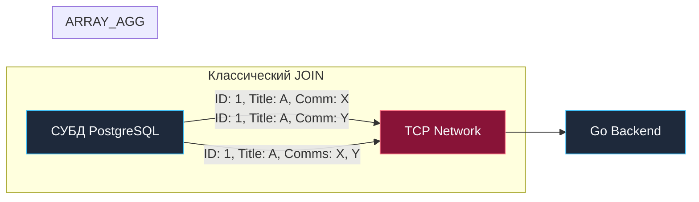

## Нарушая правила: Зачем массивы в реляционной БД

Классическая реляционная теория баз данных, сформулированная Эдгаром Коддом, бескомпромиссна: фундаментом модели является первая нормальная форма ([[10. Первая нормальная форма 1NF]]), требующая абсолютной атомарности значений в каждой ячейке строки. Никаких списков, никаких повторяющихся групп. Если у сущности «статья» есть несколько меток (тегов), академический канон обязывает создать отдельную таблицу связей `article_tags` и соединять данные через классический `JOIN` ([[6. JOIN. INNER, LEFT, RIGHT]]).

Однако в реальных высоконагруженных промышленных системах догматическая нормализация нередко превращается в главный инфраструктурный затор (Bottleneck). Каждый `JOIN` требует вычислений на CPU сервера базы данных. Но что еще критичнее — при соединении отношений «один-ко-многим» (1:M) реляционный движок дублирует поля родительской сущности на каждой строке дочерней записи, в разы раздувая сетевой трафик (Network IO) и нагрузку на сетевые сокеты приложений.

Современные зрелые СУБД (в первую очередь PostgreSQL и колоночная ClickHouse) предлагают прагматичный инженерный выход — **нативные массивы**. Массивы позволяют хранить однородные множества значений прямо в ячейке таблицы, осознанно нарушая 1NF ради радикального сокращения I/O, уменьшения сетевого оверхеда и упрощения архитектуры.

> [!info] Под капотом: Массивы vs JSONB
> Начинающие инженеры нередко путают нативные массивы с хранением списков в [[8. JSON в SQL]]. 
> 
> Массивы в PostgreSQL **строго типизированы** на уровне каталога типов (`TEXT[]`, `INT[]`, `BIGINT[]`). Благодаря строгой однородности данных:
> 1. Массивы занимают существенно меньше места на диске, так как не содержат ключей объектов, кавычек и метаданных типов JSON.
> 2. Бинарный протокол СУБД сериализует массив как непрерывный непрерывно выровненный буфер в памяти, исключая необходимость текстового или AST-парсинга.
> 3. На стороне Go массив напрямую отображается в нативные срезы (slices) языка без промежуточной десериализации. Если вам требуется простой список идентификаторов, тегов или статусов — всегда выбирайте нативные массивы, а не `JSONB`.

---

## Базовый синтаксис и операторы (на примере PostgreSQL)

Объявление колонки с массивом в DDL выглядит лаконично:

```sql
CREATE TABLE articles (
    id BIGSERIAL PRIMARY KEY,
    title TEXT NOT NULL,
    tags TEXT[] -- Массив строк переменной длины
);
```

Вставка данных в массив может выполняться в двух форматах:

```sql
-- Формат конструктора ARRAY (предпочтительный, типобезопасный и читаемый)
INSERT INTO articles (title, tags) 
VALUES ('Golang GC', ARRAY['golang', 'runtime', 'gc']);

-- Формат строкового литерала (исторический синтаксис)
INSERT INTO articles (title, tags) 
VALUES ('PostgreSQL Tuning', '{"sql", "postgres"}');
```

### Фильтрация и поиск

Для эффективного поиска по массивам стандартные операторы `=` и `LIKE` не подходят. В PostgreSQL реализован богатый набор специализированных операторов работы с множествами:

```sql
-- 1. Содержит ли массив конкретный элемент? (Оператор ANY)
SELECT title FROM articles WHERE 'golang' = ANY(tags);

-- 2. Содержит ли массив ВСЕ указанные элементы? (Оператор @> - contains)
SELECT title FROM articles WHERE tags @> ARRAY['golang', 'runtime'];

-- 3. Есть ли хотя бы одно пересечение? (Оператор && - overlap / intersects)
SELECT title FROM articles WHERE tags && ARRAY['golang', 'java'];
```

---

## Индексирование массивов: GIN индекс

Если вы попытаетесь отфильтровать таблицу на 10 миллионов строк условием `'golang' = ANY(tags)` без специализированного индекса, СУБД будет вынуждена выполнить последовательное сканирование (`Sequential Scan`). Классический B-Tree индекс бессилен: он умеет сравнивать только значение ячейки целиком, но не способен заглянуть внутрь массива.

Для индексации элементов массивов применяется **GIN (Generalized Inverted Index)** — инвертированный индекс.

```sql
-- Создание инвертированного GIN-индекса по массиву тегов
CREATE INDEX idx_articles_tags ON articles USING GIN (tags);
```

**Mechanical Sympathy: Как GIN устроен изнутри?**  
В отличие от B-Tree, где каждой строке таблицы соответствует один ключ в индексе, GIN «разворачивает» массив на атомарные составляющие. Для каждого уникального значения (например, строки `'golang'`) создается узел в поисковом B-дереве, а в листовой странице хранится компактный сжатый список ссылок — **Posting List** (список идентификаторов строк таблицы — TID, где данный тег встречается). Операторы `@>` и `&&` выполняют пересечение и объединение битовых масок этих списков на уровне регистров CPU с колоссальной скоростью.

> [!warning] Ловушка / Gotcha: GIN и цена записи
> Инвертированный индекс GIN крайне дорог в обслуживании при операциях модификации данных. При вставке строки с массивом из 10 элементов СУБД обязана обновить поисковые списки Posting List в 10 различных местах индекса! 
> 
> В высокоинтенсивных на запись таблицах (Write-Heavy) GIN-индекс может легко стать главным узким местом по блокировкам и дисковому вводу-выводу. Для смягчения этой нагрузки в PostgreSQL предусмотрен механизм отложенного накопления **Fast Update**: изменения сначала буферизуются во временном плоском списке и лишь затем пачками сбрасываются в основное дерево GIN. Но фундаментальное правило неизменно: за высокую скорость поиска по массивам приходится расплачиваться снижением пропускной способности вставок.

---

## Магия трансформаций: UNNEST и ARRAY_AGG

В арсенале backend-разработчика есть две фундаментальные функции, превращающие работу с массивами в мощный конвейер трансформаций данных: распаковка (Explode) и свертка (Fold).

### UNNEST (Разворачивание)

Функция `unnest()` превращает элементы массива в независимые физические строки результирующего набора. Это необходимо, когда требуется выполнить классическое реляционное соединение (`JOIN`) по элементам массива.

```sql
SELECT id, title, unnest(tags) AS tag 
FROM articles;
```

*Результат:* Если у статьи с `id = 1` было три тега, функция сгенерирует три отдельные строки с дублированием `id` и `title`, но уникальным значением `tag` в каждой.

### ARRAY_AGG (Агрегация)

Функция `array_agg()` выполняет строго обратное действие: она собирает множество строк (обычно после группировки `GROUP BY` или из связанной таблицы `JOIN`) и компактно упаковывает их в единый массив.

**Это канонический паттерн для устранения [[13. N+1 проблема]] и колоссальной экономии Network I/O.**

Рассмотрим классическую связь «один-ко-многим» (1:M): статья и привязанные к ней комментарии (`comments`).

**❌ Наивный реляционный подход (избыточный трафик):**

```sql
SELECT a.id, a.title, c.text
FROM articles a
LEFT JOIN comments c ON a.id = c.article_id;
```

Если у популярной статьи 1 000 комментариев, СУБД передаст по сети 1 000 строк. При этом тяжелые поля родительской статьи (`id`, `title`, длинный текст) будут продублированы ровно 1 000 раз, впустую забивая сетевую полосу пропускания и буферы TCP-сокетов.

**✅ Высокопроизводительный подход (ARRAY_AGG):**

```sql
SELECT 
    a.id, 
    a.title, 
    array_agg(c.text) AS comments_array
FROM articles a
LEFT JOIN comments c ON a.id = c.article_id
GROUP BY a.id, a.title;
```



СУБД выполняет упаковку данных в локальной памяти и отправляет по сети ровно **одну** компактную строку на каждую статью. Нагрузка на сеть и системные вызовы чтения в сервисе на Go сокращается на порядки.

---

## Работа с массивами в Go

При использовании стандартного интерфейса `database/sql` драйвер базы данных изначально не знает, как отобразить бинарный массив СУБД в нативный срез Go `[]string` или `[]int64`. Для этого исторически применялась вспомогательная обертка драйвера `pq.Array`:

```go
package repository

import (
	"context"
	"database/sql"
	"fmt"

	"github.com/lib/pq"
)

type Article struct {
	ID    int64
	Title string
	Tags  []string
}

func GetArticle(ctx context.Context, db *sql.DB, id int64) (Article, error) {
	query := `SELECT id, title, tags FROM articles WHERE id = $1`

	var a Article
	// Оборачиваем целевой срез в pq.Array для корректной десериализации
	err := db.QueryRowContext(ctx, query, id).Scan(&a.ID, &a.Title, pq.Array(&a.Tags))
	if err != nil {
		return a, fmt.Errorf("failed to scan article: %w", err)
	}

	return a, nil
}
```

> [!tip] Собеседование: pgx vs lib/pq
> На собеседованиях Senior Go-разработчиков часто проверяют знание актуального стека драйверов.
> 
> Исторический драйвер `github.com/lib/pq` официально находится в статусе maintenance (только критические исправления). Современным отраслевым стандартом де-факто является драйвер **`github.com/jackc/pgx`**. 
> 
> В отличие от `lib/pq`, драйвер `pgx` обладает глубокой нативной поддержкой бинарного протокола PostgreSQL: он позволяет напрямую передавать срезы Go в качестве параметров (`WHERE id = ANY($1)`) и сканировать колонки массивов прямо в стандартные срезы `[]string` или `[]int64` без каких-либо сторонних адаптеров вроде `pq.Array`. Это полностью устраняет промежуточные аллокации в куче (Heap) и снижает нагрузку на Garbage Collector Go. Подробнее об этом читайте в [[1. Работа с БД в Go. database_sql]].

---

## TOAST: Цена больших массивов

Массивы открывают свободу хранить сотни килобайт связанных данных в одной строке. Однако за этим удобством стоит строгая физика подсистемы хранения СУБД.

Физическая дисковая страница (Page) в PostgreSQL имеет фиксированный размер — **8 Килобайт**. Кортеж строки не может превышать размер страницы. Если поместить в массив `TEXT[]` массив логов или телеметрии размером более 2 КБ, СУБД принудительно задействует системный механизм **TOAST (The Oversized-Attribute Storage Technique)**.

База данных сжимает массив (алгоритмами PGLZ или LZ4), делит его на блоки и складывает в скрытую системную таблицу TOAST. В основной строке таблицы остается лишь числовой указатель (Oid) на эти физические блоки.

**Mechanical Sympathy (Скрытый I/O):**  
Когда разработчик неосмотрительно выполняет запрос `SELECT * FROM articles`, СУБД считывает основную страницу, обнаруживает указатель TOAST и вынуждена выполнить серию **дополнительных случайных чтений с диска (Random I/O)** для выгрузки и декомпрессии чанков массива. Если массив тегов или комментариев на самом деле не требовался в вызывающем коде, вы впустую нагружаете дисковый массив и прожигаете процессорные такты на декомпрессию.

---

## Итог

1. **Массивы в реляционной СУБД** — это осознанный архитектурный компромисс и контролируемое отступление от 1NF, позволяющее устранить избыточные `JOIN` и сэкономить Network I/O между сервисом на Go и базой данных.
2. В отличие от `JSONB`, массивы строго типизированы (`TEXT[]`, `INT[]`), компактнее на диске и не требуют синтаксического разбора текстовых деревьев.
3. Для эффективного поиска по массивам (операторы `@>`, `&&`, `= ANY(...)`) создавайте инвертированные **GIN-индексы**. Помните о цене: GIN существенно снижает скорость вставок (`INSERT`) в Write-Heavy сценариях.
4. Функция **`array_agg()`** служит мощным оружием против проблемы N+1, сворачивая дочерние строки в единый компактный массив на стороне СУБД.
5. В экосистеме Go используйте современный драйвер `pgx`, напрямую читающий массивы в срезы Go без дополнительных аллокаций.
6. Помните о **TOAST**: массивы объемом свыше 2 КБ вызывают декомпрессию и случайный ввод-вывод (Random I/O). Никогда не делайте `SELECT *` над таблицами с тяжелыми массивами.

Мы детально освоили продвинутые декларативные возможности SQL. Но что делать, если бизнес-логика транзакции становится настолько сложной и тесно связанной с данными, что пересылать промежуточные результаты между Go-сервисом и СУБД становится непозволительно дорого? В таких случаях код переезжает жить непосредственно внутрь ядра базы данных. В следующей статье мы разберем: [[10. Хранимые процедуры и функции]].