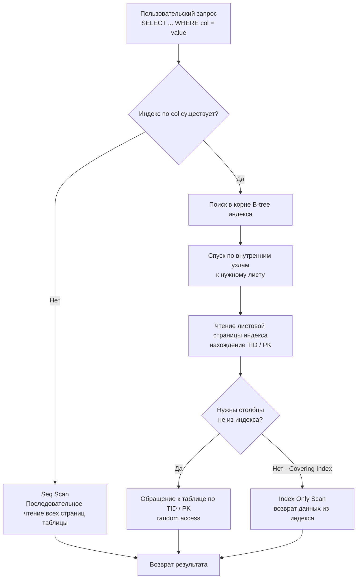

## Что такое индекс и зачем он нужен: От Seq Scan к логарифмическому поиску

Когда начинающий разработчик впервые знакомится с реляционными базами данных, окружающий мир кажется обманчиво простым и предсказуемым. Есть таблицы, состоящие из строк и столбцов, и мы пишем интуитивно понятный запрос:  
`SELECT * FROM users WHERE email = 'alice@example.com'`.  
На локальной машине разработчика с синтетической базой в тысячу строк ответ прилетает за долю миллисекунды. Возникает опасная иллюзия, будто реляционная СУБД обладает врожденной способностью мгновенно находить нужные байты в любых условиях.

Но стоит сервису выйти в производственную эксплуатацию, а таблице разрастись до десятков миллионов или миллиардов записей, как тот же самый запрос начинает зависать на секунды, а то и десятки секунд. Серверные процессоры раскаляются до 100%, дисковые очереди переполняются, а время ответа API устремляется в бесконечность. 

Причина этой драмы кроется в законах физики хранения данных: не имея вспомогательных ориентиров, база данных вынуждена физически поднять с накопителя в память **каждую страницу и каждую строку таблицы**, чтобы побайтово проверить условие `email = ...`. Этот режим называется **Seq Scan** (Sequential Scan, последовательное сканирование), и его вычислительная сложность строго линейна — $O(N)$ от физического размера отношения.

**Индекс** — это специализированная вспомогательная структура данных, позволяющая отыскать целевые кортежи без сплошного перебора таблицы. 

Каноническая физическая модель: представьте фундаментальную энциклопедию на 1 500 страниц. Если вам нужно найти упоминание концепции «виртуальная память», без предметного указателя вы будете вынуждены перелистывать том страница за страницей от корки до корки. Предметный алфавитный указатель в конце книги (индекс) позволяет за секунду найти нужный термин на букву «В» и сразу перейти к странице 412.

---

### Что такое индекс

Индекс представляет собой физически обособленную структуру данных, размещенную в отдельных файлах на диске и кэшируемую в буферном пуле СУБД. Он содержит упорядоченные (отсортированные) значения одного или нескольких целевых столбцов таблицы вместе со служебными физическими указателями на соответствующие строки в основной таблице.

Благодаря строгой упорядоченности ключей база данных отказывается от линейного сканирования $O(N)$ и переходит к логарифмическому поиску $O(\log N)$ (двоичный поиск по страницам индекса), радикально сокращая количество операций дискового ввода-вывода (IOPS).

**Фундаментальные цели создания индексов:**
- **Ускорение фильтрации строк:** Мгновенный поиск по селективным предикатам в секции `WHERE` (в особенности по операторам точного совпадения `=`, диапазонов `>`, `<`, `BETWEEN` и перечислений `IN`).
- **Оптимизация соединений (`JOIN`):** Превращение ресурсоемких соединений по внешним ключам из квадратичных циклов в эффективные цепочки точечных выборок.
- **Устранение накладных расходов на сортировку и группировку:** Поддержка операций `ORDER BY` и `GROUP BY` без создания тяжелых временных файлов и алгоритмов внешней сортировки, если индекс уже физически упорядочен требуемым образом.
- **Исключение обращений к физической таблице:** Режим **Covering Index** (покрывающий индекс / Index Only Scan), когда абсолютно все запрашиваемые в `SELECT` столбцы уже содержатся внутри самого индекса, избавляя СУБД от необходимости читать страницы самой таблицы.

---

### Механическая аналогия: как бы мы сделали это в Go

Чтобы почувствовать механику работы индекса, представим, как мы решаем задачу быстрого поиска сущностей в оперативной памяти на языке Go:

1. **Хэш-таблица (`map[string]User`):** Обеспечивает амортизированную сложность поиска за $O(1)$. Однако хэш-мапа фундаментально не сохраняет порядок следования ключей. Она бесполезна, если вам требуются выборки по диапазонам (`BETWEEN 10 AND 20`, `> 100`) или упорядоченный вывод.
2. **Отсортированный срез (`slice`) и бинарный поиск (`sort.Search`):** Мы держим элементы упорядоченными по первичному ключу. Поиск любого элемента занимает логарифмическое время $O(\log N)$ и легко поддерживает сканирование диапазонов по соседним ячейкам.

Именно этот принцип лежит в основе классического B-tree индекса. Однако оперативная память и блочные накопители живут по разным законам. В отличие от оперативной памяти, где байты адресуются поштучно, контроллер SSD или жесткого диска читает и пишет данные фиксированными физическими блоками — **страницами (Pages)**, стандартный размер которых в PostgreSQL составляет **8 КБ** (в MySQL/InnoDB — 16 КБ). B-tree индекс адаптирует бинарный поиск под блочную природу диска, организуя узлы дерева в виде страниц фиксированного размера.

> [!info] Под капотом
> В подавляющем большинстве промышленных реляционных СУБД (PostgreSQL, MySQL/InnoDB, Oracle, SQLite) индексом по умолчанию является сбалансированное B-дерево (B-tree) или его вариация $B^+$-tree. Внутреннее устройство страниц, балансировку и расщепление узлов мы детально разберем в следующей статье [[2. B Tree индекс под капотом]]. 
> 
> Индекс — это не некая абстрактная «магия СУБД», а строго детерминированная структура данных на диске, целиком подчиняющаяся законам иерархии памяти (L1/L2/L3 кэши процессора, RAM, NVMe).

---

### Как выглядит выполнение запроса с индексом и без

Разница в объеме выполняемой аппаратурой работы колоссальна:
- **При Seq Scan** база данных обязана прокачать через шину памяти контроллера накопителя **абсолютно всю таблицу** (например, 100 ГБ сырых страниц с диска).
- **При Index Scan** движок СУБД считывает 3–4 индексные страницы (корень, промежуточные узлы, лист B-дерева) и точечно забирает несколько целевых страниц самой таблицы.

На физических накопителях, где задержка случайного чтения (Random Read Latency) измеряется миллисекундами на HDD или десятками микросекунд на NVMe SSD, сокращение числа чтений с миллионов до единиц превращает 30-секундный запрос в 1-миллисекундный отклик.

---

### Первичный и вторичные индексы

В архитектуре реляционных движков существует глубокая разница между первичными и вторичными индексами:

- **Первичный индекс:**
  - В **PostgreSQL** таблицы организованы как неупорядоченные кучи страниц (Heap Tables). Первичный индекс — это автоматически создаваемое уникальное B-дерево над первичным ключом (`PRIMARY KEY`), листовые узлы которого содержат физические адреса кортежей в куче — идентификаторы строк (`ctid`).
  - В **MySQL/InnoDB** таблица фундаментально организована как **кластерный индекс (Clustered Index)**: сами строки таблицы физически упорядочены и хранятся прямо в листовых страницах B-tree первичного ключа. Сама таблица *и есть* первичный индекс.
- **Вторичные индексы:**
  - Это любые дополнительные индексы, создаваемые инженером вручную через команду `CREATE INDEX`.
  - В **PostgreSQL** вторичный индекс хранит значение индексируемой колонки и физический адрес строки в куче (`ctid`).
  - В **MySQL/InnoDB** вторичный индекс хранит значение индексируемой колонки и... значение **первичного ключа**! Чтобы извлечь остальные колонки строки, движок вынужден совершить повторный поиск по первичному B-дереву — операцию, известную как **bookmark lookup** (поиск по закладке).

> [!warning] Ловушка / Gotcha
> В MySQL/InnoDB чтение через вторичный индекс без покрытия (когда запрашиваются поля, отсутствующие во вторичном индексе) порождает двойной обход B-дерева: сначала спуск по вторичному индексу за первичным ключом, а затем полноценный спуск по кластерному индексу за телом строки. 
> 
> В PostgreSQL двойного спуска по дереву нет, однако обращение к куче по физическому адресу `ctid` представляет собой нерегулярный случайный доступ (Random Access) к дисковым страницам, что при большом объеме строк может свести выигрыш от индекса на нет.

---

### Индекс ускоряет не только WHERE

Распространенное заблуждение — считать индекс исключительно средством ускорения фильтра `WHERE`. В реальности спектр его применения гораздо шире:

1. **Сортировка (`ORDER BY col`):** Поскольку листовые страницы B-tree индекса уже физически связаны в двусвязный список в отсортированном порядке, СУБД может просто пройти по ним последовательно. Запрос возвращает отсортированный результат без тяжелой файловой сортировки во временных файлах диска.
2. **Группировка (`GROUP BY col`):** Движок использует физический порядок индекса для мгновенной потоковой агрегации групп, избавляясь от построения хэш-таблиц в оперативной памяти.
3. **Соединения (`JOIN`):** При соединении отношений по внешнему ключу без индекса СУБД вынуждена выполнять квадратичный алгоритм Nested Loop с полным сканированием дочерней таблицы для каждой строки родителя. Индекс превращает внутренний шаг в точечный поиск по B-дереву.

---

### Цена индекса: Mechanical Sympathy

Индексы в базе данных никогда не бывают бесплатными. Каждый созданный индекс — это явный архитектурный компромисс между скоростью чтения и ценой записи.

Каждая операция вставки (`INSERT`), обновления (`UPDATE`) или удаления (`DELETE`) кортежа обязывает ядро СУБД синхронно модифицировать **абсолютно все существующие индексы на данной таблице**.

Физические накладные расходы включают:
- **Случайный ввод-вывод (Random IO):** Страницы разных индексов разбросаны по адресному пространству накопителя.
- **Расщепление страниц (page split):** Если листовая 8-килобайтная страница индекса заполнена, движок вынужден аллоцировать новую страницу, переносить половину ключей и корректировать ссылки родительских узлов, порождая каскадные блокировки.
- **Раздувание журнала упреждающей записи WAL:** Каждая модификация страниц каждого индекса обязана быть зафиксирована в журнале предзаписи (см. [[8. WAL. Write Ahead Log]]).

> [!tip] Собеседование
> **Вопрос:** Почему на таблицах с интенсивным потоком записи (Write-Heavy) крайне опасно бездумно создавать множество вторичных индексов?
> 
> **Ответ:** Каждый дополнительный индекс экспоненциально увеличивает аппаратную стоимость операций записи (Write Amplification). При добавлении одной строки СУБД вынуждена записать саму строку в кучу и обновить $K$ деревьев индексов, вызывая каскадные page split и генерируя лавинообразный объем WAL-трафика. 
> 
> Грамотный инженер всегда балансирует SLA чтения и записи. На высоконагруженных транзакционных таблицах лучше допустить небольшое замедление редкого аналитического чтения, чем положить дисковую подсистему и процессор на основном потоке вставок.

Кроме того, индексы непрерывно конкурируют за самый ценный ресурс сервера — оперативную память буферного пула (Buffer Pool). Если неиспользуемый индекс занимает десятки гигабайт, он вымывает из оперативной памяти горячие страницы данных, провоцируя лавину промахов кэша (cache miss) и заставляя СУБД читать данные с физического диска.

---

### Когда индекс бесполезен

Планировщик запросов СУБД (см. подробнее в [[10. План выполнения запроса. EXPLAIN]]) — прагматичный калькулятор стоимости. Он нередко осознанно отказывается от существующего индекса в пользу полного сканирования таблицы (Seq Scan) в следующих сценариях:

1. **Компактные таблицы:** Если вся таблица целиком помещается на 2–3 дисковых страницах в оперативной памяти, последовательное чтение отработает быстрее, чем инициализация механизма обхода индексного дерева.
2. **Низкая селективность данных:** Если колонка содержит всего несколько уникальных значений (например, логический флаг `is_active` или статус `gender`), условие `WHERE is_active = true` вернет 80% всех строк таблицы. Выполнять 800 000 случайных переходов по физическим указателям к куче обойдется на порядки дороже, чем последовательно прочитать файл таблицы от начала до конца за один непрерывный дисковый проход.
3. **Запросы без предикатов:** Базовый `SELECT * FROM table` всегда выполняется через Seq Scan, если в запросе отсутствует `ORDER BY` по подходящему индексу.
4. **Нарушение порядка колонок в составном индексе:** Индекс по колонкам `(a, b)` физически отсортирован сначала по `a`, а затем по `b`. Он принципиально не способен помочь запросу, фильтрующему только по предикату `WHERE b = 42` (подробный разбор механики читайте в [[5. Composite индексы]]).

---

### Индексы и Go-разработчик

При разработке сервисов на Go через стандартный пакет `database/sql` или сторонние ORM-библиотеки инженер обязан ясно представлять физический маршрут исполнения каждого SQL-запроса. Простое добавление нового условия фильтрации в динамически формируемый SQL-запрос способно в один миг превратить молниеносный `Index Scan` в сокрушительный `Seq Scan` на промышленной базе данных.

Главный рабочий инструмент инженера — команды профилирования `EXPLAIN` и `EXPLAIN ANALYZE`. Возьмите за правило анализировать реальные планы выполнения критических запросов под нагрузкой.

> [!warning] Ловушка / Gotcha: Выражения, ломающие индексы
> Популярные ORM-библиотеки часто генерируют неявные преобразования типов или вызовы строковых функций. 
> 
> Если вы напишете:  
> `WHERE LOWER(email) = ?`  
> СУБД **не сможет** применить стандартный B-tree индекс по колонке `email`! Для движка `LOWER(email)` — это «черный ящик», значение которого нужно вычислять для каждой строки заново. Чтобы такой запрос летал, требуется построить специализированный функциональный индекс (expression index):  
> `CREATE INDEX idx_users_lower_email ON users (LOWER(email));`

---

### Первый шаг к глубокому пониманию

Индексы — фундаментальный краеугольный камень высокой производительности реляционных баз данных. Без них невозможно построить ни одну масштабируемую систему, оперирующую современными объемами информации.

Однако чтобы осознанно проектировать индексы и виртуозно оптимизировать медленные запросы, необходимо понимать их внутреннюю анатомию на уровне блоков и дисковых страниц. В следующей статье мы спустимся в самое сердце реляционных движков: [[2. B Tree индекс под капотом]] — разберем, как B-дерево организует страницы, как происходят балансировка, расщепление узлов и навигация по дисковым указателям.
