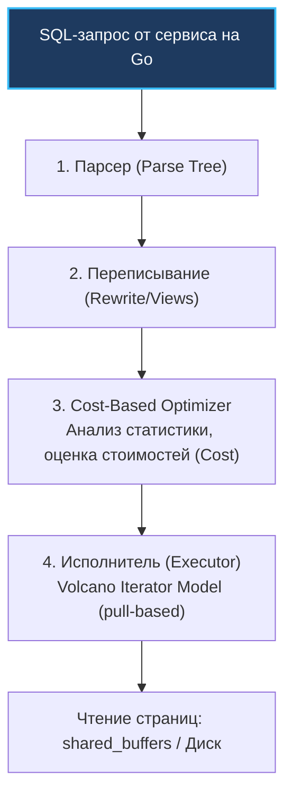
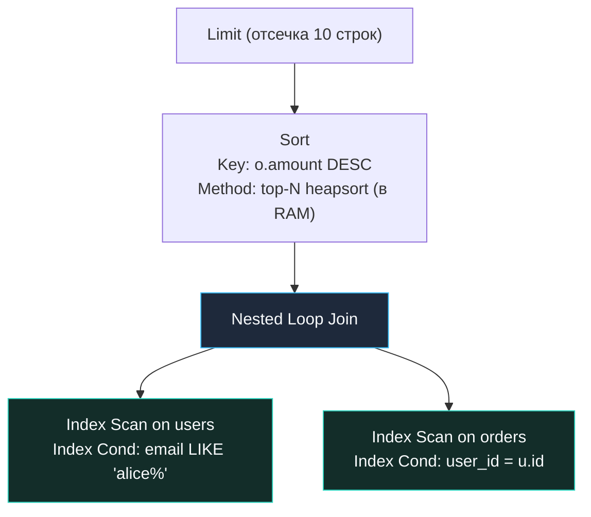

В инженерной культуре существует непреложное правило: **то, чего вы не можете измерить, вы не можете оптимизировать**. В мире Go ни один зрелый инженер не станет оптимизировать распределение памяти вслепую, без `pprof`, или гадать о блокировках горутин без `trace`. Точно так же в мире реляционных баз данных попытка оптимизировать SQL-запрос без анализа его плана выполнения — это чистой воды шаманство.

SQL — язык декларативный. Вы сообщаете СУБД, *какие* данные хотите получить (`SELECT ... WHERE ...`), но не указываете, *как именно* процессор и дисковый контроллер должны их извлечь. Выбором конкретного алгоритма, порядка соединений таблиц и методов доступа к страницам занимается оптимизатор. 

Команда `EXPLAIN` — это рентгеновский аппарат для вашей базы данных. Она выводит **план выполнения (Execution Plan)** — точную иерархическую программу действий, составленную СУБД. Без понимания вывода `EXPLAIN` невозможно ответить на главные вопросы продакшена: почему запрос работает медленно, задействован ли созданный индекс, сколько страниц поднято с диска и где скрывается узкое горлышко производительности.

---

### Как СУБД строит план

Прежде чем ни один байт данных будет прочитан с диска, поступивший от Go-приложения SQL-запрос проходит четыре фундаментальных фазы конвейера:

1. **Парсинг (Parsing):** Лексический и синтаксический анализатор превращает текстовую строку SQL в абстрактное синтаксическое дерево разбора (Parse Tree).
2. **Трансформация и переписывание (Query Rewrite):** Движок применяет реляционные правила: подставляет определения представлений (VIEW), выпрямляет тривиальные подзапросы в соединения (`JOIN`), исключает заведомо ложные или избыточные условия.
3. **Оптимизация (Query Optimization):** «Мозг» базы данных. Оптимизатор генерирует множество альтернативных путей исполнения (`Path`), вычисляет математическую стоимость каждого пути на основе модели затрат (Cost Model) и статистики, собранной процессом `ANALYZE`, и выбирает план с наименьшей стоимостью.
4. **Выполнение (Execution):** Победивший `Plan` передается исполнителю (Executor). В большинстве реляционных СУБД исполнитель работает по итераторной модели Волкано (Volcano Iterator Model): родительские узлы по требованию запрашивают строки у дочерних через вызов функции `ExecProcNode()`.



> [!info] Под капотом: Архитектура планировщика PostgreSQL в исходном коде
> В исходном коде PostgreSQL ядро планировщика сосредоточено в директории `src/backend/optimizer`. 
> Точкой входа служит функция `planner()`, которая последовательно вызывает:
> - `subquery_planner()` — планирование независимых подзапросов;
> - `grouping_planner()` — планирование группировок (`GROUP BY`), оконных функций и сортировок;
> - `query_planner()` — построение соединений и путей доступа к базовым таблицам.
> 
> Построение путей сканирования отдельных таблиц и выбор оптимальных индексов происходят в функции `make_one_rel()`. Генерация соединений между таблицами и выбор алгоритмов соединений выполняются в `add_paths_to_joinrel()`. Результирующий лучший путь превращается в дерево структур `Plan`, готовое к исполнению.

---

### EXPLAIN в PostgreSQL

Базовая команда `EXPLAIN` показывает план, который оптимизатор *намерен* выполнить, основываясь исключительно на своих теоретических оценках стоимости.

Однако наибольшую практическую ценность для инженера представляет комбинация **`EXPLAIN ANALYZE`**. В этом режиме СУБД реально исполняет запрос на сервере и рядом с теоретическими ожиданиями выводит фактические замеры времени, циклов и количества обработанных строк.

Ключевые флаги `EXPLAIN`:
- `ANALYZE` — фактически выполнить запрос и отобразить реальные показатели времени выполнения и числа строк.
- `BUFFERS` — отобразить статистику по работе с буферным пулом: сколько блоков прочитано из кэша (`shared hit`), сколько страниц поднято с диска (`read`), сколько помечено «грязными» (`dirtied`) и сброшено в WAL.
- `VERBOSE` — вывести детальную информацию: полные имена столбцов, внутренние идентификаторы плановых узлов и контекст триггеров.
- `FORMAT` — формат сериализации отчета: `TEXT` (по умолчанию), `JSON`, `XML`, `YAML`. Формат `JSON` идеально подходит для автоматизированного парсинга в микросервисах на Go.

Золотой стандарт инженерной диагностики:
```sql
EXPLAIN (ANALYZE, BUFFERS, VERBOSE) SELECT ...;
```

---

### Чтение вывода EXPLAIN

План выполнения в текстовом формате представляет собой дерево операций с отступами. **Главное правило чтения планов — читать изнутри наружу, снизу вверх.** Самый глубоко вложенный дочерний узел начинает исполнение первым, передавая порции строк наверх родительскому узлу.

Каждый узел содержит строку оценок и фактических результатов:
```text
->  Index Scan using idx_users_email on users  (cost=0.42..8.44 rows=1 width=64) (actual time=0.045..0.048 rows=1 loops=1)
```

Разберем анатомию этой записи:
- **`cost=start..total`:**
  - `start` (0.42): оценочная стоимость получения самой первой строки (время на спуск по B-Tree до листа).
  - `total` (8.44): полная оценочная стоимость выполнения узла до конца.
- **`rows`:** сколько строк оптимизатор ожидает получить из этого узла (на основе статистики).
- **`width`:** средний размер результирующего кортежа в байтах (влияет на оценку расхода оперативной памяти).
- **`actual time=start..total`:** реальное время в миллисекундах (замерено таймером CPU): появление первой строки и завершение работы узла.
- **`rows` (фактическое):** реальное количество строк, отданное узлом.
- **`loops`:** количество повторений выполнения узла (актуально для циклов `Nested Loop`).

---

### Основные узлы плана (в контексте сканирования)

1. **`Seq Scan` (Sequential Scan):**  
   Последовательное поблочное сканирование всей таблицы подряд. Дешево для маленьких таблиц (до нескольких сотен страниц), но разрушительно для таблиц на миллионы строк.
2. **`Index Scan`:**  
   Поиск адресов строк через B-Tree дерево с последующим обязательным обращением к физической таблице (Heap Fetch) для чтения колонок и проверки видимости MVCC.
3. **`Index Only Scan`:**  
   Абсолютный триумф покрывающего индекса: все запрашиваемые столбцы извлекаются прямо из листовых страниц B-Tree. Если карта видимости (Visibility Map) актуальна, обращения к физической таблице отсутствуют (`Heap Fetches: 0`).
4. **`Bitmap Index Scan` + `Bitmap Heap Scan`:**  
   Двухэтапный метод: сначала индекс сканируется для построения битовой карты адресов (`TIDBitmap`), а затем `Bitmap Heap Scan` последовательно читает только нужные страницы таблицы, устраняя хаотичный Random I/O.
5. **`Nested Loop`:**  
   Вложенный цикл: для каждой строки внешнего источника сканируется внутренний источник. Идеален, когда внешний набор мал (1–10 строк), а внутренний индексирован.
6. **`Hash Join`:**  
   СУБД строит хеш-таблицу в оперативной памяти (`work_mem`) по меньшей таблице, а затем единым проходом сопоставляет строки второй таблицы. Идеален для больших неиндексированных наборов.
7. **`Merge Join`:**  
   Слияние двух предварительно отсортированных потоков. Требует наличия индексов с нужной сортировкой или предварительного узла `Sort`.
8. **`Sort`:**  
   Явная сортировка строк. В зависимости от объема данных использует быструю сортировку в памяти (`quicksort`), усеченную кучу (`top-N heapsort` для `ORDER BY ... LIMIT N`) или сброс временных файлов на диск (`external merge`), если память `work_mem` исчерпана.

---

### Механическая симпатия: стоимость операций

Модель затрат (Cost Model) ядра PostgreSQL оперирует условными безразмерными единицами, привязанными к физическим свойствам оборудования:
- `seq_page_cost=1.0` — базовый эталон: последовательное чтение одной 8-килобайтной страницы таблицы с диска.
- `random_page_cost` — чтение одной случайной страницы с диска. Исторически параметр равен `4.0` (эпоха вращающихся магнитных HDD, где позиционирование головки занимало 10 мс). В современных серверах с быстрыми NVMe SSD этот параметр обязательно снижают до `1.1–1.5`, иначе оптимизатор будет избегать индексов!
- `cpu_tuple_cost=0.01` — процессорные затраты на обработку одной строки таблицы в CPU.
- `cpu_index_tuple_cost=0.005` — процессорные затраты на сравнение ключа в узле B-Tree.

Когда вы видите в выводе `Buffers: shared hit=4 read=0`, это означает, что все 4 блока были мгновенно извлечены из оперативной памяти (`shared_buffers`) без единого физического чтения с диска. Если же `Buffers: read=5000` — СУБД была вынуждена пробить кэш и совершить тысячи обращений к SSD.

---

### Примеры планов

**Пример 1: Точечный поиск по покрывающему индексу**
```sql
EXPLAIN (ANALYZE, BUFFERS) 
SELECT email FROM users WHERE email = 'alice@example.com';
```

Вывод:
```text
Index Only Scan using idx_users_email on users  (cost=0.42..8.44 rows=1 width=32) (actual time=0.032..0.034 rows=1 loops=1)
   Index Cond: (email = 'alice@example.com'::text)
   Heap Fetches: 0
   Buffers: shared hit=4
 Planning Time: 0.123 ms
 Execution Time: 0.051 ms
```
Здесь все 4 страницы найдены в RAM (`shared hit=4`), `Heap Fetches: 0` подтверждает работу `Index Only Scan`, а общее время исполнения — 51 микросекунда.

**Пример 2: Соединение с сортировкой и фильтром**
```sql
EXPLAIN (ANALYZE, BUFFERS)
SELECT u.name, o.amount
FROM users u
JOIN orders o ON u.id = o.user_id
WHERE u.email LIKE 'alice%'
ORDER BY o.amount DESC
LIMIT 10;
```

---

### Визуализация дерева плана



---

### EXPLAIN в Go: инструментарий

В Go-приложениях анализ планов можно автоматизировать с помощью библиотеки `pgx` или стандартного пакета `database/sql` с драйвером `lib/pq`. Получение плана в формате `JSON` позволяет легко парсить структуры узлов в тестах или телеметрии.

```go
package main

import (
	"context"
	"encoding/json"
	"fmt"
	"log"

	"github.com/jackc/pgx/v5"
)

// Структура для разбора JSON-плана PostgreSQL
type ExplainNode struct {
	NodeType        string         `json:"Node Type"`
	TotalCost       float64        `json:"Total Cost"`
	ActualRows      float64        `json:"Actual Rows"`
	ActualTotalTime float64        `json:"Actual Total Time"`
	SharedHitBlocks int            `json:"Shared Hit Blocks"`
	SharedReadBlocks int           `json:"Shared Read Blocks"`
	Plans           []ExplainNode  `json:"Plans,omitempty"`
}

type ExplainResult struct {
	Plan         ExplainNode `json:"Plan"`
	PlanningTime float64     `json:"Planning Time"`
	ExecutionTime float64    `json:"Execution Time"`
}

func AnalyzeQuery(ctx context.Context, conn *pgx.Conn, query string, args ...any) error {
	explainSQL := "EXPLAIN (ANALYZE, BUFFERS, FORMAT JSON) " + query

	var rawJSON []byte
	err := conn.QueryRow(ctx, explainSQL, args...).Scan(&rawJSON)
	if err != nil {
		return fmt.Errorf("explain failed: %w", err)
	}

	var results []ExplainResult
	if err := json.Unmarshal(rawJSON, &results); err != nil {
		return fmt.Errorf("unmarshal explain json failed: %w", err)
	}

	root := results[0].Plan
	log.Printf("Root Node: %s, Exec Time: %.3f ms, Cost: %.2f, Hit: %d, Read: %d",
		root.NodeType, results[0].ExecutionTime, root.TotalCost, 
		root.SharedHitBlocks, root.SharedReadBlocks)

	return nil
}
```

Такую функцию можно встроить в HTTP-middleware, активируемое при наличии специального заголовка `X-Debug-Explain: true` в dev- и staging-окружениях.

---

### Типичные ошибки и ловушки

> [!warning] Ловушка / Gotcha: Мутации данных, расхождение статистики и циклы
> 1. **`EXPLAIN ANALYZE` реально исполняет запросы:** Если вы запустите `EXPLAIN ANALYZE DELETE FROM users;`, вы **физически удалите всех пользователей** из таблицы! При анализе мутирующих запросов (`INSERT/UPDATE/DELETE`) всегда изолируйте выполнение в транзакции:
>    ```sql
>    BEGIN; EXPLAIN ANALYZE ...; ROLLBACK;
>    ```
> 2. **Катастрофическое расхождение `rows`:** Если оценочные `rows=1`, а реальные `actual rows=500000`, оптимизатор ошибся в 500 тысяч раз! Причина — устаревшая статистика. Немедленно запустите `ANALYZE` таблицы и проверьте настройки `autovacuum`.
> 3. **Множитель циклов `loops` в `Nested Loop`:** Если для узла указано `actual time=2.5ms` и `loops=10000`, это значит, что узел суммарно работал $2.5 \times 10\,000 = 25\,000 \text{ мс}$ (25 секунд)! Начинающие разработчики смотрят только на время одного цикла и не замечают катастрофы.
> 4. **Высокий показатель `Buffers: read`:** Обилие дисковых чтений (`read`) на фоне малых `shared hit` означает, что данные не помещаются в `shared_buffers`, провоцируя тяжелый дисковый I/O.

---

> [!tip] Собеседование: Физический смысл параметра cost
> **Вопрос:** Что конкретно означает число `cost` (например, `cost=1542.50`) в плане PostgreSQL? Можно ли сказать, что запрос со стоимостью 100 выполняется быстрее запроса со стоимостью 500?
> 
> **Ответ:** Нет! Число `cost` — это абстрактная, расчетная безразмерная величина модели затрат. Она вычисляется как комбинация параметров `seq_page_cost`, `random_page_cost`, `cpu_tuple_cost` и т.д. Число `cost` служит оптимизатору **только для сравнения альтернативных планов внутри одного и того же запроса**. Сравнивать стоимость двух разных запросов бессмысленно: запрос со стоимостью 10 000 (например, последовательное чтение компактной таблицы из RAM) может выполниться за 2 мс, тогда как запрос со стоимостью 500 (тяжелые B-Tree прыжки по холодному диску) может выполняться несколько секунд. Реальную производительность отражает только поле `actual time` в `EXPLAIN ANALYZE`.

---

### Сравнение с MySQL

В MySQL (движок InnoDB) базовый `EXPLAIN` возвращает плоскую таблицу, где каждая строка описывает доступ к одной таблице:
- **`type`:** метод доступа в порядке убывания эффективности: `const` $\to$ `eq_ref` $\to$ `ref` $\to$ `range` $\to$ `index` $\to$ `ALL` (аналог Seq Scan).
- **`key`:** имя реально выбранного индекса.
- **`rows`:** число строк, которые InnoDB планирует проинспектировать.
- **`Extra`:** важнейшие флаги: `Using index` (покрывающий индекс), `Using temporary` (создание временной таблицы), `Using filesort` (сортировка на диске или в буфере сортировки).

Начиная с MySQL 8.0, команда `EXPLAIN FORMAT=JSON` и команда `EXPLAIN ANALYZE` предоставляют полноценное дерево операций с замерами времени, аналогичное PostgreSQL.

---

### Интеграция в процесс разработки

1. **Регрессионное тестирование планов в CI/CD:**  
   Добавьте тесты на ключевые запросы приложения. Тест может выполнять `EXPLAIN (FORMAT JSON)` и проверять, что в корневом плане отсутствуют узлы `Seq Scan` на миллионных таблицах.
2. **Анализ телеметрии с `pg_stat_statements`:**  
   Сортируйте запросы по `total_exec_time` и `mean_exec_time`, выявляйте кандидатов на профилирование и прогоняйте их через `EXPLAIN ANALYZE`.
3. **Логирование медленных планов:**  
   Параметр `log_min_duration_statement` в сочетании с модулем `auto_explain` позволяет PostgreSQL автоматически логировать полные планы всех запросов, чье время выполнения превысило заданный порог (например, 250 мс).

---

### Заключение

`EXPLAIN` — это мост между абстрактным синтаксисом SQL и кремниевой реальностью процессора, буферного кэша и SSD-накопителей. Умение мгновенно считывать дерево операций, замечать промахи мимо кэша и выявлять паразитные узлы сортировки превращает разработчика на Go в настоящего мастера распределенных систем.

В следующей лекции мы детально изучим внутреннее математическое устройство оптимизатора: [[11. Cost based optimizer]] — как именно СУБД считает формулы стоимости и выбирает идеальный маршрут исполнения.
