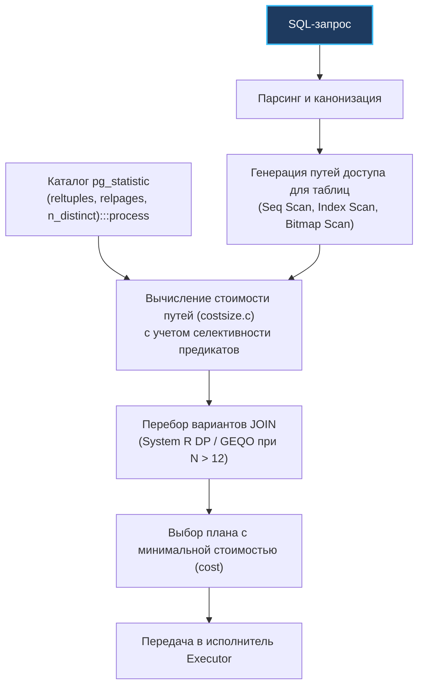

В ранние дни реляционных СУБД (1970–1980-е годы) планировщики запросов напоминали педантичных бюрократов, строго следовавших неизменным циркулярам. Это была эпоха **Rule-Based Optimizer (RBO)** — оптимизаторов на основе жестких правил. Правило №1: «Если есть индекс — всегда используй индекс». Правило №2: «Сначала соединяй таблицы по первичному ключу».

Однако реальный мир быстро доказал несостоятельность бюрократии. Если в таблице всего 5 страниц данных, то прочитать их последовательно одним махом — в разы быстрее, чем спускаться по B-Tree и совершать хаотичные прыжки по диску. Если таблица состоит из 100 миллионов строк, то соединение методом вложенных циклов (`Nested Loop`) превратит сервер в обогреватель, тогда как построение хеш-таблицы в оперативной памяти (`Hash Join`) выполнит задачу за секунды.

На смену жестким правилам пришел **Cost-Based Optimizer (CBO)** — оптимизатор на основе математической модели стоимости. Это настоящий экономический мозг базы данных. Он не верит догмам: для каждого поступившего SQL-запроса CBO генерирует десятки альтернативных сценариев исполнения, оценивает стоимость каждого сценария в условных единицах («валюте» планировщика) и выбирает маршрут с наименьшей ценой.

Понимание того, как CBO считает стоимость, избавляет бэкенд-разработчика от мучительных догадок: вы начинаете точно понимать, почему база данных предпочла один индекс другому, и почему после миграции на быстрые NVMe SSD поведение базы может измениться до неузнаваемости.

---

### CBO vs RBO: почему стоимость, а не правила

Фундаментальное отличие CBO от RBO заключается в **адаптивности**:
- **RBO (Rule-Based):** Слепая эвристика. План запроса одинаков независимо от того, содержит ли таблица 10 записей или 10 миллиардов.
- **CBO (Cost-Based):** Динамический расчет. Оптимизатор опирается на два столпа:
  1. **Статистика данных (`pg_statistic`):** размер таблиц в страницах, число строк, распределение значений по гистограммам, доля NULL-элементов.
  2. **Модель аппаратных затрат (Cost Model):** калиброванные веса для дискового ввода-вывода (I/O) и процессорных вычислений (CPU).

Благодаря этому CBO способен принять идеальное инженерное решение: на маленькой таблице он выберет быстрый потоковый `Seq Scan`, а на огромной — точечный `Index Scan`.

---

### Модель стоимости: от операций к условным единицам

Ядро PostgreSQL оперирует настраиваемыми коэффициентами стоимости, заданными в конфигурационном файле `postgresql.conf` или переопределяемыми для отдельной сессии.

Базовые единицы модели затрат:
- **`seq_page_cost`** (по умолчанию `1.0`): Базовый эталон стоимости. Это цена последовательного чтения одной 8-килобайтной страницы таблицы с диска. Все остальные параметры измеряются относительно нее.
- **`random_page_cost`** (по умолчанию `4.0`): Стоимость чтения одной страницы при случайном доступе (Random I/O). Исторически выбрано равным 4.0 для вращающихся магнитных накопителей (HDD), где физическое позиционирование головки диска занимало львиную долю времени.
- **`cpu_tuple_cost`** (по умолчанию `0.01`): Стоимость обработки одной строки ядром процессора (распаковка кортежа, передача на следующий этап конвейера).
- **`cpu_index_tuple_cost`** (по умолчанию `0.005`): Затраты CPU на обработку одной записи внутри узла B-Tree.
- **`cpu_operator_cost`** (по умолчанию `0.0025`): Затраты CPU на выполнение одной элементарной операции сравнения (`=`, `<`, `AND`).
- **`effective_cache_size`**: Оценка объема оперативной памяти, доступной под дисковый кэш (включает `shared_buffers` и OS Page Cache). Параметр не увеличивает потребление RAM, но помогает планировщику прогнозировать, осядет ли B-Tree индекс в памяти.

В MySQL/InnoDB эквивалентные константы хранятся в системных таблицах `mysql.server_cost` и `mysql.engine_cost` и могут калиброваться через команду `SET GLOBAL`.

Формула полной стоимости (`cost`) любого узла плана складывается из дисковой и процессорной компонент:

$$\text{Total Cost} = (\text{Pages}_{\text{seq}} \times \text{seq\_page\_cost}) + (\text{Pages}_{\text{rnd}} \times \text{random\_page\_cost}) + (\text{Rows} \times \text{cpu\_tuple\_cost}) + (\text{IndexRows} \times \text{cpu\_index\_tuple\_cost}) + (\text{Ops} \times \text{cpu\_operator\_cost})$$

Полученная сумма и есть то самое число `cost`, которое мы видим в выводе команды `EXPLAIN` ([[10. План выполнения запроса. EXPLAIN]]).

> [!info] Под капотом: Калькуляция стоимости в ядре PostgreSQL
> В исходном коде ядра логика расчета стоимости реализована в файле `src/backend/optimizer/path/costsize.c`. 
> Функции `cost_seqscan()`, `cost_index()`, `cost_nestloop()`, `cost_hashjoin()` и `cost_mergejoin()` вычисляют ожидаемые затраты для каждого конкретного алгоритма доступа.
> Расчет селективности предикатов делегирован модулю `clausesel.c`, который извлекает частотные характеристики и гистограммы из системного каталога `pg_statistic`.

---

### Статистика — топливо CBO

Даже самая совершенная формула бесполезна, если в нее подставить неверные переменные. Чтобы рассчитать стоимость, CBO обязан знать, сколько страниц придется прочесть и сколько строк вернет фильтр `WHERE`.

Эти данные поставляет системный процесс сбора статистики `ANALYZE` (вызываемый вручную или фоновым демоном `autovacuum`):
- **`pg_class.reltuples`** — расчетная оценка общего количества строк в таблице.
- **`pg_class.relpages`** — физическое число 8-килобайтных страниц, занимаемых таблицей на диске.
- **`pg_statistic`** — детальная математическая статистика по каждому столбцу: доля `NULL`-значений, средняя ширина данных, количество уникальных значений (`n_distinct`), списки наиболее частых значений (Most Common Values, MCV) и эквиглубинные гистограммы распределения.

Пример: если запрос содержит фильтр `WHERE status = 'active'`, планировщик заглядывает в MCV-список для колонки `status`. Если значение `'active'` там есть с частотой 0.4, то селективность составит 40%. Если значение отсутствует в MCV, планировщик берет приближение `1 / n_distinct`. Умножив селективность на `reltuples`, CBO получает ожидаемую кардинальность (число возвращаемых строк).

Глубокий разбор сбора и анализа статистических распределений мы проведем в следующей лекции — [[12. Cardinality и статистика]].

---

### Генерация и сравнение планов

Процесс поиска оптимального плана напоминает шахматный движок:

1. **Разбор и канонизация:** Запрос приводится к канонической форме: подзапросы выпрямляются, предикаты `IN` преобразуются в полусоединения (Semi-Joins).
2. **Генерация путей сканирования таблиц:** Для каждой базовой таблицы строятся изолированные пути доступа: `Seq Scan`, `Index Scan`, `Index Only Scan`, `Bitmap Scan`. Для каждого пути вычисляется стартовая (`start`) и общая (`total`) стоимость.
3. **Перебор деревьев соединения (Join Tree):** Таблицы объединяются в пары, тройки и так далее с использованием алгоритмов `Nested Loop`, `Hash Join` и `Merge Join`.
4. **Выбор чемпиона:** Полный путь с наименьшей итоговой стоимостью побеждает и компилируется в исполняемое дерево узлов `Plan`.

Для поиска оптимального порядка соединения $N$ таблиц применяется динамическое программирование (классический алгоритм System R). Однако при большом числе таблиц наступает комбинаторный взрыв: число возможных деревьев соединений растет факториально. Поэтому, если количество соединяемых таблиц превышает порог `geqo_threshold = 12`, PostgreSQL переключается на генетический алгоритм (GEQO — Genetic Query Optimizer), чтобы оптимизация не длилась дольше самого запроса!



---

### Пример: почему на маленькой таблице Seq Scan

Классическая загадка начинающих разработчиков: «Я создал индекс на колонку `email`, но база упорно делает `Seq Scan`! Почему оптимизатор игнорирует мой индекс?»

Посчитаем математику CBO на пальцах.

Пусть таблица `users` только что создана и занимает 5 страниц (`relpages = 5`). На ней создан индекс по колонке `email`. Мы выполняем запрос:
```sql
SELECT * FROM users WHERE email = 'alice@example.com';
```

Посчитаем стоимость вариантов по формуле:
1. **Вариант А: `Seq Scan` (последовательное чтение)**  
   Нужно прочитать 5 страниц подряд:
   $$\text{Cost} = 5 \text{ страниц} \times \text{seq\_page\_cost}(1.0) = 5.0 \text{ (запись `5 страниц × seq_page_cost(1.0) = 5`)}$$
   (плюс символические доли затрат на проверку строк в CPU).
2. **Вариант Б: `Index Scan` (поиск по индексу)**  
   - Спуск по B-Tree: чтение 2 внутренних страниц индекса (случайный доступ).
   - Чтение листовой страницы индекса (случайный доступ).
   - Чтение страницы самой таблицы (Heap Fetch) по найденному адресу (случайный доступ).
   Итого 4 случайных дисковых обращения:
   $$\text{Cost} = (2 + 1 + 1) \times \text{random\_page\_cost}(4.0) = 16.0 \text{ (запись `(2+1+1) × random_page_cost(4.0) = 16`)}$$

Сравнение очевидно: **5.0 против 16.0**. Оптимизатор абсолютно прав: на маленькой таблице последовательное чтение в 3 раза дешевле и быстрее!

Но представьте, что таблица разрослась до 100 000 страниц. Стоимость `Seq Scan` подскочит до 100 000, в то время как стоимость `Index Scan` останется равной ~16–20. Оптимизатор мгновенно и автоматически переключится на `Index Scan`.

---

### Mechanical Sympathy: random_page_cost и железо

Дефолтный параметр `random_page_cost = 4.0` — это исторический памятник 1990-м годам. На старых вращающихся HDD-дисках время позиционирования магнитной головки (Seek Time) составляло 8–10 мс, тогда как последовательное чтение шло с максимальной скоростью вращения шпинделя. Разница в 4 раза была абсолютно оправданной.

Сегодня современные серверы работают на твердотельных накопителях NVMe SSD. В SSD нет механических движущихся частей: случайное чтение ячеек флеш-памяти выполняется за десятки микросекунд, практически не уступая последовательному чтению.

> [!warning] Ловушка / Gotcha: Дефолтный random_page_cost на SSD
> Если вы оставите `random_page_cost = 4.0` на современном сервере с NVMe-накопителями, оптимизатор будет панически бояться случайного доступа. Он будет отвергать великолепные индексы и скатываться в `Seq Scan` там, где индекс отработал бы в 10 раз быстрее!
> 
> **Рекомендация для SSD:** Установите `random_page_cost` в диапазоне от **`1.1` до `1.5`**.  
> Однако никогда не опускайте `random_page_cost` ниже `seq_page_cost` (например, меньше 1.0), иначе оптимизатор посчитает случайные прыжки дешевле потокового чтения, что приведет к катастрофическому искажению планов.

В Go-микросервисе вы можете проверить эффект смены стоимости прямо в рамках тестовой сессии:

```go
package main

import (
	"context"
	"github.com/jackc/pgx/v5"
)

func SetSSDCosts(ctx context.Context, conn *pgx.Conn) error {
	// Подсказываем планировщику, что мы работаем на быстром SSD
	_, err := conn.Exec(ctx, "SET random_page_cost = 1.1")
	return err
}
```

---

### Параллельные запросы и стоимость

Начиная с PostgreSQL 9.6, CBO умеет рассчитывать стоимость параллельного исполнения.

Если таблица велика (превышает `min_parallel_table_scan_size`, по умолчанию 8 МБ), планировщик генерирует узел **`Parallel Seq Scan`**. 

Формула стоимости параллельного сканирования делит общий объем страниц на количество выделенных воркеров (контролируемое параметром `max_parallel_workers_per_gather`), добавляя небольшие затраты на передачу кортежей через общую память (Shared Memory) и запуск процессов. С появлением параллелизма `Seq Scan` стал значительно дешевле, что позволяет базе эффективно задействовать все ядра современных 64-ядерных CPU.

---

### Статистика подводит: когда CBO ошибается

CBO гениален, но слеп без актуальной статистики. Если в таблице произошли масштабные изменения, а фоновый `ANALYZE` еще не отработал, CBO начинает гадать:

1. **Взрывные вставки (Batch Inserts):** В таблицу залили 10 миллионов строк. Оптимизатор по-прежнему считает, что там 100 строк, и выбирает губительный `Nested Loop` без индексов.
2. **Корреляция колонок:** Классический пример — колонки `country` и `city`. Вероятность того, что город — Лондон, если страна — Великобритания, близка к 100%. Но стандартный CBO предполагает независимость атрибутов: он перемножает вероятности ($P(\text{UK}) \times P(\text{London})$), получая заниженную в тысячи раз оценку кардинальности. Решение — создание многоколоночной статистики в PostgreSQL:
   ```sql
   CREATE STATISTICS stat_users_geo ON country, city FROM users;
   ```

> [!tip] Собеседование: Регрессия планов (Plan Regression)
> **Вопрос:** Почему после выполнения `VACUUM FULL` или команды `ANALYZE` критически важный запрос в продакшене внезапно стал выполняться в 10 раз медленнее?
> 
> **Ответ:** Это классический феномен **регрессии плана (Plan Regression)**. Команда `ANALYZE` обновила распределение статистики и гистограммы в `pg_statistic`. Новые расчетные стоимости привели к тому, что CBO сменил прежний план (например, `Index Scan`) на альтернативный (например, `Hash Join`), посчитав его более выгодным на микродолю условной стоимости. Но из-за неточности моделей или перекоса данных (Data Skew) реальное время исполнения на альтернативном плане деградировало.  
> Для стабилизации планов в критичных системах используют фиксацию параметров запроса через Prepared Statements или специализированные расширения, такие как `pg_hint_plan`.

---

### Инструменты для анализа работы CBO

- **`auto_explain`:** Модуль ядра, автоматически сбрасывающий в системный лог полные планы выполнения запросов, чье время превысило заданный порог.
- **`pg_stat_statements`:** Агрегирует профиль производительности всех выполняемых шаблонов запросов.
- **`EXPLAIN (ANALYZE, BUFFERS, VERBOSE)`:** Главный диагностический инструмент инженера. Сравнение строк `Rows (planned)` и `Rows (actual)` мгновенно вскрывает ошибки оптимизатора.
- **`pg_hint_plan`:** Расширение, позволяющее принудительно диктовать оптимизатору выбор алгоритма (например, запретить `Seq Scan` или навязать `Hash Join`) в экстренных случаях.

---

### Практика в Go: анализ и настройка

В высоконагруженных бэкендах на Go рекомендуется настраивать пулы соединений (`pgxpool`) с автоматической калибровкой сессионных параметров оптимизатора под ваше «железо»:

```go
package main

import (
	"context"
	"log"
	"time"

	"github.com/jackc/pgx/v5/pgxpool"
)

func InitDatabasePool(ctx context.Context, connString string) (*pgxpool.Pool, error) {
	config, err := pgxpool.ParseConfig(connString)
	if err != nil {
		return nil, err
	}

	// Хук, вызываемый при создании каждого физического соединения в пуле
	config.AfterConnect = func(ctx context.Context, conn *pgx.Conn) error {
		// Калибруем CBO под NVMe SSD и реальный кэш
		sessionSettings := `
			SET random_page_cost = 1.1;
			SET effective_cache_size = '16GB';
			SET work_mem = '64MB';
		`
		_, err := conn.Exec(ctx, sessionSettings)
		return err
	}

	return pgxpool.NewWithConfig(ctx, config)
}
```

---

### Итог

Cost-Based Optimizer — это триумф прикладной математики в системном программировании. Он непрерывно переводит физические свойства серверов (IOPS диска, задержки случайного доступа, такты процессора) в строгие математические модели, защищая разработчика от необходимости вручную прописывать алгоритмы поиска данных.

Однако CBO эффективен лишь тогда, когда сыт свежей статистикой и правильно откалиброван под современное аппаратное обеспечение.

В следующей лекции мы разберем математическое ядро, питающее CBO: [[12. Cardinality и статистика]] — как работают гистограммы, списки MCV и почему ошибка в кардинальности способна обрушить любой план.
