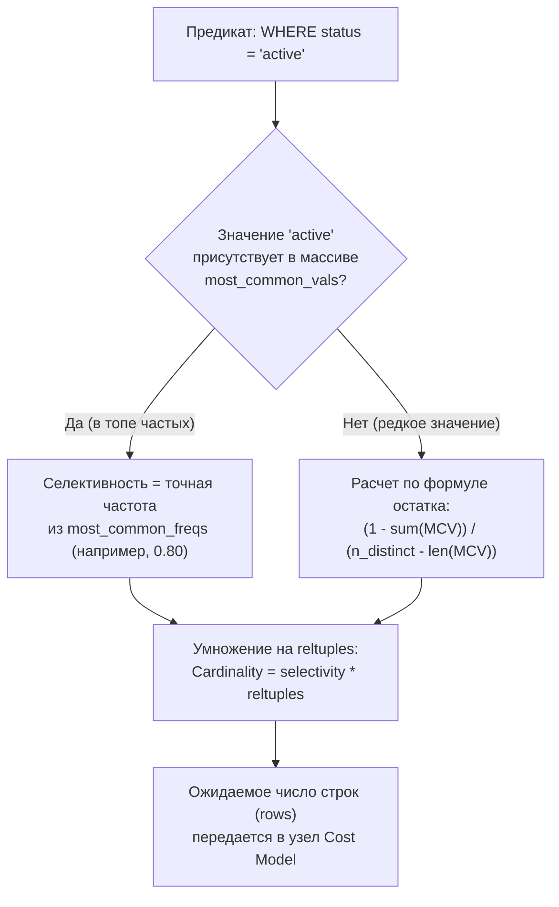

В предыдущей главе [[11. Cost based optimizer]] мы убедились, что планировщик запросов — это строгий экономический калькулятор. Он считает условную стоимость каждого маршрута выполнения. Но в основе всех формул CBO лежит один-единственный, фундаментальный параметр — **Cardinality (кардинальность)**, то есть расчетная оценка количества строк, которые вернет конкретный фильтр, таблица или узел соединения.

Если оптимизатор ошибается в оценке стоимости на 10%, план запроса останется вполне разумным. Но если оптимизатор ошибается в cardinality на порядок — пиши пропало:
- Ожидая 1 строку, движок выберет `Nested Loop`. Если на деле прилетит 1 000 000 строк, сервер совершит миллион дисковых обходов B-Tree и зависнет намертво.
- И наоборот: ожидая 500 000 строк там, где вернется всего 5, планировщик выделит 200 МБ оперативной памяти под массивную хеш-таблицу (`Hash Join`) и будет сбрасывать временные файлы на диск, хотя простейший индексный спуск отработал бы за 50 микросекунд.

Кардинальность вычисляется по статистическим данным, которые собираются ядром базы данных. В этой лекции мы заглянем в «машинное отделение» статистики PostgreSQL, разберем формулы селективности, устройство гистограмм и поймем, как писать Go-сервисы, устойчивые к статистическим перекосам.

---

### Что такое cardinality

**Cardinality (кардинальность)** — это математическое ожидание числа кортежей (строк), производимых конкретной реляционной операцией (фильтрацией в `WHERE`, сканированием узла, соединением двух таблиц).

В отчете `EXPLAIN` ([[10. План выполнения запроса. EXPLAIN]]) кардинальность представлена двумя числами:
- **`rows` (ожидаемое):** теоретическая оценка, вычисленная оптимизатором *до* выполнения запроса.
- **`actual rows` (фактическое):** реальное количество строк, зафиксированное счетчиком при выполнении `EXPLAIN ANALYZE`.

Точность этого прогноза напрямую определяет архитектуру всего дерева плана: выбор между `Seq Scan` и `Index Scan`, между `Nested Loop` и `Hash Join`, а также порядок многотабличных соединений.

---

### Как PostgreSQL собирает статистику

Если бы база данных сканировала терабайтную таблицу целиком при каждом обновлении статистики, сервер непрерывно занимался бы только чтением собственных дисков.

Поэтому команда `ANALYZE` использует изящный метод математической статистики — **репрезентативную случайную выборку (Reservoir Sampling)**:
- **Вручную:** вызов `ANALYZE table_name;`.
- **Автоматически:** фоновый демон `autovacuum`, который запускает сбор статистики, когда число измененных строк превышает порог `autovacuum_analyze_threshold` (по умолчанию 50) плюс коэффициент `autovacuum_analyze_scale_factor` (по умолчанию 10% от `reltuples`).

Объем случайной выборки определяется параметром `default_statistics_target` (по умолчанию `100`), умноженным на эмпирический коэффициент 300. То есть при дефолтной конфигурации `default_statistics_target = 100` ядро считывает ровно **30 000 случайных строк** из всей таблицы!

Для критически важных и перекошенных колонок (например, поля `payload` или статусов заказов) точность выборки можно поднять индивидуально:
```sql
ALTER TABLE events ALTER COLUMN payload SET STATISTICS 1000;
```
При `statistics_target = 1000` размер выборки вырастет до 300 000 строк, что даст безупречно точные гистограммы и частотные списки.

> [!info] Под капотом: Диспетчер сбора статистики analyze.c
> В ядре PostgreSQL процесс анализа реализован в модуле `src/backend/commands/analyze.c`. 
> Функция `do_analyze_rel()` инициализирует сбор, а процедура `acquire_sample_rows()` производит двухэтапную выборку: сначала случайно выбираются физические страницы таблицы (с учетом алгоритма резервуарной выборки Виттера), а затем из каждой выбранной страницы извлекаются случайные строки.
> Для индексов отдельная выборка не проводится: индексы наследуют статистику базовой таблицы, обновляя лишь счетчики `reltuples` и `relpages`.

---

### Хранение статистики: pg_statistic и pg_stats

Собранные статистические данные записываются в системный каталог `pg_statistic`. Однако напрямую заглядывать в эту таблицу неудобно: значения хранятся в полиморфных массивах `anyarray` в виде бинарных блобов.

Для человека и прикладных инструментов предназначено системное представление **`pg_stats`**, которое декодирует внутренние массивы в читаемые поля:
- **`null_frac`**: доля строк, содержащих значение `NULL` (от 0.0 до 1.0).
- **`avg_width`**: средняя ширина значения в байтах (влияет на поле `width` в плане и оценку потребления оперативной памяти).
- **`n_distinct`**: расчетное число уникальных значений.
- **`most_common_vals` (MCV)**: массив наиболее часто встречающихся значений.
- **`most_common_freqs`**: массив частот для каждого значения из списка MCV.
- **`histogram_bounds`**: границы корзин гистограммы для значений, не вошедших в MCV.
- **`correlation`**: коэффициент статистической корреляции между физическим порядком строк на диске и логическим значением колонки (от -1.0 до +1.0). Если `correlation` близок к 1.0, физические строки лежат на диске строго упорядоченно, и `Index Scan` будет почти бесплатным (без Random I/O).

> [!tip] Собеседование: Что означает n_distinct = -1?
> **Вопрос:** В представлении `pg_stats` для столбца первичного ключа `id` вы видите `n_distinct = -1`. Что означает это отрицательное число?
> 
> **Ответ:** Отрицательное значение `n_distinct` кодирует **долю уникальности относительно общего числа строк таблицы**!  
> Значение `-1` означает, что абсолютно все строки в столбце уникальны ($100\%$, то есть `n_distinct = reltuples`). Значение `-0.2` означало бы, что количество уникальных значений составляет ровно 20% от общего числа строк в таблице. Если же число уникальных значений фиксировано (например, 5 статусов заказа), то `n_distinct` записывается положительным числом `n_distinct = 5`.

---

### Основные статистические показатели

#### Доля NULL
Показатель `null_frac` критичен для предикатов `IS NULL` и `IS NOT NULL`.  
Если в таблице на 1 000 000 строк параметр `null_frac = 0.2`, то ожидаемая кардинальность фильтра `WHERE deleted_at IS NULL` составит:
$$\text{Кардинальность} = \text{reltuples} \times 0.2 = 200\,000 \text{ строк (расчет `reltuples × 0.2`)}$$

#### Средняя ширина
Параметр `avg_width` сообщает оптимизатору, сколько байт займет кортеж в оперативной памяти при построении хеш-таблиц для `Hash Join` или сортировке в узлах `Sort`.

#### Количество уникальных значений (n_distinct)
Определяет базовую селективность оператора точного равенства: `1 / n_distinct`. Если колонка содержит 5 уникальных статусов (`n_distinct = 5`), то в отсутствие списка MCV оптимизатор предполагает, что каждый статус занимает $1/5 = 20\%$ таблицы.

#### Наиболее частые значения (MCV)
В реальных данных распределение редко бывает равномерным. Список **MCV (Most Common Values)** сохраняет точные частоты самых популярных элементов. 

Если 80% заказов имеют статус `"status = 'active'"`, этот факт будет зафиксирован в массивах `most_common_vals` и `most_common_freqs`:
```text
most_common_vals  : {'active', 'completed', 'cancelled'}
most_common_freqs : {0.80, 0.15, 0.04}
```
Благодаря этому для запроса `WHERE status = 'active'` CBO не станет делить единицу на три, а возьмет точную селективность `0.80`.

#### Гистограммы
Для значений, не попавших в топ MCV, PostgreSQL строит **эквиглубинную гистограмму (Equi-depth Histogram)**, границы которой зафиксированы в массиве `histogram_bounds`.

В отличие от обычной школьной гистограммы (где корзины имеют одинаковую ширину диапазонов), эквиглубинная гистограмма делит весь остаток данных на корзины с **одинаковым количеством строк** внутри каждой. Количество границ равно `statistics_target + 1`. Это позволяет CBO математически точно интерполировать селективность диапазонов (`>`, `<`, `BETWEEN`). Например, для запроса `WHERE created_at > '2025-01-01'` оптимизатор находит, в какую корзину попадает граница, и интерполирует долю строк.

---

### Вычисление селективности

Параметр **`selectivity` (селективность)** — это расчетная вероятность того, что произвольная строка таблицы удовлетворит условию фильтра (число от 0.0 до 1.0).

Алгоритм вычисления селективности:
1. **Точное равенство (`=`):**  
   - Ищем значение в массиве `most_common_vals`. Если найдено — селективность равна соответствующей частоте из `most_common_freqs`.
   - Если значения нет в MCV, остаток вероятности ($1 - \sum \text{MCV}$) равномерно распределяется между оставшимися уникальными значениями:
     $$\text{selectivity} = \frac{1 - \sum \text{most\_common\_freqs}}{n\_distinct - \text{len}(\text{MCV})}$$
2. **Диапазонные операторы (`>`, `<`, `BETWEEN`):**  
   Для диапазонного условия вида `> const` оптимизатор суммирует частоты всех значений из MCV, попадающих в диапазон, а для гистограммы `histogram_bounds` находит долю полностью покрытых корзин плюс линейно интерполирует граничные неполные корзины.
3. **Префиксный поиск (`LIKE 'prefix%'`):**  
   Трансформируется в диапазонный поиск `(col >= 'prefix' AND col < 'prefiy')` и обсчитывается по строковой гистограмме.
4. **Неравенство (`!=`):**  
   Вычисляется как дополнение до единицы: $\text{selectivity}(!=) = 1.0 - \text{selectivity}(=)$.



> [!warning] Ловушка / Gotcha: Гипотеза независимости атрибутов
> При объединении нескольких предикатов (`WHERE a = 1 AND b = 2`) оптимизатор по умолчанию предполагает, что колонки **статистически независимы**, и просто перемножает их селективности:
> $$\text{selectivity}(A \land B) = \text{selectivity}(A) \times \text{selectivity}(B)$$
> 
> В реальных данных это приводит к чудовищным ошибкам!  
> Если колонка `country='RU'`, а колонка `city='Moscow'`, то эти атрибуты жестко скоррелированы. Перемножив их вероятности, оптимизатор решит, что запрос вернет 1 строку вместо реальных 100 000, и выберет катастрофически медленный план с миллионом итераций вложенного цикла.

---

### Проблемы и искажения

1. **Статистическое голодание (Stale Statistics):**  
   После ночной пакетной загрузки (ETL) 50 миллионов строк счетчики `reltuples` и гистограммы остаются старыми. Оптимизатор строит планы для маленькой таблицы, вызывая сбои в проде. Решение — обязательный вызов `ANALYZE` в конце любого загрузочного скрипта.
2. **Слишком грубая выборка:**  
   Если в таблице есть редкие, но критичные бизнес-статусы, выборка из 30 000 строк может вообще их не зацепить. Решение — повышение `SET STATISTICS 500` или `1000` для конкретной колонки.
3. **Многоколоночная статистика (Extended Statistics):**  
   Для устранения проблемы коррелированных столбцов в PostgreSQL (начиная с версии 10) введен механизм расширенной статистики:
   ```sql
   CREATE STATISTICS s_city_country (dependencies) ON country, city FROM users;
   ANALYZE users;
   ```
   Директива `dependencies` заставляет PostgreSQL вычислить функциональную зависимость между столбцами. Теперь оптимизатор понимает, что город детерминирован страной, и больше не перемножает вероятности вслепую!

> [!info] Под капотом: Типы Extended Statistics
> Расширенная статистика сохраняется в системных таблицах `pg_statistic_ext` и `pg_statistic_ext_data`. 
> Доступны три типа анализа:
> - `dependencies` — степень корреляции между колонками (для многоколоночных `WHERE`);
> - `ndistinct` — многоколоночная оценка уникальности (для `GROUP BY country, city`);
> - `mcv` — многоколоночные списки наиболее частых пар и троек значений.

---

### Mechanical Sympathy: цена сбора статистики

Процесс `ANALYZE` не бесплатен для оборудования:
1. **Дисковый I/O случайной выборки:**  
   Чтение 30 000 случайных страниц таблицы — это 30 000 операций Random I/O. Если таблица не помещается в `shared_buffers`, запуск `ANALYZE` создает ощутимую волну дисковой нагрузки.
2. **Вымывание полезного кэша:**  
   Чтение страниц таблицы вытесняет из буферного пула страницы горячих индексов.
3. **Сортировка в CPU:**  
   Построение гистограмм требует сортировки всей собранной выборки в оперативной памяти.

Для минимизации влияния на продакшен фоновый процесс `autovacuum` искусственно принудительно ограничивается (Throttling) через параметры `autovacuum_vacuum_cost_limit` и задержки `autovacuum_vacuum_cost_delay`.

---

### Практические рекомендации для Go-разработчика

В боевых микросервисах на Go полезно иметь фоновый сторожевой таймер, который инспектирует расхождение между теоретической оценкой CBO и реальностью:

```go
package main

import (
	"context"
	"encoding/json"
	"fmt"
	"log"
	"math"

	"github.com/jackc/pgx/v5"
)

// Структура для анализа расхождения кардинальности
type PlanExplain struct {
	Plan struct {
		NodeType      string  `json:"Node Type"`
		RowsEstimated float64 `json:"Plan Rows"`
		ActualRows    float64 `json:"Actual Rows"`
	} `json:"Plan"`
}

func VerifyCardinalitySkew(ctx context.Context, conn *pgx.Conn, sqlQuery string, args ...any) {
	explainSQL := "EXPLAIN (ANALYZE, FORMAT JSON) " + sqlQuery

	var rawJSON []byte
	if err := conn.QueryRow(ctx, explainSQL, args...).Scan(&rawJSON); err != nil {
		log.Printf("Explain query failed: %v", err)
		return
	}

	var parsed []PlanExplain
	if err := json.Unmarshal(rawJSON, &parsed); err != nil || len(parsed) == 0 {
		return
	}

	root := parsed[0].Plan
	ratio := 1.0
	if root.RowsEstimated > 0 && root.ActualRows > 0 {
		ratio = root.ActualRows / root.RowsEstimated
		if ratio < 1.0 {
			ratio = 1.0 / ratio
		}
	}

	// Если расхождение превышает 10x — в базе данных протухла статистика!
	if ratio > 10.0 {
		log.Printf("WARNING: Критическое расхождение кардинальности (%.1fx)! Оценка: %.0f, Факт: %.0f. Требуется ANALYZE!",
			ratio, root.RowsEstimated, root.ActualRows)
	}
}
```

А в пайплайнах пакетной обработки (ETL/миграторы) всегда явно вызывайте сбор статистики после заливки данных:

```go
func AnalyzeAfterBatch(ctx context.Context, conn *pgx.Conn, table string) error {
	log.Printf("Запуск принудительного ANALYZE для таблицы %s...", table)
	_, err := conn.Exec(ctx, fmt.Sprintf("ANALYZE %s;", table))
	return err
}
```

---

### Заключение

Cardinality — это фундамент, на котором держится вся математика стоимостного оптимизатора. Механизм сбора статистики через случайные выборки, списки MCV и эквиглубинные гистограммы позволяет реляционным базам данных мгновенно принимать мудрые решения на петабайтных масштабах.

Понимание того, как считаются вероятности и где кроются статистические ловушки (коррелированные атрибуты, протухшие данные), позволяет инженеру уверенно управлять поведением базы данных и предотвращать опасные деградации в продакшене.

В следующей лекции мы перейдем к одной из самых разрушительных архитектурных проблем прикладного слоя: [[13. N+1 проблема]] — почему даже идеальные индексы и актуальная статистика бессильны перед наивными ORM-циклами в коде.
