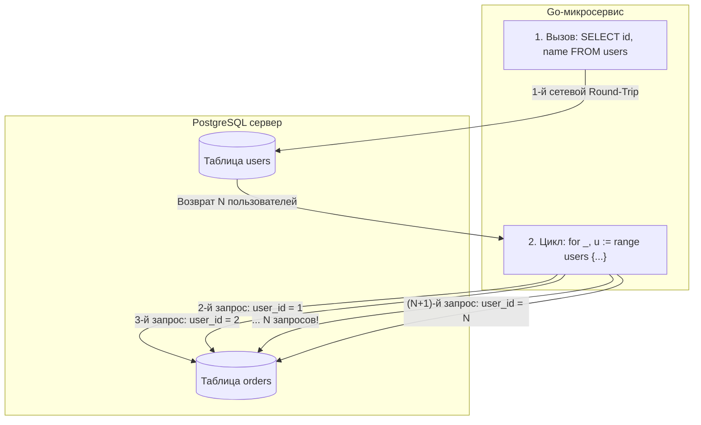

В программировании существует фундаментальный концептуальный разрыв, известный как **Object-Relational Impedance Mismatch (объектно-реляционный диссонанс)**. Разработчик мыслит понятиями сущностей, структур и итераций: «У меня есть список пользователей, для каждого пользователя я хочу получить его заказы». На процедурном языке вроде Go цикл `for _, user := range users { fetchOrders(user.ID) }` выглядит кристально чистым, естественным и лаконичным.

Но для реляционной базы данных и операционной системы Linux такой цикл — это сущее бедствие. 

Этот паттерн называется **N+1 проблема**. Приложение делает один запрос для получения списка из $N$ сущностей, а затем в цикле отправляет еще $N$ отдельных запросов для загрузки связанных данных. Если первый запрос вернул 10 000 пользователей, ваш сервис обрушит на базу данных **10 001 запрос**.

Несмотря на полувековую историю реляционных баз, N+1 до сих пор остается самой частой причиной внезапных аварий в продакшене. В этой главе мы разберем проблему N+1 с точки зрения кремния и сетевого стека (Mechanical Sympathy), изучим архитектурные альтернативы и научимся искоренять этот антипаттерн в микросервисах на Go.

---

### Как выглядит N+1

Классический сценарий: таблицы `users` и `orders`, связанные внешним ключом `orders.user_id`. Наивный код выборки на Go:

```go
package main

import (
	"context"
	"database/sql"
)

type Order struct {
	ID     int64
	Amount float64
}

type User struct {
	ID     int64
	Name   string
	Orders []Order
}

func GetUsersWithOrdersNaive(ctx context.Context, db *sql.DB) ([]User, error) {
	// 1-й запрос: получаем список всех пользователей
	rows, err := db.QueryContext(ctx, "SELECT id, name FROM users")
	if err != nil {
		return nil, err
	}
	defer rows.Close()

	var users []User
	for rows.Next() {
		var u User
		if err := rows.Scan(&u.ID, &u.Name); err != nil {
			return nil, err
		}
		users = append(users, u)
	}

	// Еще N запросов: для каждого пользователя идем в БД за его заказами!
	for i := range users {
		orderRows, err := db.QueryContext(ctx,
			"SELECT id, amount FROM orders WHERE user_id = $1", users[i].ID)
		if err != nil {
			return nil, err
		}
		for orderRows.Next() {
			var o Order
			if err := orderRows.Scan(&o.ID, &o.Amount); err != nil {
				orderRows.Close()
				return nil, err
			}
			users[i].Orders = append(users[i].Orders, o)
		}
		orderRows.Close()
	}

	return users, nil
}
```

Если таблица `users` вернула 100 строк, сервис выполнит $1 + 100 = 101$ запрос. Если вернула 10 000 строк — 10 001 запрос! Задержка ответа микросервиса вырастает с миллисекунд до десятков секунд, а база данных захлебывается.



---

### Почему N+1 убивает производительность

Начинающие разработчики часто полагают: «Каждый запрос длится всего 0.5 мс, в чем проблема?». С точки зрения физики оборудования и ядра Linux (Mechanical Sympathy), N+1 порождает колоссальный каскад паразитных накладных расходов:

1. **Сетевой Round-Trip Time (RTT) и системные вызовы:**  
   Каждый отдельный сетевой запрос — это как минимум пара системных вызовов `send` и `recv` (или `write` и `read`), переключение контекста между пространством пользователя и ядром ОС, буферизация TCP-пакетов и задержка передачи по витой паре или оптоволокну. Даже в локальной сети дата-центра RTT составляет 0.5–1 мс. 10 000 запросов — это $10\,000 \times 1 \text{ мс} = 10 \text{ секунд}$ чистого сетевого ожидания, во время которого процессор вашего сервера просто спит!
2. **Накладные расходы протокола PostgreSQL (FE/BE Protocol):**  
   Для каждого из 10 000 запросов сервер СУБД обязан принять сообщения протокола `Parse`, `Bind`, `Execute`, `Sync`. Он вынужден заново разбирать SQL-строку, проверять права доступа, заглядывать в кэш планов и инициализировать исполнитель Volcano.
3. **Исчерпание пула соединений ([[2. Connection pool]]):**  
   Когда горутина надолго захватывает соединение из `sql.DB` для выполнения тысячи последовательных запросов, другие горутины встают в очередь ожидания. Пул соединений исчерпывается, и весь микросервис перестает отвечать на внешние запросы клиентов.
4. **Вымывание буферного кэша:**  
   Постоянные обращения к разрозненным страницам индекса по внешнему ключу вызывают лишние блокировки страниц в памяти и вытесняют из кэша другие полезные данные.

---

### Пример в терминах SQL

Реляционная алгебра создавалась специально для того, чтобы оперировать **множествами данных (Sets)** за одну транзакцию.

Вместо N+1 запросов мы пишем ровно **один запрос с `LEFT JOIN`**:

```sql
SELECT u.id, u.name, o.id AS order_id, o.amount
FROM users u
LEFT JOIN orders o ON u.id = o.user_id
ORDER BY u.id;
```

База данных соединяет таблицы за один проход, используя быстрый `Hash Join` или индексированный `Nested Loop`. Сервер возвращает плоский поток строк за **один сетевой round-trip**.

На стороне Go нам остается лишь аккуратно свернуть плоские строки в древовидные структуры:

```go
func GetUsersWithOrdersJoin(ctx context.Context, db *sql.DB) ([]User, error) {
	query := `
		SELECT u.id, u.name, o.id, o.amount
		FROM users u
		LEFT JOIN orders o ON u.id = o.user_id
		ORDER BY u.id;
	`

	rows, err := db.QueryContext(ctx, query)
	if err != nil {
		return nil, err
	}
	defer rows.Close()

	usersMap := make(map[int64]*User)
	var orderedUsers []*User

	for rows.Next() {
		var uID int64
		var uName string
		var oID sql.NullInt64
		var oAmount sql.NullFloat64

		if err := rows.Scan(&uID, &uName, &oID, &oAmount); err != nil {
			return nil, err
		}

		u, exists := usersMap[uID]
		if !exists {
			u = &User{ID: uID, Name: uName}
			usersMap[uID] = u
			orderedUsers = append(orderedUsers, u)
		}

		if oID.Valid {
			u.Orders = append(u.Orders, Order{
				ID:     oID.Int64,
				Amount: oAmount.Float64,
			})
		}
	}

	result := make([]User, len(orderedUsers))
	for i, u := range orderedUsers {
		result[i] = *u
	}
	return result, rows.Err()
}
```

Ровно **1 запрос к базе данных** независимо от того, сколько пользователей и заказов хранится в системе!

---

### N+1 и ORM в Go

Популярные Go ORM (GORM, Ent, Bun) предлагают механизмы жадной загрузки: `Preload`, `Eager`, `Include`. Однако при неосторожном обращении они легко порождают скрытый N+1.

Классическая ловушка в GORM:
```go
// АНТИПАТТЕРН: N+1 в цикле
var users []User
db.Find(&users) // 1 запрос: SELECT * FROM users;
for i := range users {
    // ВНИМАНИЕ: генерирует отдельный запрос на каждой итерации!
    db.Model(&users[i]).Association("Orders").Find(&users[i].Orders)
}

// ПРАВИЛЬНО: Жадная загрузка (Eager Loading)
db.Preload("Orders").Find(&users)
```

Обратите внимание: даже при вызове `Preload` GORM чаще всего выполняет не `JOIN`, а **два запроса**:
1. `SELECT * FROM users;`
2. `SELECT * FROM orders WHERE user_id IN (1, 2, 3, ...);`

Это в тысячи раз лучше, чем N+1, но инженер обязан точно знать, что именно происходит под капотом.

---

### Альтернативы решения

Существует три основных паттерна ликвидации N+1:

#### 1. Классический JOIN
Один запрос, объединяющий таблицы.  
- **Плюсы:** Ровно 1 RTT, максимальная скорость на небольших структурах.
- **Минусы:** Избыточность данных (Data Multiplication). Если у пользователя 50 заказов, его имя, email и профиль продублируются в ответе 50 раз, увеличивая сетевой трафик.

#### 2. Пакетная загрузка (Batch Loading / WHERE IN)
Выполняется строго 2 запроса:
1. Загружаем родительские сущности: `SELECT id, name FROM users;`
2. Собираем слайс всех ID и загружаем всех детей пачкой: `WHERE parent_id IN ($1, $2, ...)` или через `WHERE id IN (...)`.
3. Сопоставляем структуры в оперативной памяти Go за $O(N)$ через хеш-мапу.

В Go это элегантно реализуется через `sqlx.In` или передачу массива в PostgreSQL (`= ANY($1)`):

```go
func FetchOrdersBatch(ctx context.Context, db *sql.DB, userIDs []int64) ([]Order, error) {
	// Использование синтаксиса PostgreSQL: ANY(slice)
	query := `SELECT id, user_id, amount FROM orders WHERE user_id = ANY($1)`
	rows, err := db.QueryContext(ctx, query, userIDs)
	// ... чтение и группировка
	return orders, err
}
```

#### 3. Агрегация в JSON на стороне PostgreSQL (LATERAL / json_agg)
Современный PostgreSQL позволяет переложить всю работу по сборке вложенных деревьев прямо на плечи ядра СУБД:

```sql
SELECT 
    u.id, 
    u.name,
    COALESCE(
        json_agg(
            json_build_object('id', o.id, 'amount', o.amount)
        ) FILTER (WHERE o.id IS NOT NULL), 
        '[]'
    ) AS orders
FROM users u
LEFT JOIN orders o ON u.id = o.user_id
GROUP BY u.id;
```

Каждая строка результата возвращает пользователя и готовый JSON-массив его заказов. Никакого дублирования колонок пользователя, ноль лишних сетевых пакетов, чистый десериализатор в Go!

---

### Обнаружение N+1 в Go-приложении

1. **Распределенная трассировка (OpenTelemetry / Jaeger):**  
   Если в трейсе HTTP-запроса вы видите «расческу» (веер из 200 одинаковых синих полосок спанов обращения к БД подряд) — это гарантированный N+1.
2. **Анализ телеметрии `pg_stat_statements`:**  
   Сортируйте системный каталог по числу вызовов (`calls`). Если запрос шаблона `SELECT * FROM orders WHERE user_id = $1` вызывается 500 000 раз в минуту с одинаковым средним временем 0.2 мс — перед вами классический N+1.
3. **Логирование количества запросов в тестах:**  
   Пишите интеграционные тесты, которые замеряют количество SQL-запросов на один эндпоинт и валят сборку, если число запросов превышает константу (например, > 2).

> [!warning] Ловушка / Gotcha: Маскировка N+1 пулом pgBouncer
> Если между микросервисом и PostgreSQL установлен `pgBouncer` в режиме пулинга транзакций или операторов (`statement` pooling), а база данных кэширует планы запросов, микросервис может казаться «быстрым» на локальном стенде. Однако сетевой оверхед протокола и латенция RTT никуда не исчезают. При первой же серьезной нагрузке в продакшене сокеты забьются, и задержка p99 взлетит до небес. Никогда не надейтесь на кэширование — устраняйте N+1 архитектурно.

---

> [!tip] Собеседование: Паттерн DataLoader в GraphQL и микросервисах
> **Вопрос:** Мы пишем GraphQL или gRPC API на Go. Каждый резолвер поля `User.Orders` вызывается независимо для каждого пользователя в графе. Как предотвратить N+1 на уровне архитектуры сервиса?
> 
> **Ответ:** Использовать паттерн **DataLoader** (например, библиотеку `github.com/graph-gophers/dataloader`).  
> DataLoader работает по принципу отложенного батчинга:
> 1. Когда независимые горутины запрашивают заказы для разных `user_id`, DataLoader не бежит сразу в базу данных.
> 2. Он аккумулирует входящие ID в течение одного тика планировщика Go (Event Loop / Microtask tick, обычно 1–5 мс).
> 3. По истечении окна ожидания DataLoader объединяет все накопленные ключи в один пакетный запрос `WHERE user_id = ANY($1)`, выполняет его за один round-trip и раздает результаты ожидающим горутинам через Go-каналы.

---

### Mechanical Sympathy: стоимость одного запроса

Давайте разложим вызов `db.QueryContext` на микросекунды и системные операции:
1. Захват мьютекса пула соединений `database/sql` (риск ожидания свободной структуры).
2. Сериализация параметров драйвером `pgx` в сетевой буфер.
3. Системный вызов `writev()` ядра Linux — передача пакета в TCP-сокет.
4. Переключение контекста: ядро $\to$ физический сетевой контроллер (NIC).
5. Получение пакета на стороне сервера БД: системный вызов `epoll_wait()` и `read()`.
6. Парсер PostgreSQL: выделение памяти в `MemoryContext`, проверка каталога.
7. Планировщик CBO ([[11. Cost based optimizer]]): генерация путей доступа.
8. Исполнитель: чтение страниц из `shared_buffers` с захватом легковесных блокировок (Latches).
9. Сериализация ответа в сокет, системный вызов `send()`.
10. Десериализация на клиенте в Go-структуры, аллокации в куче (`Heap Allocs`).

Один запрос делает эту цепочку один раз за 0.3 мс.  
Цикл N+1 повторяет эту цепочку **10 000 раз**, перегружая системные прерывания ядра Linux и прожигая процессорные такты впустую.

---

### Итог

N+1 — это не просто досадная ошибка кодирования, а фундаментальный симптом пренебрежения законами распределенных систем и сетевого ввода-вывода.

Профессиональный инженер на Go думает наборами данных:
- Заменяйте циклы одиночных обращений на единый `JOIN` или пакетную загрузку `WHERE IN`.
- Используйте возможности JSON-агрегации современного PostgreSQL (`json_agg`).
- Внедряйте паттерн DataLoader для слабосвязанных интерфейсов.
- Контролируйте метрики запросов через `pg_stat_statements` и трейсинг.

В следующей лекции мы детально разберем, как заставить сам реляционный движок объединять данные с предельной эффективностью: [[14. Оптимизация JOIN]] — алгоритмы Hash Join, Merge Join, Nested Loop и правила расстановки индексов для них.
