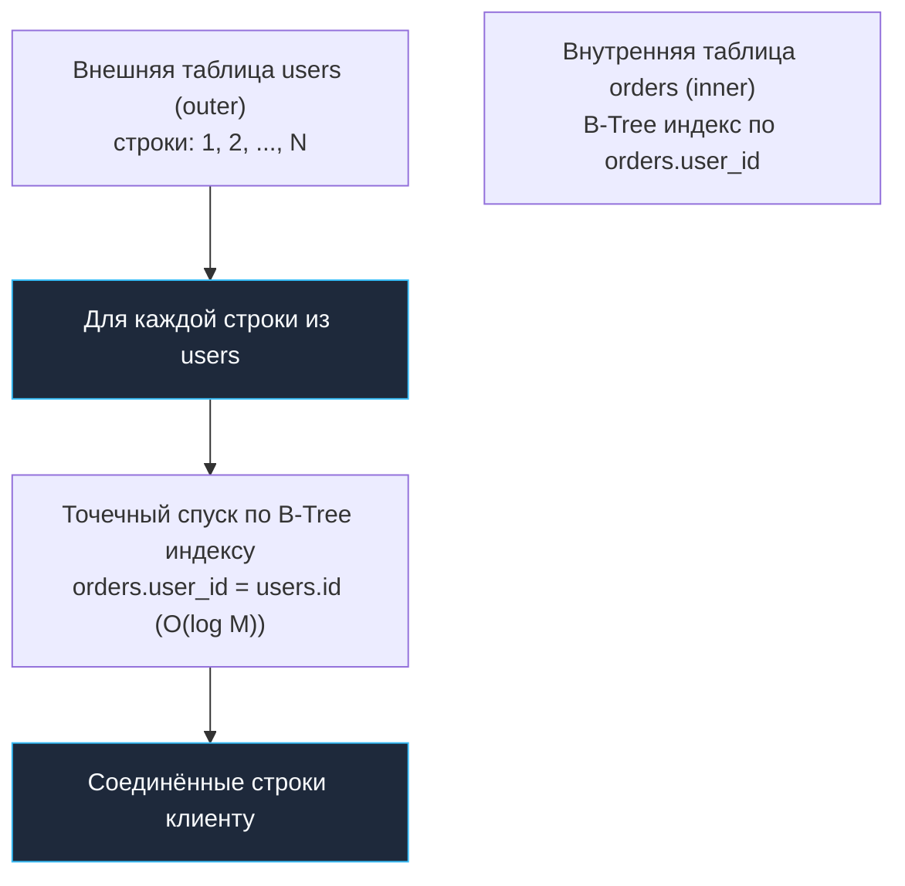
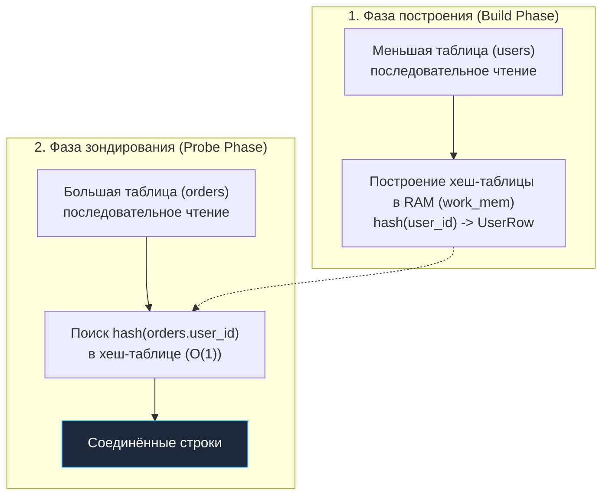
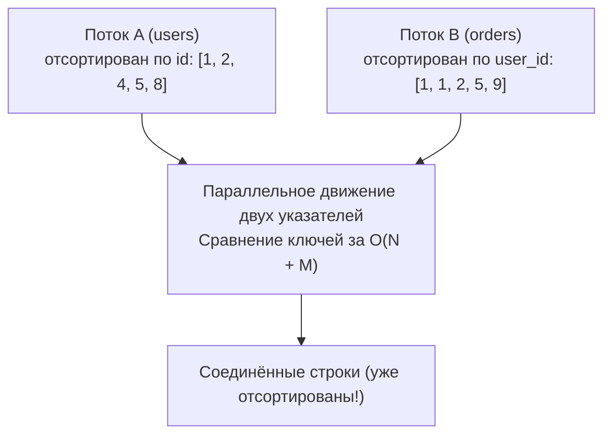

Главная суперсила реляционной модели данных, сформулированной Эдгаром Коддом более полувека назад, — это способность разделять данные на независимые нормализованные таблицы и динамически связывать их воедино во время выполнения запроса с помощью оператора `JOIN`. Это освобождает нас от чудовищной избыточности и аномалий обновления.

Но за эту гибкость приходится платить. Наивное соединение двух таблиц размером $N$ и $M$ строк — это декартово произведение (Cartesian Product) размером $N \times M$. Если в обеих таблицах всего по 100 000 записей, декартово произведение порождает **10 миллиардов пар**! Если СУБД попытается перебрать их в лоб, сервер сгорит от стыда и перегрева.

В отличие от проблемы N+1 ([[13. N+1 проблема]]), где избыточность порождается небрежным кодом прикладного слоя, медленный `JOIN` — это результат неоптимального физического плана и отсутствия поддерживающих индексов. В этой главе мы изучим три фундаментальных алгоритма физического соединения в реляционных движках (Nested Loop, Hash Join, Merge Join), разберем их работу с точки зрения кремния и кэшей CPU (Mechanical Sympathy), и научимся проектировать схему и запросы так, чтобы соединения летали за миллисекунды.

---

### Три кита: Nested Loop, Hash Join, Merge Join

Современные СУБД (PostgreSQL, MySQL/InnoDB, Oracle) реализуют три базовых физических алгоритма соединения. Оптимизатор CBO ([[11. Cost based optimizer]]) выбирает между ними, опираясь на оценку кардинальности ([[12. Cardinality и статистика]]), доступные индексы и объем свободной оперативной памяти `work_mem`.

---

#### Nested Loop Join (соединение вложенными циклами)

Это самый простой, интуитивный и исторически первый алгоритм. Движок организует классический двойной цикл: берет строку из **внешней** таблицы (`outer`), а затем ищет соответствующие строки во **внутренней** таблице (`inner`).



**Когда алгоритм эффективен:**
- Внешняя таблица (`outer`) очень мала (от 1 до нескольких сотен строк) после применения фильтра `WHERE`.
- Внутренняя таблица (`inner`) имеет высокоселективный B-Tree индекс по ключу соединения.
- Запрос ограничен условием `LIMIT`: `Nested Loop` отдает первые строки мгновенно (минимальный `start cost`), позволяя остановить сканирование за микросекунды.

**Mechanical Sympathy:**  
Если на внутренней таблице **нет индекса**, `Nested Loop` превращается в аппаратный кошмар: для каждой из 10 000 внешних строк СУБД выполнит полное последовательное чтение всей внутренней таблицы!  
При наличии B-Tree индекса каждое обращение — это спуск по 2–3 страницам дерева. Если внешняя таблица мала, эти индексные страницы оседают в кэше L1/L2 процессора, и соединение выполняется молниеносно. Но если внешняя таблица насчитывает 500 000 строк, даже с индексом `Nested Loop` вызовет лавину из полутора миллионов случайных чтений диска, убив IOPS дискового массива.

---

#### Hash Join (хеш-соединение)

**Hash Join** — главная рабочая лошадка аналитических и пакетных запросов. Алгоритм разделен на две четкие фазы:

1. **Фаза построения (Build Phase):** СУБД сканирует меньшую из двух таблиц (внутреннюю) и строит по ключу соединения хеш-таблицу в оперативной памяти (`work_mem`).
2. **Фаза зондирования (Probe Phase):** СУБД последовательно сканирует вторую таблицу (внешнюю) и для каждой строки вычисляет хеш ключа соединения, мгновенно находя совпадения в хеш-таблице за $O(1)$.



**Когда алгоритм эффективен:**
- Обе таблицы достаточно велики, и на внутренней таблице нет готового B-Tree индекса.
- Внутренняя таблица (после фильтрации) целиком помещается в лимит памяти `work_mem`.
- Предикат соединения — строгое равенство (Equi-join: `a.id = b.user_id`), так как хеш-таблица не умеет искать по диапазонам (`>`, `<`).

**Mechanical Sympathy:**  
С точки зрения кремния, `Hash Join` великолепен: обе таблицы считываются последовательно (Sequential Scan), что идеально утилизирует аппаратный упреждающий буфер (Read-Ahead) ядра Linux и шину PCIe SSD.  
Однако у `Hash Join` есть критическая уязвимость: **нехватка памяти**. Если размер хеш-таблицы превышает `work_mem`, PostgreSQL переключается на **многопакетный хеш (Multi-batch Hash Join)**. Данные разбиваются на батчи и сбрасываются во временные файлы на диск! Случайная запись и чтение сотен мегабайт временных файлов обваливают производительность запроса в 50–100 раз.

---

#### Merge Join (соединение слиянием)

**Merge Join** — самый благородный и математически чистый алгоритм, прямой родственник сортировки слиянием (Merge Sort).

Оба потока данных предварительно сортируются по ключу соединения. Затем два отсортированных потока протягиваются параллельно: движок держит два курсора, сравнивает текущие ключи и продвигает меньший вперед.



**Когда алгоритм эффективен:**
- Обе таблицы **уже физически отсортированы** благодаря наличию B-Tree индексов по ключам соединения.
- Запрос содержит секцию `ORDER BY` по ключу соединения: `Merge Join` выдает результат уже в готовом отсортированном порядке, полностью исключая тяжелый узел `Sort`!
- Соединяются две огромные таблицы с миллионами строк, которые физически не влезают ни в какую оперативную память.

**Mechanical Sympathy:**  
Если оба источника читаются из индексов, `Merge Join` производит идеальное поточное чтение. Никаких хеш-таблиц в памяти, никаких временных файлов на диске, минимальная нагрузка на CPU (только линейное сравнение ключей). Но если хотя бы одну таблицу приходится предварительно сортировать узлом `Sort`, вся выгода растворяется в накладных расходах сортировки.

---

### Как планировщик выбирает алгоритм

Оптимизатор CBO выбирает победителя на основе математических оценок:
- **Размеры таблиц (`reltuples`)** и ожидаемое число строк после фильтрации.
- **Наличие подходящих индексов** на внешних ключах.
- **Объем памяти `work_mem`**, выделенный текущей сессии.

Для глубокой отладки в PostgreSQL можно временно запрещать планировщику использовать те или иные алгоритмы:
```sql
SET enable_nestloop = off;
SET enable_hashjoin = off;
SET enable_mergejoin = off;
```
Это незаменимый прием, позволяющий экспериментально проверить, насколько быстрее выполнился бы альтернативный план.

---

### Оптимизация JOIN в Go-приложениях

Для разработчика на Go оптимизация соединений строится на шести железных правилах:

1. **Индексы на внешние ключи (Foreign Keys):**  
   Каждое поле внешнего ключа (например, `orders.user_id`) **обязано иметь B-Tree индекс**! В отличие от первичных ключей, PostgreSQL не создает индекс на `FOREIGN KEY` автоматически. Без этого индекса любой `JOIN` или каскадное удаление `ON DELETE CASCADE` превратится в катастрофический `Seq Scan`.
2. **Фильтрация до соединения:**  
   Старайтесь отсекать строки в секции `WHERE` до того, как они попадут в соединение. Чем меньше строк подается на вход `JOIN`, тем меньше работы достанется процессору.
3. **Покрывающие индексы ([[6. Covering индекс]]):**  
   Если в дочерней таблице вам нужно всего пару полей (например, `status` и `amount`), добавьте их в секцию `INCLUDE` индекса внешнего ключа:
   ```sql
   CREATE INDEX idx_orders_user_covering 
       ON orders (user_id) 
       INCLUDE (amount, status);
   ```
   Это превратит обращение к внутренней таблице в мгновенный `Index Only Scan` без обращения к куче (Heap Fetch).
4. **Согласованность типов данных (Type Alignment):**  
   Следите, чтобы связываемые колонки имели идентичный тип данных! Если `users.id` имеет тип `bigint`, а `orders.user_id` случайно объявлен как `int` (int4), ядро PostgreSQL откажется использовать индекс из-за несовместимости типов в операторах сравнения, и соединение скатится в последовательный перебор.
5. **Динамическая настройка `work_mem` в Go:**  
   Если вы запускаете тяжелый аналитический отчет с `Hash Join`, увеличьте `work_mem` локально внутри сессии перед выполнением запроса:

```go
package main

import (
	"context"
	"fmt"
	"github.com/jackc/pgx/v5"
)

func ExecuteHeavyReport(ctx context.Context, conn *pgx.Conn) error {
	// Поднимаем память для сессии с 4 МБ до 128 МБ, чтобы Hash Join не выпадал на диск
	if _, err := conn.Exec(ctx, "SET work_mem = '128MB'"); err != nil {
		return err
	}
	defer conn.Exec(ctx, "RESET work_mem")

	query := `
		SELECT u.country, count(*), sum(o.amount)
		FROM users u
		JOIN orders o ON u.id = o.user_id
		GROUP BY u.country;
	`
	// ... выполнение запроса
	return nil
}
```

6. **Фиксация порядка соединений через CTE `MATERIALIZED`:**  
   Если оптимизатор ошибается в порядке соединений из-за перекоса статистики, вы можете изолировать подзапрос в CTE с директивой `AS MATERIALIZED (...)`. Это заставит PostgreSQL сначала вычислить и материализовать промежуточный результат, разорвав неоптимальный план соединения.

---

### Пример анализа плана с JOIN

Рассмотрим запрос с фильтром и соединением:

```sql
EXPLAIN (ANALYZE, BUFFERS)
SELECT u.name, o.amount
FROM users u
JOIN orders o ON u.id = o.user_id
WHERE u.created_at > '2024-01-01';
```

Реальный вывод `EXPLAIN`:
```text
Hash Join  (cost=12.50..45.67 rows=1000 width=36) (actual time=0.850..2.120 rows=1200 loops=1)
  Hash Cond: (o.user_id = u.id)
  Buffers: shared hit=842
  ->  Seq Scan on orders o  (cost=0.00..28.00 rows=2000 width=16)
  ->  Hash  (cost=10.00..10.00 rows=200 width=20)
        Buckets: 1024  Batches: 1  Memory Usage: 18kB
        ->  Index Scan using idx_users_created on users u
              Index Cond: (created_at > '2024-01-01'::timestamp)
```

Разбор картины:
- Оптимизатор отфильтровал пользователей по индексу `idx_users_created` и построил компактную хеш-таблицу в памяти (`Memory Usage: 18kB`).
- Параметр `Batches: 1` подтверждает, что хеш-таблица целиком поместилась в `work_mem` без сброса на диск.
- Затем единым линейным проходом по таблице заказов сопоставил ключи за 2 миллисекунды.

---

### Типичные ошибки и ловушки

> [!warning] Ловушка / Gotcha: Неявное приведение типов и сброс на диск
> 1. **Неявный каст типов:** Если первичный ключ объявлен как `bigint`, а внешний ключ дочерней таблицы — как `int`, СУБД вынуждена на лету конвертировать значения. B-Tree индекс по внешнему ключу отключается, и запрос вырождается в полный перебор таблицы.
> 2. **Маркер дискового сброса `Buckets: ... Batches: ...`:** Если в строке хеша вы видите `Batches: 16` (или любое число больше 1) и надпись `written to disk`, значит, хеш-таблице не хватило `work_mem`. Запрос выполняет миллионы дисковых записей. Немедленно увеличьте `work_mem` или перепишите запрос.
> 3. **Недооценка кардинальности:** Если оптимизатор ошибочно решил, что в результате `JOIN` вернется 10 строк вместо реальных 500 000, он может поставить после соединения узел `Sort` с методом `quicksort`, который взорвет потребление памяти.

---

> [!tip] Собеседование: Когда Nested Loop быстрее Hash Join на миллионах строк?
> **Вопрос:** В таблице `users` — 10 миллионов строк, в таблице `orders` — 100 миллионов строк. Может ли `Nested Loop Join` оказаться быстрее, чем `Hash Join`?
> 
> **Ответ:** Да, и в двух классических случаях:
> 1. **Высокая селективность внешнего фильтра:** Если запрос выбирает заказы конкретного VIP-пользователя (`WHERE users.email = 'boss@corp.com'`), внешняя таблица возвращает ровно 1 строку. `Nested Loop` сделает ровно один спуск по B-Tree индексу заказов за 0.05 мс, в то время как `Hash Join` потратил бы секунды на полное сканирование таблицы пользователей и построение хеш-таблицы.
> 2. **Наличие `LIMIT` с ранним выходом:** Если запросу требуется вернуть первые 10 заказов (`ORDER BY id LIMIT 10`), `Nested Loop` вернет 10 записей и немедленно завершит выполнение, тогда как `Hash Join` обязан полностью достроить хеш-таблицу до конца, прежде чем отдать первую строку.

---

### Мониторинг и анализ в Go

Для автоматизированного контроля за качеством соединений напишем вспомогательную функцию трассировки планов:

```go
package main

import (
	"context"
	"database/sql"
	"encoding/json"
	"log"
)

func AuditJoinStrategy(ctx context.Context, db *sql.DB, query string, args ...any) {
	explainQuery := "EXPLAIN (ANALYZE, BUFFERS, FORMAT JSON) " + query

	var rawJSON []byte
	if err := db.QueryRowContext(ctx, explainQuery, args...).Scan(&rawJSON); err != nil {
		log.Printf("Explain failed: %v", err)
		return
	}

	var parsed []struct {
		Plan map[string]any `json:"Plan"`
	}
	if err := json.Unmarshal(rawJSON, &parsed); err == nil && len(parsed) > 0 {
		inspectJoinNodes(parsed[0].Plan)
	}
}

func inspectJoinNodes(node map[string]any) {
	nodeType, _ := node["Node Type"].(string)
	// Отслеживаем опасный Nested Loop без индексов
	if nodeType == "Nested Loop" {
		log.Printf("FOUND JOIN: %s, Total Cost: %v", nodeType, node["Total Cost"])
	}

	if plans, ok := node["Plans"].([]any); ok {
		for _, p := range plans {
			if child, ok := p.(map[string]any); ok {
				inspectJoinNodes(child)
			}
		}
	}
}
```

---

### Заключение

Операция `JOIN` — это сердце реляционной модели. Понимание механики трех физических алгоритмов соединения превращает разработчика из пассивного пользователя базы данных в архитектора высоконагруженных конвейеров:
- **`Nested Loop`** — снайперский инструмент для точечных выборок и запросов с `LIMIT`.
- **`Hash Join`** — мощный экскаватор для пакетной обработки и аналитики без индексов (при условии адекватного `work_mem`).
- **`Merge Join`** — элегантный скоростной поезд для огромных отсортированных потоков.

В следующей лекции мы обобщим техники оптимизации чтения и перейдем к фундаментальным правилам написания эффективных запросов: [[15. Оптимизация SELECT]].
