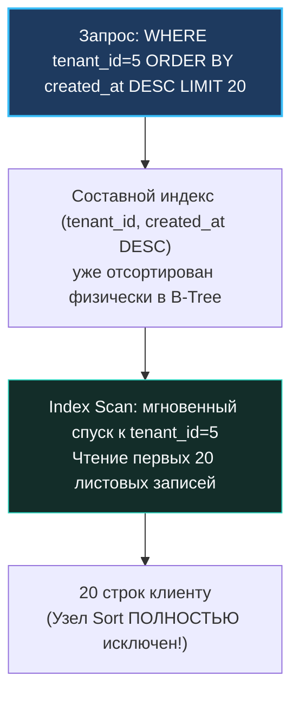

В повседневной жизни бэкенд-разработчика оператор `SELECT` кажется самым привычным и безобидным. Мы пишем его сотни раз в день: читаем пользователей, фильтруем заказы, строим витрины данных. Но именно в операциях чтения скрывается до 90% всех узких мест высоконагруженных сервисов.

`SELECT` обманчив своей кажущейся простотой. За лаконичной строчкой SQL скрывается гигантский конвейер: парсинг, планирование, обход B-Tree страниц, обращение к буферному пулу, чтение TOAST-таблиц, сериализация в TCP-сокет и десериализация в Go-структуры. Каждая небрежность — лишняя звездочка `*`, несаргабельное условие в `WHERE`, пагинация через `OFFSET` или неявное приведение типов — способна обрушить пропускную способность базы данных в десятки раз.

В этой главе мы систематизируем инженерное искусство оптимизации `SELECT`. Мы разберем, как сделать выборки легкими для процессора, памяти и сети, опираясь на глубокое понимание законов железа (Mechanical Sympathy) и рантайма Go.

---

### Не выбирайте звёздочку

Среди всех ошибок в SQL самая распространенная и разрушительная — привычка писать `SELECT *`.

В кодовой базе на Go, особенно при использовании ORM, разработчики часто тянут всю строку целиком, даже если для бизнес-логики нужны только два поля: `id` и `status`. Последствия этого легкомыслия катастрофичны:

1. **Убийство `Index Only Scan`:**  
   Как мы детально выяснили в [[6. Covering индекс]], если запрос выбирает строго те поля, которые заложены в индекс (или секцию `INCLUDE`), СУБД отдает данные прямо из листьев B-Tree, вообще не прикасаясь к физической таблице. Но стоит вам написать `SELECT *`, как оптимизатор видит необходимость достать еще 20 столбцов и немедленно переключается на тяжелый `Index Scan` с лавиной случайных чтений диска (`Heap Fetches`).
2. **Чтение TOAST-таблиц для широких полей:**  
   Колонки переменной длины (`text`, `jsonb`, `bytea`), превышающие порог в 2 КБ, в PostgreSQL физически выносятся в отдельную таблицу (TOAST — The Oversized-Attribute Storage Technique). Запрос `SELECT *` заставляет СУБД считывать и склеивать эти гигантские куски данных, даже если они вам не нужны.
3. **Нагрузка на сеть и аллокации памяти в Go:**  
   Широкие строки прокачиваются через сокеты ядра Linux, расходуют буферы драйвера и провоцируют колоссальное количество мелких аллокаций в куче Go (`Heap Allocations`), загружая сборщик мусора (Garbage Collector).

Золотое правило высоконагруженного бэкенда: **запрашивайте строго те столбцы, которые будут прочитаны кодом**:
```sql
SELECT id, name, email FROM users WHERE active = true;
```

> [!info] Под капотом: Буферизация драйверов lib/pq и pgx
> При выполнении `SELECT *` клиентский драйвер (`lib/pq` или `pgx`) получает сетевой пакет протокола PostgreSQL, содержащий дескрипторы и бинарные значения абсолютно всех атрибутов строки. Даже если в Go-коде вы вызываете `rows.Scan(&u.ID, &u.Name)` и игнорируете остальные поля, драйвер все равно вынужден парсить входящий поток байтов целиком. При точечном запросе `SELECT id, name` объем передаваемых и парсируемых байтов сокращается на 80–90%.

---

### Sargable условия: позвольте индексам работать

Термин **Sargable** (Search ARGument ABLE) обозначает условия фильтрации в секции `WHERE`, которые позволяют оптимизатору использовать индекс для быстрого логарифмического спуска по B-Tree.

К саргабельным операторам относятся: `=`, `<`, `>`, `BETWEEN`, `LIKE 'prefix%'`, `IN` с константами, а также `IS NULL` (при определенных индексах).

**Не-саргабельные конструкции (Non-Sargable)** ломают математику индекса, вынуждая базу вычислять функцию для каждой строки таблицы через полный перебор (`Seq Scan`):

1. **Оборачивание индексированной колонки в функцию:**
   ```sql
   -- ПЛОХО: B-Tree индекс по email отключен!
   WHERE LOWER(email) = 'alice@example.com'
   ```
   Дерево индекса отсортировано по значениям `email`, а не по результату функции `LOWER()`. База не может найти ключ поиском.  
   *Решение:* создать **функциональный B-Tree индекс**:
   ```sql
   CREATE INDEX ON users (LOWER(email));
   ```
2. **Арифметика над колонкой:**
   ```sql
   -- ПЛОХО: колонка salary умножается на лету
   WHERE salary * 1.2 > 100000;

   -- ПРАВИЛЬНО: перенесите вычисления в константную часть!
   WHERE salary > 100000 / 1.2;
   ```
   В выражении `WHERE salary > 100000 / 1.2` правая часть вычисляется планировщиком один раз как константа, а левая часть остается чистой колонкой, позволяя B-Tree мгновенно спозиционироваться на границе диапазона.
3. **Неявное приведение типов (Type Coercion):**  
   Если колонка `created_at` имеет тип `timestamp with time zone`, а в SQL-запрос передана текстовая строка без часового пояса или тип `date`, ядро СУБД применит скрытое приведение типа к каждой строке, полностью отключив индекс.  
   В Go-коде всегда передавайте точный тип `time.Time`:
   ```go
   // Надежно и саргабельно: драйвер передает бинарный timestamp с таймзоной
   rows, err := db.QueryContext(ctx, 
       "SELECT id FROM events WHERE created_at >= $1", startTime)
   ```

---

### Индексы для сортировки и пределов

Запросы с `ORDER BY` и `LIMIT` — основа любых лент новостей, каталогов и очередей.

В наивной базе данных запрос:
```sql
SELECT * FROM events WHERE tenant_id = 5 ORDER BY created_at DESC LIMIT 20;
```
приведет к тому, что база найдет все события организации (пусть их 2 миллиона), загрузит их в память, выполнит тяжелую сортировку узлом `Sort` и лишь затем отдаст первые 20 строк.

Если же у вас есть составной B-Tree индекс:
```sql
CREATE INDEX idx_events_tenant_created ON events (tenant_id, created_at DESC);
```
происходит архитектурное чудо:
1. База прыгает в корень B-Tree к узлу `tenant_id = 5`.
2. Внутри узла записи **уже физически отсортированы** по `created_at DESC`!
3. Движок просто считывает первые 20 записей из листовых страниц и немедленно завершает запрос. Ноль байт памяти на сортировку, нулевой CPU `Sort`!



При отсутствии точного индекса планировщик вынужден использовать **top-N heapsort** — алгоритм усеченной пирамидальной сортировки в памяти, что значительно дороже.

---

### Пагинация: избегайте OFFSET

Классическая постраничная навигация через `OFFSET`:
```sql
-- Страница 10 000:
SELECT id, name FROM users ORDER BY id LIMIT 20 OFFSET 200000;
```
Это чудовищный антипаттерн! 

Физически `OFFSET 200000` означает: **прочитай 200 000 строк с диска, пропусти их в мусорную корзину и верни следующие 20**. На 1 000-й странице ваш сервер упадет под лавиной дискового ввода-вывода.

Единственно верное инженерное решение — **Keyset Pagination (пагинация курсором / Seek Method)**:
Вместо номера страницы клиент запоминает последнее значение сортируемого ключа и передает условие `WHERE key > last_value`:
```sql
SELECT id, name FROM users WHERE id > $1 ORDER BY id LIMIT 20;
```

```go
package main

import (
	"context"
	"database/sql"
)

// Keyset пагинация: стабильная скорость O(log N) на любой глубине!
func FetchUsersKeyset(ctx context.Context, db *sql.DB, lastID int64, limit int) ([]User, error) {
	query := `
		SELECT id, name 
		FROM users 
		WHERE id > $1 
		ORDER BY id 
		LIMIT $2;
	`
	rows, err := db.QueryContext(ctx, query, lastID, limit)
	// ... обработка строк
	return users, err
}
```

При keyset-пагинации база данных совершает один логарифмический спуск по B-Tree до точки `WHERE id > last_value` и считывает ровно `LIMIT` строк. Время выборки 100 000-й страницы точно такое же, как и 1-й страницы — 0.1 миллисекунды.

> [!warning] Ловушка / Gotcha: Многоколоночная keyset-пагинация
> Если сортировка идет по нетиповому полю (например, по дате создания `created_at`), поле может содержать дубликаты. Поэтому ключ сортировки обязан быть составным и уникальным: `(created_at, id)`.  
> В PostgreSQL фильтрация выполняется изящным сравнением кортежей (Row Value Constructors):
> ```sql
> WHERE (created_at, id) > ($1, $2)
> ORDER BY created_at, id
> LIMIT 20;
> ```
> PostgreSQL нативно умеет использовать составной B-Tree индекс для предикатов `(created_at, id) > ($1, $2)`.

---

### Агрегация и GROUP BY

Агрегатные функции (`COUNT`, `SUM`, `AVG`) требуют сканирования больших массивов данных. Способы их оптимизации:

1. **Покрывающий индекс для группировки:**  
   Для запроса `SELECT tenant_id, COUNT(*) FROM events GROUP BY tenant_id` создание индекса `(tenant_id)` позволяет СУБД выполнить `Index Only Scan`. Таблица вообще не читается с диска.
2. **Index Skip Scan (Loose Index Scan):**  
   Если в составном индексе первые столбцы имеют мало уникальных значений, современные движки умеют «перепрыгивать» через одинаковые значения ключа, вычисляя агрегаты без сплошного перебора.
3. **Материализованные представления:**  
   Если вам нужен мгновенный `COUNT(*)` по миллиардной таблице, не делайте его в реальном времени. Создайте материализованное представление ([[12. Представления и materialized views]]) или используйте триггерные инкрементные счетчики.

---

### Подзапросы, CTE и LATERAL

1. **CTE (`WITH`) в современном PostgreSQL:**  
   До версии PostgreSQL 12 любое CTE-выражение выступало жестким оптимизационным барьером (принудительно материализовалось во временную таблицу). Начиная с PostgreSQL 12, CTE по умолчанию считаются **`NOT MATERIALIZED`**: оптимизатор встраивает их в тело основного запроса и оптимизирует совместно. Принудительная материализация задается явно: `WITH cte AS MATERIALIZED (...)`.
2. **Подзапросы `JOIN LATERAL`:**  
   Конструкция `LATERAL` позволяет подзапросу обращаться к колонкам родительской таблицы для каждой строки (своего рода контролируемый цикл `foreach`). Это незаменимо для задачи «выбрать топ-3 последних заказа для каждого пользователя»:

```sql
SELECT u.id, u.name, o.id AS order_id, o.amount
FROM users u
JOIN LATERAL (
    SELECT id, amount 
    FROM orders 
    WHERE user_id = u.id 
    ORDER BY created_at DESC 
    LIMIT 3
) o ON true;
```

При наличии составного индекса `(user_id, created_at DESC)` этот запрос отрабатывает в десятки раз быстрее, чем монструозные оконные функции с `ROW_NUMBER() OVER (PARTITION BY user_id)`.

---

### Параллельное выполнение

Для тяжелых аналитических выборок PostgreSQL умеет распараллеливать исполнение между несколькими воркерами процессора.

Планировщик строит узел **`Gather`**, который собирает результаты параллельных сканирований (`Parallel Seq Scan` или `Parallel Index Scan`). Управлять этим поведением можно параметрами ядра:
- `max_parallel_workers_per_gather` (по умолчанию 2) — максимальное число воркеров на один узел запроса.
- `min_parallel_table_scan_size` — минимальный размер таблицы, с которого имеет смысл включать параллелизм.

Для быстрых OLTP-запросов параллелизм не активируется, так как накладные расходы на запуск процессов и межпроцессное взаимодействие (IPC) через Shared Memory превышают время самого поиска.

---

### Практические приёмы в Go

1. **Подготовленные запросы (Prepared Statements):**  
   Использование `PREPARE` позволяет базе данных один раз распарсить SQL и построить план, а затем многократно выполнять его с новыми аргументами. В драйвере `pgx` это включено по умолчанию (параметр `PreferSimpleProtocol = false`).
2. **Пакетная отправка (Batching):**  
   Вместо серии одиночных запросов объединяйте выборки через `UNION ALL` или пакетную фильтрацию `WHERE id IN (...)`. А для независимых запросов используйте механизм `SendBatch` в `pgx` (подробнее — в [[16. Batch запросы]]).
3. **In-Memory кэширование в Go:**  
   Самый быстрый запрос к базе данных — это запрос, который не был отправлен. Для статичных справочников (страны, валюты, тарифы) используйте локальные in-memory кэши с алгоритмом вытеснения TinyLFU/LRU (библиотеки `ristretto` или `go-cache`).

> [!info] Под капотом: Конвейеризация (Pipelining) в pgx через SendBatch
> В драйвере `pgx` метод `SendBatch` позволяет отправить пачку SQL-команд в одном сетевом TCP-пакете, задействуя протокол конвейеризации PostgreSQL (Pipeline Mode). Это радикально снижает задержки round-trip, когда в ответ на один HTTP-запрос приложению требуется выполнить несколько независимых операций `SELECT`.

---

### Mechanical Sympathy: сеть и CPU

Каждый байт ответа СУБД преодолевает длинный путь:
- Системный вызов `send()` ядра Linux на сервере БД.
- Передача пакетов по сетевому стеку TCP/IP.
- Системный вызов `recv()` на сервере приложений Go.
- Копирование байтов из буфера сокета в пользовательское пространство.
- Десериализация текстовых/бинарных форматов в Go-структуры.

Устранение `SELECT *` и переход на keyset-пагинацию сокращают сетевой трафик и количество системных вызовов в разы. Меньше аллокаций в Go — меньше пауз GC, выше пропускная способность RPS и стабильнее задержка p99.

---

### Как убедиться, что оптимизация работает

После написания любого нетривиального `SELECT` обязательно выполните:
```sql
EXPLAIN (ANALYZE, BUFFERS) <ваш запрос>;
```
Чек-лист инспекции:
- [ ] Отсутствуют паразитные узлы `Seq Scan` на больших таблицах.
- [ ] Отсутствуют лишние узлы `Sort` (сортировка берется из B-Tree индекса).
- [ ] Оценка кардинальности `rows` совпадает с `actual rows` с точностью до порядка.
- [ ] Количество буферов `shared hit` в разы превышает дисковые чтения `read`.

---

### Заключение

Оптимизация `SELECT` — это вершина мастерства бэкенд-разработчика. Она объединяет знания кремниевых структур B-Tree ([[2. B Tree индекс под капотом]]), архитектуры составных и покрывающих индексов ([[5. Composite индексы]], [[6. Covering индекс]]), принципов работы стоимостного оптимизатора ([[11. Cost based optimizer]]) и дисциплины сетевого ввода-вывода.

Отказывайтесь от `SELECT *`, используйте саргабельные предикаты, внедряйте keyset-пагинацию — и ваша база данных будет работать с предельной грацией даже под многомиллионной нагрузкой.

В заключительной лекции этого подраздела мы рассмотрим технику максимального уплотнения сетевого трафика: [[16. Batch запросы]] — как отправлять сотни операций за один вызов.
