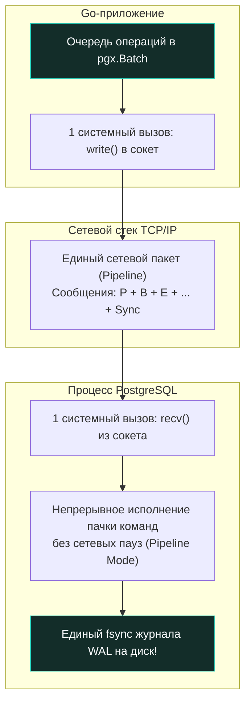

Представьте строителя, которому необходимо перевезти тысячу кирпичей со склада на стройплощадку. Если он погрузит в багажник легкового автомобиля ровно один кирпич, проедет через весь город, выгрузит его и вернется обратно — и так тысячу раз, — стройка затянется на месяцы, бензин сожжет весь бюджет, а водитель сойдет с ума. Любой здравомыслящий человек наймет грузовик, погрузит всю тысячу кирпичей сразу и сделает **одну-единственную поездку**.

В сетевом взаимодействии микросервисов с базами данных этот фундаментальный здравый смысл называется **Batch-запросами (пакетными операциями)**.

Вместо того чтобы отправлять сотни и тысячи одиночных команд `SELECT`, `INSERT`, `UPDATE` или `DELETE`, заставляя операционную систему совершать тысячи сетевых пересылок туда и обратно, приложение формирует один уплотненный пакет данных. Для Go-разработчика, проектирующего высоконагруженные API, освоение пакетных операций — это кратчайший путь к десятикратному росту пропускной способности (throughput) и снижению задержек (latency).

---

### Почему round-trip — враг

Даже в самом современном дата-центре скорость света в оптоволокне и кремниевых кристаллах конечна ($c \approx 200\,000 \text{ км/с}$). Время прохождения сетевого пакета от сервера приложений до сервера СУБД и обратно (Round-Trip Time, RTT) даже в пределах одной локальной сети составляет от 0.3 до 1.5 миллисекунд.

Каждый одиночный вызов `db.Exec` или `db.Query` совершает полный цикл:
1. **Go-приложение:** сериализация аргументов в память буфера, системный вызов `sendto()` ядра Linux.
2. **Сетевой стек:** фрагментация TCP/IP, передача через виртуальный коммутатор и физическую сетевую карту (NIC).
3. **Сервер СУБД:** прерывание ядра, системный вызов `recvfrom()`, парсер PostgreSQL, построение плана, выполнение и отправка ответа.
4. **Возврат:** чтение байтов из сокета, десериализация в Go-структуры.

Если вам нужно вставить 1 000 строк по одной, суммарное время составит:
$$\text{Время ожидания} = 1\,000 \times 1 \text{ мс} = 1 \text{ секунда!}$$
При этом сам процессор базы данных выполнял полезную работу лишь 2 миллисекунды. Остальные 998 миллисекунд система бессмысленно ждала подтверждения сетевых пакетов. 

Пакетный запрос (Batch) уничтожает этот оверхед, упаковывая 1 000 операций в одну сетевую транзакцию.

---

### Типы пакетных операций

#### 1. Множественная вставка (Multi-row INSERT)
Вместо череды отдельных `INSERT` операторов данные объединяются в один SQL-запрос с множеством кортежей:

```sql
INSERT INTO events (user_id, type, payload) VALUES
  ($1, $2, $3),
  ($4, $5, $6),
  ($7, $8, $9);
```

База данных парсит синтаксическое дерево один раз и вставляет все строки в рамках одной атомарной операции.

#### 2. Пакетная выборка по ключам (WHERE IN)
Вместо одиночных запросов вида `SELECT ... WHERE id = 1` для каждого идентификатора, приложение формирует один запрос с предикатом `WHERE id IN (...)`:

```sql
SELECT id, name FROM users WHERE id IN ($1, $2, $3, ...);
```

Это радикально сокращает число сетевых вызовов и позволяет оптимизатору применить `Index Scan` один раз по всему массиву ключей.

#### 3. Пакетное обновление (Bulk UPDATE)
Обновление множества строк разными значениями без циклов можно выполнить с помощью выражения `CASE` или элегантно через виртуальную таблицу значений `UPDATE ... FROM VALUES`:

```sql
UPDATE users u SET
    name = v.name,
    email = v.email
FROM (VALUES
    (1, 'Alice', 'alice@example.com'),
    (2, 'Bob', 'bob@example.com')
) AS v(id, name, email)
WHERE u.id = v.id;
```

Это один запрос вместо N отдельных `UPDATE`. Аналогично для массового удаления используется конструкция `DELETE FROM table WHERE id IN (...)`.

#### 4. Множественные SQL-команды через разделитель `;`
Протокол PostgreSQL позволяет отправить несколько разнородных команд в одном текстовом сообщении, разделяя их точкой с запятой `;`. Сервер выполнит их последовательно без возврата управления в сеть между командами.

---

### Реализация в Go: pgx.SendBatch

Для асинхронной пакетной отправки в Go драйвер `pgx` предоставляет мощнейший API — структуру `pgx.Batch` и метод `conn.SendBatch`:

```go
package main

import (
	"context"
	"fmt"

	"github.com/jackc/pgx/v5"
)

type Event struct {
	UserID  int64
	Type    string
	Payload []byte
}

func InsertEventsBatch(ctx context.Context, conn *pgx.Conn, events []Event) error {
	batch := &pgx.Batch{}

	// Наполняем очередь батча операциями
	for _, e := range events {
		batch.Queue(
			"INSERT INTO events(user_id, type, payload) VALUES($1, $2, $3)",
			e.UserID, e.Type, e.Payload,
		)
	}

	// Отправляем все команды единым TCP-пакетом по протоколу конвейеризации
	br := conn.SendBatch(ctx, batch)
	defer br.Close()

	// Считываем результаты выполнения каждой операции из сетевого буфера
	for i := 0; i < len(events); i++ {
		_, err := br.Exec()
		if err != nil {
			return fmt.Errorf("batch insert failed at index %d: %w", i, err)
		}
	}

	return br.Close()
}
```

А для пакетной выборки с динамическим числом аргументов в экосистеме Go традиционно используется библиотека `sqlx.In`:

```go
package main

import (
	"context"
	"github.com/jmoiron/sqlx"
)

func GetUsersByIDs(ctx context.Context, db *sqlx.DB, ids []int64) ([]User, error) {
	// sqlx.In автоматически разворачивает срез в плейсхолдеры: ($1, $2, $3...)
	query, args, err := sqlx.In(
		"SELECT id, name FROM users WHERE id IN (?);", ids,
	)
	if err != nil {
		return nil, err
	}

	// Rebind преобразует '?' в диалект PostgreSQL ($1, $2, $3...)
	query = db.Rebind(query)

	var users []User
	err = db.SelectContext(ctx, &users, query, args...)
	return users, err
}
```

---

### COPY: максимальная скорость вставки

Когда речь заходит о загрузке сотен тысяч или миллионов записей (ETL, аналитические дампы, миграции), даже `INSERT ... VALUES` уступает специализированному протоколу **`COPY`**.

Протокол `COPY` работает в обход стандартного SQL-парсера и планировщика запросов. Данные передаются напрямую в бинарном потоке, а ядро PostgreSQL потоком раскладывает их по страницам таблицы:

```go
package main

import (
	"context"
	"github.com/jackc/pgx/v5"
)

func StreamEventsCopy(ctx context.Context, conn *pgx.Conn, events []Event) (int64, error) {
	// CopyFrom использует бинарный протокол COPY PostgreSQL
	return conn.CopyFrom(
		ctx,
		pgx.Identifier{"events"},
		[]string{"user_id", "type", "payload"},
		pgx.CopyFromSlice(len(events), func(i int) ([]any, error) {
			e := events[i]
			return []any{e.UserID, e.Type, e.Payload}, nil
		}),
	)
}
```

Метод `CopyFrom` на порядки превосходит `INSERT`: скорость вставки возрастает со скромных 2 000 строк/сек до впечатляющих **100 000 – 300 000 строк в секунду**.

---

### Потенциальные проблемы и ловушки

> [!warning] Ловушка / Gotcha: Границы батча, память и атомарность
> 1. **Гигантские батчи (Batch Bloat):** Попытка отправить батч из 100 000 строк в одном запросе перегрузит память процесса СУБД, приведет к превышению лимитов `max_stack_depth` и `max_prepared_transactions`, а также надолго заблокирует страницы таблицы. **Оптимальный размер батча для OLTP — от 100 до 1 000 строк**.
> 2. **Тайм-ауты транзакций:** Большой батч рискует превысить серверный лимит `statement_timeout`. Всегда настраивайте таймаут контекста в Go с учетом размера пачки.
> 3. **Атомарность ошибок:** В одиночном запросе `INSERT ... VALUES` любая ошибка (например, конфликт уникальности) откатит весь батч целиком. В `pgx.Batch` поведение зависит от того, обернут ли вызов в явную транзакцию (`BEGIN` / `COMMIT`). Если транзакции нет, успешные команды зафиксируются, а упавшие вернут ошибку.

---

> [!tip] Собеседование: Битва производительности — INSERT vs Batch vs COPY
> **Вопрос:** Какой метод вставки 1 миллиона строк в PostgreSQL самый эффективный и почему?
> 
> **Ответ:** 
> 1. Самый медленный: одиночные `INSERT` в цикле ($1\,000\,000$ сетевых round-trips, $1\,000\,000$ операций записи в WAL и парсинга SQL).
> 2. Быстрее в 20–50 раз: `pgx.Batch` или множественный `INSERT ... VALUES` пачками по 1 000 строк.
> 3. Самый быстрый (в 100+ раз): протокол **`COPY` (`conn.CopyFrom`)**. Он полностью минует лексический анализатор и планировщик, передает бинарные данные потоком и формирует страницы таблицы с минимальными накладными расходами CPU.

---

### Mechanical Sympathy: что происходит под капотом

Давайте заглянем внутрь сетевого кабеля и ядра операционной системы, когда Go-сервис вызывает `conn.SendBatch`:

1. **Упаковка фреймов протокола:**  
   В простом протоколе каждый одиночный SQL-запрос передается отдельным сообщением типа `'Q'` (Query). В пакетном же режиме драйвер задействует расширенный протокол PostgreSQL и конвейеризирует сообщения без ожидания:
   - Сообщение `'P'` (Parse) — компиляция подготовленного выражения;
   - Сообщение `'B'` (Bind) — привязка бинарных параметров;
   - Сообщение `'E'` (Execute) — запуск узла исполнения;
   - И лишь в самом конце — одиночное сообщение `'S'` (Sync).
2. **Сетевой стек TCP (Pipelining):**  
   Все эти команды укладываются в один или несколько непрерывных TCP-сегментов. Ядро Linux отправляет их через системный вызов `write`.
3. **Работа бэкенда PostgreSQL:**  
   Обслуживающий процесс PostgreSQL считывает данные из сокета через `recv` и выполняет команды непрерывной серией. Он не переключает контекст и не ждет сетевых подтверждений от клиента.
4. **Сжатие WAL:**  
   Вся пачка строк фиксируется единой записью фиксации транзакции (Commit Record) в журнале WAL. Вместо 1 000 операций сброса диска (`fsync`) сервер выполняет **ровно один `fsync`**!



---

### Когда batch не нужен

Пакетная обработка — инструмент коллективный. Если ваш сервис получает независимые единичные запросы от пользователей (например, одиночный клик в веб-интерфейсе), искусственное накопление батча во временном буфере задерживает ответ клиенту, увеличивая задержку (Latency Penalty).

Используйте батчи там, где данные уже имеют пакетную природу:
- Очереди сообщений (Kafka, RabbitMQ), вычитываемые пачками по 500 сообщений.
- Фоновые воркеры синхронизации и сбора метрик.
- Обработка входящих вебхуков от платежных систем.

---

### Конкурентные batch-запросы и блокировки

При выполнении объемных пакетных модификаций `UPDATE ... FROM (VALUES ...)` база данных захватывает эксклюзивные блокировки строк таблицы (Row-level Locks).

Если две параллельные горутины обновляют одни и те же строки в разном порядке:
- Горутина 1 обновляет пользователя 10, затем пользователя 20.
- Горутина 2 обновляет пользователя 20, затем пользователя 10.

База данных мгновенно свалится в **взаимоблокировку (Deadlock)** ([[6. Deadlock и их предотвращение]]).

**Правило предотвращения дедлоков в батчах:**  
Перед формированием батча на запись или обновление **всегда сортируйте массив идентификаторов по возрастанию ключа** (`sort.Slice(ids, func(i, j int) bool { return ids[i] < ids[j] })`). Если все транзакции захватывают блокировки строк в строго одинаковом порядке, возникновение дедлока математически невозможно!

---

### Итог

Пакетные запросы — это финальный аккорд в архитектуре высокопроизводительного взаимодействия с базой данных. Они объединяют аппаратное понимание дискового кэша, законов распространения сетевых пакетов и легковесных возможностей Go-рантайма.

На этом мы триумфально завершаем подраздел **«04. Индексы и производительность»**. За 16 фундаментальных лекций мы прошли грандиозный путь:
1. Изучили кремниевую физику B-Tree, Hash и Bitmap индексов.
2. Освоили искусство составных, покрывающих и частичных индексов.
3. Научились индексировать полуструктурированные JSONB и массивы через GIN/GiST.
4. Разобрали вредные индексы, научились читать мысли CBO через `EXPLAIN` и управлять кардинальностью.
5. Искоренили проблему N+1, оптимизировали `JOIN` и `SELECT` и обуздали сетевой ввод-вывод через `Batch` и `COPY`.

Вооружившись этим глубоким арсеналом знаний о производительности, мы готовы перейти к следующему краеугольному камню реляционной инженерии — надежности, атомарности и изоляции данных. В следующем подразделе мы открываем фундаментальную тему транзакций: [[1. ACID. Основы]].
