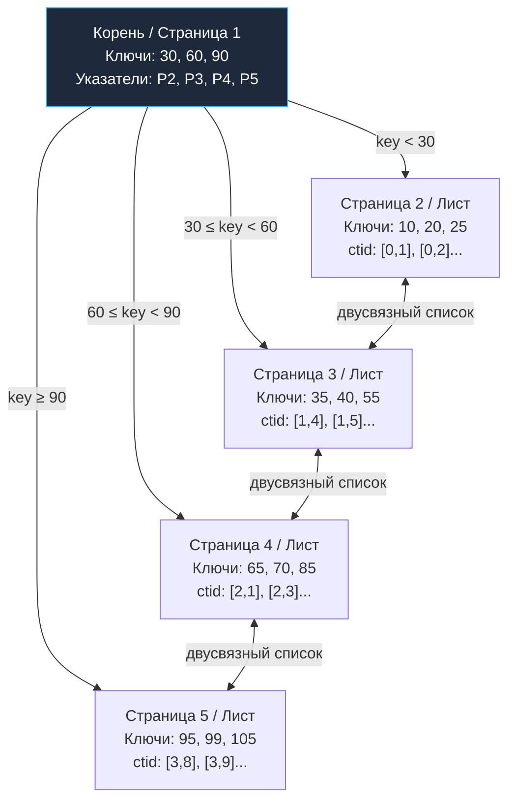

## B-Tree индекс под капотом: Балансировка страниц и механическое сочувствие

В предыдущей статье [[1. Что такое индекс и зачем он нужен]] мы выяснили, что индекс — это фундаментальная вспомогательная структура, позволяющая реляционному движку находить нужные кортежи без губительного сплошного сканирования всей таблицы (Seq Scan). 

Теперь пришло время заглянуть глубоко под капот и разобрать анатомию самой распространенной, проверенной полувеком эксплуатации структуры данных в реляционных СУБД — **B-Tree** и его промышленного стандарта **$B^+$-Tree**.

Индекс типа B-Tree лежит в основе практически всех современных реляционных движков: он используется в PostgreSQL (все стандартные индексы `btree`), в MySQL/InnoDB (как для кластерного первичного ключа, так и для всех вторичных индексов), в Oracle, SQLite и Microsoft SQL Server. Это главный рабочий конь серверных баз данных, безупречно оптимизированный под физику дисковых накопителей.

---

### Почему не бинарное дерево

В курсах компьютерных наук разработчики начинают знакомство с деревьями с классического двоичного дерева поиска (BST, Binary Search Tree) или его сбалансированных версий (AVL, Красно-черные деревья). В оперативной памяти бинарное дерево великолепно: поиск занимает логарифмическое время $O(\log_2 N)$, а переходы по указателям на адреса в RAM происходят за единицы наносекунд.

Но стоит перенести бинарное дерево на постоянный дисковый накопитель (HDD или SSD), как алгоритм превращается в катастрофу.

В бинарном дереве каждый узел хранит ровно один ключ и два дочерних указателя. Следовательно, высота дерева равна $\log_2 N$.  
Если в таблице накоплен $1\,000\,000\,000$ записей ($N = 10^9$), высота бинарного дерева составит:  
$$\log_2(10^9) \approx 30 \text{ уровней}$$

Каждый переход по указателю в дисковой структуре — это обращение к новой физической области накопителя. Если каждый шаг требует чтения отдельного сектора с задержкой случайного доступа (Random Read Latency) порядка 5–10 мс на HDD или 50–100 мкс на NVMe SSD, то выполнение тривиального поиска одной строки потребует **30 последовательных дисковых чтений** и займет от сотен миллисекунд до нескольких секунд. Ни одна высоконагруженная OLTP-система не выдержит подобной задержки.

**B-Tree решает эту проблему радикальным сплющиванием дерева.** Вместо одного ключа узел B-Tree упаковывает в себя сотни ключей и сотни указателей на потомков. Узел разрастается ровно до размера одной дисковой страницы (обычно 8 КБ). За одно дисковое чтение процессор получает в оперативную память сразу сотни ключей. 

В результате степень ветвления (Fanout) возрастает с 2 до 300–500, а высота дерева при том же миллиарде строк падает с 30 до **3–4 уровней**! Поиск по диску сводится всего к 3–4 блочным чтениям, большая часть которых гарантированно оседает в оперативной памяти.

---

### Механическая симпатия: страница — наш друг

Физические блочные накопители принципиально не умеют читать или записывать отдельные байты. Традиционный жесткий диск оперирует секторами по 512 байт или 4 КБ; твердотельный накопитель (SSD) выполняет чтение и запись физическими страницами флэш-памяти по 4–16 КБ.

Ядро СУБД выравнивает свою архитектуру под физику железа, вводя абстракцию **страницы данных (Data Page / Block)**:
- В **PostgreSQL** базовый размер страницы равен **8 КБ**.
- В **MySQL/InnoDB** стандартная страница составляет **16 КБ** (конфигурируемый параметр).

Узел B-Tree физически представляет собой ровно одну такую страницу на диске. Когда база данных считывает узел индекса, контроллер накопителя за один непрерывный I/O-цикл загружает весь 8-килобайтный блок в буферный пул оперативной памяти.

> [!info] Под капотом
> При чтении страницы процесс СУБД выполняет системный вызов ядра Linux `pread()` с указанием дескриптора файла и точного байтового смещения. 
> 
> Если страница отсутствует в буферном пуле СУБД (`shared_buffers` в PostgreSQL или `buffer pool` в InnoDB), ядро ОС инициирует блочный ввод-вывод. Страница оседает в системном дисковом кэше (Page Cache ОС) и копируется в память СУБД. Повторные обращения к этой же странице больше никогда не дергают физический накопитель, утилизируя наносекундную скорость оперативной памяти.

---

### Внутреннее устройство B-Tree узла

Внутренняя структура 8-килобайтной страницы B-Tree спроектирована с ювелирной точностью. Страница делится на три зоны:
1. **Заголовок страницы (Page Header):** Содержит метаданные (LSN последней модификации WAL, флаги состояния страницы, указатели на свободное пространство, ссылки на левую и правую соседние страницы).
2. **Массив указателей на элементы (Line Pointers / ItemIDs):** Непрерывный массив смещений, растущий от начала страницы к ее концу.
3. **Область данных ключей (Items):** Сами значения ключей и служебные указатели, растущие от конца страницы навстречу массиву указателей.

Все ключи внутри страницы физически поддерживаются в строго отсортированном порядке.

В промышленном стандарте **$B^+$-Tree** (который и применяется на практике в СУБД) существует строгое разделение типов узлов:
- **Внутренние узлы (Branch / Interior Nodes):** Содержат только ключи-разделители и номера дочерних страниц. Внутренний узел с `k` ключами хранит ровно `k+1` дочерних указателей. Они вообще не содержат ссылок на строки таблицы! Это позволяет максимизировать плотность ключей на странице (увеличить Fanout) и минимизировать высоту дерева.
- **Листовые узлы (Leaf Nodes):** Содержат абсолютно все реальные ключи и соответствующие им физические указатели на кортежи: идентификатор строки `ctid` в PostgreSQL либо значение первичного ключа в MySQL/InnoDB.
- **Двусвязный список листьев:** Листовые страницы физически связаны между собой указателями влево и вправо (`leftlink` и `rightlink`). Чтобы прочитать диапазон `WHERE age BETWEEN 20 AND 30`, движку достаточно спуститься от корня к первой записи `age = 20`, а затем просто двигаться последовательно по листьям вправо, не возвращаясь в родительские узлы!

---

### Поиск по B-Tree: от корня к строке

Проследим маршрут выполнения запроса `SELECT * FROM users WHERE id = 40`:

1. **Корень дерева (Root):** Корневая страница индекса почти со 100% вероятностью уже зафиксирована в оперативной памяти `shared_buffers`. Чтение диска не требуется.
2. **Бинарный поиск внутри корня:** Процессор выполняет двоичный поиск по отсортированному массиву ItemIDs в L1/L2 кэше за доли микросекунды ($O(\log_2 M)$, где $M$ — число ключей на странице). Диапазон $30 \le 40 < 60$ указывает на страницу №3.
3. **Спуск к промежуточному узлу или листу:** Если страницы №3 нет в памяти, выполняется блочное чтение страницы с диска.
4. **Поиск в листе:** Внутри листовой страницы двоичный поиск находит точный ключ `40` и извлекает физический указатель строки `ctid` (например, блок 1, смещение 5).
5. **Извлечение кортежа из таблицы:** СУБД считывает 8-килобайтную страницу данных таблицы по адресу `ctid` и возвращает строку клиенту. (Если все запрашиваемые поля содержались в самом индексе, срабатывает [[6. Covering индекс]], и обращение к таблице полностью отменяется).

---

### Вставка и расщепление (page split)

Когда сервис на Go выполняет операцию `INSERT`, ядро базы данных спускается по B-дереву, чтобы найти листовую страницу, куда логически должен попасть новый ключ.

Если на целевой странице достаточно свободного места (параметр плотности заполнения `fillfactor`, см. также [[4. Bitmap индекс]]), новый ключ и `ctid` просто дописываются в страницу с сохранением отсортированного порядка указателей. Изменение фиксируется в буфере страницы и сбрасывается в журнал упреждающей записи [[8. WAL. Write Ahead Log]]. Это быстрая, дешевая операция.

Однако если 8-килобайтная страница **физически переполнена**, активируется тяжелый алгоритм **расщепления (Page Split)**:

1. Движок аллоцирует новую пустую страницу в файле индекса.
2. Ровно половина ключей из переполненной страницы перемещается в новую страницу, чтобы обе страницы оказались заполненными примерно на 50%.
3. В родительский узел (уровнем выше) вставляется новый ключ-разделитель и указатель на свежесозданную страницу.
4. Если родительский узел тоже был переполнен, расщепление каскадно поднимается выше по дереву. 
5. В крайнем случае расщепляется сам корень дерева: создаются две новые дочерние страницы, а над ними возводится новый корень. **Расщепление корня — единственный математический способ увеличения высоты B-дерева.**

**Mechanical Sympathy:**  
Операция `page split` чрезвычайно дорога для аппаратуры. Она порождает синхронную запись нескольких страниц, блокировки узлов и массивные записи в WAL. Но что еще хуже — новая страница выделяется в произвольном свободном месте дискового файла, разрушая физическую последовательность блоков (вызывая фрагментацию индекса). В высоконагруженных системах каскадные page split приводят к резким скачкам задержки (Latency Spikes). Для борьбы с этим администраторы проводят регулярное обслуживание: `REINDEX` в PostgreSQL или `OPTIMIZE TABLE` в MySQL.

> [!tip] Собеседование
> **Вопрос:** Почему первичные ключи на основе монотонно возрастающих счетчиков (`BIGSERIAL`, автоинкремент) работают с максимальной скоростью вставки, а случайные UUID v4 способны катастрофически обрушить производительность B-tree индекса?
> 
> **Ответ:** При использовании монотонного возрастающего ключа каждая новая запись гарантированно попадает в **самый крайний правый лист** B-дерева. Страницы заполняются последовательно одна за другой. Записи пишутся линейно, а расщепление старых страниц отсутствует как класс.
> 
> Напротив, случайный UUID v4 равномерно размазывает значения по всему адресному пространству дерева. Каждая новая вставка попадает в случайную листовую страницу. Как только страницы заполняются, в случайных местах дерева непрерывно происходят лавинообразные `page split`. Это вымывает буферный пул из RAM, порождает хаотичный случайный ввод-вывод (Random Write) и фрагментирует файлы. (Современное индустриальное решение — переход на упорядоченные по времени идентификаторы **UUID v7**).

---

### Удаление и слияние (merge)

Когда кортеж удаляется, СУБД находит ключ в листе и помечает его удаленным. Теоретически при падении заполненности страницы ниже 50% движок мог бы выполнить обратную операцию — слияние (**Merge**) двух полупустых страниц в одну либо перебалансировку ключей с соседом.

Однако на практике большинство реляционных движков (включая PostgreSQL) **отказываются от автоматического слияния страниц при удалении**. Слияние узлов требует тяжелых эксклюзивных блокировок нескольких страниц одновременно, что убивает параллелизм конкурентных транзакций. Вместо этого страницы остаются разреженными в расчете на то, что будущие вставки заполнят образовавшиеся пустоты. Физическое сжатие раздутого B-дерева выполняется регламентными утилитами `VACUUM` и `REINDEX`.

---

### Борьба за конкурентный доступ: latching

Пока одна горутина через пул соединений выполняет поиск по индексу, другая может параллельно выполнять вставку, провоцирующую расщепление узла. Чтобы предотвратить повреждение памяти процесса, структуры страниц защищаются специализированными легковесными примитивами синхронизации — **защелками (Latches)**.

В архитектуре PostgreSQL защелки страниц реализованы как легковесные блокировки (**lightweight locks / LWLocks**):
- Поиск удерживает страницу под разделяемой блокировкой на чтение (Read Latch).
- Вставка и расщепление требуют эксклюзивной блокировки на запись (Write Latch).

Чтобы читающие потоки не блокировались пишущими на каждом узле, в современных движках применяется алгоритм **Lehman-Yao B-Tree**: листовые страницы связываются правыми указателями (`rightlink`) и снабжаются максимальным ключом страницы (High Key). Если читающий поток во время спуска обнаруживает, что целевая страница прямо сейчас была расщеплена пишущей транзакцией, он не блокируется и не паникует: он просто переходит по правому указателю `rightlink` на страницу-близнеца, сохраняя высокую пропускную способность параллельного чтения без монопольных локов.

---

### Mechanical Sympathy: B-Tree и память

Произведем точный инженерный расчет физического индекса для таблицы на $1\,000\,000\,000$ строк:
- Размер страницы: **8 КБ** (8 192 байта).
- Размер ключа `BIGINT`: 8 байт.
- Размер указателя на строку `ctid`: 6 байт (плюс 2 байта на выравнивание и ItemID = 16 байт на запись).
- Заголовок страницы: около 100 байт.

Полезная емкость листа:
$$\frac{8192 - 100}{16} \approx 500 \text{ записей на страницу}$$

Степень ветвления (Fanout) внутреннего узла также составляет порядка 500.

Высота дерева для миллиарда строк:
$$H \approx \log_{500}(10^9) = \frac{\log_{10}(10^9)}{\log_{10}(500)} \approx \frac{9}{2.7} \approx 3.33 \longrightarrow \mathbf{3\text{--}4 \text{ уровня}}$$

Это означает:
- **Уровень 1 (Корень):** 1 страница (8 КБ). Всегда живет в L3-кэше процессора или RAM.
- **Уровень 2:** ~500 страниц (~4 МБ). Практически всегда прогреты в оперативной памяти `shared_buffers`.
- **Уровень 3:** ~250 000 страниц (~2 ГБ). Значительная часть находится в кэше ОС.
- **Уровень 4 (Листья):** ~2 000 000 страниц (~16 ГБ).

Для любого точечного чтения из миллиардной таблицы базе требуется совершить от 0 до 1 реального физического чтения с NVMe SSD! Задержка составляет доли миллисекунды.

В экосистеме Go существует множество популярных встраиваемых хранилищ, реализующих дисковые B+деревья непосредственно на чистом Go (ярчайший пример — `bbolt`, лежащий в основе etcd и Kubernetes). Знание структуры страниц, оффсетов и механики split/merge позволяет уверенно понимать исходный код таких систем.

---

### Итог

1. **B-Tree (и $B^+$-Tree)** — это эталонная структура индексации для блочных накопителей, сжимающая высоту дерева до 3–4 уровней за счет высокой степени ветвления (Fanout $\approx 500$).
2. Листовые узлы $B^+$-Tree связаны в двусвязный список, что делает диапазонные выборки и сортировку `ORDER BY` потоковыми и мгновенными.
3. **Расщепление страниц (page split)** — аппаратная цена переполнения узлов, порождающая фрагментацию диска и скачки latency.
4. Для минимизации page split используйте монотонно возрастающие суррогатные ключи (`BIGSERIAL`, UUID v7), избегая хаотичных UUID v4 на первичных ключах.
5. Для защиты страниц при конкурентном доступе применяются легковесные защелки (`lightweight locks`) и алгоритмы типа Lehman-Yao, позволяющие читателям двигаться по правым ссылкам `rightlink` без долгих блокировок.

B-деревья универсальны: они поддерживают и точечные поиски, и диапазоны, и сортировку. Но что, если приложению требуется исключительно точечный поиск по ключу за константное время $O(1)$? В следующей статье мы разберем специализированную альтернативу: [[3. Hash индекс]].
