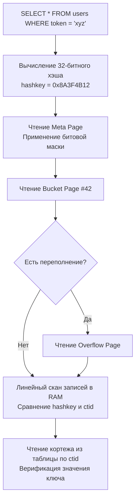

## Hash индекс: Константный поиск O(1) и его дисковая цена

В предыдущей статье [[2. B Tree индекс под капотом]] мы разобрали анатомию B-дерева — универсального рабочего коня реляционных баз данных, обеспечивающего стабильный логарифмический поиск $O(\log N)$, поддержку диапазонов и естественную сортировку. Однако инженерная мысль всегда стремится к асимптотическому идеалу. Если B-Tree требует нескольких последовательных переходов по страницам, возникает закономерный вопрос: можем ли мы добиться на постоянном носителе константного времени доступа **$O(1)$**?

Ответом на этот вызов служит **Hash индекс** — реализация ассоциативного массива (хэш-таблицы), адаптированная для блочных дисковых накопителей. 

Вместо построения упорядоченного дерева значений хэш-индекс пропускает искомый ключ через математическую **хэш-функцию**, которая преобразует данные произвольной длины в числовой номер корзины (bucket). В этой корзине и хранятся физические указатели на целевые строки таблицы. 

Если B-Tree можно сравнить с систематизированным библиотечным каталогом, где карточки расставлены по алфавиту, то Hash индекс — это автоматическая камера хранения или постамат: по штрихкоду заказа вы сразу получаете точный номер ячейки и забираете посылку. Но за эту предельную точечную скорость приходится платить полным отказом от диапазонных выборок, префиксного поиска и сортировки.

---

### Хеш-функция и коллизии

Математический фундамент любого хэш-индекса — детерминированная хэш-функция, отображающая входное значение ключа произвольного типа в беззнаковое целое число фиксированной разрядности (обычно 32 или 64 бита). 

Идеальная хэш-функция распределяет ключи строго равномерно по всему адресному пространству корзин. Однако в силу принципа Дирихле при сжатии бесконечного множества возможных значений в конечное число ячеек неизбежно возникают **коллизии** — ситуация, когда два совершенно разных ключа порождают идентичный хэш-код либо попадают в одну и ту же корзину.

В алгоритмической теории выделяют два классических метода разрешения коллизий:
- **Метод цепочек (chaining):** Каждая корзина представляет собой список или массив записей. При переполнении основной корзины к ней динамически подвязывается дополнительная страница переполнения (**overflow page**).
- **Открытая адресация (open addressing):** Все элементы хранятся в общем непрерывном массиве ячеек. При возникновении коллизии алгоритм по детерминированному закону (линейное или квадратичное пробирование) ищет следующую свободную ячейку.

В промышленных дисковых СУБД открытая адресация практически не применяется из-за высоких накладных расходов на дисковый ввод-вывод при удалении и поиске. Вместо этого реляционные движки реализуют алгоритмы **расширяемого хэширования (extendible hashing)** или **линейного хэширования (linear hashing)**, которые позволяют динамически наращивать число корзин блоками, не выполняя полной остановки базы данных для рехэширования всего объема информации.

---

### Устройство Hash индекса в PostgreSQL

PostgreSQL поддерживал тип индекса `hash` с самых ранних версий. Однако долгие годы он оставался практически заброшенным: вплоть до версии PostgreSQL 9.6 операции над хэш-индексами не фиксировались в журнале упреждающей записи WAL. Это означало, что при аварийном сбое питания индекс повреждался и требовал полной ручной перестройки, а в кластерных репликах потоковая репликация хэш-индексов была физически невозможна.

Начиная с **PostgreSQL 10**, хэш-индексы получили полноценную интеграцию с подсистемой предзаписи WAL (см. [[8. WAL. Write Ahead Log]]), стали абсолютно отказоустойчивыми (crash-safe) и реплицируемыми.

Архитектура хэш-индекса в PostgreSQL опирается на алгоритм **расширяемого хэширования**. Физический файл индекса делится на три категории 8-килобайтных страниц:

1. **Мета-страница (meta page):** Нулевая страница файла индекса. Хранит глобальные параметры: версию алгоритма, текущее количество корзин, битовую маску для быстрого вычисления номера корзины и счетчики свободных страниц переполнения.
2. **Страницы корзин (bucket pages):** Основные страницы, выделенные под конкретные номера корзин. Каждая корзина содержит массив записей, состоящих из 32-битного хэш-кода и физического адреса строки в куче таблицы (`ctid`).
3. **Страницы переполнения (overflow pages):** Если объем новых записей, попадающих в корзину, превышает 8 КБ, СУБД аллоцирует страницу переполнения и связывает ее с основной корзиной в однонаправленный список.



> [!info] Под капотом
> В исходном коде PostgreSQL (подсистема `src/backend/access/hash/`) мета-страница описывается структурой `HashMetaPageData`. Текущее число активных корзин хранится в поле `hashm_maxbucket`. 
> 
> Функция `_hash_hashkey2bucket` мгновенно определяет номер целевой страницы корзины с помощью быстрой битовой операции `AND` между хэш-кодом и маской `hashm_highmask`. Элементы внутри корзины представлены структурами `HashItem`, содержащими пару: целочисленный `hashkey` и структуру `ItemPointerData` (физический указатель `ctid`).

**Пошаговый процесс поиска по Hash индексу:**
1. Движок берет значение аргумента (например, токен сессии) и вычисляет 32-битный хэш с помощью встроенных хэш-функций (`hashtext`, `hashint4`).
2. По битовой маске из мета-страницы мгновенно вычисляется номер корзины.
3. Исполнитель считывает ровно одну целевую 8-килобайтную страницу корзины.
4. Процессор производит быстрый поиск по массиву `HashItem` в L1/L2 кэше.
5. По найденному адресу `ctid` движок считывает строку из кучи таблицы и **в обязательном порядке сравнивает исходное строковое значение ключа**, чтобы исключить ложное срабатывание из-за хэш-коллизии.

---

### Adaptive Hash Index в MySQL/InnoDB

В подсистеме хранения InnoDB (MySQL) пользователю не разрешено явно создавать постоянные дисковые хэш-индексы через DDL. Если вы выполните команду `CREATE INDEX ... USING HASH`, движок MySQL молча проигнорирует директиву `USING HASH` и создаст стандартное B-дерево.

Однако разработчики InnoDB внедрили великолепный внутренний механизм аппаратной оптимизации — **Adaptive Hash Index (AHI)**.

Когда подсистема мониторинга InnoDB замечает, что к определенным страницам существующего B-Tree индекса непрерывно идут запросы по точному совпадению ключа (например, повторяющиеся `SELECT ... WHERE pk = ?`), движок автоматически и прозрачно строит в оперативной памяти хэш-таблицу. Эта таблица связывает искомый ключ напрямую с физическим указателем на фрейм страницы в буферном пуле (`Buffer Pool`).

Последующие аналогичные запросы вообще не тратят такты CPU на спуск по уровням B-дерева: они за $O(1)$ обращаются к адаптивному хэшу в RAM и мгновенно считывают строку. Механизм управляется системной переменной `innodb_adaptive_hash_index` и полностью автономен.

---

### Mechanical Sympathy: Hash индекс и память

С точки зрения расхода тактов процессора хэш-индекс почти идеален:
- Вычисление современных хэш-функций (вроде MurmurHash или `hashlittle()`) занимает единицы наносекунд и отлично оптимизируется векторными инструкциями CPU.
- Определение номера корзины требует одной битовой операции сдвига и маскирования.
- В отличие от B-Tree (см. [[2. B Tree индекс под капотом]]), где даже при прогретом буферном кэше процессор должен совершить несколько прыжков по указателям узлов (что порождает промахи кэша ветвлений и задержки L3), хэш-индекс сразу обращается к целевой странице.

Для точечного запроса на чтение Hash индекс требует **ровно одного дискового чтения страницы корзины** (если нет длинной цепочки переполнения) и одного чтения страницы таблицы. В B-Tree аналогичный холодный поиск требует 3–4 блочных чтений.

Кроме того, внутри страницы корзины записи сканируются линейно. Линейный проход по непрерывному массиву размером 8 КБ идеально предсказывается аппаратным блоком предвыборки процессора (Hardware Prefetcher), загружающим кэш-линии L1 без единой задержки конвейера.

---

### Ограничения и ловушки

Почему же при столь впечатляющих теоретических характеристиках хэш-индексы остаются узкоспециализированным инструментом?

> [!warning] Ловушка / Gotcha: Анатомические ограничения
> - **Полное отсутствие упорядоченности:** Хэш-функция перемешивает биты ключа псевдослучайным образом. Хэш-индекс принципиально не способен ускорить операции диапазонного поиска (`BETWEEN`, `>`, `<`), агрегатные функции минимума и максимума (`MIN`, `MAX`) или сортировку `ORDER BY`. Планировщик запросов всегда выберет Seq Scan, если встретит эти операторы.
> - **Невозможность префиксного поиска:** Запросы вида `WHERE col LIKE 'abc%'` или `WHERE col >= 'abc'` не могут использовать хэш-индекс, так как хэш от префикса `'abc'` не имеет ничего общего с хэшем полной строки `'abcdef'`.
> - **Раздувание дискового пространства:** Из-за дискретного выделения корзин (удвоение объема при расширении) и страниц переполнения хэш-индексы часто занимают существенно больше места на диске, чем компактные B-деревья.
> - **Блокировки при динамическом росте:** При удвоении числа корзин движок вынужден расщеплять существующие страницы, накладывая тяжелые эксклюзивные блокировки, что вызывает резкие просадки пропускной способности при интенсивной записи.

> [!tip] Собеседование
> **Вопрос:** Почему хэш-индекс в PostgreSQL никогда не может использоваться для выполнения оптимизации Index Only Scan?
> 
> **Ответ:** По двум фундаментальным архитектурным причинам:
> 1. **Хранение только хэш-кодов:** В листовых страницах хэш-индекса сохраняются 32-битные хэши, а не исходные значения ключей. Восстановить исходное значение поля (например, текстовый email) из хэш-кода математически невозможно из-за необратимости хэш-функции.
> 2. **Отсутствие метаданных видимости MVCC:** Хэш-индекс не содержит информации о видимости транзакций (xmin/xmax, см. [[7. MVCC. Multi Version Concurrency Control]]). Чтобы удостовериться, что найденная строка видна текущему снимку транзакции и не является хэш-коллизией, СУБД обязана физически прочитать кортеж из кучи таблицы.

---

### Hash индекс в Go-разработке

При проектировании схемы базы данных для микросервисов на Go явное создание хэш-индекса оформляется через стандартный синтаксис DDL:

```sql
CREATE INDEX idx_sessions_token ON user_sessions USING hash (session_token);
```

В плане выполнения команды `EXPLAIN` такой индекс отображается как `Index Scan using idx_whatever` (или с именем созданного индекса). Обратите внимание: в плане отсутствует указание направления сканирования (`Index Scan Backward`), поскольку у хэш-индекса нет физического порядка следования элементов.

В прикладном коде на Go эквивалентом хэш-индекса служит встроенный тип `map[K]V`. Семантика полностью идентична: мгновенный доступ по ключу за $O(1)$, но невозможность итерироваться по диапазону значений или гарантировать стабильный порядок ключей при обходе.

---

### Когда же применять hash индекс

Профессиональный инженер выбирает хэш-индекс только при одновременном соблюдении четырех жестких условий:

1. **Экстремально высокая частота точечных чтений:** Таблица огромна (сотни миллионов строк), и экономия даже 1–2 дисковых чтений B-дерева дает ощутимый выигрыш в p99 latency.
2. **Запросы выполняются строго по оператору точного равенства (`WHERE key = val`):** Классические примеры — поиск сессии по длинному криптографическому токену, проверка уникальности UUID или сопоставление хэшей файлов (SHA-256).
3. **Полное отсутствие аналитических запросов:** По этой колонке никогда не выполняются сортировки `ORDER BY`, диапазоны дат или поиск по шаблону `LIKE`.
4. **Относительно стабильный объем данных:** Данные не подвержены лавинообразным пакетам вставок, провоцирующим каскадные расщепления корзин хэша.

В подавляющем большинстве стандартных задач современное B-дерево с включенным кэшированием страниц в оперативной памяти работает практически столь же быстро, обладая несоизмеримо большей универсальностью.

---

### Альтернативы в других СУБД

- **MySQL / MariaDB:** Единственный способ получить явный хэш-индекс — использование специализированного движка таблиц в оперативной памяти **MEMORY (HEAP)** с клаузой `USING HASH`. В стандартном движке InnoDB работает только внутренний автоматический Adaptive Hash Index.
- **SQLite:** Не имеет поддержки хэш-индексов, полностью полагаясь на B-деревья.
- **Oracle Database:** Предоставляет механизм хэш-кластеров (**Hash Clusters**), где физические строки нескольких связанных таблиц перемешиваются и размещаются на одних дисковых страницах на основе вычисленного хэш-ключа.

---

### Что дальше

Мы досконально изучили две полярные структуры: универсальное B-дерево и специализированный Hash индекс точечного доступа. 

Однако в реальных системах часто возникает принципиально иная задача: фильтрация таблиц с сотнями миллионов строк по нескольким колонкам с низкой селективностью (например, статус заказа, регион, тип оплаты). Ни B-Tree, ни тем более Hash индекс не способны эффективно объединять такие фильтры на лету. Для решения этой проблемы существует специализированная булева структура — [[4. Bitmap индекс]], которую мы детально разберем в следующей статье.
