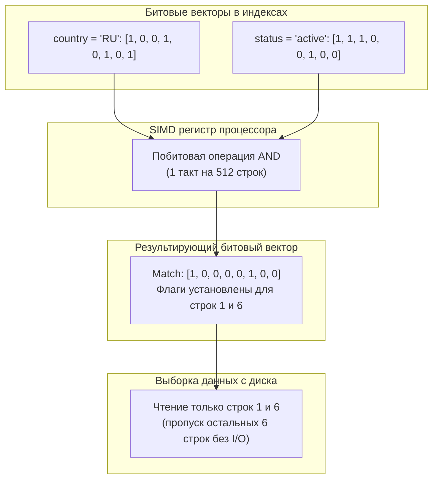
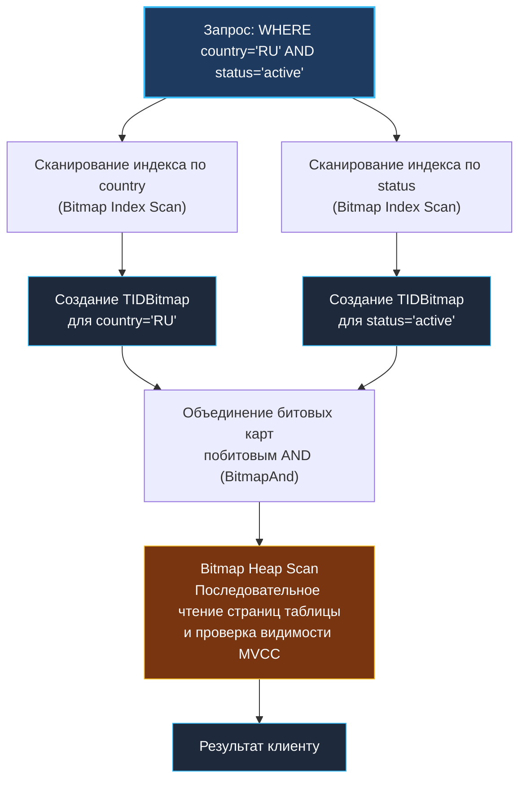

Если спросить инженера старой закалки, какая операция в кремниевом процессоре выполняется быстрее всего, ответ будет однозначным: побитовая логика. Операции `AND`, `OR`, `NOT` и `XOR` не требуют многотактного умножения, деления или сложных предсказаний ветвлений. В современных CPU регистры векторных расширений (AVX-512 или ARM NEON) способны за один-единственный такт пропустить через логические вентили 256 или 512 бит. 

Традиционные B-Tree индексы оперируют указателями и отсортированными массивами ключей. Это прекрасный универсальный молоток, но что делать, если в таблице на миллиард строк столбец `пол` принимает ровно два значения, или столбец `country` содержит код из трёх десятков государств? В B-Tree на каждый ключ придётся плодить миллионы дублирующихся записей с указателями на строки, раздувая дерево до гигантских размеров и заставляя процессор страдать от случайных переходов по памяти.

Здесь на сцену выходит **Bitmap индекс (битовый индекс)** — специализированная структура, применяемая в аналитических базах данных (OLAP) и хранилищах данных для столбцов с низкой кардинальностью (числом уникальных значений). Bitmap индекс заменяет список указателей на строки компактным битовым вектором, где каждый бит соответствует физической строке таблицы и флажком (0 или 1) сообщает, принадлежит ли строка данному значению.

---

### Внутреннее устройство: битовые карты

Представим реляционную таблицу `users` с колонкой `country`. Допустим, в ней всего 8 строк, а уникальные значения сводятся к `RU`, `US` и `DE`. Вместо того чтобы сохранять список пар `(значение, ID строки)`, bitmap индекс формирует матрицу из трёх битовых векторов (по одному на каждое значение), где длина каждого вектора равна общему числу строк:

```text
Физические строки (TID / RowID):  1  2  3  4  5  6  7  8
Вектор для 'RU':                   1  0  0  1  0  1  0  1
Вектор для 'US':                   0  1  0  0  1  0  1  0
Вектор для 'DE':                   0  0  1  0  0  0  0  0
```

Бит `1` на позиции `i` означает, что $i$-я строка таблицы содержит искомое значение. Если нам нужно найти всех пользователей из России или США:

```sql
SELECT * FROM users WHERE country = 'RU' OR country = 'US';
```

СУБД не нужно перебирать строки таблицы или совершать скачки по узлам B-Tree. Процессор берет вектор `RU` и вектор `US` и накладывает их друг на друга побитовой операцией ИЛИ (`RU | US`):

```text
RU:        1 0 0 1 0 1 0 1
US:        0 1 0 0 1 0 1 0
--------------------------
RU | US:   1 1 0 1 1 1 1 1   (строки 1, 2, 4, 5, 6, 7, 8)
```

А если мы добавим фильтр по активности пользователя `country = 'RU' AND status = 'active'`, то при наличии второго bitmap индекса по колонке `status` движок вычислит побитовое И двух карт:

```text
RU:                    1 0 0 1 0 1 0 1
active:                1 1 1 0 0 1 0 0
--------------------------------------
RU AND active:         1 0 0 0 0 1 0 0   (строки 1 и 6)
```

Результат — результирующая битовая карта. Только для тех позиций, где осталась единица, база данных обращается к диску или буферному пулу, чтобы извлечь реальные строки таблицы.



> [!info] Под капотом: Сжатие битовых карт и Roaring Bitmaps
> Прямолинейный битовый вектор длиной в миллиард строк занял бы 125 МБ на каждое значение ($10^9 \text{ бит} / 8 = 125 \text{ млн байт}$). При сотнях уникальных значений это гигантский объём. Кроме того, если значение встречается редко, вектор будет состоять из сплошных нулей с редкими единицами.
> 
> На практике применяются алгоритмы сжатия:
> 1. **Run-Length Encoding (RLE):** заменяет длинные серии нулей или единиц числом их повторений.
> 2. **WAH (Word Aligned Hybrid) и EWAH:** специализированные форматы, где данные выравниваются по машинным словам (32 или 64 бита), позволяя выполнять битовые операции прямо над сжатыми словами без полной распаковки.
> 3. **Roaring Bitmap:** де-факто промышленный стандарт в современных аналитических движках. Roaring Bitmap делит 32-битное пространство идентификаторов на сегменты по $2^{16} = 65\,536$ элементов. В зависимости от плотности данных внутри сегмента выбирается оптимальный контейнер:
>    - **Array Container:** если чисел меньше 4096, они хранятся как отсортированный массив 16-битных целых чисел.
>    - **Bitmap Container:** если чисел больше 4096, сегмент хранится как классическая битовая карта на 8 КБ (65536 бит).
>    - **Run Container:** если присутствуют длинные непрерывные последовательности чисел, они сжимаются парами `(старт, длина)`.
> 
> Roaring Bitmaps дают феноменальную скорость побитовых операций, идеально согласуясь с кэш-линиями современных CPU.

---

### Ключевые характеристики и механическая симпатия

С точки зрения аппаратного обеспечения, bitmap индекс обладает уникальной гармонией с архитектурой процессора:

1. **Потоковая SIMD-обработка без бранч-миссов (Branch Misses):**  
   В B-Tree каждый шаг поиска — это ветвление (переход по указателю влево или вправо), где неудачное предсказание перехода сбрасывает процессорный конвейер. Битовые операции потоковые: векторные инструкции (AVX2, AVX-512) загружают сотни бит прямо в широкие регистры и обрабатывают их без единого условного перехода.
2. **Компактность для низкокардинальных столбцов:**  
   Сжатые битовые карты занимают в разы меньше места, чем B-Tree с дублирующимися ключами. Меньше размер на диске — выше процент попадания в буферный кэш оперативной памяти (`L1/L2/L3` и OS page cache), меньше дорогостоящих физических чтений с диска.
3. **Пакетное объединение десятков фильтров:**  
   В сложных аналитических панелях (BI-дашбордах) пользователи фильтруют данные по полу, статусу заказа, региону, типу доставки и категории товара. Составной B-Tree индекс бессилен, если порядок колонок в запросе не совпадает с индексом. Bitmap индексы независимы: СУБД считывает 5 компактных векторов, выполняет 4 инструкции `AND` в процессоре — и получает точный список строк.

Однако за эту мощь приходится платить суровую цену:

- **Катастрофическая производительность при записи (Write Amplification):**  
  Добавление или удаление одной строки требует обновления всех битовых карт для каждого индексируемого столбца: необходимо расширить или сжать векторы, обновить структуры сжатия. В OLTP-системах с тысячами транзакций в секунду это парализует базу данных.
- **Блокировочные накладные расходы:**  
  В реляционных строковых движках транзакция блокирует строку (`Row Lock`). Но в bitmap индексе один физический блок памяти содержит биты от тысяч строк. Изменение одного бита требует блокировки всего блока карты, вызывая жесткие конфликты конкурентных транзакций.

---

### Bitmap индекс в реляционных СУБД

#### Oracle
**Oracle** — одна из немногих классических коммерческих СУБД, предоставляющих полноценный физический bitmap индекс как отдельный тип (`CREATE BITMAP INDEX`). Он изначально спроектирован для корпоративных хранилищ данных (Data Warehouse) со схемой «звезда» или «снежинка», где таблицы фактов содержат сотни миллионов строк, а таблицы измерений имеют низкую кардинальность. В Oracle действуют жесткие предупреждения: никогда не создавать bitmap индекс на таблицах с интенсивным OLTP-трафиком.

#### PostgreSQL: Архитектура Bitmap Index Scan
**PostgreSQL** принципиально не имеет встроенного типа хранимого на диске bitmap индекса. Причина — приверженность модели MVCC ([[7. MVCC. Multi Version Concurrency Control]]), где частые `UPDATE` создают новые версии строк, что привело бы к колоссальным накладным расходам на обновление битовых карт.

Вместо постоянного индекса в PostgreSQL реализован элегантный гибридный метод доступа: **Bitmap Index Scan** и **Bitmap Heap Scan**. Это динамическое построение битовой карты в оперативной памяти на лету.

Механизм работы Bitmap Scan в PostgreSQL:

1. Планировщик видит запрос с несколькими условиями или условие по обычному B-Tree индексу, которое возвращает значительный процент строк (например, 5–15% таблицы). Простой `Index Scan` был бы неэффективен из-за лавины случайных чтений диска.
2. Для каждого индекса вызывается **Bitmap Index Scan**. Индекс сканируется, и в оперативной памяти строится временная битовая карта идентификаторов строк (`TIDBitmap` из исходного кода PostgreSQL, `src/backend/nodes/tidbitmap.c`).
3. Если условий несколько (например, по `country` и по `status`), полученные карты `TIDBitmap` объединяются побитовыми операциями `BitmapAnd` или `BitmapOr`.
4. Полученная карта упорядочена физически: биты соответствуют номерам страниц и смещениям строк на диске.
5. Вызывается **Bitmap Heap Scan**: база читает страницы таблицы строго последовательно (sequential scan), исключая лишние возвраты головки диска или скачки по SSD. Каждая прочитанная строка проверяется на видимость транзакцией через MVCC.



> [!tip] Собеседование: О чем говорит Bitmap Heap Scan?
> **Вопрос:** В плане выполнения запроса (`EXPLAIN ANALYZE`) вы видите оператор `Bitmap Heap Scan`. Означает ли это, что администратор БД создал bitmap индекс? Что означает строка `Recheck Cond`?
> 
> **Ответ:** 
> 1. Нет! В PostgreSQL нет постоянного дискового bitmap индекса. `Bitmap Index Scan` означает, что планировщик динамически собрал временную битовую карту в оперативной памяти из обычных B-Tree (или GIN, GiST) индексов.
> 2. `Recheck Cond` (условие повторной проверки) возникает из-за ограничения оперативной памяти `work_mem`. Если битовая карта строк не помещается в `work_mem`, структура `TIDBitmap` переключается из точного режима (Exact, 1 бит = 1 строка) в огрубленный, или **«с потерями» (Lossy)**. В lossy-режиме 1 бит соответствует целой странице таблицы (8 КБ). База данных считывает всю страницу и обязана заново перепроверить предикат (`Recheck`) для каждой строки на этой странице.

Существуют сторонние расширения для PostgreSQL, реализующие полноценный bitmap индекс (например, `pg_bitmap`), но они не входят в стандартную поставку ядра и применяются крайне редко из-за ограничений MVCC.

---

### Когда bitmap индекс оправдан

- **OLAP и Data Warehouse:** аналитические витрины с миллионами и миллиардами записей, где данные сгруппированы по измерениям с низкой кардинальностью (статусы, валюты, категории, типы устройств).
- **Системы отчётности и ETL-пайплайны:** базы данных, куда данные заливаются пачками ночью (batch load), а днем выполняются исключительно запросы на чтение.
- **Множественные комбинации фильтров:** интернет-магазины и каталоги с фильтрами вида: `WHERE country IN ('RU', 'US', 'DE') AND status = 'active'`. Битовые операции сливаются в единый процессорный цикл.

---

### Когда bitmap индекс вреден

> [!warning] Ловушка / Gotcha: Высокая кардинальность и транзакционная конкуренция
> - **Высокая кардинальность:** если столбец принимает миллионы уникальных значений (например, первичный ключ `user_id` или email), создание bitmap индекса — катастрофа. Для каждого уникального значения создается отдельный битовый вектор. Память улетает в гигабайты, сжатие теряет всякий смысл, а размер индекса многократно превышает размер самой таблицы.
> - **Интенсивная запись (OLTP):** каждая вставка строки требует синхронного обновления сотен битовых карт.
> - **Блокировки страниц:** обновление одного бита блокирует весь сегмент карты. Параллельные транзакции встают в очередь, вызывая деградацию всей системы.
> - **Низкая избирательность (Selectivity):** если предикат возвращает 90% строк таблицы, планировщик отвергнет и обычный `Index Scan`, и bitmap scan в пользу обычного последовательного сканирования всей таблицы (Sequential Scan).

---

### Практический взгляд Go-разработчика

При разработке бэкенд-сервисов на Go вы будете регулярно встречать `Bitmap Heap Scan` при анализе узких мест через `EXPLAIN ANALYZE` ([[10. План выполнения запроса. EXPLAIN]]). Понимание того, как PostgreSQL динамически формирует `TIDBitmap`, спасает от типичной паники: многие начинающие разработчики считают, что база делает «что-то странное и медленное». На самом деле `Bitmap Scan` спасает ваш диск от тысяч хаотичных прыжков (Random I/O), превращая их в упорядоченное линейное чтение страниц. Если вы видите, что план перешел в режим `lossy`, значит, вашему запросу не хватило памяти `work_mem`.

Вторая грань механического сочувствия — перенос концепций битовых карт прямо в исходный код микросервисов на Go:

1. **Битовые маски для флагов и разрешений:**  
   Вместо структур с десятком булевых полей или срезов строк опытные инженеры используют целочисленные битовые маски (`uint64` или `[]uint64`). Проверка прав доступа превращается в одну инструкцию процессора:
   ```go
   type Permission uint64

   const (
       PermRead   Permission = 1 << iota // 0001
       PermWrite                         // 0010
       PermDelete                        // 0100
       PermAdmin                         // 1000
   )

   func HasAccess(userPerms, required Permission) bool {
       return (userPerms & required) == required
   }
   ```

2. **In-Memory фильтрация и инвертированные индексы:**  
   Если сервис на Go держит в памяти кэш из сотен тысяч сущностей и должен мгновенно фильтровать их по десяткам критериев (подобно рекламным аукционам RTB или рекомендательным системам), подключение библиотеки `github.com/RoaringBitmap/roaring` даёт колоссальный прирост пропускной способности. Микросервис находит пересечение пяти критериев за микросекунды, используя лишь регистры CPU и кэш L1/L2.

---

### Итог

Bitmap индекс — это триумф механического сочувствия для специфического круга задач. Он превращает сложный реляционный поиск по низкокардинальным атрибутам в молниеносную побитовую арифметику кремниевого процессора. 

В OLTP-мире и стандартном PostgreSQL постоянные bitmap индексы отсутствуют из-за дороговизны обновлений и законов MVCC. Однако механизм динамического построения битовых карт (`Bitmap Index Scan` + `Bitmap Heap Scan`) позволяет современным базам данных извлекать максимум выгоды из побитовой фильтрации, не жертвуя скоростью записи.

Теперь, когда мы изучили фундаментальные типы одноколоночных индексов — B-Tree, Hash и Bitmap, — настало время перейти к индексам, объединяющим несколько атрибутов: [[5. Composite индексы]].
