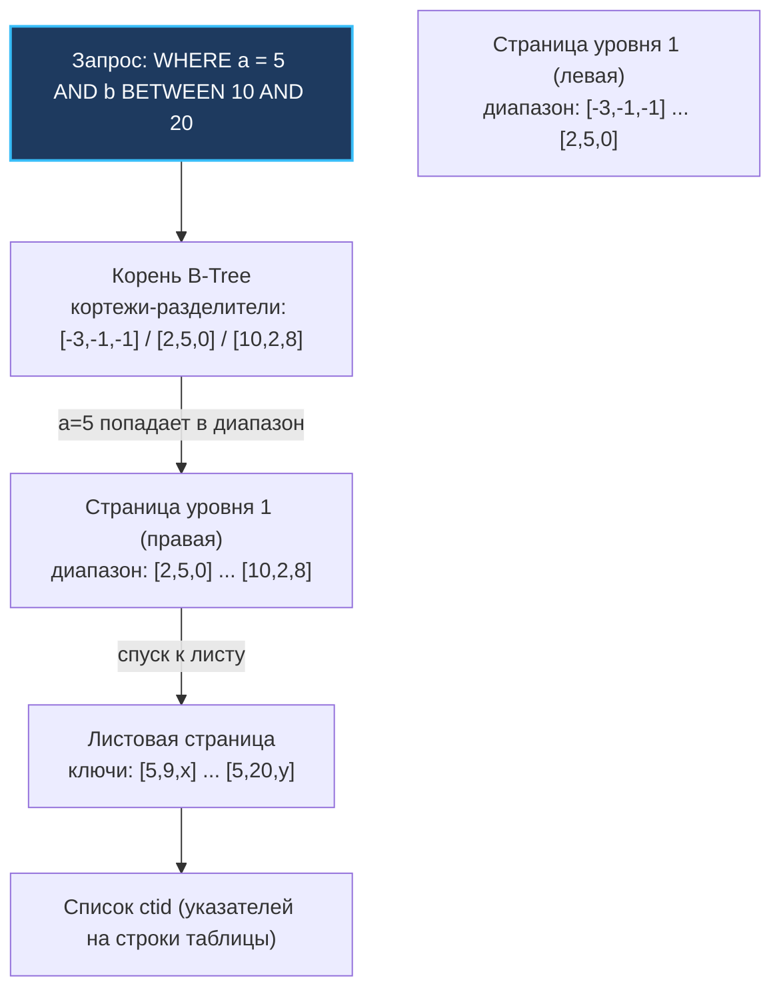
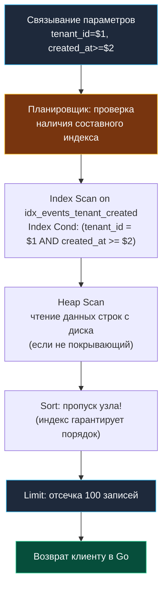

В реальном мире бэкенд-разработки запросы редко бывают стерильными и изолированными. Ни один пользователь не фильтрует данные только по суррогатному первичному ключу. Бизнес-запросы всегда многомерны: «найди все заказы клиента №42 за последнюю неделю, отсортированные по дате создания» или «покажи активные подписки пользователей в регионе EU».

Если на каждую колонку вешать отдельный индекс, база данных будет тратить массу ресурсов на их синхронное поддержание, а при запросе ей придется мучительно собирать битовые карты в оперативной памяти (`BitmapOr`, `BitmapAnd`). 

Выход из этой ситуации — **Composite индекс (составной, многоколоночный индекс)**. Это единая B-Tree структура, построенная на двух и более столбцах таблицы, где ключи упорядочены лексикографически. Понимание принципов работы составного индекса и знаменитого **правила левого префикса** — это та невидимая граница, которая отделяет начинающего разработчика от опытного проектировщика высоконагруженных систем.

---

### Аналогия: телефонный справочник

Представьте себе классический толстый бумажный телефонный справочник города. Все записи в нём отсортированы по двум колонкам: сначала по фамилии, а при совпадении фамилий — по имени. Перед нами классический двухколоночный индекс `(last_name, first_name)`.

- **Поиск по фамилии и имени («Иванов Иван»):** Вы молниеносно открываете страницу на букву «И», находите блок «Иванов» и за секунду взглядом отыскиваете имя «Иван». Это эффективнейший точечный поиск $O(\log N)$.
- **Поиск только по фамилии («Иванов»):** Вы мгновенно открываете нужную страницу и видите непрерывный блок всех Ивановых города.
- **Поиск только по имени («Иван»):** Полная катастрофа. Вам придется методично пролистать весь справочник от первой до последней страницы, потому что Иваны рассеяны внутри Петровых, Сидоровых и Смирновых. Для этого запроса упорядоченность справочника полностью бесполезна.

В точности так же работает составной B-Tree индекс в любой реляционной СУБД: физический порядок данных подчиняется строгому порядку объявления колонок при создании индекса.

---

### Устройство составного индекса в B-Tree

Как мы детально разбирали в [[2. B Tree индекс под капотом]], B-Tree хранит ключи в отсортированном порядке. Когда индекс определён на столбцах `(a, b, c)`, каждый ключ в узле — это кортеж `(val_a, val_b, val_c)`, а сравнение ключей выполняется лексикографически:
1. Сравниваем значения в колонке `a`.
2. Если значения `a` равны, сравниваем значения в колонке `b`.
3. Если и `b` равны, сравниваем значения в колонке `c`.

Физически это означает, что в листовых страницах индекса все записи упорядочены сначала по первому полю, затем по второму, затем по третьему. Внутренние узлы B-Tree содержат ключи-разделители, которые тоже являются кортежами. При спуске по дереву для поиска ключа `(x, y, z)` сравнение на каждом уровне идёт по тем же правилам.



При поиске по `WHERE a = 5 AND b BETWEEN 10 AND 20` база данных спускается в корень дерева, по ключам-разделителям находит лист, где начинаются записи с `a = 5, b = 10`, а затем по горизонтальным двусвязным указателям последовательно обходит листья вправо, пока выполняется условие `a = 5` и `b ≤ 20`. 

Это предельно эффективно: сканируется строго непрерывный физический диапазон страниц. Если бы у нас были раздельные индексы на `a` и на `b`, СУБД пришлось бы делать два независимых поиска и объединять результаты через `BitmapAnd`, либо сканировать один индекс и долго отсеивать строки на этапе `Heap Fetch`.

---

### Правило левого префикса

Составной индекс может использоваться для эффективного поиска по B-Tree только в том случае, если предикаты запроса образуют непрерывный **префикс** колонок индекса, начиная с самого первого (крайнего левого) столбца.

Рассмотрим составной индекс на трех колонках: `(a, b, c)`:

- `WHERE a = 1` — **Используется полностью.** Ведущий столбец присутствует, B-Tree спускается к первой записи `a = 1` и сканирует непрерывный диапазон.
- `WHERE a = 1 AND b = 2` — **Используется полностью.** Поиск выполняется по двухколоночному кортежу `(1, 2)`.
- `WHERE a = 1 AND b = 2 AND c = 3` — **Используется полностью.** Точечный спуск ко всем трем колонкам.
- `WHERE a = 1 AND c = 3` — **Используется частично.** Поиск по B-Tree локализует диапазон только по колонке `a`. Колонка `c` не может направлять движение по дереву, так как значение `b` неизвестно. База данных прочитает все записи с `a = 1` и применит `c = 3` как фильтр на лету (Index Filter).
- `WHERE b = 2` — **Индекс почти бесполезен.** Прямой точечный спуск по дереву (`Index Scan`) невозможен, так как ведущий столбец `a` отсутствует (вспомните поиск имени «Иван» в телефонном справочнике). В лучшем случае движок выполнит полное сканирование всех страниц индекса (`Index Full Scan`), что при большой таблице медленнее обычного последовательного сканирования таблицы (`Seq Scan`).
- `WHERE b = 2 AND c = 3` — **Аналогично.** Ведущий префикс пропущен, эффективный спуск невозможен.
- `WHERE a = 1 OR b = 2` — **Индекс не может обработать запрос единым проходом.** Ветки `OR` требуют независимого доступа: условие `a = 1` требует спуска по данному индексу, а `b = 2` — полного перебора. СУБД может применить этот индекс только для ветки `a = 1`, если для `b = 2` есть отдельный индекс (через `Bitmap OR` в PostgreSQL).

> [!tip] Собеседование: Сортировка по составному индексу
> **Вопрос:** Таблица имеет составной индекс на `(a, b)`. Сможет ли СУБД ускорить запрос `SELECT * FROM t ORDER BY b, a` без дополнительной сортировки в памяти?
> 
> **Ответ:** Нет! Порядок сортировки в индексе физически выстроен как `(a, b)`. Это означает, что данные сгруппированы сначала по значениям `a`, и лишь внутри каждого значения `a` отсортированы по `b`. Глобального порядка по колонке `b` в индексе не существует. Запрос `ORDER BY a, b` выполнится мгновенно без сортировки (индекс отдает строки в уже готовом порядке). Запросы `ORDER BY b, a` или `ORDER BY b` потребуют от базы данных материализации строк и явного узла сортировки (`Sort` или `Incremental Sort`) с возможным сбросом во временные файлы на диск (`spill to disk`).

---

### Range-столбец и его последствия

Что происходит, если в префиксе составного индекса встречается диапазонное условие (`>`, `<`, `BETWEEN`, `LIKE 'prefix%'`)?

> [!warning] Ловушка / Gotcha: Граница диапазонного поиска
> После первого же диапазонного оператора последующие колонки составного индекса **теряют способность направлять точечный спуск по B-Tree**! Они могут использоваться базой данных только для фильтрации найденных ключей на уровне индекса (`Index Filter`), но не для сужения границ обхода листьев.

Представьте индекс `(status, created_at)`:
- Запрос `WHERE status = 'active' ORDER BY created_at DESC`:
  Колонка `status` проверяется на точное равенство (`=`). Движок мгновенно позиционируется на первой записи `status = 'active'`, а все записи внутри этого статуса уже физически отсортированы по `created_at`. База данных просто читает листья B-Tree в обратном порядке. Идеальный план: нулевая сортировка, минимум I/O!
- Запрос `WHERE created_at > '2024-01-01' AND status = 'active'`:
  Если бы мы создали индекс `(created_at, status)`, то `created_at` — это диапазонное условие (`>`). Движок прыгает в точку `2024-01-01`, но дальше в листьях перемешаны записи с разными статусами (`active`, `pending`, `archived`), так как они упорядочены по времени, а не по статусу. Индексу придется перебрать миллионы записей за весь год и на каждой проверять `status = 'active'`.

**Золотое правило порядка колонок (Правило ESR — Equality, Sort, Range):**
1. Сначала колонки с условиями строгого **равенства** (`=`, `IN`).
2. Затем колонки, по которым требуется **сортировка** (`ORDER BY`), если они согласованы по направлению.
3. Затем **одна** колонка с **диапазонным** условием (`>`, `<`, `BETWEEN`).

---

### Индекс и соединения (JOIN)

Составные индексы играют ключевую роль в оптимизации операций `JOIN`, особенно при работе со связями «многие ко многим» или составными внешними ключами.

В классической таблице позиций заказов:
```sql
CREATE TABLE order_items (
    order_id BIGINT NOT NULL,
    product_id BIGINT NOT NULL,
    quantity INT NOT NULL,
    price NUMERIC(10, 2) NOT NULL,
    PRIMARY KEY (order_id, product_id)
);
```

Ограничение `PRIMARY KEY (order_id, product_id)` автоматически создает составной уникальный B-Tree индекс. Этот индекс:
- Безупречно ускоряет `JOIN orders o ON o.id = oi.order_id`.
- Позволяет мгновенно искать товары конкретного заказа `WHERE order_id = 100`.
- Но совершенно не помогает запросам `WHERE product_id = 500` (потому что `product_id` — второй столбец). Для поиска заказов по товару потребуется создать отдельный индекс на `(product_id)`.

---

### Покрывающие индексы

Если составной индекс содержит в себе абсолютно все столбцы, запрошенные в секциях `SELECT`, `WHERE`, `JOIN` и `ORDER BY`, базе данных больше не нужно обращаться к физическим страницам таблицы (Heap pages).

СУБД выполняет **Index Only Scan** — читает данные непосредственно из листьев B-Tree индекса. Начиная с PostgreSQL 11, для включения неключевых колонок в листовые узлы без раздувания ключей поиска используется конструкция `INCLUDE`. Подробнейший разбор этой механики мы проведем в [[6. Covering индекс]].

---

### Mechanical Sympathy: что внутри страницы

Давайте заглянем внутрь 8-килобайтной страницы листового узла B-Tree индекса и посчитаем байты.

Представим индекс на трех 64-битных целых числах: `(int8, int8, int8)`.
- Размер полезного ключа: $3 \times 8 \text{ байт} = 24 \text{ байта}$.
- Заголовок элемента индекса (`IndexTuple` в PostgreSQL): 8 байт (включая флаги и указатель на строку `ItemPointer` / `ctid`).
- Выравнивание структуры (Padding): 4 байта.
- Смещение элемента в заголовке страницы (`ItemId`): 4 байта.
- **Итого на одну запись:** около 36 байт.

При стандартном размере страницы 8192 байта и коэффициенте заполнения (fillfactor) 90%:
$$\text{Число записей в листе} \approx \frac{8192 \times 0.9}{36} \approx 204 \text{ записи (запись `(8192 * 0.9) / 36 ≈ 204`)}$$

Во внутреннем узле кортеж содержит ключ и указатель на дочернюю страницу (размер около 32 байт), что дает ветвление (fanout) около 230 потомков на узел. Сравните это с простым одноколоночным индексом на `int4` (где ветвление превышает 500):
1. **Высота дерева (Tree Height):** Чем шире составной ключ, тем меньше записей влезает в страницу. Для таблицы на миллиард строк глубина дерева может вырасти с 3 до 4 уровней, добавляя еще одно чтение страницы на каждый точечный поиск.
2. **Сравнение ключей в кэше L1:** Кортежи фиксированной ширины (`int8`, `int4`) сравниваются процессором с идеальной предсказуемостью ветвлений через быстрые регистровые инструкции `CMP`.
3. **Строковые колонки переменной ширины (`text`, `varchar`):** Если в составной индекс включены длинные текстовые поля, ядро СУБД вынуждено разыменовывать указатели и вызывать функцию `memcmp`. Это провоцирует частые Cache Misses в L1/L2 кэшах CPU и замедляет спуск по дереву в разы.

---

### Практический пример в Go

Представим сервис аудита событий или метрик для мультитенантной платформы. Схема таблицы:

```sql
CREATE TABLE events (
    id BIGSERIAL PRIMARY KEY,
    tenant_id INT NOT NULL,
    event_type VARCHAR(50) NOT NULL,
    created_at TIMESTAMPTZ NOT NULL DEFAULT now(),
    payload JSONB
);

-- Составной индекс строго под паттерн выборки клиента
CREATE INDEX idx_events_tenant_created 
    ON events (tenant_id, created_at DESC);
```

В коде микросервиса на Go мы пишем функцию выборки последних событий организации:

```go
package main

import (
	"context"
	"database/sql"
	"log"
	"time"

	_ "github.com/jackc/pgx/v5/stdlib"
)

type Event struct {
	ID        int64
	EventType string
	CreatedAt time.Time
	Payload   []byte
}

func FetchRecentEvents(ctx context.Context, db *sql.DB, tenantID int, since time.Time) ([]Event, error) {
	query := `
		SELECT id, event_type, created_at, payload
		FROM events
		WHERE tenant_id = $1 AND created_at >= $2
		ORDER BY created_at DESC
		LIMIT 100
	`

	rows, err := db.QueryContext(ctx, query, tenantID, since)
	if err != nil {
		return nil, err
	}
	defer rows.Close()

	var events []Event
	for rows.Next() {
		var e Event
		if err := rows.Scan(&e.ID, &e.EventType, &e.CreatedAt, &e.Payload); err != nil {
			return nil, err
		}
		events = append(events, e)
	}

	return events, rows.Err()
}
```

Этот запрос ложится на индекс с математической точностью:
1. `tenant_id = $1` — точечный переход в корень B-Tree к блоку нужного клиента.
2. `created_at >= $2` — мгновенный спуск к нужной временной отсечке.
3. `ORDER BY created_at DESC` — листья уже отсортированы по убыванию, база не тратит ни единого байта оперативной памяти на сортировку.
4. `LIMIT 100` — движок останавливает сканирование ровно после 100 записей. Запрос отрабатывает за доли миллисекунды.

Для верификации поведения индекса в Go удобно иметь встроенную функцию профилирования:

```go
// Пример отладочного вывода плана
func explainQuery(ctx context.Context, db *sql.DB, query string, args ...interface{}) {
	explainQuery := "EXPLAIN ANALYZE " + query
	rows, err := db.QueryContext(ctx, explainQuery, args...)
	if err != nil {
		log.Printf("Explain error: %v", err)
		return
	}
	defer rows.Close()

	for rows.Next() {
		var line string
		if err := rows.Scan(&line); err == nil {
			log.Printf("PLAN: %s", line)
		}
	}
}
```

---

### Выбор порядка столбцов: алгоритм принятия решения

Чтобы никогда не ошибаться при проектировании многоколоночных индексов, следуйте четкому алгоритму:

1. **Равенства (`=`, `IN`):** Поместите на первое место все столбцы, которые в 100% запросов участвуют в строгих равенствах. Если таких столбцов несколько, первым ставьте столбец с наивысшей селективностью (уникальностью), чтобы первый же шаг B-Tree отсекал максимум мусорных страниц.
2. **Сортировка (`ORDER BY` / `GROUP BY`):** Следующими ставьте столбцы, порядок которых совпадает с сортировкой в бизнес-запросах. Это избавит базу данных от тяжелых узлов `Sort` в плане выполнения.
3. **Диапазоны (`>`, `<`, `BETWEEN`, `LIKE 'prefix%'`):** Столбец диапазона ставьте после колонок равенства и сортировки. Помните: диапазонный оператор завершает эффективную часть B-Tree ключа.
4. **Нефильтруемые атрибуты:** Колонки, которые нужны только в секции `SELECT` для предотвращения обращения к таблице, добавляйте через `INCLUDE` (в PostgreSQL 11+), чтобы не раздувать внутренние узлы дерева.

> [!tip] Собеседование: Порядок условий в WHERE и порядок столбцов в индексе
> **Вопрос:** В таблице создан составной индекс `(country, city, created_at)`. Разработчик написал запрос:
> ```sql
> SELECT * FROM events 
> WHERE city = 'London' AND country = 'UK' 
> ORDER BY created_at DESC;
> ```
> Повлияет ли то, что в блоке `WHERE` колонка `city` написана раньше `country`, на использование индекса?
> 
> **Ответ:** Нет, абсолютно не повлияет. Реляционная алгебра декларативна. Оптимизатор запросов (Cost-Based Optimizer) перед построением плана нормализует предикаты и сопоставляет их с метаданными индексов независимо от порядка их написания в тексте SQL-запроса. Поскольку оба равенства присутствуют, планировщик использует ведущий префикс `(country, city)` и выполнит `Index Scan`.

---

### Когда составной индекс вреден

- **Дублирование и избыточность:** Если у вас уже есть индекс `(a, b)`, отдельный индекс на `(a)` становится мертвым грузом. Запросы по `WHERE a = ?` прекрасно обслуживаются составным индексом по правилу левого префикса. Хранение обоих индексов удваивает накладные расходы на диск и замедляет каждый `INSERT`/`UPDATE`.
- **Слишком широкие индексы:** Попытка включить в индекс 5–7 колонок «на всякий случай» катастрофически снижает коэффициент ветвления B-Tree. Листовые страницы быстро переполняются, провоцируя частые расщепления страниц (`Page Split`, [[2. B Tree индекс под капотом]]).
- **Замедление модификаций (`Write Amplification`):** Изменение значения в любой из колонок составного индекса требует удаления старого и вставки нового ключа в B-Tree дерево, генерируя огромное количество записей в WAL-журнале.

---

### Диаграмма исполнения запроса с составным индексом

Посмотрим, как оптимизатор PostgreSQL выполняет наш пример выборки с индексом `(tenant_id, created_at)`:



В реальном отчете `EXPLAIN` мы увидим идеальную картину:
```text
->  Index Scan using idx_events_tenant_created on events  (cost=0.42..8.45 rows=10 width=...) Index Cond: ((tenant_id = 5) AND (created_at >= '2024-01-01'::timestamp with time zone))
```

---

### Заключение

Составной индекс — один из самых мощных инструментов в арсенале бэкенд-инженера. Он объединяет многомерные бизнес-требования в единую изящную B-Tree структуру, устраняя необходимость в дорогостоящих сортировках и множественных дисковых выборках. 

Однако этот инструмент требует строгости: порядок колонок в индексе должен определяться паттернами запросов и правилом левого префикса, а не случайностью.

В следующей лекции мы сделаем шаг вперед и изучим вершину оптимизации чтения — [[6. Covering индекс]]: как полностью исключить обращения к физической таблице, превратив индекс в самодостаточный источник данных.
