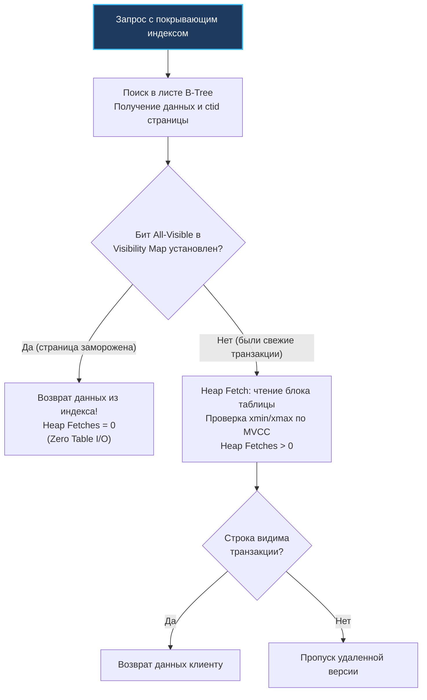

В архитектуре реляционных баз данных существует негласное правило: **самый быстрый ввод-вывод — это ввод-вывод, которого не произошло**. 

Когда мы создаем B-Tree индекс, мы радуемся тому, что время поиска строки сокращается с линейного перебора всей таблицы $O(N)$ до логарифмического спуска по дереву $O(\log N)$. Но на практике классический `Index Scan` таит в себе скрытую и весьма коварную цену. Индекс находит адрес строки (`ctid` в PostgreSQL или первичный ключ в InnoDB), но чтобы прочитать полезные данные (имя пользователя, дату создания, статус), СУБД вынуждена совершить еще один прыжок — обратиться к физической странице самой таблицы (так называемый **Heap Fetch**). Если запрос возвращает 5 000 строк, разбросанных по разным блокам диска, база данных совершает тысячи случайных чтений (Random I/O), нивелируя всю прелесть быстрой навигации по дереву.

**Covering индекс (покрывающий индекс)** доводит идею ускорения до логического финала: он сохраняет **все столбцы**, запрошенные клиентом, прямо внутри листовых страниц самого индекса. В этом случае СУБД удовлетворяет запрос полностью из структуры индекса, вообще не прикасаясь к физической таблице на диске. В плане выполнения такой запрос превращается в священный грааль оптимизации чтения — **Index Only Scan**.

---

### Как это работает: данные в листьях

Обычный B-Tree индекс ([[2. B Tree индекс под капотом]]) хранит в своих узлах только индексированные столбцы и физический указатель на строку (кортеж `(key, ctid)` в PostgreSQL).

Когда вашему запросу требуются столбцы, отсутствующие в ключе индекса, база данных выполняет двухэтапную работу:
1. Спускается по B-Tree и находит адреса подходящих строк в листьях.
2. Для каждого найденного адреса считывает соответствующую страницу таблицы (Heap page), чтобы извлечь недостающие данные.

Covering индекс решает эту проблему включением дополнительных атрибутов в индекс. Сделать это можно двумя путями:
- **Расширить ключ индекса:** включить все нужные колонки в составной индекс `(email, name, created_at)`. Но это ухудшает индекс: колонки начинают участвовать во всех внутренних узлах дерева, снижают коэффициент ветвления (fanout), раздувают индекс и навязывают лексикографическую сортировку.
- **Использовать секцию `INCLUDE` (PostgreSQL 11+, SQL Server):** неключевые столбцы добавляются **только в листовые страницы** индекса как сопутствующий полезный груз (payload). Они не влияют на сортировку B-Tree и не занимают ни одного байта во внутренних навигационных узлах дерева.

В PostgreSQL индекс с покрывающими столбцами создается декларативно:

```sql
CREATE INDEX idx_users_covering ON users (email) INCLUDE (name, created_at);
```

В таком индексе навигация и сортировка строятся исключительно по полю `email`. Во внутренних страницах дерева хранятся только компактные значения `email` и указатели на потомков. Но когда поисковый спуск достигает листа, база данных находит там не только `email` и `ctid`, но и готовые значения `name` и `created_at`.

Запрос:
```sql
SELECT name, created_at FROM users WHERE email = 'alice@example.com';
```

Выполняется мгновенно как **Index Only Scan**: база находит запись в листе B-Tree и тут же возвращает клиенту значения `name` и `created_at`. Ни единого байта с дисковых страниц таблицы `users` не запрашивается.

```mermaid
flowchart TD
    classDef process  fill:#1e293b,stroke:#38bdf8,stroke-width:1px,color:#f8fafc
    classDef success  fill:#064e3b,stroke:#34d399,stroke-width:1px,color:#f8fafc
    classDef error    fill:#7f1d1d,stroke:#f87171,stroke-width:1px,color:#f8fafc
    classDef warning  fill:#78350f,stroke:#fbbf24,stroke-width:1px,color:#f8fafc
    classDef entry    fill:#1e3a5f,stroke:#38bdf8,stroke-width:2px,color:#f8fafc
    classDef aux      fill:#334155,stroke:#64748b,stroke-width:1px,color:#f8fafc
    classDef system   fill:#312e81,stroke:#a78bfa,stroke-width:1px,color:#f8fafc
    classDef data     fill:#132d29,stroke:#2dd4bf,stroke-width:1px,color:#f8fafc
    classDef network  fill:#881337,stroke:#fb7185,stroke-width:1px,color:#f8fafc
    classDef accent   fill:#1e1b4b,stroke:#818cf8,stroke-width:1px,color:#f8fafc
    subgraph Traditional["Классический Index Scan (Random I/O)"]
        Idx1["Лист B-Tree<br>[email, ctid=(Page 42, Line 5)]"]
        HeapFetch1["Heap Fetch: Чтение Page 42 таблицы<br>Random I/O к диску!"]:::system
        Extract1["Извлечение name, created_at из строки"]:::process
        Idx1 -->|"Прыжок к куче (Heap)"| HeapFetch1 --> Extract1
    end

    subgraph Covering["Covering Index: Index Only Scan"]
        Idx2["Лист B-Tree (с INCLUDE)<br>[email | name, created_at | ctid]"]
        DirectReturn["Мгновенная отдача name, created_at<br>Куча (Heap) НЕ читается!"]
        Idx2 -->|"Zero Random I/O"| DirectReturn
    end
```



---

### Index Only Scan и visibility map

Казалось бы, если все данные лежат в индексе, физическая таблица больше не нужна вовсе? В мире PostgreSQL это не совсем так из-за архитектуры многоверсионности MVCC ([[7. MVCC. Multi Version Concurrency Control]]).

В PostgreSQL заголовки строк с метаданными транзакций (`xmin`, `xmax`, биты фиксации `t_infomask`) хранятся **только в страницах таблицы (Heap)**. В записях B-Tree индекса информации о видимости транзакций нет. Если бы движок слепо брал данные из индекса, он мог бы вернуть строку, удаленную секунду назад другой транзакцией, или еще не зафиксированную строку.

Как же PostgreSQL умудряется выполнять `Index Only Scan` без чтения заголовка строки из таблицы? Ответ кроется в **карте видимости (Visibility Map)**.

**Visibility Map (VM)** — это специализированная битовая карта, где каждому 8-килобайтному блоку таблицы соответствует пара бит в отдельном файле (суффикс `_vm`):
1. **All-visible:** установлен, если абсолютно все строки на данной странице таблицы видимы всем текущим и будущим транзакциям (то есть на странице нет удаленных или незакоммиченных версий строк).
2. **All-frozen:** установлен, если все строки на странице заморожены процессом `VACUUM`.

Когда оптимизатор выполняет `Index Only Scan`:
1. Он берет `ctid` из листа индекса и смотрит бит страницы в Visibility Map (которая почти всегда целиком находится в оперативной памяти).
2. Если бит **all-visible** установлен — строка гарантированно видима! База мгновенно берет данные из листа индекса и отдает их клиенту (`Heap Fetches: 0`).
3. Если бит сброшен (на странице недавно происходили изменения), база данных **вынуждена прочитать страницу таблицы** и проверить `xmin`/`xmax` строки. Это фиксируется в плане как `Heap Fetches: N`.



> [!warning] Ловушка / Gotcha: Деградация Index Only Scan из-за ленивого VACUUM
> Если таблица подвергается интенсивным `INSERT`/`UPDATE`, а фоновый демон очистки `autovacuum` настроен слишком консервативно, биты в Visibility Map сбрасываются и не успевают обновляться.
> 
> В результате в выводе `EXPLAIN ANALYZE` вы увидите грустную картину:
> ```text
> ->  Index Only Scan using idx_users_covering on users
>       Heap Fetches: 5420
> ```
> Если число `Heap Fetches` сопоставимо с числом возвращенных строк, хваленый `Index Only Scan` фактически деградировал до обычного `Index Scan` со всеми его случайными чтениями. 
> Для эффективной работы покрывающих индексов регулярный и агрессивный `VACUUM` жизненно необходим. Контролируйте метрики `pg_stat_user_tables.n_dead_tup` и поле `last_vacuum`.

---

### InnoDB и покрывающие индексы

В MySQL и хранилище InnoDB архитектура принципиально иная. Там таблица физически организована как кластерный индекс (**Clustered Index**, где первичный ключ является B+Tree деревом, а в листовых страницах лежат полные строки таблицы).

- **Первичный ключ:** поиск по `PRIMARY KEY` в InnoDB — это всегда абсолютный покрывающий индекс по определению, так как сама строка живет в листе дерева.
- **Вторичные индексы (Secondary Indexes):** хранят в листьях ключ вторичного индекса и значение `PRIMARY KEY`. Если запросу требуются столбцы, которых во вторичном индексе нет, InnoDB совершает так называемый **Bookmark Lookup** — берет первичный ключ и спускается во второе B+Tree (кластерный индекс) за телом строки. Это удваивает число дисковых чтений.
- **Покрывающий запрос (`Using index`):** Если все требуемые столбцы входят во вторичный индекс (или являются частью первичного ключа, который неявно присутствует в каждом вторичном индексе), MySQL пишет в плане `Using index`. Никакого `Bookmark Lookup` не происходит.

```sql
-- В MySQL создаем составной индекс, покрывающий запрос:
CREATE INDEX idx_email_name ON users (email, name);

-- Запрос полностью удовлетворяется из листьев вторичного индекса:
SELECT name FROM users WHERE email = 'bob@example.com';
```

---

### Mechanical Sympathy: где выигрыш

С точки зрения кремния и накопителей данных, покрывающий индекс превращает самый худший для накопителей режим — **хаотичный случайный доступ (Random I/O)** — в **последовательное поточное чтение (Sequential Read)** либо в чистую выборку из кэша RAM:

1. **Пропускная способность NVMe/SSD:**  
   Случайное чтение мелкими блоками по 8 КБ упирается в задержки контроллера диска (IOPS-лимит). Последовательное сканирование листьев индекса считывает сотни мегабайт в секунду на полной скорости шины PCIe, задействуя аппаратный упреждающий буфер (Read-Ahead) ядра Linux.
2. **Компактность в RAM (`shared_buffers` / `Buffer Pool`):**  
   Страницы таблицы содержат длинные текстовые поля, массивы, служебные заголовки строк и старые версии MVCC. Они занимают огромный объем. Листовые страницы покрывающего индекса содержат только нужные столбцы, они плотно упакованы и с высокой вероятностью целиком оседают в буферном пуле оперативной памяти.
3. **Сокращение системных вызовов:**  
   Меньше страниц для чтения означает меньшее число вызовов `pread64` ядра ОС, снижение нагрузки на TLB-кэш процессора и нулевое переключение контекста между ядром и процессом СУБД.

---

### Практический пример с Go

Рассмотрим реальный микросервис каталога пользователей или сессий. Типичная задача: вывод списка активных пользователей с email и именем:

```sql
-- Создадим покрывающий индекс:
CREATE INDEX idx_users_active_covering 
    ON users (active, created_at) 
    INCLUDE (name, email);
```

В коде сервиса на Go пишем функцию получения пользователей с контекстом и контролем тайм-аутов:

```go
package main

import (
	"context"
	"database/sql"
	"log"

	_ "github.com/jackc/pgx/v5/stdlib"
)

type UserSummary struct {
	Name      string
	Email     string
}

func GetRecentActiveUsers(ctx context.Context, db *sql.DB, limit int) ([]UserSummary, error) {
	// ВНИМАНИЕ: запрашиваем строго те колонки, которые покрыты индексом!
	// Любое добавление стороннего столбца (или SELECT *) сломает Index Only Scan.
	query := `
		SELECT name, email 
		FROM users 
		WHERE active = true 
		ORDER BY created_at DESC 
		LIMIT $1;
	`

	rows, err := db.QueryContext(ctx, query, limit)
	if err != nil {
		return nil, err
	}
	defer rows.Close()

	var users []UserSummary
	for rows.Next() {
		var u UserSummary
		if err := rows.Scan(&u.Name, &u.Email); err != nil {
			return nil, err
		}
		users = append(users, u)
	}

	return users, rows.Err()
}
```

Для проверки того, действительно ли запрос обходится без обращений к таблице, напишем вспомогательную функцию трассировки плана выполнения:

```go
func debugQueryPlan(ctx context.Context, db *sql.DB, query string, args ...any) {
	rows, err := db.QueryContext(ctx, "EXPLAIN (ANALYZE, BUFFERS) "+query, args...)
	if err != nil {
		log.Printf("explain error: %v", err)
		return
	}
	defer rows.Close()

	for rows.Next() {
		var line string
		if err := rows.Scan(&line); err == nil {
			log.Printf("PLAN: %s", line)
		}
	}
}
```

Вывод плана запроса в идеальном состоянии продемонстрирует абсолютное торжество покрывающего индекса:
```text
Index Only Scan using idx_users_active_covering on users (cost=0.42..8.50 rows=50 width=48)
  Index Cond: (active = true)
  Heap Fetches: 0
```

Заметьте строку `Heap Fetches: 0` — база данных не сделала ни одного случайного обращения к таблице.

---

### Компромиссы и ловушки

> [!info] Под капотом: Размер страницы и расщепление узлов (Page Splits)
> Добавление столбцов через `INCLUDE` увеличивает физический размер кортежей в листовых узлах индекса. Если в `INCLUDE` поместить поля переменной длины (`text`, `varchar`, `jsonb`), то вместо 200 записей на 8-килобайтной странице поместится лишь 30–40. Это приводит к раздуванию общего размера индекса, увеличению числа листовых страниц и более частым операциям `Page Split` при вставках новых данных.

> [!warning] Ловушка / Gotcha: Убийство HOT (Heap-Only Tuples) и цена записи
> 1. **Разрушение механизма HOT:** В PostgreSQL действует великолепная оптимизация HOT: если при `UPDATE` изменяются поля, не входящие ни в один индекс таблицы, новая версия строки помещается на ту же страницу данных, а существующие индексы вообще не модифицируются. Но как только вы добавляете поле в `INCLUDE (...)`, **любое обновление этого поля ломает HOT**! СУБД вынуждена вставлять новую запись в индекс, генерируя лавину записей в WAL ([[8. WAL. Write Ahead Log]]).
> 2. **Главный враг покрывающих индексов — `SELECT *`:** Если неопытный разработчик использует в ORM (GORM, Ent) конструкцию `SELECT *`, оптимизатор видит необходимость вернуть десятки полей, которых нет в индексе, и немедленно переключается на обычный `Index Scan` или `Seq Scan`. Запомните: покрывающий индекс работает только тогда, когда в `SELECT` указаны строго те поля, которые в него заложены.
> 3. **Размер индекса может превысить размер таблицы:** Покрывающий индекс с широкими полями дублирует данные таблицы. Если таблица весит 10 ГБ, а покрывающий индекс раздувается до 8 ГБ, вы сжигаете оперативную память и дисковый кэш.

---

### Сравнение с альтернативами

| Подход | Где хранятся колонки? | Влияет на ветвление B-Tree? | Влияет на сортировку? | Разрешен UNIQUE? |
|---|---|:---:|:---:|:---:|
| **Обычный составной индекс** `(email, name, created_at)` | Во всех узлах (корень, ветви, листья) | Да (сильно снижает fanout) | Да (сортирует по всем трем) | Да (по всей тройке) |
| **Покрывающий индекс** `(email) INCLUDE (name, created_at)` | Ключ — везде; payload — **только в листьях** | Нет (внутренние узлы компактны) | Нет (сортировка только по email) | Да (уникальность строго по email!) |

Секция `INCLUDE` идеальна для уникальных ограничений: вы можете потребовать уникальности только по полю `email`, но при этом прикрепить к листовым записям `name` и `created_at` для мгновенных выборок профиля пользователя.

---

### Когда covering индекс необходим

- **Узкие высоконагруженные запросы:** эндпоинты авторизации по логину/email, проверки баланса счета, валидация JWT-токенов или API-ключей, где задержка измеряется микросекундами.
- **Диапазонные отчеты и агрегации:** аналитические запросы за временной интервал (`WHERE created_at BETWEEN ...`), где считывание сотен тысяч строк из последовательных листьев индекса на порядки быстрее чтения разрозненных страниц таблицы.
- **Read-Heavy таблицы:** каталоги товаров, географические справочники, архивы конфигураций, где данные редко меняются, но непрерывно читаются миллионами клиентов.

---

### Заключение

Covering индекс — это инженерный инструмент ювелирной точности. Он смещает вычислительный баланс с дорогого случайного дискового доступа на потоковое чтение из оперативной памяти, доводя эффективность запросов в PostgreSQL и MySQL до абсолютного предела.

Однако за эту скорость приходится платить памятью и накладными расходами на запись. Настоящий мастер проектирования баз данных применяет покрывающие индексы точечно — для самых критичных путей исполнения системы, где каждая сэкономленная миллисекунда превращается в спасенные серверные ресурсы.

В следующей статье мы познакомимся с еще более тонким инструментом экономии ресурсов — [[7. Partial индекс]], который индексирует не всю таблицу целиком, а только строго заданное подмножество строк.
