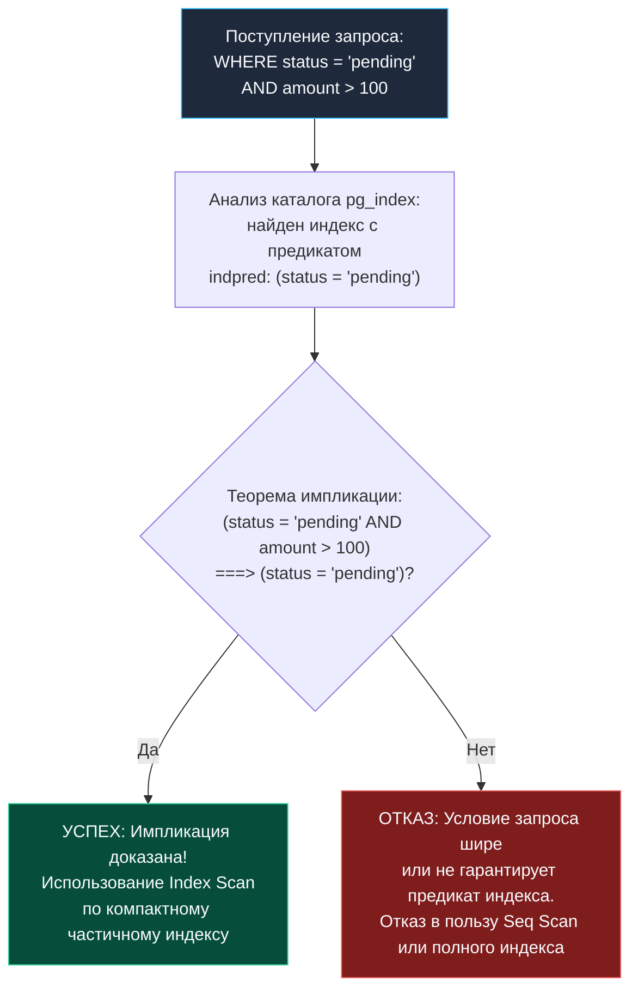

Представьте огромный архив документов городской библиотеки, в котором хранятся десять миллионов старых формуляров. Лишь сто из них находятся на руках у читателей прямо сейчас. Если библиотекарь заведет массивную картотеку на все десять миллионов формуляров, ему придется выделять под нее целую комнату, тратить часы на перекладывание карточек при каждом возврате книги и стирать пыль с полок, 99.9% которых никогда не понадобятся. Разумный библиотекарь поступит иначе: он заведет крошечный блокнот на столе и запишет туда только те сто книг, которые выданы на руки.

В реляционных базах данных этот изящный принцип называется **Partial индекс (частичный индекс)**. Это индекс, построенный не на всех строках таблицы, а исключительно на тех, которые удовлетворяют явно заданному условию `WHERE`.

В отличие от классического индекса, обязанного монотонно отражать каждую строку таблицы, частичный индекс предельно избирателен. Он дает инженеру тройную выгоду: колоссальную экономию дискового пространства и оперативной памяти, кардинальное снижение нагрузки на запись (Write Amplification) и молниеносную скорость запросов к «горячему» подмножеству данных.

---

> [!info] Под капотом: Дерево выражений indpred и предикатная импликация
> В PostgreSQL метаданные частичного индекса регистрируются в системном каталоге `pg_index`. Атрибут `indpred` хранит сериализованное дерево выражений (node tree), представляющее условие `WHERE` в канонической нормализованной форме.
> 
> При поступлении запроса стоимостной оптимизатор (Cost-Based Optimizer) проверяет математическую состоятельность применения индекса через аппарат **логической импликации (Predicate Implication)**. Оптимизатор доказывает теорему: следует ли истинность условия индекса из условия запроса ($P_{\text{query}} \implies P_{\text{index}}$)? Если из `WHERE` запроса строго следует условие индекса, частичный индекс объявляется легитимным кандидатом для генерации плана `Index Scan` или `Index Only Scan`.

---

### Синтаксис создания

В диалекте SQL PostgreSQL синтаксис создания частичного индекса предельно лаконичен — к стандартной команде `CREATE INDEX` дописывается предикат фильтрации:

```sql
CREATE INDEX idx_orders_pending ON orders (created_at)
    WHERE status = 'pending';
```

Этот индекс будет физически содержать ключи `created_at` и указатели `ctid` **только для тех строк**, у которых столбец `status` равен значению `'pending'`. Как только заказ переходит в статус `completed` или `cancelled`, запись о нем автоматически и бесследно удаляется из дерева индекса.

---

### Когда частичный индекс полезен

1. **Разреженные атрибуты и мягкое удаление (Soft Delete):**  
   В таблице `users` столбец `deleted_at` равен `NULL` для 99% активных пользователей и содержит временную метку для архивных записей. Запросы бизнес-логики почти всегда отсекают удаленных: `WHERE deleted_at IS NULL`.  
   Индекс:
   ```sql
   CREATE INDEX idx_users_active ON users (email) 
   WHERE deleted_at IS NULL;
   ```
   будет обслуживать только живых пользователей, оставаясь компактным и быстрым.

2. **Очереди задач и воркеры (Task Queues):**  
   Таблица `tasks` хранит миллионы выполненных исторических задач (`status = 'processed'`) и всего пару сотен новых заданий (`status = 'new'`), ожидающих обработки. Частичный индекс на колонки `priority` и `created_at` с условием `WHERE status = 'new'` позволяет воркерам забирать задачи за микросекунды, не просеивая миллионы завершенных записей.

3. **Горячие временные диапазоны:**  
   Индекс с условием `WHERE event_date >= CURRENT_DATE - INTERVAL '7 days'` для сверхбыстрого доступа к оперативным логам текущей недели, в то время как холодный архив может сканироваться полным перебором (`Seq Scan`) или лежать в партиционированных архивных таблицах.

4. **Исключение тривиальных значений:**  
   Если флаг `is_spam` в 99.9% случаев равен `false`, нет смысла индексировать добропорядочных пользователей. Индекс с условием `WHERE is_spam = true` займет несколько килобайт и позволит модераторам мгновенно выгружать список нарушителей.

---

### Как работает планировщик: логическая импликация

Рассмотрим, как оптимизатор запросов принимает решение об использовании частичного индекса на основе математической логики.

Пусть у нас создан индекс:
```sql
CREATE INDEX idx_orders_pending ON orders (created_at) WHERE status = 'pending';
```

- **Запрос 1:**
  ```sql
  SELECT * FROM orders 
  WHERE status = 'pending' AND created_at > '2025-01-01';
  ```
  Здесь предикат запроса явно содержит `status = 'pending'`. Из истинности `status = 'pending' AND created_at > ...` тривиально следует истинность `status = 'pending'`. Оптимизатор применяет частичный индекс: строит узел `Index Scan`, где в `Index Cond` передается проверка диапазона дат `created_at > ...`.

- **Запрос 2:**
  ```sql
  SELECT * FROM orders 
  WHERE status = 'pending' OR priority = 1;
  ```
  Здесь используется дизъюнкция: условие `WHERE status = 'pending' OR priority = 1` допускает строки, где `status` равен `'cancelled'`, но `priority = 1`. Такие строки **отсутствуют в частичном индексе**! Следовательно, предикат индекса не покрывает запрос ($P_{\text{query}} \not\implies P_{\text{index}}$). Планировщик отвергнет этот частичный индекс и выберет последовательное чтение таблицы (`Seq Scan`).

> [!tip] Собеседование: Расширение диапазона в запросе
> **Вопрос:** В таблице создан частичный индекс с предикатом `WHERE status = 'active'`. Будет ли он задействован для запроса:
> ```sql
> SELECT * FROM users WHERE status IN ('active', 'suspended');
> ```
> 
> **Ответ:** Нет, планировщик полностью проигнорирует этот частичный индекс. Условие запроса шире, чем фильтр индекса: в индексе физически нет строк со статусом `suspended`. Оптимизатор PostgreSQL не станет делить запрос на части, сканируя индекс для `active` и кучу таблицы для `suspended`. Запрос уйдет в обычный `Seq Scan` (или использует другой индекс, если он существует).

---

### Mechanical Sympathy: экономия на всех уровнях

С точки зрения кремния и накопителей, частичный индекс — это наивысшая форма уважения к ресурсам сервера:

1. **Экономия буферного кэша (RAM L1/L2/L3 и shared_buffers):**  
   Обычный индекс на 100 миллионов строк может весить 5 ГБ. Он непрерывно вымывает полезные данные из оперативной памяти (`shared_buffers` в PostgreSQL или buffer pool в InnoDB). Частичный индекс на 1% активных строк весит всего 50 МБ. Он **целиком помещается в RAM**, обеспечивая 100% Cache Hit Rate и нулевые задержки дискового ввода-вывода.
2. **Нулевая нагрузка на запись (Write Amplification):**  
   При вставке, обновлении или удалении строки СУБД первым делом вычисляет предикат частичного индекса. Если новая строка не удовлетворяет условию (например, вставляется событие со статусом `processed`), индекс **вообще не трогается**!  
   - Ноль операций I/O к страницам индекса.
   - Ноль записей в журнал предзаписи WAL ([[8. WAL. Write Ahead Log]]).
   - Ноль расщеплений страниц дерева (`Page Split`, [[2. B Tree индекс под капотом]]).
3. **Снижение фрагментации:**  
   В монотонно растущих таблицах обычные индексы страдают от разрастания правых ветвей B-Tree. Частичный индекс с узким фильтром `WHERE status = 'new'` изолирует мутации: 95% транзакций приложения вообще не генерируют индексного мусора.

> [!warning] Ловушка / Gotcha: Шторм обновлений при смене статуса
> Частичный индекс идеален, пока данные статичны. Но представьте пакетный воркер, который за одну транзакцию переводит 100 000 строк из `status = 'new'` в статус `status = 'active'` или `processed`.  
> 1. Это порождает лавинообразную нагрузку: 100 000 ключей должны быть синхронно удалены из одного частичного индекса и (если есть второй частичный индекс) вставлены в другой.
> 2. Массовое удаление ключей приводит к образованию пустых страниц в B-Tree и раздуванию индекса (Bloat). Чтобы вернуть дисковое пространство, потребуется регулярная работа `VACUUM` (см. [[10. VACUUM, ANALYZE]] в разделе PostgreSQL).

---

### Пример на практике: Go и частичный индекс

Рассмотрим классический паттерн современной микросервисной разработки на Go: мягкое удаление учетных записей (`Soft Delete`). В таблице пользователей удаление помечается заполнением поля `deleted_at TIMESTAMPTZ`.

Бизнес-требование: **email должен быть строго уникальным, но только среди активных пользователей**. Если пользователь удалил свой аккаунт, другой человек имеет полное право зарегистрироваться с тем же email. Обычный `UNIQUE` констрейнт здесь бессилен.

Решение — частичный уникальный B-Tree индекс:

```sql
CREATE UNIQUE INDEX idx_users_email_active ON users (email)
    WHERE deleted_at IS NULL;
```

Этот индекс решает сразу две фундаментальные задачи:
1. На аппаратном уровне гарантирует уникальность email среди неудаленных пользователей.
2. Служит сверхбыстрым навигатором при аутентификации.

В коде сервиса на Go пишем безопасную функцию авторизации:

```go
package main

import (
	"context"
	"database/sql"
	"errors"
	"time"

	_ "github.com/jackc/pgx/v5/stdlib"
)

type User struct {
	ID        int64
	Email     string
	Name      string
	DeletedAt *time.Time
}

func GetActiveUserByEmail(ctx context.Context, db *sql.DB, email string) (*User, error) {
	// ВНИМАНИЕ: предикат WHERE обязательно должен содержать `deleted_at IS NULL`,
	// чтобы планировщик смог доказать импликацию и применить частичный индекс!
	query := `
		SELECT id, email, name, deleted_at
		FROM users
		WHERE email = $1 AND deleted_at IS NULL;
	`

	var u User
	err := db.QueryRowContext(ctx, query, email).Scan(&u.ID, &u.Email, &u.Name, &u.DeletedAt)
	if err != nil {
		if errors.Is(err, sql.ErrNoRows) {
			return nil, errors.New("user not found or deactivated")
		}
		return nil, err
	}

	return &u, nil
}
```

Проверим план выполнения через `EXPLAIN ANALYZE`:

```sql
EXPLAIN ANALYZE SELECT id, email, name FROM users
WHERE email = 'alice@example.com' AND deleted_at IS NULL;
```

Ожидаемый результат:
```text
Index Scan using idx_users_email_active on users  (cost=0.15..8.17 rows=1 width=40)
  Index Cond: (email = 'alice@example.com'::text)
  Filter: (deleted_at IS NULL)
```

Поскольку предикат запроса `email = $1 AND deleted_at IS NULL` полностью включает в себя условие `WHERE deleted_at IS NULL`, база данных мгновенно выбирает частичный индекс, совершая ровно один точечный спуск по маленькому, сидящему в L1-кэше дереву. А если бы мы дополнили индекс секцией `INCLUDE (name)`, то получили бы полноценный `Index Only Scan` вообще без обращений к физической таблице!

---

### Ограничения и тонкости

1. **Нестабильные (Non-Immutable) функции:**  
   Если в условии индекса используется недетерминированная функция (например, `WHERE created_at > CURRENT_DATE`), PostgreSQL выдаст ошибку еще при создании индекса. Условие частичного индекса обязано быть детерминированным (`IMMUTABLE`). Конструкции вроде `date_column > '2020-01-01'` допустимы, так как правая часть — константа.
2. **Параметризованные запросы в Go и Generic Plans:**  
   Если вы используете `status = $1`, а индекс построен с `WHERE status = 'pending'`, PostgreSQL на этапе подготовки общего плана (Generic Plan) не знает, какое значение придет в `$1`. Следовательно, он **не сможет** применить частичный индекс! Частичный индекс работает только тогда, когда условие жестко прописано в тексте SQL (`WHERE status = 'pending' AND ...`) либо при использовании кастомных планов (Custom Plans).
3. **Множественные взаимодополняющие индексы:**  
   Можно создать два частичных индекса под разные профили нагрузки: один для `status = 'active'`, другой для `status = 'inactive'`. Оптимизатор сам выберет нужный в зависимости от запроса.
4. **Поддержка в разных СУБД:**  
   Частичные индексы нативно поддерживаются PostgreSQL, SQLite и SQL Server. В MySQL/InnoDB классических частичных индексов нет. В MySQL разработчики вынуждены эмулировать их через виртуальные генерируемые столбцы (`GENERATED ALWAYS AS`) с выражениями вида:
   ```sql
   ALTER TABLE orders ADD COLUMN pending_created_at DATETIME 
       GENERATED ALWAYS AS (IF(status='active', column, NULL)) VIRTUAL;
   CREATE INDEX idx_pending ON orders (pending_created_at);
   ```
   где индекс строится по виртуальной колонке, а в запросе добавляется `WHERE column IS NOT NULL`.

---

### Диаграмма принятия решения планировщиком



---

### Рекомендации для Go-разработчика

1. **Закон Парето (80/20) в структуре данных:**  
   Проанализируйте запросы в кодовой базе. Если 90% трафика бэкенда приходится на 5% строк таблицы (активные сессии, незавершенные заказы, актуальные события), немедленно создавайте частичные индексы.
2. **Мониторинг объема через `\di+`:**  
   Регулярно сравнивайте размеры индексов с помощью консольной команды `\di+` в psql или системных функций `pg_relation_size`. Вы будете поражены: частичный индекс часто весит в 20–50 раз меньше полного индекса на ту же колонку.
3. **Осторожность с ORM:**  
   Библиотеки вроде GORM часто генерируют громоздкие предикаты со скрытыми условиями. Всегда проверяйте сгенерированный ORM-запрос через `EXPLAIN` — любая опечатка в предикате приведет к игнорированию частичного индекса.

---

### Заключение

Частичный индекс — это демонстрация высшего пилотажа инженерной мысли. Он не пытается решить проблему «в лоб», индексируя терабайты мертвого груза, а концентрирует вычислительную мощь процессора и буферного кэша строго на том срезе данных, который создает ценность для бизнеса.

В следующей лекции мы погрузимся в мир полуструктурированных данных и разберем нетривиальную тему — [[8. Индексы для JSON и массивов]], где классические скалярные B-Tree уступают место инвертированным GIN и GiST индексам.
