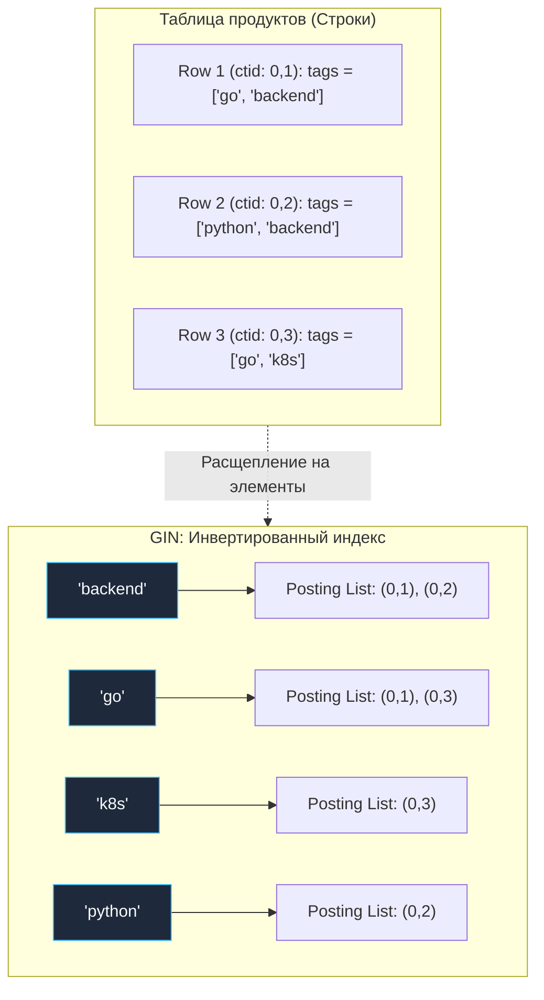

В современной бэкенд-разработке чистые реляционные схемы всё чаще уступают место гибридным решениям. Инженеры ценят строгие ACID-гарантии и целостность реляционных баз данных, но одновременно хотят гибкости документо-ориентированных хранилищ: возможности сохранять произвольные атрибуты, динамические конфигурации, теги и вложенные структуры без изнурительных миграций схемы на каждый чих. Так в наш повседневный арсенал вошли полуструктурированные типы: `JSONB` в PostgreSQL, `JSON` в MySQL и массивы примитивов (`integer[]`, `text[]`).

Однако за гибкость приходится платить. Обычные B-Tree индексы, построенные на скалярных полях, оказываются беспомощными, когда поиск направлен внутрь документа или массива. Запросы вида `WHERE tags @> ARRAY['go','backend']` или `WHERE attributes->>'role' = 'admin'` требуют принципиально иной структуры хранения — индексов, способных заглядывать под капот сложных составных структур.

В этой главе мы погрузимся во внутреннее устройство двух титанов индексирования полуструктурированных данных в PostgreSQL — **GIN** и **GiST**, разберем их архитектуру вплоть до дисковых страниц и исходного кода ядра, а также научимся грамотно работать с ними из высоконагруженных сервисов на Go.

---

### Почему B-Tree недостаточно

Классический B-Tree индекс ([[2. B Tree индекс под капотом]]) обращается со значением колонки как с неделимым скаляром. Для таких типов, как `int`, `text`, `timestamp`, это идеальный подход: мы сравниваем значения целиком, выстраивая их в непрерывный отсортированный ряд.

Но если столбец содержит JSON-документ или массив, B-Tree может лишь лексикографически сравнить две бинарные строки целиком. Это бесполезно для семантики предметной области:
- Нам нужно найти все строки, где JSON содержит ключ `"role"` со значением `"admin"`.
- Или строки, где массив тегов содержит элемент `'go'`.

Для B-Tree это означает полный крах: отношение «содержит в себе» не сводится к привычным операторам равенства или диапазона. Если применить B-Tree к JSONB-колонке, база сможет лишь обслужить запрос `WHERE data = '{"exact":"match"}'::jsonb`, что в реальных приложениях практически никогда не требуется.

Чтобы решить эту задачу, компьютерная наука предложила элегантную структуру данных — **инвертированный индекс (Inverted Index)**.

---

### GIN: Generalized Inverted Index

**GIN (Generalized Inverted Index)** — это обобщенный инвертированный индекс, глубоко интегрированный в ядро PostgreSQL. Он спроектирован специально для композитных типов данных, где каждый элемент строки состоит из множества дискретных частей, и одна и та же часть (лексема, ключ, значение, элемент массива) может встречаться в миллионах разных строк таблицы.

Классическая физическая аналогия инвертированного индекса — **предметный указатель в конце толстой книги**. Вместо того чтобы перечитывать 1 000 страниц в поисках упоминания системного вызова `fork`, читатель открывает алфавитный указатель на букву «F», находит термин `fork` и видит готовый список страниц: `[42, 115, 203, 780]`.

В терминах GIN:
- **Элемент (Key/Entry):** конкретное значение (элемент массива, лексема полнотекстового поиска `tsvector`, ключ или пара ключ-значение в `jsonb`).
- **Список вхождений (Posting List):** упорядоченный список идентификаторов строк (`ctid`), в которых этот ключ присутствует.



> [!info] Под капотом: Внутреннее устройство GIN в исходном коде ядра
> В исходном коде PostgreSQL (`src/include/access/gin_private.h`) GIN-индекс представляет собой двухуровневую гибридную систему:
> 
> 1. **Мета-страница (GinMetaPageData):** содержит метаданные индекса, ссылки на корневые страницы и служебные флаги.
> 2. **B-Tree ключей (Entry Tree):** стандартное B-Tree дерево, где ключами служат отсортированные уникальные элементы (слова, теги, пути JSON). Поиск любого ключа по дереву выполняется за логарифмическое время $O(\log K)$.
> 3. **Posting List (список вхождений):** если ключ встречается редко, его адреса `ctid` хранятся в листовой странице Entry Tree в виде компактного отсортированного массива.
> 4. **Posting Tree (дерево вхождений):** если ключ суперпопулярен (например, статус `"status": "active"`, встречающийся в миллионах строк), список `ctid` перерастает размер страницы. В этом случае GIN динамически создает **отдельное внутреннее B-Tree**, ключами которого являются сами `ctid`! Это гарантирует, что операции добавления, удаления и пересечения списков никогда не деградируют до линейного перебора.
> 5. **Буфер отложенной записи (gin_pending_list):** вставка в GIN дорога. Чтобы не тормозить каждую транзакцию вставками в десятки posting-листов, PostgreSQL складывает новые записи во временный плоский буфер (`fastupdate = on`). Фоновый процесс очистки или `VACUUM` пакетом переносит их в основное дерево.

Поиск по GIN при выполнении запроса происходит в три этапа:
1. Запрос анализируется, из него извлекаются искомые элементы.
2. По B-Tree ключей находятся соответствующие posting lists или posting trees.
3. Полученные списки `ctid` объединяются операциями `AND` (пересечение) или `OR` (объединение) прямо в оперативной памяти через механизм `Bitmap Index Scan`.

---

### GiST: Generalized Search Tree

**GiST (Generalized Search Tree)** — это расширяемый каркас для построения произвольных сбалансированных деревьев поиска. Если GIN — это инвертированный словарь, то GiST похож на классическое дерево с ветвлением, где узлы объединяют дочерние элементы по произвольным правилам включения (например, геометрические прямоугольники в R-Tree или сигнатуры хешей).

Для документов `jsonb` GiST использует технику **битовых сигнатур (Bloom-фильтров)**. Каждый узел дерева хранит битовую маску, представляющую логическое сложение (побитовое ИЛИ) сигнатур всех вложенных документов. При поиске движок вычисляет сигнатуру искомого фрагмента и спускается только по тем ветвям дерева, чьи битовые маски содержат все требуемые биты.

---

### Операции и выбор индекса для JSONB

PostgreSQL предоставляет богатый набор операторов для работы с `jsonb`:

- **Проверка включения (Contains):** `data @> '{"role":"admin"}'` — содержит ли документ указанный JSON-фрагмент на любом уровне вложенности.
- **Обратное включение (Is Contained):** `data <@ '{"role":"admin"}'` — содержится ли сам документ внутри указанного фрагмента.
- **Существование ключа (Top-level Key Exists):** `data ? 'key'` — присутствует ли ключ на верхнем уровне объекта.
- **Существование любого ключа (Any Key Exists):** `data ?| array['a','b']` — есть ли хотя бы один из перечисленных ключей.
- **Существование всех ключей (All Keys Exist):** `data ?& array['a','b']` — присутствуют ли абсолютно все перечисленные ключи.

Для индексирования `jsonb` в PostgreSQL через GIN доступны два операторных класса:

```sql
-- 1. Универсальный класс jsonb_ops (по умолчанию)
CREATE INDEX idx_events_data ON events USING GIN (data jsonb_ops);

-- 2. Специализированный класс jsonb_path_ops
CREATE INDEX idx_events_data_path ON events USING GIN (data jsonb_path_ops);
```

> [!tip] Собеседование: Битва классов — jsonb_ops против jsonb_path_ops
> **Вопрос:** В чем фундаментальная разница между классами операторов `jsonb_ops` и `jsonb_path_ops` в GIN-индексах? Какой из них выбрать для высоконагруженного сервиса?
> 
> **Ответ:**
> - `jsonb_ops` разбивает JSON на независимые ключи и значения. Он индексирует отдельно ключи и отдельно значения. Это универсальный класс: он поддерживает все операторы (`@>`, `?`, `?|`, `?&`). Но его индекс получается огромным, а вставки — медленными.
> - `jsonb_path_ops` хеширует полные цепочки путей от корня до значения (например, хеш от строки `"user.profile.role.admin"`). Он поддерживает **только оператор включения `@>`**. Но взамен он дает:
>   1. Уменьшение размера индекса в 3–5 раз по сравнению с `jsonb_ops`.
>   2. В разы меньшее число записей в B-Tree ключей.
>   3. Более быстрое выполнение запросов поиска поддеревьев.
> 
> Если ваш сервис ищет документы по шаблонам через `@>`, выбор `jsonb_path_ops` обязателен!

---

### Индексы для массивов

Одномерные и многомерные массивы в PostgreSQL (`integer[]`, `text[]`) нативно индексируются с помощью GIN.

Ключевые операции над массивами:
- `&&` — пересечение (Overlaps): содержат ли массивы хотя бы один общий элемент.
- `@>` — содержит ли массив правый операнд целиком.
- `<@` — входит ли массив в правый операнд.

```sql
CREATE TABLE items (
    id BIGSERIAL PRIMARY KEY,
    name TEXT NOT NULL,
    tags TEXT[] NOT NULL
);

-- Создаем GIN индекс по массиву тегов:
CREATE INDEX idx_tags ON items USING GIN (tags);
```

Запрос на поиск позиций с несколькими тегами:
```sql
SELECT * FROM items WHERE tags @> ARRAY['go', 'backend'];
```
будет выполнен через `Bitmap Index Scan` по GIN-индексу за доли миллисекунды.

Для массивов целых чисел (`integer[]`) существует великолепное официальное расширение `intarray`. Оно подключает специализированный класс операторов `gin__int_ops`, оптимизированный под 4-байтовые целые числа и использующий сжатые битовые векторы без оверхеда обобщенных типов.

---

### Mechanical Sympathy: цена гибкости

С точки зрения кремния и накопителей данных, инвертированный индекс — это тяжелая артиллерия. Он требует глубокого механического сочувствия к оборудованию:

1. **Колоссальный Write Amplification при вставках:**  
   Представьте JSON-документ из 80 полей. При выполнении одной команды `INSERT` ядро PostgreSQL вынуждено разложить документ на 80 элементов и выполнить до 80 поисков и вставок в B-Tree ключей и posting lists! Это генерирует массивный объем записей в журнал предзаписи WAL ([[8. WAL. Write Ahead Log]]), порождает расщепления страниц и блокировки страниц в памяти.
2. **Параметр fastupdate и отложенный сброс:**  
   По умолчанию для GIN включен `fastupdate = on`. Вставки идут в плоский список страниц `gin_pending_list`. Но как только размер списка превышает лимит `gin_pending_limit` (по умолчанию 4 МБ), очередной случайный `INSERT` клиента «залипает», выполняя синхронную очистку буфера и перестройку дерева.
3. **Расход буферного кэша и Random I/O:**  
   Размер GIN-индекса на широких JSONB-колонках легко превышает размер самой таблицы в 2–4 раза! Если этот монстр не помещается в `shared_buffers`, поиск по нескольким тегам превращается в серию хаотичных чтений диска.
4. **GiST и ложные срабатывания (False Positives):**  
   Поскольку GiST использует сигнатурное сжатие (хеширование), поиск по дереву страдает от коллизий хешей. Движок отбирает страницы-кандидаты, но затем обязан выполнить `Recheck` реального документа в куче таблицы, что увеличивает объем чтения Heap pages.

---

### Использование из Go

При разработке бэкенда на Go работа с `jsonb` и массивами осуществляется через популярные библиотеки `pgx` или `lib/pq`.

Спроектируем каталог товаров с динамическими атрибутами:

```sql
CREATE TABLE products (
    id BIGSERIAL PRIMARY KEY,
    attributes JSONB NOT NULL,
    tags TEXT[] NOT NULL
);

-- Высокопроизводительный GIN индекс для поиска по атрибутам
CREATE INDEX idx_products_attributes ON products USING GIN (attributes jsonb_path_ops);

-- GIN индекс по тегам
CREATE INDEX idx_products_tags ON products USING GIN (tags);
```

Реализация безопасных параметризованных выборок в Go:

```go
package main

import (
	"context"
	"database/sql"
	"encoding/json"
	"log"

	_ "github.com/jackc/pgx/v5/stdlib"
	"github.com/lib/pq"
)

type Product struct {
	ID         int64
	Attributes map[string]any
	Tags       []string
}

// Поиск по элементам массива с использованием lib/pq
func FindProductsByTag(ctx context.Context, db *sql.DB, tag string) ([]Product, error) {
	// Оператор @> требует передачи массива справа: ARRAY[$1]
	query := `SELECT id, attributes, tags FROM products WHERE tags @> ARRAY[$1]`

	rows, err := db.QueryContext(ctx, query, tag)
	if err != nil {
		return nil, err
	}
	defer rows.Close()

	var result []Product
	for rows.Next() {
		var p Product
		var rawAttrs []byte
		if err := rows.Scan(&p.ID, &rawAttrs, pq.Array(&p.Tags)); err != nil {
			return nil, err
		}
		_ = json.Unmarshal(rawAttrs, &p.Attributes)
		result = append(result, p)
	}

	return result, rows.Err()
}

// Поиск по поддереву JSONB
func FindProductsByAttribute(ctx context.Context, db *sql.DB, filter map[string]any) ([]Product, error) {
	// Сериализуем фильтр в компактный JSON
	jsonBytes, err := json.Marshal(filter)
	if err != nil {
		return nil, err
	}

	// Передаем JSON-строку, приводя ее к типу jsonb на стороне БД
	query := `SELECT id, attributes, tags FROM products WHERE attributes @> $1::jsonb`

	rows, err := db.QueryContext(ctx, query, string(jsonBytes))
	if err != nil {
		return nil, err
	}
	defer rows.Close()

	var result []Product
	for rows.Next() {
		var p Product
		var rawAttrs []byte
		if err := rows.Scan(&p.ID, &rawAttrs, pq.Array(&p.Tags)); err != nil {
			return nil, err
		}
		_ = json.Unmarshal(rawAttrs, &p.Attributes)
		result = append(result, p)
	}

	return result, rows.Err()
}
```

Для проверки эффективности запроса выполним трассировку через `EXPLAIN (ANALYZE, BUFFERS)` (подробнее логи медленных запросов рассматриваются в [[18. Slow query log]], а техники покрывающих запросов — в [[6. Covering индекс]]):

```go
func explainJSONBQuery(ctx context.Context, db *sql.DB, filterJSON string) {
	query := "EXPLAIN (ANALYZE, BUFFERS) SELECT id FROM products WHERE attributes @> $1::jsonb"
	rows, err := db.QueryContext(ctx, query, filterJSON)
	if err != nil {
		log.Printf("explain failed: %v", err)
		return
	}
	defer rows.Close()

	for rows.Next() {
		var line string
		if err := rows.Scan(&line); err == nil {
			log.Printf("PLAN: %s", line)
		}
	}
}
```

План запроса подтвердит использование инвертированного индекса:
```text
Bitmap Heap Scan on products  (cost=12.05..25.80 rows=10 width=8)
  Recheck Cond: (attributes @> '{"role":"admin"}'::jsonb)
  ->  Bitmap Index Scan on idx_products_attributes  (cost=0.00..12.05 rows=10 width=0)
        Index Cond: (attributes @> '{"role":"admin"}'::jsonb)
```

Если же в плане выскочил `Seq Scan`, это тревожный сигнал: возможно, вы забыли приведение типа `$1::jsonb` или применили неподдерживаемый оператор.

---

> [!warning] Ловушка / Gotcha: Когда GIN не нужен — функциональные B-Tree индексы
> Начинающие разработчики часто совершают ошибку: вешают массивный `USING GIN` на всю колонку `JSONB`, хотя в реальности микросервис фильтрует данные только по одному конкретному полю (например, `WHERE attributes->>'role' = 'admin'`).
> 
> В такой ситуации GIN — чудовищно избыточен! Правильное решение — **функциональный B-Tree индекс на выражение**:
> ```sql
> CREATE INDEX idx_users_role ON events ((data->>'role'));
> ```
> Этот индекс:
> 1. В десятки раз компактнее GIN.
> 2. Обновляется с молниеносной скоростью классического B-Tree.
> 3. Идеально ускоряет поиск по точному равенству `WHERE data->>'role' = 'admin'`.
> 
> Однако помните: функциональный индекс на `->>'key'` ускоряет только запросы с `->>'key'`, но совершенно бесполезен для оператора включения `data @> '{"role":"admin"}'`. Мониторьте размер индекса через `\di+` в psql: GIN-индекс на широких JSONB-полях может многократно превышать размер таблицы.

---

> [!tip] Собеседование: Индексирование целочисленных массивов
> **Вопрос:** В таблице хранится столбец тегов `integer[]`, и запросы выполняют поиск `WHERE tags @> ARRAY['one']` или проверку пересечений. Почему для таких задач расширение `intarray` с классом `gin__int_ops` предпочтительнее стандартного GIN?
> 
> **Ответ:** Стандартный GIN оперирует обобщенными типами через полиморфные функции PostgreSQL. Расширение `intarray` и класс операторов `gin__int_ops` созданы специально для фиксированных 4-байтовых целых чисел (`int4`). Они используют быстрые битовые операции, сжатие без накладных расходов на заголовки типов данных и алгоритмы, использующие прямое сравнение машинных слов CPU. Индекс `intarray` получается на 30–50% компактнее и работает ощутимо быстрее.

---

### Почему GiST может быть лучше для JSONB в некоторых случаях

Хотя GIN является фаворитом для поисковых систем и статических документов, у GiST есть свои сильные стороны:

- **Быстрые обновления при частых мутациях:** GiST пересчитывает битовые сигнатуры локально внутри узлов дерева. Ему не требуется обновлять десятки отдельных posting lists по всему индексу.
- **Меньший размер при сложной структуре:** GiST сжимает весь документ в компактную хеш-сигнатуру фиксированной длины, тогда как GIN вынужден хранить каждый уникальный ключ.
- **Меньше накладных расходов на WAL:** На системах с частыми изменениями JSONB документов GiST создает значительно меньший поток журнальных записей.

---

### Индексы для JSON в MySQL

В MySQL (движок InnoDB) архитектура работы с JSON исторически строилась через функциональные индексы на виртуальных столбцах:

```sql
ALTER TABLE events ADD role VARCHAR(50) GENERATED ALWAYS AS (data->>'$.role') STORED;
CREATE INDEX idx_role ON events(role);
```

Начиная с MySQL 8.0.17, появилась полноценная поддержка **многозначных индексов (Multi-Valued Indexes)**. Они создаются непосредственно над массивами внутри JSON-документов:

```sql
CREATE INDEX idx_tags ON products ((CAST(data->'$.tags' AS UNSIGNED ARRAY)));
```

Такие индексы ускоряют функции `JSON_CONTAINS`, `JSON_EXTRACT`, `MEMBER OF()` и `JSON_OVERLAPS`, приближая возможности MySQL к инвертированным индексам GIN.

---

### Диаграмма поиска через GIN

```mermaid
flowchart TD
    classDef process  fill:#1e293b,stroke:#38bdf8,stroke-width:1px,color:#f8fafc
    classDef success  fill:#064e3b,stroke:#34d399,stroke-width:1px,color:#f8fafc
    classDef error    fill:#7f1d1d,stroke:#f87171,stroke-width:1px,color:#f8fafc
    classDef warning  fill:#78350f,stroke:#fbbf24,stroke-width:1px,color:#f8fafc
    classDef entry    fill:#1e3a5f,stroke:#38bdf8,stroke-width:2px,color:#f8fafc
    classDef aux      fill:#334155,stroke:#64748b,stroke-width:1px,color:#f8fafc
    classDef system   fill:#312e81,stroke:#a78bfa,stroke-width:1px,color:#f8fafc
    classDef data     fill:#132d29,stroke:#2dd4bf,stroke-width:1px,color:#f8fafc
    classDef network  fill:#881337,stroke:#fb7185,stroke-width:1px,color:#f8fafc
    classDef accent   fill:#1e1b4b,stroke:#818cf8,stroke-width:1px,color:#f8fafc
    Query["Запрос: WHERE attributes @> '{\"role\":\"admin\"}'"]
    ExtractKeys["Разбор запроса парсером:<br>извлечение пары (role=admin)"]
    GinBtree["Поиск в Entry B-Tree индекса GIN<br>Логарифмический спуск O(log K)"]
    GetPostings["Извлечение Posting List/Tree<br>список всех ctid для role=admin"]:::process
    Bitmap["Построение битовой карты (TIDBitmap)<br>в оперативной памяти"]
    HeapScan["Bitmap Heap Scan:<br>последовательное чтение блоков таблицы<br>с диска и проверка видимости MVCC"]:::warning
    Result["Возврат строк клиенту в Go"]:::success

    Query --> ExtractKeys
    ExtractKeys --> GinBtree
    GinBtree --> GetPostings
    GetPostings --> Bitmap
    Bitmap --> HeapScan
    HeapScan --> Result
```

---

### Заключение

Индексы для JSON и массивов — это инженерный мост между миром строгой реляционной теории и гибкостью современных слабоструктурированных форматов. Инвертированные индексы GIN и сигнатурные деревья GiST превращают мучительный линейный перебор многомегабайтных документов в быструю навигацию по кремниевым структурам B-Tree и битовым картам.

Однако эта мощь требует дисциплины:
- Для точечных фильтров по одному полю создавайте легковесные **функциональные B-Tree индексы**.
- Для операторов включения `@>` используйте класс **`jsonb_path_ops`**, экономящий до 70% дискового пространства.
- Помните о колоссальной цене частых `UPDATE` для GIN-индексов.

В следующей лекции мы детально разберем парадоксальную, но жизненно важную тему — [[9. Когда индекс вреден]]: почему добавление «еще одного индекса» может разрушить производительность вашей базы данных.
